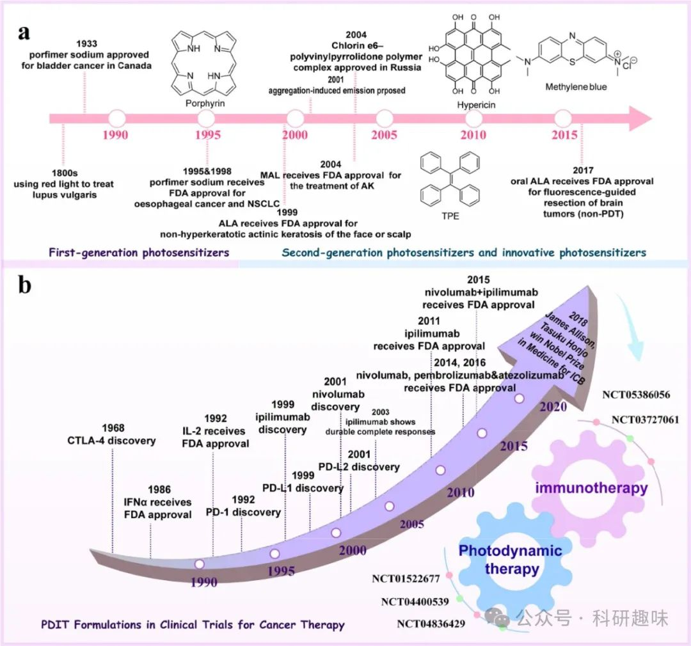
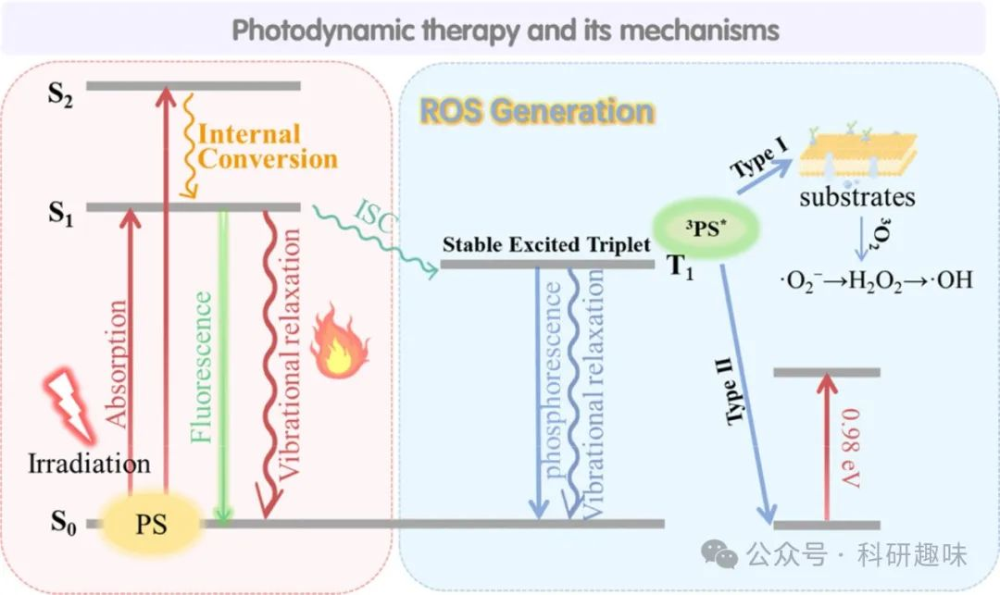
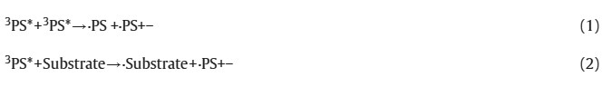
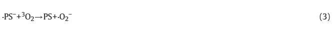
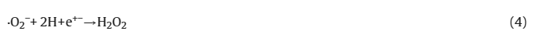
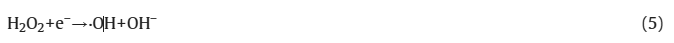
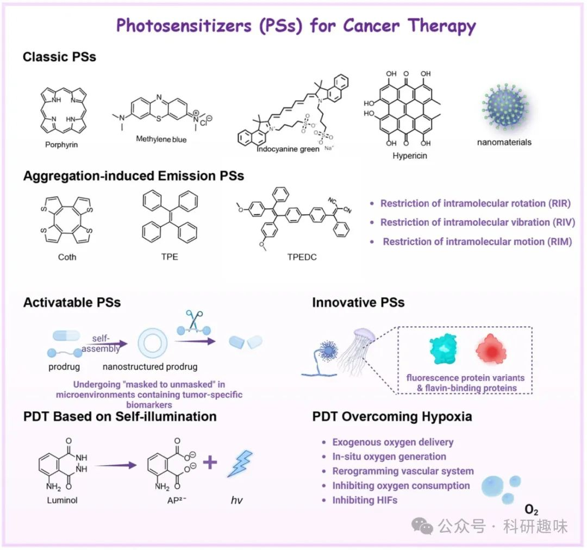
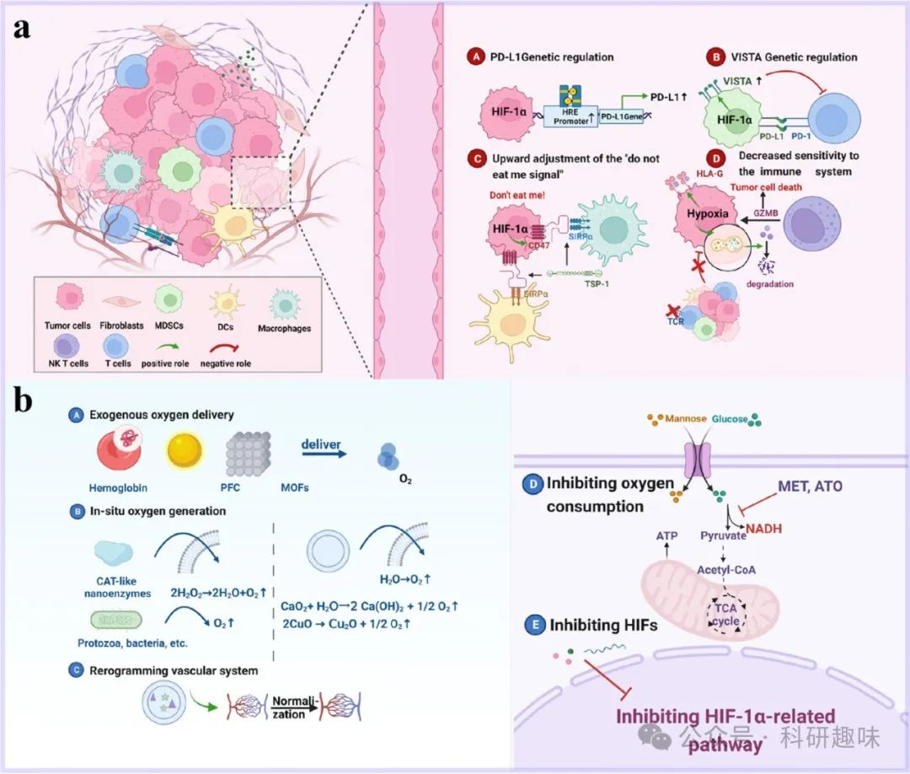

 

#  【光动力治疗】一文足够，最全PDT之肿瘤免疫疗法（2）- 光动力疗法原理及生物应用 
 

# 本节主要介绍了光动力疗法的原理及其在生物医学中的应用，包括光敏剂的基本原理和物理化学机制、用于癌症的四类光敏剂及近年来新型的PDT技术

### 1. 现代医学中的光

光，作为自然界中赋予生命的最初恩赐，其重要性在《创世纪》的神话叙事中便得以彰显，作为创世之初的三大奇迹之一，同时也是推动人类文明进步不可或缺的力量。在自然界光的启迪下，科学界不断探索并应用光的发光机制，利用发光材料作为探针，揭示了众多先前未知的生物化学结构与动态过程，从而深化了对生命活动途径的理解。

从物理学的角度来看，光本质上是一种特定频率范围内的光子流。光源发光，源于其内部电子获取额外能量后的跃迁行为。若能量不足以使电子跃迁至更高能级的轨道，电子则会以加速运动的形式释放能量，以光波的形式辐射出去。1925年，法国物理学家德布罗意进一步提出物质波粒二象性的理论，为理解光在生物医学领域的应用提供了坚实的理论基础。在此框架下，光在生物医学应用中常被视为粒子，其光物理与光化学特性成为研究的核心。

光作为一种外部控制的治疗手段，相较于传统化学药物，展现出了无可比拟的优势，包括精确的时空调控能力和低毒性特点。尤为值得一提的是，光的这些特性可通过调节光源的功率、照射时长乃至波长来精细调控药物的激活与释放过程。光疗通常聚焦于紫外线-可见光（UV-Vis，波长范围200-760纳米）及红外线（IR）区域，而光的组织穿透能力则是选择适当波长的关键因素。这一能力受组织特性、光传输参数与技术、光敏药物的消光系数（ε）及量子产率（Φ）等多重因素影响，同时也需考虑生物大分子（如血红蛋白、黑色素）对光子的吸收竞争。

为优化光的组织穿透深度，现代技术已能利用可降解光纤或微型无线光源替代传统外部光源，实现更为精准的治疗。ε与Φ的乘积，即光敏性指标，是衡量光治疗剂效能的重要参数。值得注意的是，尽管短波长光（&lt;600 nm）在某些情况下会因生物分子的强吸收而导致组织穿透性下降，但最新研究表明，多数光活化化合物均能有效吸收300-450纳米范围内的短波光子，因此，红色及红外光区域成为光疗的优选频段。

追溯历史，光疗作为一种非侵入性治疗手段，其应用可上溯至三千多年前的古文明时期，如古印度、古埃及及中国，均有利用光治疗皮肤疾病及佝偻病的记载。19世纪末，尼尔斯·芬森（Niels Ryberg Finsen）开创性地运用光辐射治疗寻常狼疮，标志着现代光疗法的诞生。随后，赫尔曼·冯·塔佩纳与杰西内克等人通过曙红与白光联合疗法成功治疗皮肤癌，进一步推动了光疗的发展。进入20世纪60年代，蓝光疗法在治疗新生儿高胆红素血症方面的巨大成功，更是光疗史上的里程碑事件。自此以后，基于激光技术的各类治疗剂与设备不断涌现，广泛应用于临床前研究与临床实践中，开启了光疗新时代的大门。

图 1. 光动力疗法光敏剂（a）和免疫疗法（主要是免疫检查点抑制剂，b）的监管审批时间表和关键里程碑，以及光动力免疫组合疗法的未来发展方向。

### 2. 光治疗及其原理

光疗作为一种先进的医疗手段，其核心在于将低强度、无害的光线与特定的外源性光敏物质（Photosensitizer, PS）结合，以治疗多种疾病。这一过程主要涵盖光动力疗法（Photodynamic Therapy, PDT）与光热疗法（Photothermal Therapy, PTT）两大领域。PDT的设计精妙地利用了三个关键要素的相互作用：首先是PS，其次是能与PS吸收光谱匹配的光源，最后是氧气环境。

在理想状态下，PS能够特异性地在肿瘤组织区域富集，并通过精确控制的光源激发，引发其电子能级的跃迁。雅布隆斯基图（Jablonski Diagram）为我们提供了一个直观理解这一过程的工具。在基态（S0），PS分子中的两个电子占据低能轨道，且自旋方向相反，形成稳定的单电子态。当PS吸收光子能量后，一个电子被激发至高能态，形成不稳定的激发单重态（S1），此状态寿命短暂（约10^-6秒）。

在S1态，电子自旋方向相同，经历弛豫过程，可能通过系统间交叉（Intersystem Crossing, ISC）跃迁至更为稳定的激发三重态（T1），其寿命显著延长（约10^-2秒）。在T1态，电子可经历辐射衰减，释放荧光能量（磷光），这一过程常用于生物成像的引导。另一方面，非辐射衰减则导致局部温度升高，产生热能与机械能，如热膨胀和压力波，这些效应在PTT或光声成像（Photoacoustic Imaging, PAI）中发挥关键作用。

尤为重要的是，通过ISC过程，T1态的电子自旋方向反转，使得其能够引发一系列化学反应。一方面，T1态可直接或间接促进活性氧物种（Reactive Oxygen Species, ROS）的生成（第一类机制），或是通过能量转移生成单线态氧（^1O2）（第二类机制），这些强氧化性物质能有效破坏肿瘤细胞结构，实现PDT的治疗效果。

图 2. 显示光疗原理的 Jablonski 图。在照射下，PS 的电子吸收光子的能量并发生一系列能级转换，从而引发化学反应，促进 ROS（I 类机制）或 1O2 与氧（II 类机制）的产生，从而杀死肿瘤细胞。

在光动力疗法（PDT）的I型机制中，处于三重激发态（T1，3PS\* ）的光敏剂（PS）通过质子或电子转移过程与邻近的生物分子底物（如细胞膜组分、蛋白质、脂质等）相互作用，导致自由基阴离子与自由基阳离子的生成。这些初级自由基进一步参与化学反应链，依次生成超氧阴离子自由基（O2•-，如方程式3所示）、过氧化氢（H2O2，方程式4）以及最为活跃的羟自由基（•OH，方程式5）。

尽管超氧阴离子自由基（O2•-）本身毒性相对较低，不足以直接造成显著的氧化性损害，但在超氧化物歧化酶（SOD）催化下或通过单电子还原途径转化为H2O2时，其代谢平衡可能被打破，进而生成高细胞毒性的•OH。

另一方面，PDT的II型机制则依赖于3PS\* 与基态氧分子（3O2）之间的能量转移，由于两者电子自旋多重性匹配，3PS\*能有效激发3O2至单线态，生成高活性的单线态氧（1O2）。此过程需克服约0.98 eV的能量差，因此要求三重态PS的能量水平必须高于此阈值。

1O2以其高度亲电性著称，是PDT诱导细胞毒性的关键因子之一。鉴于其在生物环境中极短的半衰期（&lt;0.04 μs）和有限的作用半径（&lt;0.02 μm），PDT的细胞毒性效应高度局限于PS分子附近区域，从而确保了治疗过程对周围正常组织的安全性。

值得注意的是，PDT过程中I型和II型反应往往并存，且两者之间的相对贡献受PS种类、底物特性、氧气浓度以及PS与底物间亲和力等多重因素影响。鉴于多数PS主要通过II型机制发挥作用，氧气成为PDT不可或缺的要素。

相较于光热疗法（PTT），PDT以其较低的能量需求、独特的治疗机制、良好的安全性及操作简便性，在癌症治疗领域展现出越来越大的应用潜力。近年来，PDT因其独特的优势，在癌症治疗领域内日益受到重视与青睐。

### 3. 用于癌症治疗的光敏剂 (PS)

在光疗领域，光敏剂（PS）的高效捕光能力是确保治疗效果的关键。因此，我们倾向于采用高灵敏度但低强度的光源进行照射，这一选择直接关联到PS的性能对治疗效果的深远影响。近期综述已深入探讨了理想PS应具备的核心特性，这些特性可概括为以下几点：

1. 1. **高效生成活性氧物种（ROS）**：PS需能有效触发生物系统中ROS的产生，这些高反应性的分子对于细胞损伤和肿瘤抑制至关重要。
2. 2. **组织穿透深度与波长匹配**：光疗通常选用红光（620-750 nm）、近红外I区（750-1000 nm）及近红外II区（1000-1350 nm）等波长，以最大化利用组织的光学窗口（600-900 nm）。理想的PS应在此波长范围内表现出优异的吸收特性，以平衡穿透深度与ROS生成效率的矛盾——短波长穿透力有限，而长波长则可能因能量不足而难以有效激发ROS生成。
3. 3. **生物相容性与靶向性**：PS应具备无细胞毒性的特性，并能在肿瘤组织中特异性地富集，同时确保从非目标组织中的快速清除，以减少对正常细胞的潜在伤害。
4. 4. **合成便捷与高效**：理想的PS应拥有简短的合成路径、易于操作的工艺流程以及高产量的生产能力，这对于临床应用的推广具有重要意义。
5. 5. **化学稳定性与储运便利性**：PS在存储和运输过程中应保持稳定，不易分解或变性，以保证治疗时的有效性和安全性。

截至目前，已有多种PS被探索并应用于临床或临床前光动力疗法中，其中，以四吡咯结构（如卟啉类化合物）为代表的PS因其大型共轭结构能有效吸收光能并高效生成单线态氧而备受瞩目。此外，其他新型光活性材料，诸如硼-二吡咯甲烷、氰基染料、富勒烯、半导体纳米颗粒以及聚集诱导发射荧光染料等，也展现出了巨大的应用潜力，正逐步成为光疗领域的新兴力量。这些材料的引入不仅丰富了光疗手段的选择，也为未来精准医疗和个性化治疗提供了更多可能性。

Fig. 3. 癌症治疗 PS 的分类和典型示例示意图。

Table 2. Approaches to PDT overcoming hypoxia.

| Approaches | Typical cases | Effectiveness | Limitations |
| --- | --- | --- | --- |
| Exogenous O2 delivery | hemoglobin (Hb) | O2 carriers in the blood ;   excellent ability to overcome biological barriers;   delayed uptake by the monocyte-phagocytic system | (1) High nephrotoxicity and neurotoxicity ;   (2) Susceptible deformation;   (3) O2 carried by Hb is not released efficiently in acidic TME as affected by PH . |
| perfluorocarbons (PFC) | good oxygen solubility | (1) Low polarity, requires mixing with surfactants to prepare ;   (2) High concentrations of surfactants can cause side effects;   (3) O2 level which PFC released is in a linear relationship with arterial partial pressure, so the patient must to be in a highpressure O2 state |  |
| metal–organic frameworks (MOFs) | high porosity | biosafety to be further studied . |  |
| in situ oxygen generation | catabolism of endogenous H2O2 using Catalase or nanoenzymes with CAT-like activity | excessive H2O2 in the TME; tumor-specific | (1) CAT preparation and purification processes are complex and costly;   (2) CAT-like nanoenzymes are mostly based on precious metals, and high concentrations lead to serious side effects ;   (3) Limited H2O2 content of tumor cells. |
| bionic photosynthesis (conversion of water to oxygen by protists, bacteria) , ; water decomposition catalyst , , ; metal peroxide | continuous production of O2 with H2O from cells without additional chemical reactions | Significant biosafety challenges. |  |
| reduction of oxygen consumption | ATO, Metformin (MET), carrying NO donors | blocking the respiratory electron transport chain  inhibition of endogenous O2 consumption , ; inhibition of mitochondrial-associated oxidative phosphorylation (OXPHOS) | Tumors are primarily based on anaerobic glycolysis for energy supply (Warburg effect), partial inhibition of cellular respiration saves only alittle of O2 . |
| normalization of the tumor vascular system and ECM disrupting | normalization of the vascular system based on chemopharmaceutical nanosystems; collagenase; PTT and PDT combination therapy | reducing vascular permeability and increasing oxygen delivery to the tumor site ; disrupting ECM , ; enhancing oxygen supply by promoting vasodilation and blood circulation , | (1) Biosafety of antiangiogenic drugs;   (2) Consideration needs to be given to the damage that laser-mediated PTT can cause to the patient’s superficial tissues. |
| Inhibition of the HIFs-related signaling pathway | Small molecule HIF-1α inhibitors , , ; siHIF-1α , | Suppression of side effects such as hypoxia-induced drug resistance | The regulation of HIFs-related signaling pathways is very complex, and the structural domains and molecular mechanisms of their key functions need to be further elucidated. |

#### 3.1. 传统的PSs

在光动力疗法（PDT）的发展中，一系列具有独特化学结构的光敏剂（PS）被深入研究并应用于临床实践中。这些PS包括环状四吡咯类（如卟啉、酞菁及其衍生物、氯素）、氰基染料、吩噻嗪盐（典型代表为亚甲基蓝MB和甲苯胺蓝O TBO）以及硼-二吡咯烷酮/氮-硼-二吡咯烷酮（BODIPYs/aza-BODIPYs），它们因卓越的生物相容性和高效的活性氧物种（ROS）产生能力而备受青睐。

自上世纪70年代以来，PS在癌症治疗中的应用已历经四十余载，其中“血卟啉衍生物”（HpD）作为先驱，开启了PDT的临床探索之路。1978年，Dougherty团队利用氩染料激光器发出的红光成功实现了对皮肤及皮下肿瘤的消融治疗。卟啉，作为一类具有环状四吡咯结构的化合物，因其广泛存在于自然界（如血红蛋白、肌红蛋白、叶绿素）而被誉为“生命色素”。其独特的18π芳香族大环结构，由四个吡咯环通过甲烷桥连接而成，为PDT提供了光吸收与能量转换的基础。

随着研究的深入，HpD的纯化产物porfimer sodium相继获得加拿大及美国FDA的批准，应用于膀胱癌、阻塞性食道癌及非小细胞肺癌（NSCLC）的治疗，标志着第一代PSs的诞生。尽管这些PSs在临床剂量下展现出良好的耐受性和水溶性，但其引起的皮肤光敏反应及有限的红光吸收能力仍待改进。

为解决上述问题，第二代PSs应运而生，包括氯素、细菌氯素、酞菁衍生物等次级卟啉，它们凭借更高的光透射效率、更短的皮肤光敏期及增强的肿瘤选择性，在部分司法管辖区获得了癌症治疗的监管批准。此外，为进一步提升PSs的结合亲和力与功能多样性，研究人员通过引入功能基团（如阳离子基团、靶向肽）对天然环状四吡咯结构进行修饰，开发出多功能PSs。目前，第二代PSs如photocyanine、hemoporfin、photodithazine等已进入临床开发阶段，并在特定地区获准用于癌症治疗。

除卟啉外，多环醌类和吩噻嗪类PS作为二级PS，也在临床上展现出重要价值。多环醌类如菊花黄素、姜黄素，源自天然植物，减少了化学合成的复杂性；而吩噻嗪类不仅具有抗肿瘤活性，还具备荧光特性，可用于淋巴结及肺结节的检测。然而，这些PSs在应用中常面临光线穿透力有限及聚集诱导淬灭（ACQ）效应的挑战。

为克服上述局限，纳米技术的引入为PDT带来了革命性的变化。基于功能性纳米材料开发的三代PSs，不仅增强了光敏性、肿瘤选择性和生物相容性，还通过纳米平台实现了PSs的有效递送与控释。例如，将齐墩果酸（OA）与血卟啉（Hp）整合于纳米增敏剂中，有效减少了Hp的π-π聚集，实现了PDT疗效的显著提升。这一创新策略为PDT的未来发展开辟了新的方向，预示着更加精准、高效的癌症治疗时代的到来。

#### 3.2. 聚集诱导发光PSs

在光动力疗法（PDT）及生物成像领域，具有发光特性的光敏剂（PS）能够通过发光信号精确指示光照射位置，对于提高治疗精准度至关重要。然而，传统PS如卟啉类在生理亲水环境下易于聚集，引发聚合诱导的淬灭效应（ACQ），严重阻碍了其发光性能及ROS生成能力。幸运的是，2001年唐本忠研究团队提出的聚集诱导发光（AIE）现象，为克服ACQ效应提供了新思路。

AIE发光剂（AIEgens）展现出独特的性质：在稀溶液中几乎不发光，而在聚集状态下，由于分子内运动受限（包括旋转、振动等），非辐射衰变路径被阻断，导致荧光显著增强，并伴随增强的ROS生成，即聚集诱导的ROS生成（AIG-ROS）。这一发现为开发高性能PS开辟了新的途径。

当前研究广泛的AIEgens通常具备高度扭曲的分子结构和丰富的旋转振动自由度，如四苯基乙烯（TPE）、环辛四噻吩（Coth）及其衍生物等。其工作机制可通过限制分子内运动（RIM）机制阐释：在聚集状态下，分子内旋转和振动受限，促进了辐射跃迁，从而增强了荧光和ROS生成。实验数据显示，AIE聚集体中的ROS生成效率远高于单体，且激发态单重态与三重态之间的能级差（ΔE\_ST）对ROS生成具有重要影响。

AIEgens在肿瘤诊断和治疗中的应用也取得了显著进展。例如，Lou团队利用带正电的TPE-Z探针通过静电作用与DNA结合，实现了对端粒酶活性的高灵敏度检测，为癌症早期诊断提供了新方法（https://doi.org/10.1021/acs.analchem.5b01099）。Min团队则开发了基于TPE-DNA复合探针的膀胱癌尿液microRNA检测技术，利用核酸酶水解释放TPE，通过RIM过程产生强荧光信号，实现了高灵敏度的分子诊断（https://doi.org/10.1021/acsami.5b04821）。

AIEgens以其高量子产率、大斯托克斯位移、优异的光稳定性和生物相容性，在肿瘤成像和PDT中展现出巨大潜力。通过结构调控和功能化修饰，AIEgens能够实现亚细胞器靶向、生物标志物检测和量子产率提升，进一步拓宽其应用范围。例如，通过引入亲脂性阳离子，构建线粒体靶向的AIEgens，利用其跨膜电位实现线粒体高效富集，为肿瘤治疗提供新策略（https://doi.org/10.1021/ja508043q）。

此外，聚合物PS作为另一类重要光敏材料，通过增加重复单元数量和优化结构设计，不仅增强了捕光能力和ROS生成效率，还克服了小分子AIE PS在双光子激发光动力疗法（2PE-PDT）中的局限，展现出更深的组织穿透能力和高度时空精确性。（https://doi.org/10.1021/acsnano.8b08398）这些特性使得聚合物PS在复杂生物环境中的应用前景更加广阔。

尽管AIEgens和聚合物PS在生物医学领域取得了显著进展，但仍面临诸多挑战，如低浓度下的治疗诊断技术开发、生物相互作用机制研究不足以及光谱特性优化等。未来研究需进一步深入探索AIEgens和聚合物PS的分子设计、作用机制及临床应用潜力，推动其在肿瘤诊断和治疗中的广泛应用。

#### 3.3. 可激活PSs

尽管小分子光敏剂（PSs）在特定肿瘤治疗中取得了显著成效，但仍面临靶向性不足及潜在毒性风险的挑战。尤为关键的是，传统光动力疗法（PDT）过程中，非靶标组织中的残留PSs可能因光激发而产生光毒性，导致眼部敏感、皮肤晒伤及炎症反应等不良后果。鉴于此，近十年来，科学界聚焦于光激活前药策略，旨在提升PDT/光热疗法（PTT）的精准性。

相较于纳米颗粒、功能性辅料等复杂载体，光激活前药（即原药）因其合成简便、口服性好及稳定性高而备受青睐。原药在常态下处于非活性状态，几乎无药理效应，但在肿瘤特异性微环境（TME）中，能响应特定生物标志物实现“去掩蔽”，进而在目标位点释放并蓄积活性药物。

通过巧妙设计，利用光物理性质的转变，可激活PSs被构想为类似原药的机制，即PDT激发波长被精心调控，仅当PSs暴露于肿瘤特有的生物标记物时才被激活。TME的独特性，包括快速增殖的癌细胞、多样的基质细胞与免疫细胞、复杂的血管网络及细胞外基质，共同营造了一个低pH、富含炎症生物标志物（如谷胱甘肽、基质金属蛋白酶、组蛋白B等）的微环境，这些特性为PSs前体的精准激活提供了可能。

PSs前体策略超越了传统PSs的双重选择性局限，即不仅依赖于PSs的特异性积累，还需肿瘤相关刺激的触发，从而确保了PDT反应的高度肿瘤局部特异性。这一策略正引领着精准医疗的新方向，尽管原药策略在延长治疗窗口、减少非靶组织损伤方面展现出优势，但患者间的药物基因组学差异可能影响原药释放效果，且原药本身亦可能带来独特问题。

进一步地，针对小分子PSs的快速代谢问题，开发纳米级递送系统成为研究热点。例如，Gao团队通过引入MMP-2敏感肽连接体，成功构建了mPEG-GALGLPG-PPa纳米前药，并整合了吲哚胺2,3-二氧合酶1（IDO-1）抑制剂于同一纳米平台（https://doi.org/10.1021/acs.nanolett.9b04012）。在MMP-2的介导下，前药PSs被激活并深入渗透至肿瘤内部，实现高效PDT与荧光成像。同时，该平台还通过抑制PDT诱导的IDO-1过表达，有效预防了适应性免疫逃逸与肿瘤复发，为增强PDT疗效提供了新的思路。

#### 3.4. 下一代PSs

当前，科研界已深刻认识到肿瘤微环境（TME）的复杂性对传统光动力疗法（PDT）构成的挑战。化学光敏剂（PS）在肿瘤区域内的非均匀分布，使得临床上精准调控光剂量以实现有效PDT同时避免光漂白成为难题。为应对化学PSs的固有问题，基因编码的光毒性蛋白质作为新型PSs的开发平台，展现出了独特潜力。这些蛋白质PSs多源自植物、海洋无脊椎动物等自然生态系统中的生物体，其蛋白质受体经过长期进化，具备高效光能转换能力，并能在特定亚细胞位置表达，实现精确的空间定位。

在蛋白质PSs中，MiniSOG作为研究最为深入的黄素结合蛋白之一，源自含有光、氧和电压（LOV）结构域的蓝光受体，广泛存在于真菌、藻类和细菌中。通过基因工程手段，对拟南芥（A. thaliana）光营养因子2的LOV2结构域进行突变，引入MiniSOG，使其与黄素单核苷酸（FMN）结合，显著提升荧光信号。MiniSOG能够在细胞内精确控制并高效生成单线态氧（¹O₂），这是由于其独特的结构特性，使¹O₂成为主要活性氧种类（ROS），对细胞构成较大威胁。进一步地，通过氨基酸替换（如miniSOGQ102L/V的Q102L突变），减少氢键结合，增强了能量转移效率。此外，Pp2FbFPL30M等改进型黄素结合蛋白通过LOV结构域的优化，实现了更高的量子产率（Φ），为PDT提供了更强大的光动力效应。

另一方面，源自水母的KillerRed及其衍生物，如KillerOrange，通过特定的点突变，不仅保留了优异的光化学特性，还展现出独特的ROS生成机制。KillerRed的结构设计使其能够将激发能传递给通过水性中心孔扩散的氧气，生成ROS并通过同一通道排出，实现了高效的能量转换与ROS释放。为克服KillerRed二聚化导致的空间阻碍，研究开发了Supernova等单一突变体，进一步提升了其应用潜力。

值得注意的是，光敏蛋白在跨生物系统中高效生成ROS的能力，相较于化学PS，为PDT的精确靶向与空间控制提供了新途径。然而，要实现这些蛋白质PSs在PDT中的广泛应用，还需深入研究编码PSs的基因，开发高效的肿瘤特异性递送系统，并克服基因表达效率低下的难题。

回顾传统PS，尽管部分经典染料已获监管批准用于癌症治疗，但其聚集诱导淬灭（ACQ）效应、低肿瘤选择性蓄积等问题仍限制了其临床效果。为此，研究人员开发了聚集诱导发光（AIE）分子和可激活PSs，前者在聚集状态下不仅避免了ACQ效应，还增强了光捕获与ROS生成能力；后者则通过特定刺激激活，提高在肿瘤中的积累与持续时间，同时减少非靶组织损伤。然而，这些新型PSs在临床转化中仍面临诸多挑战，如生物效应复杂性与个体差异等，需进一步探索以优化其治疗效果。

### 4. PDT治疗技术

局部放射光疗法（LRT）的核心在于光与光敏剂（PS）之间的相互作用。尽管在利用多样化光敏剂（PSs）强化光动力疗法（PDT）方面取得了显著进展，但外部光源穿透生物组织以触及深层癌症病灶的能力仍受显著限制。发一般LED光源常发出660纳米和600纳米波长的光，这些波长虽与典型光敏剂如原卟啉IX（PpIX）或Ce6的吸收峰相匹配，处于生物组织的光学透明窗口内，却不足以穿透至超过一定深度的肿瘤组织（通常约2厘米为界），限制了其在深层肿瘤治疗中的应用。

为解决这一难题，研究界已将目光投向了更先进的自发光技术，旨在无需外部光源即可在肿瘤局部产生光能，从而规避了组织穿透力不足的障碍。同时，针对第二类PDT策略（如基于5-氨基乙酰丙酸（5-ALA）和Ce6的光动力疗法），其可能加剧肿瘤内部缺氧环境的问题也备受关注。缺氧环境的恶化会削弱PDT效果，甚至引发治疗抵抗性和肿瘤复发，成为癌症治疗中的一大挑战。

因此，癌症治疗领域正积极探索能够显著增强光透射疗法组织穿透能力的新技术，或开发能够有效管理肿瘤缺氧状态的治疗策略。这些努力旨在通过创新性的材料科学、化学及生物学方法，提高PDT的疗效，拓宽其适应症范围，特别是在深层肿瘤及复杂肿瘤微环境中的应用潜力。

#### 4.1. 基于自发光的PDT

在化学与生物科学领域，化学发光（CL）与生物发光（BL）作为无需外部光源的发光现象，展现出卓越的灵敏度和选择性，尤其在肿瘤组织内部的能量传递中表现出色。CL 主要源自过氧化物（O-O）键断裂或富电子基团间的化学反应，以光子的形式释放能量。其中，鲁米诺作为CL研究的明星分子，在碱性环境下经H2O2和氧化催化剂作用，能发出425纳米波长的强烈蓝光，成为临床诊断、生物医学研究及环境监测中的关键工具。

基于鲁米诺的自发光特性，科研人员创新性地构建了血红蛋白（Hb）封装的生物仿脂聚合物纳米颗粒（Hb-NPs）系统，该系统集发光、供氧与高效光动力疗法（PDT）于一体（https://doi.org/10.1002/anie.201905884）。Hb作为含铁蛋白，能吸收鲁米诺发出的光并敏化氧分子，生成活性氧（ROS），同时H2O2的加入促进了肿瘤区域的充氧，改善了缺氧环境。此外，利用具有大斯托克斯偏移的光敏剂（PSs），在420至650纳米激发/发射范围内，实现了CL与PSs之间的化学发光共振能量转移（CRET）和荧光共振能量转移（FRET），显著提升了ROS的生成效率（https://doi.org/10.1021/ac404201s）。

生物发光（BL），作为CL的一种特殊形式，在自然界如萤火虫中尤为显著。萤火虫体内的荧光素酶催化荧光素氧化，生成不稳定的二氧杂环丁酮中间体，随后通过辐射弛豫发出可见光。这一机制在Renilla荧光素酶-腔肠素、Gaussia荧光素酶-腔肠素等系统中得到应用，其荧光发射波长分别覆盖560-610纳米和480纳米范围，广泛用于生物过程的体内外监测。BL因哺乳动物细胞内缺乏相应响应系统，故背景干扰极低。通过基因编码或纯蛋白形式，荧光素酶可靶向肿瘤组织，实现局部发光。

尽管BL在PDT中的应用自2003年起便有所报道，如萤火虫荧光素酶-荧光素系统通过BRET降低细胞活力，但早期研究表明其光子产率不足以单独触发常规光敏剂如RB或chrysin（https://doi.org/10.1007/s11307-006-0048-1）。为克服这一局限，近十年来，基于萤火虫荧光素酶的光导疗法取得了显著进展，通过与纳米结构（如金纳米粒子、半导体量子点）的生物耦合，不仅提升了光子产率，还实现了多功能成像与治疗的一体化。另外，量子点（QDs）与荧光素酶的耦合策略，不仅实现了体内多模态成像，还通过BRET机制将能量传递给QDs，用于激活如m-THPC等临床光敏剂，从而克服了PDT的光穿透限制，提升了深部肿瘤的治疗效果（https://doi.org/10.1016/j.biomaterials.2012.08.044）。此外，通过EDC/Sulfo-NHS活化缩合反应，直接将PSs耦合到Renilla荧光素酶上，开创了PSs与荧光蛋白结合的新途径，为PDT技术的发展开辟了新方向。这些创新策略不仅增强了光动力疗法的疗效，还拓展了其在癌症治疗中的应用前景。

#### 4.2. 克服缺氧的PDT

在探讨光动力疗法（PDT）的局限性时，我们着重指出，鉴于大多数光敏剂（PS）主要依赖于II型反应机制，肿瘤微环境（TME）中的供氧不足，即肿瘤缺氧，构成了PDT疗效提升的主要障碍。肿瘤缺氧，作为晚期实体瘤的一个标志性特征，其根源在于肿瘤细胞的快速增殖对营养物质的极度渴求与异常血管网络供给能力之间的严重失衡。这种不平衡状态不仅预示着恶性肿瘤的预后不佳，还通过激活一系列与细胞存活紧密相关的信号通路，深刻影响着肿瘤的生物学行为。低氧环境稳定了低氧诱导因子（HIFs）的表达，这些因子转而促进肿瘤细胞对低氧环境的适应性调节，包括但不限于增强细胞的增殖潜力、抑制凋亡途径、调整代谢策略、诱导上皮-间质转化（EMT）以及促进血管新生。这一系列复杂的生理变化共同促进了肿瘤细胞的侵袭性和远端转移能力，使得肿瘤治疗面临更加严峻的挑战。

尤为值得注意的是，PDT作为一种依赖氧分子参与的治疗手段，其过程本身即会消耗大量氧气，从而进一步加剧肿瘤内部的缺氧状态。这种恶性循环不仅削弱了PDT的治疗效果，还可能触发肿瘤细胞的缺氧适应性反应，导致治疗耐药性的产生。

此外，免疫状态作为评估免疫治疗效果的关键参数，同样受到肿瘤缺氧的深远影响。缺氧环境通过多种机制促进免疫抑制性TME的形成，限制了免疫系统的正常功能，包括抑制免疫细胞的活化与迁移、干扰免疫细胞间的相互作用以及降低对肿瘤细胞的杀伤能力等。这一系列效应最终削弱了免疫治疗药物的疗效，增加了患者对免疫治疗产生耐药性的风险。因此，在探索PDT及免疫治疗等新型肿瘤治疗策略时，必须充分考虑肿瘤缺氧这一关键因素，并寻求有效的干预手段以打破其介导的恶性循环。

图 4. 缺氧对肿瘤免疫格局的影响机制（a）和 PDT 克服缺氧的方法（b）

**缺氧对肿瘤免疫微环境的多维度调控及其治疗策略**

在肿瘤生物学中，缺氧作为晚期实体瘤的显著特征，通过复杂的分子机制深刻影响着肿瘤细胞的免疫逃逸能力。其中，缺氧诱导因子-1α（HIF-1α）和HIF-2在调控肿瘤免疫检查点表达中扮演了核心角色。

**1. 缺氧与免疫检查点表达的调控**

缺氧环境下，HIF-1α直接结合至多种肿瘤细胞（如肺癌、黑色素瘤、前列腺癌及乳腺癌）的PD-L1基因启动子中的低氧反应元件（HRE），上调PD-L1的表达。此外，在肾透明细胞癌（ccRCC）中，HIF-2的稳定由特定基因突变诱导，这些突变亦与PD-L1表达增加紧密相关。

另一方面，缺氧还通过上调V-Domain Ig Suppressor of T Cell Activation（VISTA）的表达，增强髓源性抑制细胞（MDSCs）的免疫抑制功能。在CT-26结肠小鼠模型和结肠癌患者中，VISTA在缺氧区域及TME中浸润的CD11b^highGr1^+ MDSCs上显著过表达。这一过程涉及HIF-1α与VISTA启动子中保守HRE的结合，进而上调MDSCs中VISTA的表达。阻断VISTA表达可有效缓解MDSCs介导的T细胞抑制。

**2. CD47与吞噬阻遏的缺氧调控**

CD47作为跨膜免疫检查点蛋白，在肿瘤细胞和造血细胞表面表达，通过与巨噬细胞和树突状细胞（DC）上的信号调节蛋白α（SIRPα）及血小板反应蛋白-1（TSP-1）结合，抑制吞噬作用。在乳腺癌中，缺氧促进HIF-1α下游靶基因表达，进而上调CD47表达，二者呈正相关关系。

**3. 缺氧诱导自噬与免疫逃逸**

缺氧还诱导肿瘤细胞自噬，通过降解受损细胞器和蛋白质维持细胞功能，同时降低对免疫攻击的敏感性。HIF-1α在此过程中诱导Bcl-2相关蛋白（如BNIP3和BNIP3L）表达，促进Beclin1与Bcl-2解耦，激活自噬。阻断自噬可恢复肺癌细胞在低氧条件下对细胞毒性T淋巴细胞（CTL）的敏感性，这与自噬介导的泛素-蛋白酶体系统（UPS）降解磷酸化信号转导子和转录激活子蛋白（pSTAT3）相关。此外，自噬还帮助肿瘤细胞降解NK细胞释放的颗粒酶B（GZMB），并上调HLA-G等免疫抑制性分子的表达，促进免疫逃逸。

**4. 基于纳米技术的缺氧缓解策略**

为应对肿瘤缺氧挑战，研究者开发了多种基于纳米给药系统（NDDS）的治疗策略，主要包括：

- • **外源供氧**：利用血红蛋白（Hb）、全氟化碳（PFC）和金属有机框架（MOFs）等材料直接向肿瘤组织输送氧气。
- • **原位制氧**：通过过氧化氢酶（CAT）或类CAT纳米酶降解内源性H2O2，或以H2O为底物生成O2。
- • **减少O2消耗**：通过抑制肿瘤细胞的呼吸作用来降低氧气消耗。
- • **改善TME**：通过肿瘤血管正常化或ECM降解改善血液灌注和氧气输送，尤其在光热治疗（PTT）或PDT与免疫治疗的联合策略中尤为重要。
- • **抑制HIFs信号通路**：直接干预HIFs信号，以缓解肿瘤缺氧并减少相关副作用。

综上所述，缺氧对肿瘤免疫微环境的调控机制复杂且深远，而基于纳米技术的创新治疗策略则为克服肿瘤缺氧、提升免疫治疗效果提供了新的思路和工具。

预览时标签不可点

素材来源官方媒体/网络新闻

 [阅读原文](javascript:;) 

  继续滑动看下一个 

 轻触阅读原文 

   

