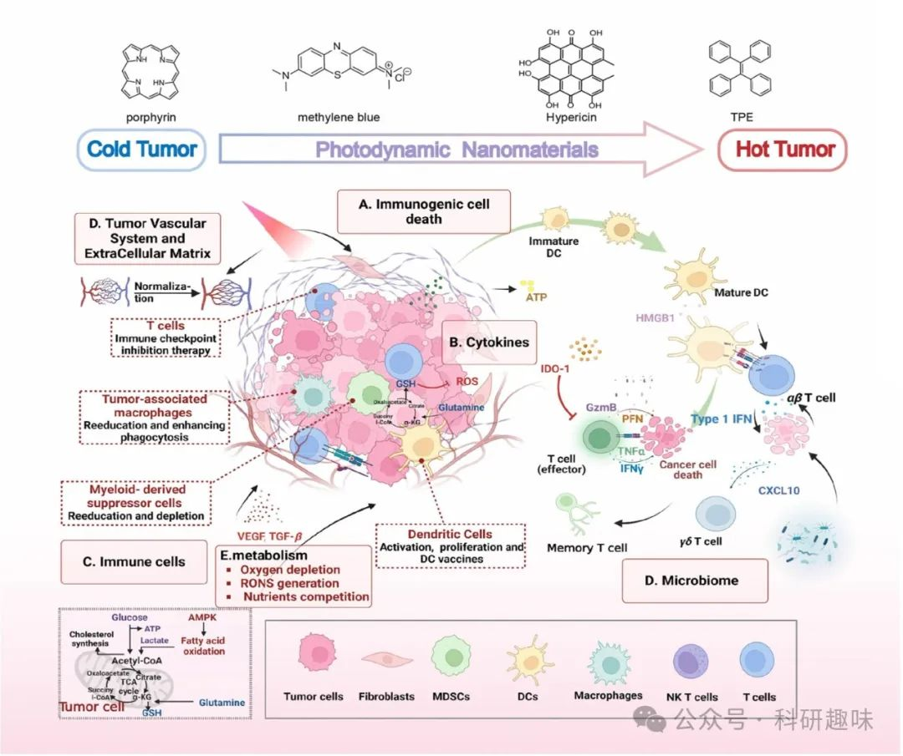

 

#  【光动力治疗】一文足够，最全PDT之肿瘤免疫疗法（3）- 光动力引导免疫治疗机制 
 

# 本节主要介绍了光动力治疗与肿瘤相关的免疫治疗，包括PDT刺激的抗肿瘤免疫效应和光动力-免疫疗法协同抗肿瘤治疗

## 光动力治疗与肿瘤免疫治疗

肿瘤微环境（TME）是一个高度复杂的生态系统，由多细胞组分、细胞外基质（ECM）、各类分泌分子以及错综复杂的血液与淋巴管网络共同构成，这一环境对肿瘤的发生与发展起着至关重要的作用。癌症的免疫环境则是一个涵盖多种因素的综合性概念，这些因素共同影响着机体的抗癌免疫反应。

近十年来，随着对TME认识的不断深化以及免疫疗法（IT）和光动力疗法（PDT）在临床实践中的迅速崛起，科学家们愈发关注PDT与肿瘤相关免疫之间的协同增效作用。PDT作为一种非侵入性治疗手段，在激活宿主免疫系统方面展现出独特优势。PDT治疗后，不仅能够有效调节先天性免疫应答，还能增强适应性免疫的效能，从而优化肿瘤免疫微环境（TIME），促进免疫细胞对肿瘤细胞的识别和清除，进而激发更为强烈的抗肿瘤免疫反应。

此外，基于PDT的联合治疗方案更是将这一潜力发挥到了极致。通过将PDT与特异性信号通路抑制剂及免疫应答的强力激活剂相结合，科学家们能够实现对肿瘤免疫应答的精准调控和持续增强。这种联合治疗策略不仅能够有效克服单一疗法的局限性，还能通过多途径、多靶点的综合作用，实现对肿瘤细胞的全面打击，为癌症治疗开辟了新的道路。

图 1. 光动力疗法与靶向肿瘤相关免疫景观策略之间相互促进的相互作用。

### 1. PDT 刺激的抗肿瘤免疫效应

光动力疗法（PDT）在调节免疫系统，特别是先天性免疫与适应性免疫方面展现出显著成效。首先，PDT诱导的肿瘤局部组织损伤能触发急性炎症反应，这一直接途径旨在清除受损组织并恢复体内稳态。早在1991年，Yamamoto团队即观察到PDT过程中生物体免疫系统的响应，特别是PDT产生的活性氧（ROS）诱导淋巴细胞膜脂质过氧化，随后通过Fc受体介导巨噬细胞活化（https://doi.org/10.1016/0277-5379(91)90388-T）。2002年，Sun等人的研究进一步证实，PDT后小鼠体内CD11b/CD18和CD11c/CD18表达上调及髓过氧化物酶活性增强，表明中性粒细胞积极参与了PDT介导的急性炎症调控，其在早期血管损伤及肿瘤细胞靶向破坏中扮演关键角色（https://doi.org/10.1039/b204254a）。然而，2003年的研究也警示我们，过度的炎症反应可能不利于临床应用，因此需精细调控炎症介质以优化PDT疗效（https://doi.org/10.1089/104454702753474931）。

另一方面，PDT通过诱导免疫原性细胞死亡（ICD）机制，有效激发先天性免疫反应，并触发适应性免疫应答的激活，进而形成长期免疫记忆。这一过程依赖于PDT诱导的肿瘤细胞损伤后释放的一系列损伤相关分子模式（DAMPs），它们作为“危险信号”促进抗原呈递细胞（APCs）的招募与激活。例如，内质网钙网蛋白（CRT）的膜转位、NF-κB转录因子上调导致的热休克蛋白（HSP）暴露、ATP及高迁移率族蛋白B1（HMGB1）的释放等，均参与了APCs的成熟、迁移及抗原呈递，最终激活效应T细胞对肿瘤细胞的特异性杀伤。此外，HSPs还促进树突状细胞（DCs）的成熟与迁移，而炎症因子的分泌则进一步加速了APCs的成熟过程。这一系列复杂而精密的免疫反应构成了PDT抗肿瘤免疫的基石。

然而，PDT对免疫系统的影响并非全然积极。其诱导的免疫抑制效应亦不容忽视，这主要与光敏剂（PS）类型、光源参数及辐射区域等因素相关。PDT可激活T细胞介导的免疫抑制过程，并涉及巨噬细胞的参与。同时，PDT诱导的血管效应及组织缺氧可稳定缺氧诱导因子-1α（HIF-1α），后者与血管内皮生长因子（VEGF）基因启动子结合，促进VEGF分泌，进而抑制T细胞的发育并可能引发肿瘤诱导的免疫抑制。此外，某些PS还可能通过影响细胞内铁代谢直接杀伤活化T细胞，进一步削弱免疫反应。

综上所述，PDT在调节免疫系统方面展现出复杂的双重效应：既能有效激活抗肿瘤免疫应答，又可能诱发免疫抑制。因此，在PDT的临床应用中，需综合考虑多种因素，通过优化治疗参数及联合其他治疗手段以最大限度地发挥其抗肿瘤优势并减少副作用。

### 2. 光动力-免疫疗法（PDIT）协同抗肿瘤治疗

免疫系统在调控肿瘤生长方面展现出双刃剑效应：既能通过其防御机制抑制肿瘤，又可能经由慢性炎症和肿瘤免疫微环境（TIME）的重塑，促进肿瘤的生长与转移，这一过程被形象地称为“癌症免疫编辑”，涵盖消除、平衡（稳态）及逃逸三大阶段。光动力疗法（PDT）实施后，会诱导肿瘤相关抗原（TAAs）的释放，随后抗原呈递细胞（APCs），如树突状细胞（DCs）、巨噬细胞、中性粒细胞及淋巴内皮细胞，会捕获并处理这些新抗原。这些新抗原被加工并展示于主要组织相容性复合体（MHC）I和II分子上，通过与T细胞受体（TCR）的结合，激活位于引流淋巴结（LN）中的未成熟T细胞（包括初始CD8+ T细胞和CD4+ T细胞）。此激活过程依赖于多个信号通路的协同作用，包括MHC-TCR间的突触形成、共刺激分子（如APC上的CD80/CD86与T细胞上的CD28）的相互作用，以及APC释放的细胞因子触发的T细胞极化。

被激活的肿瘤特异性T细胞在协同刺激下被激活并渗透至肿瘤微环境（TME）中，它们能够识别并诱导癌细胞凋亡，从而清除目标癌细胞。这一过程伴随着死亡肿瘤细胞继续释放TAAs，启动新一轮的肿瘤抗原-免疫循环。然而，值得注意的是，并非所有肿瘤细胞都能被有效清除，未被根除的癌细胞将促使癌症进入稳态阶段。在此阶段，TME通过免疫编辑机制塑造TIME，导致高免疫原性克隆的淘汰，并激活多种免疫逃逸策略，这些策略能够阻断免疫循环中的一个或多个关键环节，使癌细胞逃避免疫监视，减弱免疫系统的抗肿瘤反应。

此外，PDT的全身效应受限不仅归因于TIME的屏障作用，还因为PDT本身可能诱导全身性的免疫抑制状态，这一现象早在1989年即由David等人揭示（https://doi.org/10.1111/j.1751-1097.1989.tb09194.x），他们发现PDT能触发巨噬细胞介导的免疫抑制，且与小鼠的接触超敏反应抑制相关。进一步地，许多II型光敏剂（PSs）会加剧肿瘤组织的缺氧状态，促进缺氧诱导因子-1（HIF-1）的转录激活，从而加剧免疫抑制并可能诱导PDT耐受性。

因此，将PDT与针对肿瘤相关免疫环境的策略相结合显得尤为重要。这种联合疗法旨在通过诱导免疫原性细胞死亡（ICD）来调整TIME，增强全身免疫力；同时，也是克服PDT和免疫疗法（IT）耐药性的关键途径。通过优化肿瘤免疫环境，如增强抗原呈递、促进T细胞浸润与活化、抑制免疫抑制性细胞及因子等五种策略，可以有效改善PDT的局限性或实现PDT与免疫疗法的协同增效。

#### 2.1. 作用于免疫抑制相关的细胞因子

在缺氧的肿瘤微环境（TME）中，促血管生成因子如血管内皮生长因子（VEGF）的过度表达，导致了血管系统的异常增殖与无序分布，表现为血管高通透性增加、间质压力（IFP）上升以及淋巴循环失调。这些变化构成了物理屏障，阻碍了免疫细胞、光敏剂（PSs）及纳米药物的肿瘤靶向递送。VEGF的上调与光动力疗法（PDT）诱导的缺氧环境和氧化应激紧密相关。值得注意的是，Perftoran作为一种干预手段，通过下调低氧诱导的miRNA（hypoxamiRs），进而抑制VEGF的表达，显著增强了Visudyne诱导的肿瘤细胞晚期凋亡与坏死效应。此外，联合抗血管生成疗法，特别是索拉非尼对VEGF的抑制，促进了肿瘤血管的正常化，改善了免疫抑制性TME，从而放大了T细胞介导的免疫原性细胞死亡（ICD）效果。将VEGF靶向毒素融入PDT策略中，可作为免疫检查点抑制剂（如αCTLA-4）的佐剂，潜在地降低了免疫治疗所需的药物剂量。

另一方面，吲哚胺 2,3-双加氧酶 1（IDO1），作为一种在肿瘤浸润淋巴细胞（TILs）中过表达的血红素酶，通过犬尿氨酸（Kyn）途径催化L-色氨酸的氧化降解，生成一系列具有免疫调节功能的代谢物。这些代谢物中，部分能够抑制T细胞的体外增殖或诱导其凋亡，同时IDO1还通过局部色氨酸耗竭，激活应激反应途径，如抑制mTOR激酶活性并触发GCN2激酶，促进幼稚CD4+ T细胞向具有免疫抑制功能的调节性T细胞（Tregs）分化。大量临床前研究揭示了PDT与IDO-1抑制剂联合使用的潜力，鉴于IDO-1在促进免疫耐受、增强犬尿氨酸毒性及促进Tregs分化方面的作用，该联合策略在临床研究中展现出合理的应用前景。

再者，转化生长因子-β（TGF-β）在肿瘤进展中扮演多重角色，包括促进血管生成、诱导EMT相关转录因子表达、抑制细胞周期进程及重塑细胞骨架，共同构建了一个有利于肿瘤侵袭与转移的微环境。因此，通过联合阻断TGF-β信号通路，可以逆转PDT可能引发的晚期免疫抑制，为肿瘤治疗提供新的策略方向。

#### 2.2. 肿瘤免疫相关的免疫细胞调控

在肿瘤免疫学的最新进展中，肿瘤相关免疫微环境（TME）的复杂性得到了深入探索，这一环境由多种因素交织而成，共同塑造着抗癌免疫反应的面貌。最新一期《自然》杂志刊登的两项研究，借助高精度的35重成像质谱（IMC）技术，精准解析了大脑与肺部TME中的约20种关键细胞组分，包括癌细胞、多样化的免疫细胞亚群以及内皮细胞，从而细致描绘了这些器官的免疫景观特征（https://doi.org/10.1038/s41586-022-05680-3，https://doi.org/10.1038/s41586-022-05672-3）。

免疫细胞，作为TME中数量庞大的非癌性居民，由先天性免疫细胞和适应性免疫细胞两大类构成，它们在抗肿瘤免疫中发挥着不可或缺的作用。然而，在多种TME背景下，免疫细胞可能通过减少在肿瘤组织中的有效归巢以及扩增具有免疫抑制功能的细胞群体，来抑制宿主的免疫系统，形成免疫逃逸的屏障。

为了克服这一挑战，当前的临床前研究正积极致力于重新编程肿瘤浸润免疫微环境（TIME），通过特异性或非特异性的策略靶向那些与免疫抑制紧密相关的分子机制。这一努力旨在增强光动力疗法（PDT）及其诱导的免疫原性细胞死亡（ICD）的效能，从而更有效地激发抗肿瘤免疫反应。

尤为值得注意的是，PDT与免疫疗法（IT）的联合应用展现出了非凡的潜力。PDT不仅能够显著提升IT的疗效，还能够有效弥补免疫检查点阻断（ICB）疗法在特异性、成本效益及安全性方面的局限性。通过这一创新策略，科学家们正逐步揭开肿瘤免疫治疗的新篇章，为癌症患者带来更加精准、高效且安全的治疗选择。

#### 2.2.1. T细胞

在抗肿瘤免疫学的广阔领域中，T细胞凭借其卓越的细胞杀伤能力，已成为研究的核心焦点。TME（肿瘤微环境）内，多种T细胞亚群如细胞毒性T淋巴细胞（CTLs）、调节性T细胞（Tregs）及辅助性T细胞（Th）协同作用，介导复杂的免疫反应。其中，CTLs在靶向并摧毁肿瘤细胞的过程中扮演着核心角色。为精确调控这一过程，免疫系统配备了诸如CTLA-4与PD-1/PD-L1等负性调控因子作为检查点分子，它们既是免疫稳态的守护者，也可能被肿瘤细胞劫持以逃避免疫监视。

PD-1，一种在T细胞活化后表达的免疫检查点受体，通过与配体结合，触发一系列磷酸化-去磷酸化反应，抑制T细胞功能。针对PD-1/PD-L1通路的单克隆抗体（mAb）疗法，通过阻断这一抑制信号，有效激活CTLs介导的特异性抗肿瘤免疫。此类抑制剂在临床试验中展现出延长患者总生存期（OS）的显著优势，尤其以Pembrolizumab和nivolumab为代表，已被FDA批准用于黑色素瘤治疗。然而，其疗效受限于PD-L1在肿瘤细胞表面的表达水平及CTLs的浸润程度，对于非选择性人群的有效率相对较低。

为克服这一挑战，结合Pheophorbide A介导的光动力疗法（PDT）与αPD-L1治疗，旨在通过增加肿瘤内PD-L1表达及T细胞浸润，提升治疗效果（https://doi.org/10.3390/pharmaceutics14112513）。研究表明，血管靶向PDT联合αPD-L1/αPD-1治疗，能够优化肿瘤免疫微环境，促进CD8+与CD4+ T细胞相对Tregs的增殖，从而加速原发性肿瘤消退并预防远端转移。

另一重要检查点CTLA-4，在效应T细胞（Teff）中表达，通过与APC上的B7分子结合，抑制T细胞活化。利用NIR-PDT结合CTLA-4阻断策略，可诱导急性炎症反应，促进DC成熟与活化，延长实验动物生存期。基于Redaporfin的PDT与αCTLA-4阻断联合，不仅促进T细胞增殖与活化，还降低了ICI治疗的剂量需求，简化了治疗管理（https://doi.org/10.1016/j.addr.2017.05.011）。

Tregs，作为免疫耐受与自身免疫抑制的关键调节者，其在肿瘤部位的浸润通过多种机制增强肿瘤逃逸。通过表达高亲和力IL-2受体、分泌免疫抑制细胞因子、高亲和力CTLA-4结合共刺激分子及诱导CTL功能障碍，Tregs限制了抗肿瘤免疫的效力。PDT后，Tregs的短暂激增可能是调节免疫激活与抑制平衡的机制之一，而PDT本身也削弱了Tregs与其他免疫细胞的相互作用。因此，PDT联合Tregs抑制剂（如CD25耗竭抗体、环磷酰胺）的研究正深入展开，旨在通过降低Tregs活性，进一步提升PDT的治疗效果。

#### 2.2.2. 肿瘤相关巨噬细胞（TAMs）

巨噬细胞，作为众多组织中的常驻免疫细胞，在维护机体非特异性及特异性防御机制中扮演核心角色，是维持组织稳态不可或缺的媒介。然而，肿瘤微环境（TME）的异常改变，如增殖失控、血管生成加剧及转移潜能的提升，显著扰乱了巨噬细胞的正常功能。在肿瘤病灶处，巨噬细胞群体既包含原位增殖的细胞，也吸引着单核细胞衍生的巨噬细胞（MDM）的迁入，共同作用于肿瘤的生长与进展过程。

肿瘤相关巨噬细胞（TAM）作为肿瘤炎症的关键调控者，通过多种机制促进肿瘤恶化，包括但不限于加剧遗传不稳定性、滋养癌症干细胞以及助力肿瘤细胞的转移扩散。TAM的极化状态，依据其接触的细胞因子谱，可划分为促炎的经典活化M1表型和抗炎的交替活化M2表型。随着肿瘤进展，TME中的酶、细胞因子及趋化因子等因素共同作用，促使浸润的巨噬细胞更倾向于向M2表型分化。

值得注意的是，通过激活STING信号通路并释放线粒体DNA（mtDNA），以Ce6为光敏剂的光动力疗法（PDT）能够有效诱导TAM向M1表型极化（https://doi.org/10.1186/s12951-020-00653-y）。此外，PDT还能促使肿瘤细胞释放热休克蛋白70（HSP70），该蛋白随后激活TLR2/4受体并触发肿瘤坏死因子α（TNFα）的释放，从而产生PDT后的间接杀伤效应(https://doi.org/10.1158/0008-5472.1018.65.3)。同时，巨噬细胞表面表达的补体受体赋予其识别并吞噬被C3及甘露糖结合凝集素（MBL）标记的肿瘤细胞的能力，进一步促进PDT对肿瘤组织的清除作用。

尤为重要的是，M1极化的TAM通过招募更多M1巨噬细胞，增强了PDT对皮肤鳞状细胞癌等肿瘤的治疗响应性(https://doi.org/10.1007/s00262-005-0088-4)。此外，结合TLR拮抗剂对TAMs进行重编程，并与PDT联合应用，展现出启动针对远处及转移性肿瘤的新型免疫疗法的巨大潜力。这一策略不仅加深了我们对TAM在肿瘤免疫中作用机制的理解，也为开发更加高效、精准的肿瘤治疗手段开辟了新途径。

#### 2.2.3. 髓源性抑制细胞

在肿瘤微环境（TME）的复杂调控网络中，除了肿瘤相关巨噬细胞（TAMs）外，髓源性抑制细胞（MDSCs）同样构成了靶向疗法的重要潜在靶点。这些细胞在癌症、炎症等病理状态下，展现出高度的异质性，形成一群能够抑制T细胞功能的细胞群体。MDSCs，作为病理环境中未成熟髓系细胞的集合体，通过多途径促进肿瘤生长，包括直接抑制T细胞活性、招募免疫抑制性细胞、诱导巨噬细胞向M2样TAMs极化，以及削弱自然杀伤细胞（NK细胞）的功能，从而在癌症进展的每一个阶段对免疫反应施加负向调控，精细调节着先天性与适应性免疫系统的平衡。

MDSCs的活性受到一系列病原体信号网络的精密调控，这些信号以损伤相关分子模式（DAMPs）、病原体相关分子模式（PAMPs）或Toll样受体（TLR）配体的形式存在，揭示了PDT与MDSCs调节剂联合应用的潜在可行性。PDT不仅具备对MDSCs的固有招募能力，还能通过延缓Gr1+细胞（一种MDSCs标志物）的耗竭，间接提升PDT的治疗效果(https://doi.org/10.1158/2326-6066.CIR-16-0297)。

此外，全反式维甲酸（ATRA）作为一种有效的调节剂，被证实能够诱导免疫抑制性的MDSCs向非抑制性的成熟表型转变，这一发现为增强PDT的抗肿瘤效力提供了新策略。通过ATRA的应用(https://doi.org/10.3390/ijms161126008)，可以预期进一步削弱MDSCs对免疫系统的抑制作用，从而放大PDT在肿瘤治疗中的正面效应。

综上所述，当前针对MDSCs及其与PDT相互作用机制的研究正不断深入，这些努力无疑将在不远的将来为精准靶向髓系细胞、优化肿瘤免疫治疗方案提供宝贵的理论依据和实践指导。

#### 2.2.4. 树突状细胞（DC）

树突状细胞（DCs）作为一类至关重要的抗原呈递细胞（APCs），源自CD34+骨髓前体细胞，展现出卓越的从凋亡或垂死肿瘤细胞中交叉呈递突变新生抗原，以及从感染细胞内交叉呈递病原体衍生抗原的能力。目前，DCs被细分为两大主要亚群：浆细胞样树突状细胞（pDCs）和经典树突状细胞（cDCs），每一亚群均拥有独特的功能特性。

pDCs，亦称类浆细胞样树突状细胞，能够产生并释放I型干扰素（IFN-I），在免疫应答中展现出免疫原性与耐受性的双重面貌。它们通过促进DCs与促炎巨噬细胞的成熟与活化、推动B细胞向浆细胞分化、增强NK细胞与T细胞的细胞毒性，从而强化先天性与适应性免疫。同时，pDCs亦能诱导免疫调节分子的表达与分泌，招募免疫抑制细胞，参与肿瘤免疫微环境（TIME）的构建。

cDCs则进一步细化为cDC1（Clec9aXCR1+）与cDC2（SirpαCD11b+）两种同工型，两者在功能特性与转录因子依赖上各有千秋。cDC1亚群独具将肿瘤相关抗原（TAAs）引流至淋巴结，并通过MHC I分子将抗原交叉呈递给未成熟CD8+ T细胞的能力。而cDC2则主要负责向CD4+ T细胞交叉呈递MHC II分子结合的抗原，并参与Th17细胞的诱导过程。总体而言，肿瘤微环境（TME）中cDC（尤其是cDC1）密度的增加，往往预示着更为乐观的癌症预后。

DCs表达可识别损伤相关分子模式（DAMPs）的模式识别受体（PRRs），这一特性使得基于PRRs的信号传导在光动力疗法（PDT）后成为促进DC活化的关键机制。大量研究表明，PDT诱导的肿瘤裂解可促使TAAs的释放与扩散，进而刺激DCs的招募与原位DC疫苗的形成，触发强大的免疫级联反应，这一过程甚至无需额外佐剂的辅助。

值得注意的是，PDT与DC疫苗疗法之间存在显著的互补性，二者联合应用相较于单一治疗展现出更为显著的疗效。这些发现预示着PDT-DC疫苗接种策略有望成为多种肿瘤类型协同治疗的新选择，有效遏制肿瘤的转移与复发。

#### 2.3. 针对肿瘤血管系统功能障碍和促进免疫抑制的细胞外基质沉积

肿瘤血管生成的异常性是癌症的一个标志性特征，其表现为内皮细胞（ECs）的异常增殖、血管壁细胞覆盖的紊乱、细胞间紧密连接的减少以及细胞外基质（ECM）沉积的显著增加。这一异常导致肿瘤血管系统结构复杂且功能失调，迂回曲折，旨在高效地为快速增殖的肿瘤细胞提供养分。通过精细调控血管生成信号通路，促进或抑制血管形成，可以优化肿瘤血管网络，增强其免疫调节功能，从而激发更强大的抗肿瘤免疫反应。抗血管生成策略不仅优化免疫微环境，还能有效缓解肿瘤内部因血管功能不足导致的缺氧状态，克服光动力疗法（PDT）在某些情况下的局限性。

除了血管系统的异常，ECM的过度沉积也是肿瘤微环境（TME）的重要特征之一，尤其在浸润性癌中，ECM的重塑与免疫抑制环境的形成及对免疫疗法的抵抗密切相关。这一过程通过影响肿瘤相关巨噬细胞（TAMs）的表型及其在TME中的分布，直接作用于免疫系统。

癌相关成纤维细胞（CAFs）作为TME中ECM的主要生产者，其角色尤为关键。在正常生理状态下，CAFs作为静止的间充质细胞嵌入ECM中，仅在伤口愈合等过程中被激活，促进炎症修复与再生。然而，在肿瘤这一“永不愈合的伤口”中，CAFs的持续激活促进了ECM的沉积、基质重塑酶的分泌及多种细胞因子的产生，从而加剧肿瘤的侵袭与转移。此外，CAFs还通过多种机制介导TME的免疫抑制，包括分泌趋化因子与细胞因子、表达免疫检查点分子（如PD-L1/2）以及产生免疫调节代谢物，共同塑造了抗肿瘤免疫抵抗的TIME。

鉴于CAFs在肿瘤进展与免疫逃避中的核心作用，其已成为抗肿瘤免疫疗法的新靶点。PDT与CAFs的相互作用研究显示，通过减少光敏剂PpIX的积累，可降低肿瘤对光毒性的敏感性并缓解药物耐药性。此外，5-ALA介导的局部PDT能够下调α-SMA和FAP等CAF活化标志物，进而抑制鳞状细胞癌的生长与转移。

尽管针对CAFs的治疗策略取得了一定进展，但现有药物如FAP靶向药物常伴随严重副作用甚至全身毒性。为此，研究者们提出了创新的解决方案，如利用FAPα响应性裂解的诊断探针结合PDT与免疫检查点阻断（ICB），以实现CAF与肿瘤细胞的双重破坏，达到协同增效的抗癌效果。同时，通过设计智能纳米平台，实现药物释放的精确时间与空间控制，不仅能够有效调节CAF相关的抗肿瘤免疫，还能显著减少全身毒性，为癌症治疗开辟了新的途径。

#### 2.4. 通过微生物组协同抗肿瘤免疫

近期科学研究揭示，肿瘤组织内驻留的微生物群落对宿主生理机能具有深远影响，它们能够调控宿主基因组的特定方面，诱导一系列促肿瘤效应。这些效应包括但不限于直接诱发DNA损伤、塑造利于肿瘤发展的炎症微环境，以及生成具有致癌潜能的有害代谢副产物。尤为引人注目的是，组织内微生物组通过精细调控细胞因子网络及免疫细胞亚群分布，重塑整体免疫格局，具体表现为促进肿瘤相关巨噬细胞（TAMs）向免疫抑制性的M2表型极化、增强髓源性抑制细胞（MDSCs）的免疫抑制功能，并分泌多种免疫抑制性炎症因子。

鉴于微生物组在塑造免疫环境及多种生理过程中的核心地位，通过精准靶向与重组这些微生物群落，或应用其衍生物以增强免疫应答，有望成为未来癌症治疗领域的关键策略。在癌症治疗的探索中，微生物组的应用聚焦于两大核心目标：一是提升治疗效果，二是减轻治疗副作用。值得注意的是，光动力疗法（PDT）作为一种非侵入性的抗癌手段，其应用范围已不仅限于直接杀伤肿瘤细胞，还展现出对肿瘤微生物群的有效调控能力。最新研究显示，PDT在消融肿瘤细胞的同时，亦能清除人类乳头状瘤病毒及宫颈病理相关微生物群，表明其具备调节肿瘤微生物群以削弱其原发肿瘤促进及免疫抑制作用的潜力。

因此，结合微生物组调控与PDT等先进治疗手段，有望为癌症治疗开辟新的路径，实现更高效、更精准的治疗效果，同时减轻患者负担。

#### 2.5. 癌症代谢重编程和 PDIT

在肿瘤生物学领域，肿瘤内部常展现出复杂多样的中枢代谢途径异常。回溯至20世纪20年代，奥托·沃伯格（Otto Warburg）的开创性工作首次揭示了肿瘤细胞即便在富氧环境中也偏好通过糖酵解途径获取能量的独特现象，即著名的“沃伯格效应”。随着肿瘤代谢重编程研究的不断深化，我们逐渐认识到肿瘤免疫反应与组织代谢之间的密切互动，前者可显著影响耗氧量、活性氮和氧物种（RONS）的生成以及营养物质的分配，而后者则通过代谢产物反馈调节免疫细胞的发育、分化及免疫检查点的表达。

最新研究揭示了一个重要的竞争机制：免疫细胞与肿瘤微环境（TME）中的癌细胞及其他增殖细胞之间对营养资源的激烈争夺，这提示了代谢干预策略在增强抗肿瘤免疫疗法效果中的潜力。具体而言，药物干预能够精准调控T细胞的代谢适应性与持久性，例如，PI3K抑制剂的应用在CAR-T细胞激活后促进了糖酵解通量，显著提升了抗肿瘤效能(https://doi.org/10.1038/s41375-017-0008-6)。此外，通过抑制mTORC2-AKT信号通路以阻断糖酵解，促进了T细胞记忆表型的形成，这对于长期免疫监控至关重要。

值得注意的是，癌症能量平衡的重编程与光动力疗法（PDT）之间存在着显著的协同效应。这种协同主要体现在PDT反应底物浓度的提升、还原物质合成的减少以及免疫原性细胞死亡（ICD）的改善上。特别地，抑制肿瘤细胞的氧化磷酸化（OXPHOS）不仅能增加TME中的氧分压，还提高了适用于II型PDT的反应底物浓度，从而增强了治疗效果。进一步地，通过干扰与新陈代谢紧密相关的信号通路并减少肿瘤细胞内代谢物的积累，可以有效避免活化T细胞的耗竭及免疫检查点的上调，这些都是导致ICD失败的关键因素。

在此背景下，谷氨酰胺作为谷胱甘肽（GSH）的直接前体，其在TME中的代谢调控显得尤为重要。限制肿瘤细胞对谷氨酰胺的摄取与利用，能够削弱GSH对活性氧（ROS）的抗氧化防御，进而增加ROS对肿瘤细胞的杀伤作用，并促进免疫细胞对营养资源的摄取，最终防止ICD的失败，为肿瘤治疗开辟了新的策略方向。

#### 2.6. PDT与免疫环境的相互串扰

在肿瘤微环境（TME）的复杂架构中，癌细胞深植其间，与多种基质细胞（涵盖癌细胞本身、免疫细胞、血管内皮细胞及成纤维细胞活化蛋白细胞，即CAFs）形成动态交互网络。这一网络通过代谢耦合与旁分泌信号传导机制，借助细胞因子作为媒介，深刻影响着肿瘤的生物学特性。一方面，这些成分间的相互作用，在无外界干预时，倾向于构建一个免疫抑制性的微环境；另一方面，此现象也为肿瘤治疗策略的设计提供了新思路，特别是PDIT（一种假设的协同治疗策略，可能指光动力免疫疗法或其他基于光动力学的免疫疗法）的引入，旨在通过扰乱肿瘤内部的相互作用网络，解除免疫抑制的桎梏。

以IDO-1抑制剂为例，其疗效常受限于肿瘤细胞氧化还原稳态的失衡及效应T淋巴细胞（特别是CD4+和CD8+ T细胞）浸润的障碍。然而，结合光动力疗法，IDO-1抑制剂能够通过诱导程序性细胞凋亡及免疫原性细胞死亡（ICD），促使T淋巴细胞的有效浸润与肿瘤清除。

此外，CAFs过度沉积的细胞外基质（ECM）与肿瘤细胞快速增殖产生的机械应力共同作用，导致实体瘤硬度增加，压迫血管与淋巴管，降低血液灌注，加剧肿瘤缺氧状态。针对此，ECM降解酶的应用成为关键，它能有效瓦解肿瘤的物理屏障，促进药物渗透，恢复血液流动，并缓解缺氧。结合PDT对CD8+ T细胞的招募效应，这种双重策略显著提升了治疗响应率。

肿瘤细胞通过代谢重编程策略，不仅促进自身增殖、转移与侵袭，还通过竞争营养物质与生成代谢副产物，间接调控周围细胞的组成与功能。干扰其葡萄糖代谢路径可触发热休克反应，激发强大的抗肿瘤免疫反应，伴随炎症细胞因子的释放。进一步地，通过限制肿瘤细胞对谷氨酰胺的摄取，PDT的效能得以增强，减少了谷胱甘肽（GSH）与烟酰胺腺嘌呤二核苷酸磷酸（NADPH）的抗氧化作用，从而克服了PDT的某些局限性。

综上所述，TME是一个由正常细胞与恶性细胞交织而成的复杂生态系统，其中各成分间的相互作用既竞争又合作，共同塑造了肿瘤免疫微环境（TIME）。通过利用PDT对CD8+ T细胞的招募效应，并结合其他单一疗法，我们有望实现对肿瘤景观的全面调控与优化。

预览时标签不可点

素材来源官方媒体/网络新闻

 [阅读原文](javascript:;) 

  继续滑动看下一个 

 轻触阅读原文 

   

