 

#  【光动力治疗】一文足够，最全PDT之肿瘤免疫疗法（4）- 光动力材料及调控方法 
 

# 本节主要介绍了光动力疗法与肿瘤相关免疫靶向疗法相结合的一些技术，包括增强免疫性细胞死亡，减少免疫抑制相关细胞因子，通过细胞外基质重编程增强 PDIT及通过靶向癌症代谢增强 PDIT等

## 光动力疗法与肿瘤相关免疫靶向疗法相结合的**纳米材料**

在深入探讨肿瘤免疫微环境的复杂性时，我们观察到细胞因子、肿瘤细胞及免疫细胞间的协同作用显著延迟了患者对光化学疗法（PDT）及免疫疗法（IT），特别是免疫检查点阻断（ICB）疗法的响应。从理论框架出发，PDT与IT通过协同构建高度免疫原性的肿瘤微环境，旨在重振患者的内在免疫系统，从而克服各自单独治疗时的局限性，展现出作为先进治疗策略的广阔前景。

纳米医学的兴起，为抗肿瘤免疫疗法开辟了一条创新且极具潜力的路径。其独特优势在于个性化定制能力、易于修饰以赋予多种生物活性功能，以及对抗肿瘤耐药性的卓越效果。借助先进的生物材料技术，我们能够设计并实施一系列肿瘤靶向的免疫景观调控策略，这些策略与PDT形成强大的协同效应，旨在优化PDT与IT的联合治疗（简称PDIT，此处可理解为一种假想的协同治疗模式），具体措施涵盖：

1. 1. **增强免疫原性细胞死亡（ICD）**：通过优化PDT参数或结合特定纳米制剂，促进肿瘤细胞发生更为显著的ICD，释放更多肿瘤相关抗原及危险信号，从而激活并增强抗肿瘤免疫反应。
2. 2. **抑制免疫抑制性细胞因子**：利用纳米载体递送靶向抑制剂，精准调控免疫抑制性细胞因子的表达与功能，打破肿瘤微环境中的免疫抑制屏障。
3. 3. **调节免疫细胞活性**：通过纳米技术调节肿瘤浸润免疫细胞的表型与功能，如促进效应T细胞的活化与增殖，抑制调节性T细胞（Tregs）的免疫抑制作用，重塑免疫平衡。
4. 4. **重塑肿瘤血管系统与细胞外基质（ECM）**：应用纳米材料改善肿瘤血管通透性，促进药物及免疫细胞在肿瘤内的渗透与分布；同时，调节ECM成分，降低肿瘤硬度，改善局部微环境。
5. 5. **重编程肿瘤代谢**：利用纳米平台递送代谢调节剂，干扰肿瘤细胞的关键代谢途径，如糖酵解、谷氨酰胺代谢等，削弱其生存与增殖能力，同时增强免疫细胞的代谢适应性。
6. 6. **微生物组调控**：通过纳米技术调节肿瘤微环境中的微生物群落，减少有害菌的丰度，增加有益菌的定植，或利用微生物代谢产物增强抗肿瘤免疫反应，形成新的治疗靶点。

综上所述，纳米医学与PDT的协同作用，为抗肿瘤免疫疗法提供了前所未有的机遇与挑战，通过精准调控肿瘤免疫景观的多个维度，有望实现更高效、更精准的肿瘤治疗。

### 1. 增强免疫性细胞死亡

在探索光动力疗法（PDT）诱导的免疫原性细胞死亡（ICD）作为抗癌策略的过程中，尽管其展现出巨大潜力，但先天性免疫系统的负向调节仍是制约ICD疗效及肿瘤彻底清除的关键因素。树突状细胞（DCs）的抗原呈递效率紧密依赖于肿瘤内部损伤相关分子模式（DAMPs）的丰度，因此，高效释放ICD过程中产生的DAMPs对于提升PDT与免疫治疗结合（PDIT）的整体效率具有决定性意义。

钙离子（Ca²⁺）作为关键的第二信使，在维持免疫细胞活化及表位转换过程中发挥着核心作用。最新研究表明，肿瘤细胞内的Ca²⁺超载现象能够显著加速DAMPs的释放，为增强ICD提供了新途径。Huang等人巧妙设计了一种基于CaO₂的复合纳米材料，表面封装有超小型CuS-MnO₂纳米颗粒，通过实施钙超载策略与CuS的PDT效应相协同，实现了对ICD的双重增强（图6a）（https://doi.org/10.1002/adma.202207593）。

该纳米系统中，透明质酸（HA）作为表面涂层，利用其特异性靶向4T1肿瘤细胞表面CD44受体的能力，增强了药物的细胞摄取效率。在肿瘤微环境的酸性条件下，CaO₂通过CD44介导的内吞作用进入肿瘤细胞内部，随后释放Ca²⁺和氧气。值得注意的是，PDT过程中产生的活性氧（ROS）会攻击线粒体，导致其功能障碍，进而失去对细胞内Ca²⁺浓度的调控能力，诱发细胞内Ca²⁺超载，这一机制与PDT效应相辅相成，共同促进了ICD的双途径增强。

进一步地，当这种钙基纳米药物与抗程序性死亡配体1（αPD-L1）抗体联合使用时，在近红外二区光的照射下，对4T1复发性肿瘤模型展现出了显著的抑制效果。这一发现不仅深化了我们对PDT与免疫治疗协同作用机制的理解，也为开发更加高效、精准的抗肿瘤疗法提供了新的策略与思路。

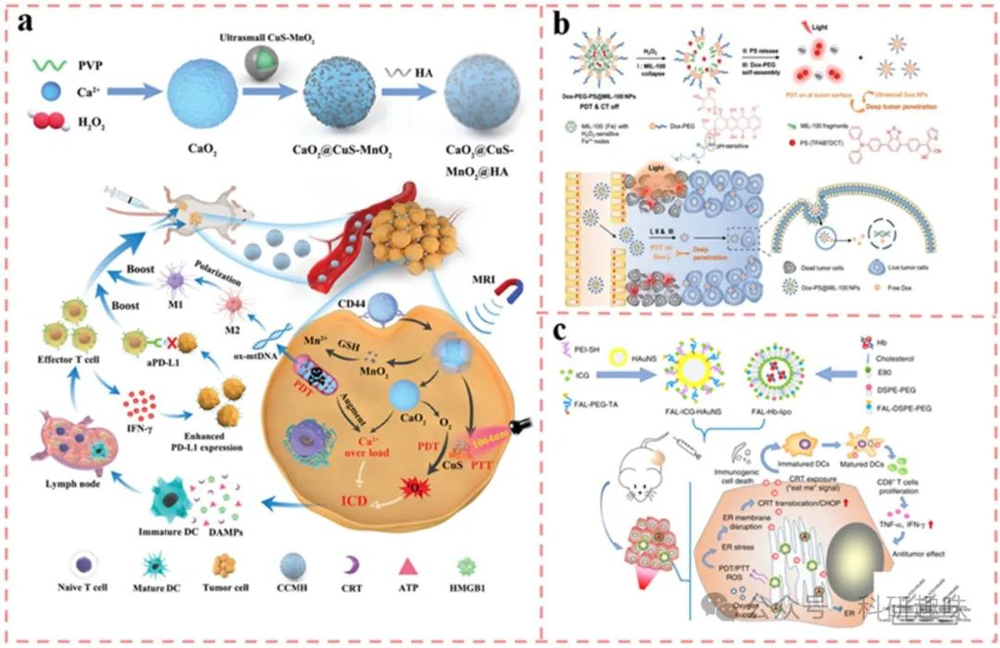

图 6. ICD 增强策略

在探讨肿瘤治疗策略的多样性时，除了光动力疗法（PDT）外，化学治疗药物如多柔比星（DOX）、奥沙利铂（OXa）和环磷酰胺也被证实能够通过诱导免疫原性细胞死亡（ICD）来激活宿主免疫反应。Wang及其团队独创性地合成了具有（供体）-A'（辅助受体）-π（π间隔物）-A（真正受体）独特构型的聚集诱导发光分子（AIEgens）（https://doi.org/10.1002/adfm.202010241），并借助纳米级铁（III）和铜（II）金属有机框架（MOF，具体为MIL-100）实现了聚乙二醇甲醚（PEG）链与AIEgens的连接，同时构建了治疗剂的环境响应性级联释放系统（如Dox-PEG-PS@MIL-100，图6b所示）。该系统在肿瘤部位，因H₂O₂的过表达促使MIL-100结构瓦解，从而精准释放DOX-PEG与光敏剂（PSs），后者在肿瘤间质中进一步自组装成超小型DOX纳米颗粒（NPs），有效穿透肿瘤组织，进入细胞核，直接损伤DNA，协同增强ICD的触发效率。

另一方面，钙网蛋白（CRT）所在的内质网（ER）作为细胞信号传导的核心，其应激状态是DAMPs释放的关键途径。因此，精确地将光敏剂（PSs）靶向至ER对于激发ICD相关的免疫原性至关重要。然而，挑战在于，多数PSs在细胞内化后难以有效积累于ER中。Wei等研究者通过巧妙的设计，将叶酸（FAL）肽修饰的脂质体应用于吲哚菁绿（ICG）耦合的空心金纳米球（HAuNS）表面（FAL-ICG-HAuNS，图6c）（https://doi.org/10.1038/s41467-019-11269-8），实现了对ER的特异性靶向。在近红外光激发下，FAL-ICG-HAuNS引发了强烈的ROS介导的ER应激，显著上调了ER凋亡相关蛋白CHOP的表达，并促使ER向细胞表面转位。这种ER靶向策略显著增强了ICD效果，进而有效抑制了肿瘤生长，并延长了动物模型的生存期。

综上所述，PDT触发的ICD在前期临床研究中展现了巨大潜力。然而，面对肿瘤缺氧微环境、肿瘤细胞通过分子机制规避免疫监视以及肿瘤免疫微环境（TIME）中复杂成分的相互作用，单纯依赖PDT诱导的ICD尚难以完全根除癌细胞。因此，探索PDT与其他治疗手段的联合策略，如化疗药物的协同作用，成为未来研究的重要方向，以期实现更高效的肿瘤治疗。

### 2. 减少免疫抑制相关细胞因子的光动力疗法

在肿瘤免疫治疗的演进历程中，细胞因子作为先驱治疗药物，其应用开启了全新的治疗篇章。随着信息技术的飞跃与肿瘤微环境（TME）认知的深化，细胞因子导向的疗法凭借其增强其他治疗手段活性或减轻免疫相关毒性的能力，成为科研领域的热点。当前，聚焦于调节血管内皮生长因子（VEGF）、吲哚胺2,3-双加氧酶（IDO）及缺氧诱导因子（HIFs）的生物材料研究尤为活跃，这些因子在肿瘤生长与复发中扮演关键角色。

鉴于光动力疗法（PDT）高度依赖氧气生成活性氧（ROS）以杀灭肿瘤细胞，而VEGF作为关键的氧调节因子，在缺氧严重的深部肿瘤区域过度表达，成为肿瘤复发的重要推手。因此，在PDT中同步抑制VEGF的过度表达，对于提升肿瘤治疗效果至关重要。Dong等人巧妙设计了一种基于树枝状精氨酸阳离子两亲肽与二硫键连接硬脂酸的纳米载体（ALS）（https://doi.org/10.1002/adhm.202001850），该载体能够同时递送疏水型光敏剂（PS）HPPH与VEGF的小干扰RNA（siVEGF）（图7a）。此策略旨在通过基因沉默技术下调VEGF表达，改善肿瘤内部缺氧状态，从而优化PDT效果。

值得注意的是，该团队在光剂量调控上亦进行了深入考量：高剂量光（HDL）虽能增强PDT效应，但可能加剧TME缺氧，引发剧烈的细胞坏死、炎症反应及组织损伤；相比之下，低剂量光（LDL）诱导的细胞凋亡更为温和，且能通过激活细胞膜表面的钙离子（Ca²⁺）通道，增强细胞间通透性，促进PSs向深部肿瘤渗透。然而，单纯LDL不足以触发高效的光导放疗效应。为此，他们创新性地提出了交替使用低密度脂蛋白（LDL）与高密度脂蛋白（HDL）的策略（ALHDL），该策略不仅有效规避了细胞内外屏障，实现了siVEGF的高效递送与HPPH的深部渗透，还借助HDL的快速细胞消融能力，显著增强了PDT的整体疗效。

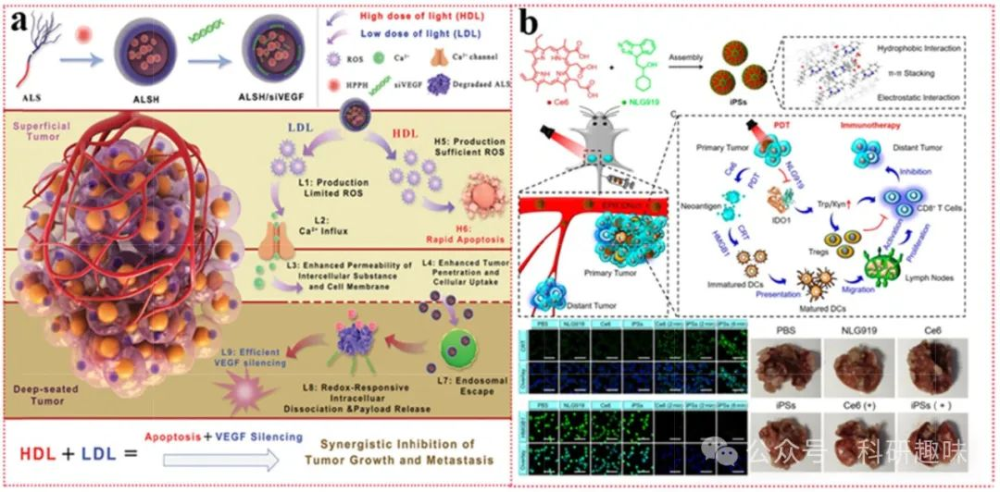

图 7. PDT 结合减少免疫抑制细胞因子的策略。

在纳米药物设计的前沿探索中，吲哚胺2,3-双加氧酶-1（IDO-1）抑制剂如NLG-919、1-甲基色氨酸（1-MT）及IND等，常被巧妙地融入其中。Zhao及其团队通过创新的策略（https://doi.org/10.1021/acsnano.0c06765），利用π-π堆积、疏水相互作用以及离子键的协同作用，成功地将光敏剂二氢卟吩e6（Ce6）与IDO-1抑制剂NLG919自组装成无载体、自我递送的光免疫纳米体系（iPSs，图b）。此设计不仅实现了Ce6与NLG919的高效共递送，还显著提升了二者的溶解性能，从而在光动力敏化免疫治疗领域展现出非凡潜力。

实验结果显示，iPSs系统对原发肿瘤及远处转移病灶均表现出优异的抑制效果，进一步在转移性CT26肿瘤模型小鼠中验证了其抑制肺转移的能力。该体系简洁的制备流程及其显著的光动力敏化免疫治疗功效，预示着其在临床应用中具有巨大的潜力和价值。

尽管众多临床前研究数据支持IDO-1抑制剂与光动力疗法联合应用的优越性，但值得注意的是，并非所有肿瘤均呈现IDO-1阳性表达，因此，在评估其临床应用前景时，需对原发性肿瘤及转移瘤中IDO-1的表达水平进行细致考量。尽管单一IDO-1抑制剂在现有研究中尚未能单独激发强烈的免疫反应，但光动力疗法与IDO-1抑制剂之间的显著协同作用，无疑为肿瘤治疗提供了新的思路与方向。因此，深入探索并优化这一联合疗法，应成为未来研究的重要课题。

### 3. 以 PDT 为靶点的肿瘤免疫治疗

#### 3.1. 调节 T 细胞的 PDT

在肿瘤微环境（TME）的免疫应答机制中，细胞毒性T细胞（Cytotoxic T Lymphocytes, CTLs）占据着至关重要的核心地位。为了精准且高效地激活这些CTLs以攻击肿瘤细胞，纳米药物技术提供了一种创新的解决方案，能够直接将免疫治疗药物靶向递送至CD8+ T细胞表面。通过这一策略，CD8+ T细胞能够响应趋化因子浓度梯度的引导，有效迁移并渗透至肿瘤组织内部。

在众多免疫检查点中，PD-1/PD-L1通路因其深入的研究基础和明确的疗效机制，成为了免疫疗法中的典范。在纳米药物的设计策略中，针对该通路的抑制方法多种多样且日益精进。其中，单克隆抗体（mAbs）因其高特异性和强亲和力，被广泛用于阻断PD-1或PD-L1的结合，从而解除对T细胞活化的抑制。此外，小分子PD-1/PD-L1抑制剂通过化学阻断的方式，同样能够有效地干扰该通路的信号传导。

除了直接针对蛋白-蛋白相互作用的策略外，纳米药物还引入了先进的基因干扰技术，如RNA干扰（RNAi），通过特异性地降解或抑制PD-1或PD-L1的mRNA，从而在基因表达层面实现对通路的调控。这些创新方法不仅丰富了免疫治疗的工具箱，也为个性化医疗和精准治疗提供了有力支持。

综上所述，纳米药物技术在细胞毒性T细胞的免疫治疗中展现出了巨大的潜力和优势，通过精准递送和高效抑制PD-1/PD-L1通路等策略，有望为肿瘤患者带来更加安全、有效的治疗选择。

Table 3. PDT combined with tumor-associated immune landscape modulation therapeutic strategy.

| Target | System | PSs & immunotherapeutics |  | Types of Immunotherapeutics | Mechanisms |
| --- | --- | --- | --- | --- | --- |
| T cell | Transition Metal Complex | ICG/αPD-1 |  | mAbs | Reducing the reducing substance GSH in TME and increasing ROS levels induces a powerful ICD storm that works with αPD-1 to eradicate tumors |
| PFC | PFC vector-coated HEK293T cell membranes expressing PD-1 protein |  | PD-1 protein | Boosting DC cell maturation and tumor infiltration of cytotoxic T lymphocytes |  |
| Albumin | A heptamethine cyanine dye analog (nIR-68) with tumor selectivity and mitochondrial targeting/lonidamine |  | OXPHOS destructive agent | Activation of AMPK by selective disruption of OXPHOS in tumor cells and further leading to accumulation and degradation of PD-L1 at ER;   sensitization of PDT by inhibition of endogenous oxygen consumption |  |
| nucleic acid nanogel | Pheophorbide A/si PD-L1 |  | siRNA | Use of si PD-L1 as the cross-linker to avoid digestion by nucleases;   si-PD-L1 knocks down intracellular PD-L1;   DNA fraction assists in enhancing the water solubility of PPA. |  |
| Polymeric nanocapsules | Pheophorbide A/αPD-1 |  | mAbs | PDT promotes IFN-γ intratumoral secretion by triggering ICD;   inhibition of endogenous SLC7A11 and SLC3A2 expression by IFN-γ induces ferroptosis of tumor cell;   Ferroptosis counteracts IFN-γ-induced PD-L1 upregulation in tumor cells in concert with αPD-1. |  |
| Polymeric nanocapsules | AIE PS (TPRA)/DC-DPPA |  | PD-L1 blocking peptide | Promoting apoptosis-pyroptosis transition after PDT through epigenetic modulation;Immunogenic pyroptosis combined with ICB therapy induces a robust tumor immune response. |  |
| (Upconversion nanoparticles) UCNPs | Ce6/αCTLA-4 |  | mAbs | Effective ablation of irradiated deep and distant tumors through the intrinsic properties of UCNPs combined with αCTLA-4 |  |
| Self-assembled nanostructure | Ce6/αPD-L1 and αCTLA-4 |  | mAbs | Simultaneous delivery of multiple mAbs;   Red fluorescence image-guided surgery based on Ce6 can be realized. |  |
|  |  |  |  |  |  |
| TAM | Re-educating TAMs and inhibiting the recruitment of macrophages | nanomaterial with p–n type heterojunction | BiFeO3/Bi2WO6 (heterostructured photocatalyst) | / | (1) Separation of photoinduced hole-electron pairs for photoactivated self-supply of O2;   (2) Simultaneous generation of ROS and O2 and collaborative reprogramming of TAMs |
| Polymeric nanocapsules | IR780/CUDC2 | EGFR & CD47 inhibitor | Enhancement of phagocytosis by inhibition of CD47 binding to SIRPα;   Re-education of TAMs by PDT-induced P53 expression |  |  |
| Enhancing phagocytosis | Bovine serum albumin | Ce6/PEP20 | CD47 inhibitory peptide | CD47-SIRPα blocking;   Depletion of reducing substances and amplification of PDT;   Self-supplied O2;   Ferroptosis activation and sensitization. |  |
|  |  |  |  |  |  |
| MDSCs | Re-educating MDSCs | Mesoporous CuS nanoparticles | PpIX/docetaxel (Low dosage) | Chemotherapeutics | Low-dose chemotherapeutics induced phenotypic polarization in MDSCs;   PDT amplified immunostimulation. |
| Eliminating MDSCs | Porphyrinic metal–organic framework (pMOF) | meso-tetra (4-carboxyphenyl) porphine/Gemcitabine | Chemotherapeutics | Elimination of MDSCs mediated by gemcitabine;   Small-sized nanomedicines ensure deeper intratumoral penetration. |  |
|  |  |  |  |  |  |
| DCs | Based on cGAS-STING pathway | pMOF | TCPP/Mn (ⅠⅠ) | Metal Forest | Nucleus-targeted AS1411 aptamer lead TCPP to the nucleus for direct DNA damage;   HDAC inhibitors prevented DNA repair;   Mn (ⅠⅠ) facilitated cGAS-STING recognition of ds DNA. |
| Based on toll-like receptors (TLR) agonists | Mesoporous silica nanoparticles (MSN) | Ce6/CpG & Adpgk (neoantigen peptide) | TLR agonists | neoantigen peptide triggered a robust neoantigen-specific T-cell response;   CpG and ICD contributed to the phenotype and function of DCs in different dimensions. |  |
| Based on inflammatory death of tumor cells | sericin derivative | IR780/Tumor cell contents | Cancer vaccine | IR780-induced mito ROS production activated GSDME-dependent pyroptosis and generated a sustained immune response. |  |
|  |  |  |  |  |  |
| CAFs | Therapeutic diagnostic probes | methylene blue (MB)/FAPα-cleavable peptide substrate |  | FAPα-cleavable peptide substrate | FAPα-activatable local pro-therapeutic diagnostic probe;   Specific killing of CAFs at the tumor site. |
|  |  |  |  |  |  |
| Cancer metabolism | Targeting glucose metabolism | Self-assembled nanostructure | Ce6/Salvianolic acid B   Ce6/GLS inhibitor compound 968 | Chemotherapeutics | inhibiting the cancer-specific (HK2);   Acting on GLUT1 to alleviate hypoxia in tumor tissues. |
|  | Targeting amino acid metabolism | Carrier-free self-assembled nanostructures | Ce6/GLS inhibitor compound 968 | Chemotherapeutics | Inhibiting glutamine metabolism, and reducing GSH production to sensitize PDT;   Inhibition of M2-type TAM glutamine metabolism and re-education of TAM. |

在肿瘤免疫治疗领域，一种被广泛采纳的策略是将针对程序性死亡受体-1（PD-1）或其配体PD-L1的单克隆抗体（mAbs）与具备光动力疗法（PDT）功能的纳米药物进行直接整合。此策略旨在实现双重治疗效应：首先，多功能纳米药物通过逆转肿瘤免疫微环境（TIME）的抑制状态，将原本“冷”（非免疫原性）的肿瘤转变为“热”（免疫原性）肿瘤，从而优化肿瘤微环境（TME），使其更利于免疫检查点阻断（ICB）疗法的实施。其次，PDT诱导的免疫原性细胞死亡（ICD）与ICB疗法形成协同效应，不仅降低了免疫检查点抑制剂（ICI）的日给药剂量，还显著减少了免疫相关不良事件（irAEs）的发生。

Hou等人创新性地设计了一种纳米平台，该平台能够激发强烈的活性氧（ROS）风暴并触发ICD级联反应(https://doi.org/10.1016/j.cej.2022.134778)。他们通过温和的化学方法，利用酰肼化透明质酸与Cu²⁺进行交联，并借助原位矿化技术形成酰肼化铜配位结构，最终合成了一种兼具谷胱甘肽（GSH）氧化酶样活性和过氧化氢（H₂O₂）酶样活性的铜基药物载体。随后，他们将吲哚菁绿（ICG）的磺酸基团以配位键形式锚定在这一纳米平台上，构建了HA@Cu(OH)₂-ICG体系（图a）。该铜基载体凭借其固有的酶活性，能够提升TME内的氧化应激水平，通过消耗还原性谷胱甘肽（GSH）来触发剧烈的ROS风暴。尤为关键的是，HA@Cu(OH)₂-ICG与αPD-1抗体的联合应用，在彻底清除原发性肿瘤的同时，有效激发了全身性的抗肿瘤免疫反应，从而有效遏制了肿瘤的转移与复发。

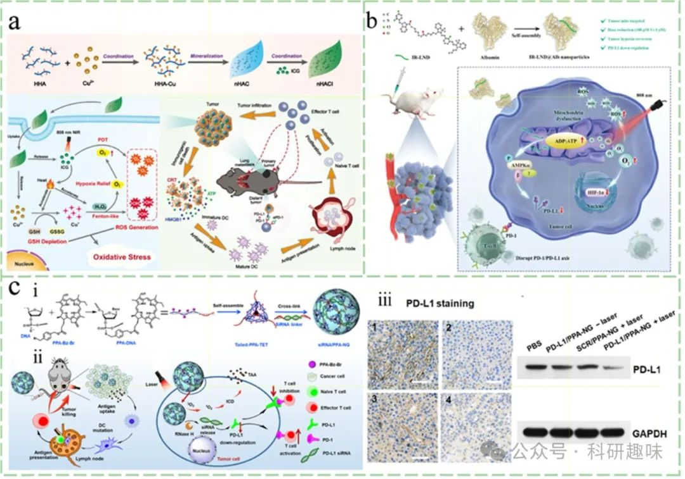

图 8. PDT 与靶向 PD-1/PD-L1 通路阻断的联合策略。

在深入探讨肿瘤免疫治疗的策略时，将抗PD-1/PD-L1抗体、多肽与纳米药物或生物材料的整合成为了一个重要的研究方向，旨在实现多层次的协同治疗效果。鉴于免疫球蛋白G（IgG）抗体的Fc区具有高度保守性，抗IgG（Fc特异性）抗体（αFc）能够通过非共价相互作用特异性地识别并结合任何含有Fc片段的单克隆抗体（mAbs）。Jiang等人巧妙地利用这一点，通过将αFc氧化偶联至纳米粒子表面，构建了多抗体偶联平台（αFc-NP）（https://doi.org/10.1038/s41467-021-21497-6）。该平台能够在温和条件下通过Fc识别机制，有效固定包括αPD-1和αPD-L1在内的多种mAbs，形成免疫调节纳米适配体（imNAs）。在多个动物模型中的研究表明，与常规组合相比，imNAs能够显著增强NK细胞、效应T细胞和巨噬细胞介导的免疫反应，然而，这仅是抗体组合治疗的初步探索，要实现肿瘤的彻底清除，还需与其他治疗手段联合应用。

值得注意的是，尽管抗PD-1/PD-L1抗体在临床应用中取得了显著成效，但它们主要作用于T细胞表面的PD-1/PD-L1轴，而对细胞内PD-L1蛋白的调控有限。为此，研究者们开始探索小分子抗肿瘤药物如多肽、奥希莫替尼以及氧化磷酸化（OXPHOS）抑制剂在PD-1/PD-L1抑制方面的潜力。特别是，OXPHOS抑制剂通过干扰线粒体能量代谢，激活AMPK信号通路，进而促进PD-L1的降解，为肿瘤治疗提供了新的思路。Liu等人通过将lonidamine（LND）与线粒体靶向的七甲基青染料类似物（nIR-68）结合，创制了新型化合物IR-LND（https://doi.org/10.1002/adma.202206121），并利用白蛋白递送系统（IR-LND@Alb）实现了肿瘤组织的优先积累。这一策略不仅增强了药物的靶向性，还通过抑制线粒体功能，有效降低了细胞内PD-L1的表达，展现了良好的抗肿瘤效果。

此外，针对疏水性光敏剂（PS）与大分子mAbs理化性质差异导致的封装难题，研究者们开发了基于核酸凝胶的递送系统。Guo等人通过将光敏剂Ppheophorbide A（PPA）共价接枝到硫代磷酸酯修饰的DNA骨架上，构建了超分子自组装的核酸凝胶。（https://doi.org/10.1126/sciadv.abn2941）同时，利用siPD-L1作为交联剂，将siRNA嵌入三维核酸凝胶结构中，形成了siRNA/PPA-NG复合物。该复合物不仅继承了核酸的优异水溶性，还通过保护siRNA免受核酸酶降解，提高了其生物稳定性和治疗效果。

在基因治疗领域，CRISPR/Cas9技术为实现PD-1或PD-L1基因的精确敲除提供了可能。通过敲除CAR T细胞中的内源性\_Pdcd1\_基因座或PD-1基因，可以避免PD-1的长期刺激导致的T细胞功能障碍和衰竭。初步的临床研究表明，PD-1基因敲除的CAR T细胞在合成免疫功能正常的小鼠模型中表现出长期的功能稳定性和有效性。然而，目前尚无文献报道将PDT与PD-1基因敲除策略相结合的研究。随着KO CAR-T细胞临床数据的积累，探索PDT与PD-1基因敲除的联合疗法，以增强抗原递呈细胞（APC）的抗原递呈能力，将成为未来研究的重要方向。

综上所述，通过整合纳米技术、基因编辑技术以及小分子药物等多种治疗手段，我们可以构建出更加高效、精准的肿瘤免疫治疗方案。这些方案的实施不仅依赖于对免疫系统和肿瘤学复杂性的深入理解，还需要跨学科的合作与创新，以推动肿瘤免疫治疗领域的持续发展。

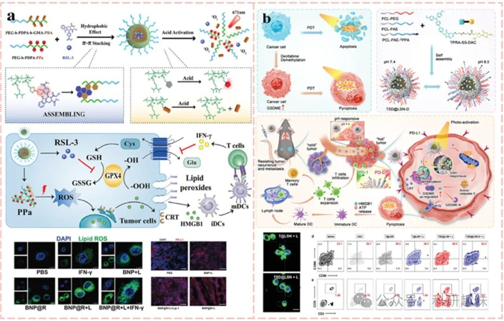

图 9. 多种癌症疗法与 ICB 策略的结合。

在深入探索免疫系统与肿瘤学复杂交互的进程中，将免疫检查点阻断（ICB）疗法与其他癌症治疗手段相结合，已成为未来研究的主流趋势。近期，铁代谢与免疫应答之间的动态联系在癌症治疗领域备受瞩目。具体而言，铁凋亡通过调节免疫细胞表型、释放KRAS蛋白及影响TAMs极化，深刻影响着肿瘤微环境（TME）。同时，T淋巴细胞浸润释放的IFN-γ在TME中抑制SLC7A11和SLC3A2表达，进而诱导肿瘤细胞铁凋亡。值得注意的是，光动力疗法（PDT）通过触发免疫原性细胞死亡（ICD），不仅直接促进免疫细胞在TME中的浸润，还间接增强了IFN-γ的分泌，从而进一步诱导铁凋亡。基于这些发现，Song等人巧妙地设计了一种pH响应性纳米药物系统，该系统利用PEG-b-PDPA二嵌段共聚物与可酸解的苯硼酸酯（PBE）动态共价键构建囊泡，将GPX4抑制剂RSL-3包封其中，并在酸性TME中（pH 5.8-6.2）触发药物释放，协同增强PDT、ICD及铁凋亡效应，同时抵消IFN-γ诱导的PD-L1上调，与αPD-1阻断形成协同效应。

尽管细胞凋亡是癌症治疗的重要策略，但癌细胞对凋亡的抗性及免疫原性不足限制了其疗效。相比之下，热凋亡作为一种炎症性程序性死亡方式，以其独特的质膜破裂、细胞肿胀及大量促炎性细胞因子释放为特征，有效促进了肿瘤相关抗原（TAAs）的暴露。这一过程的关键在于caspase炎症体介导的gasdermin-E（GSDME）裂解，生成具有膜穿孔活性的GSDME-N片段。然而，肿瘤细胞中GSDME的低表达限制了PDT诱导的热凋亡效果。为此，Wang等人通过DNA去甲基化策略（https://doi.org/10.1002/adfm.202214499），将DNA甲基转移酶抑制剂地西他滨与AIE光敏剂TPRA共价偶联，制备了肿瘤微环境响应性释放的原药（TSDs），并结合pH响应性共聚物纳米载体，实现了PDT后肿瘤凋亡向热凋亡的转变，显著增强了免疫原性和治疗效果。

此外，一种新兴的铜依赖型细胞死亡方式——铜死亡（cuproptosis）正逐渐成为研究热点。细胞内铜积累可触发线粒体脂质过氧化及Fe-S簇蛋白不稳定，进而诱导细胞死亡。鉴于铜离子载体能增强肿瘤细胞PD-L1表达，将铜突变诱导剂与ICI结合展现出巨大治疗潜力。Guo等人利用ROS敏感的非离子生物可降解聚合物包裹铜离子载体伊利司莫（ES）和铜（https://doi.org/10.1002/adma.202212267），构建了NP@ESCu纳米系统，实现了线粒体铜的持续积累，不仅诱发了杯突症，还显著增强了ICI对肿瘤细胞的杀伤效果，同时重塑了肿瘤免疫格局。这一研究为PDT与杯突症的结合提供了新思路，预示着两者联合应用将成为增强抗肿瘤免疫应答的重要策略。

在深入探讨其他关键免疫检查点，诸如CTLA-4、LAG3信号传导路径以及TIM3受体等领域时，当前的研究趋势倾向于构建精密的纳米平台，这些平台能够直接靶向并结合上述通路或受体的特异性抑制剂，以此激发强劲的肿瘤免疫原性反应。以Xu等人的创新研究为例（https://doi.org/10.1021/acsnano.7b00715），他们巧妙地利用上转换纳米颗粒（UCNPs）作为载体，将光敏剂Ce6与Toll样受体7（TLR-7）激动剂咪喹莫特（R837）协同装载于内，实现了肿瘤相关抗原（TAAs）的高效释放与呈现（图10a）。这一过程中，UCNPs凭借其独特的多光子吸收/单光子发射特性，成功将长波长光转换为短波长光，有效穿透并消融深层肿瘤组织。进一步地，通过将抗CTLA-4检查点阻断疗法与这一纳米系统相结合，不仅显著增强了局部及远处肿瘤的治疗效果，还诱导了强大的免疫记忆效应，为长期抗肿瘤免疫提供了坚实基础。值得注意的是，Ce6与免疫球蛋白G（IgG）之间的纳米摩尔级亲和力，确保了其在药用赋形剂聚乙烯吡咯烷酮（PVP）的辅助下能够自发组装成稳定的纳米结构（https://doi.org/10.1021/acsnano.9b03466）。这一纳米平台不仅实现了多种单克隆抗体（mAbs），如αPD-L1和αCTLA-4的共递送，还依托Ce6的光学特性（图10b），实现了红光荧光成像引导下的精准手术操作，为肿瘤治疗的可视化与个性化开辟了新途径。

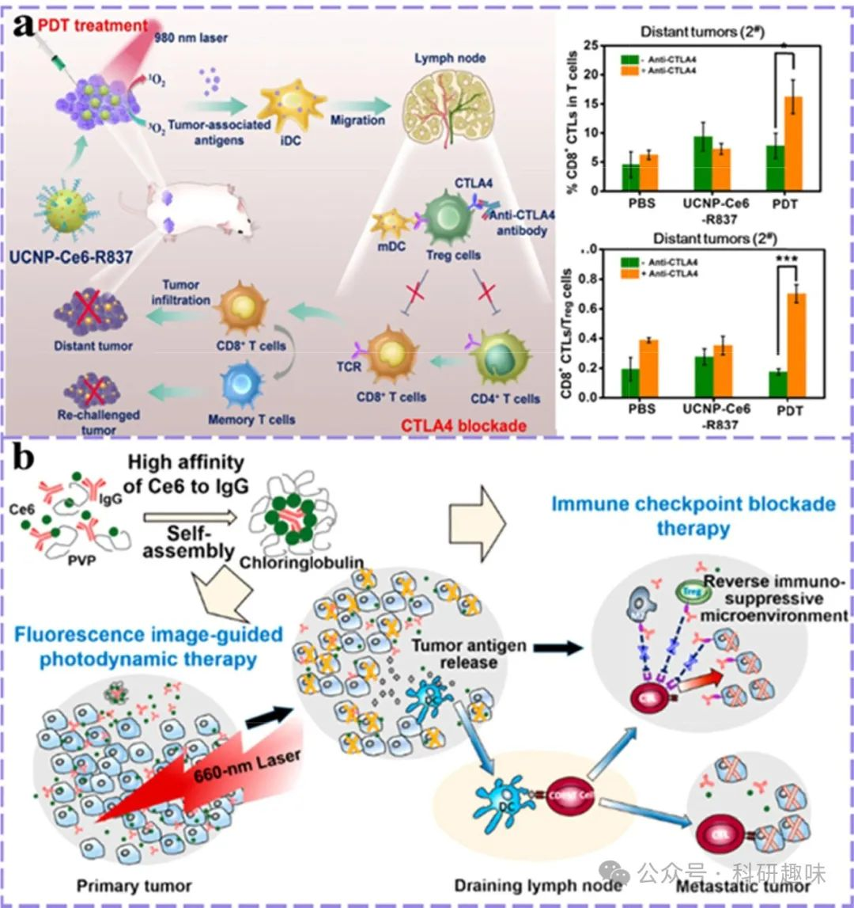

图 10. 光导疗法与其他免疫检查点阻断剂的结合。

#### 3.2. 调节肿瘤相关巨噬细胞的 PDT

在探讨肿瘤微环境（TME）调控中，肿瘤相关巨噬细胞（TAMs）的角色至关重要，它们通过多种机制驱动肿瘤的生长与进展。光动力疗法（PDT）作为一种先进的治疗手段，能够干预TAMs的免疫抑制功能，不仅通过释放肿瘤相关抗原（TAAs）重塑免疫环境，还加速线粒体活性氧（ROS）的生成，诱导线粒体DNA（mtDNA）氧化损伤，进而促进M1型TAMs的极化。当前研究聚焦于利用PDT直接或联合针对TAMs的特异性治疗药物，以干扰其生存信号、功能转变、增强吞噬活性、抑制招募，并推动其向抗肿瘤表型转化。

氧气作为生命活动的基石，在缓解肿瘤缺氧、调节TAMs招募与极化、促进T细胞浸润等方面扮演着关键角色。尽管PDT能借由ROS生成刺激M1型TAMs极化，但使用II型光敏剂（PSs）可能加剧TME的缺氧状态，对M1极化介导的抗肿瘤免疫产生不利影响。为此，将I型PSs与纳米平台集成的缺氧缓解策略应运而生，如Yang等人设计的p-n型异质结光催化剂BiFeO3/Bi2WO6纳米复合材料(https://doi.org/10.1002/adma.202108908)，经PVP改性后，在近红外光激发下高效分离光生空穴-电子对，与H2O和过量H2O2反应生成ROS与O2，同步实现肿瘤消融与TME缺氧缓解，增强了放疗敏感性与免疫微环境的双重优化。此外，该材料还具备CT成像潜力，为诊疗一体化提供了可能。

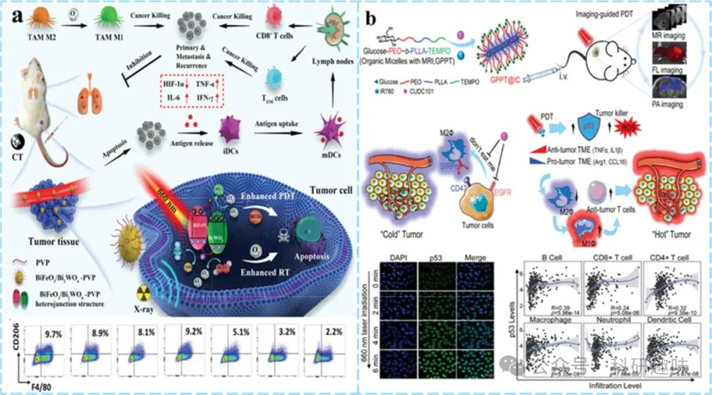

图 11. 利用 PDT 重极化 TAMs 策略。

脂质体作为纳米医学领域的明星载体，能够封装多种治疗药物。Cheng等人的工作利用葡萄糖基多嵌段共聚物构建了集成化TME调控胶束，共包载疏水PS（IR780）与多靶点抑制剂CUDC2(https://doi.org/10.1002/adma.202107674)。CUDC2通过抑制CD47-SIRPα相互作用及重编程TAMs为抗肿瘤表型，显著增强了吞噬效能。尤为重要的是，PDT诱导的P53表达进一步促进了TAMs的再教育，验证了PDT与TAMs靶向疗法协同作用的科学基础。

巨噬细胞作为先天免疫的关键防线，其吞噬能力对于肿瘤清除至关重要。肿瘤细胞表面CD47与巨噬细胞SIRPα的结合形成了免疫逃逸的屏障。He等人创新性地设计了集氧气自供、铁死亡激活与免疫激活于一体的纳米平台(https://doi.org/10.1016/j.biomaterials.2022.121832)，利用BSA搭载Ce6与Hemin，并表面修饰CD47抑制肽PEP20包覆的M1巨噬细胞膜（MP@CH/BSA NP）。该平台通过血红素模拟过氧化氢酶（CAT）活性缓解肿瘤缺氧，提升Ce6光疗效率，同时触发铁死亡路径。CD47抑制肽的引入显著增强了巨噬细胞对肿瘤细胞的吞噬能力，并经由IFN-γ过表达与Xc-系统下调，增加了肿瘤细胞对铁死亡的敏感性，为肿瘤综合治疗策略开辟了新的视角。

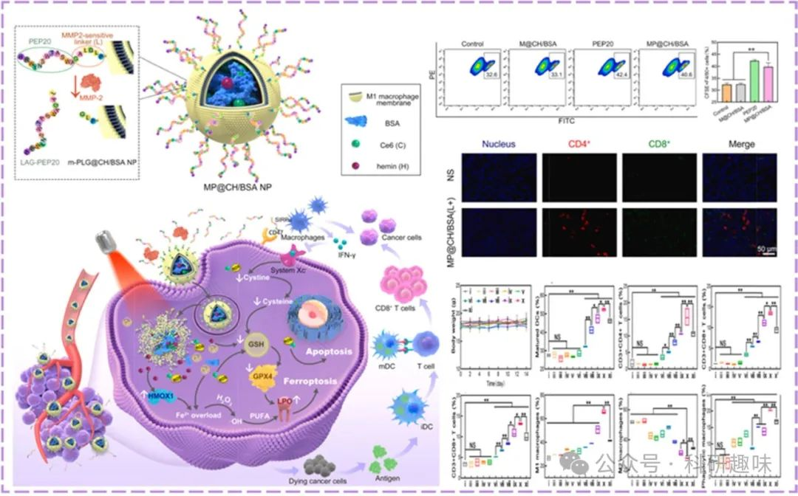

图 12. 利用 PDT 增强吞噬作用的策略。

在探讨肿瘤微环境（TME）中肿瘤相关巨噬细胞（TAM）的调控机制时，阻断循环单核细胞向TAM的补充路径成为了一种间接抑制TAM促肿瘤作用的有效策略。这一过程的核心在于调控趋化因子网络，因为循环单核细胞的募集强烈依赖于多种趋化因子的导向作用。通过干扰这些趋化因子的信号转导路径，可以显著降低TAM在TME中的聚集密度，进而削弱其促肿瘤生长的功能。

近期的研究揭示了光动力疗法（PDT）对趋化因子及其受体表达谱的潜在影响。Zhu等人利用高通量芯片分析技术，系统地评估了5-氨基乙酰丙酸（5-ALA）介导的PDT对趋化因子和趋化因子受体表达的影响(https://doi.org/10.1016/j.pdpdt.2019.04.018)。他们发现，PDT后共有21种趋化因子和13种相关受体的表达显著上调，其中CXCL13尤为突出。这一发现表明，PDT不仅能够直接杀伤肿瘤细胞，还可能通过调节趋化因子网络来间接影响免疫细胞的募集和分布。

此外，除了趋化因子外，其他细胞因子如巨噬细胞迁移抑制因子（MIF）和单核细胞趋化蛋白1（MCP-1）在ALA介导的PDT后也表现出类似的分泌变化。这些细胞因子的变化可能进一步抑制了循环单核细胞的募集，从而减少了TAM的来源，最终削弱了TAM在TME中的促肿瘤作用。

#### 4.3.3. 利用髓源性抑制细胞调控PDT

在深入剖析《免疫学》中关于免疫治疗（IT）对特定癌症疗效受限的论述时，我们认识到这一挑战主要归因于淋巴细胞与髓源性抑制细胞（MDSCs）之间的复杂相互作用及其有效过滤机制。最新科研进展揭示，低剂量传统化疗药物诱导的免疫原性细胞死亡（ICDs）能够激活免疫系统，具体表现为减少MDSCs比例并诱导其向M1样抗肿瘤表型转变。

Chen等人的研究中，巧妙地将介孔硫化铜纳米粒子（CuS NPs）作为光热治疗（PTT）的媒介(https://doi.org/10.1002/adma.201904997)，并辅以低剂量多西他赛以协同激发免疫反应。为进一步扩大免疫刺激效果，他们创新地将聚乙烯亚胺修饰的原卟啉IX（PEI-PpIX）共轭物与CpG寡核苷酸交替锚定于纳米复合物表面，并通过迈克尔加成反应将肿瘤靶向配体叶酸（FA）接枝其上，形成FA-CuS/DTX@PEI-PpIX-CpG复合体系（a）。此体系中，多西他赛诱导的MDSCs表型极化促进了炎症因子的释放，进而增强了免疫反应，有效防止了细胞毒性T淋巴细胞（CTL）的功能障碍与失效。

此外，吉西他滨（GEM）作为另一种能够削弱MDSCs免疫抑制作用的化疗药物，尽管因其血液半衰期短而难以在肿瘤部位有效积累，限制了其治疗效果。为解决这一问题，研究者利用阳离子树枝状聚合物PEG-DGL将GEM包裹成约10纳米大小的纳米颗粒(https://doi.org/10.1002/advs.202000411)，实现了在实体瘤组织中的深层渗透与高效递送，有效清除了肿瘤浸润的免疫抑制性微环境（TME）。进一步地，结合卟啉金属有机框架（pMOF）进行光导治疗，不仅增强了GEM的抗肿瘤效果，还通过ICD协同作用促进了肿瘤内CTL的浸润与肿瘤免疫微环境（TIME）的重塑（图13b）。

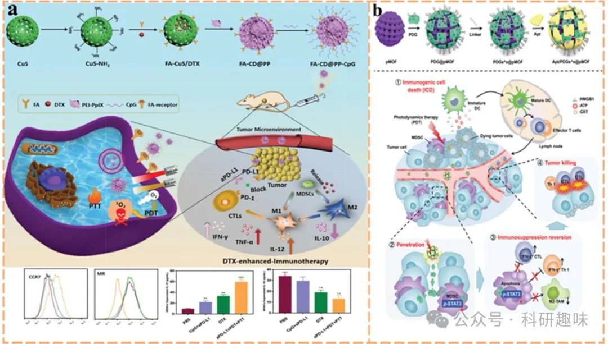

图 13. PDT 与 MDSCs 的调控。

#### 4.3.4. 利用树突状细胞调控 PDT

在癌症的免疫逃逸机制中，抗原呈递功能的下调与丧失占据着核心地位。树突状细胞（DCs）凭借其独特的三大固有特性——在淋巴与非淋巴组织间的迁移能力、与细胞毒性T淋巴细胞（CTLs）的交叉呈递抗原能力，以及趋化因子与细胞因子的释放能力，成为激发强大且持久抗肿瘤反应的关键。因此，针对DCs的肿瘤免疫微环境（TIME）调控策略被视为极具潜力的治疗靶点。光动力疗法（PDT）诱导的免疫原性细胞死亡（ICD）在促进抗原呈递方面展现出积极作用，已催生多种策略以优化DC功能，包括：

1. 1. **激活cGAS-STING通路**：通过刺激环状GMP-AMP合成酶-干扰素基因刺激器（cGAS-STING）诱导的I型干扰素（IFN）信号通路，增强抗原呈递细胞（APCs）的激活状态。这一通路作为细胞质DNA的关键感知机制，在增强肿瘤与免疫细胞间交流、放大免疫反应方面发挥重要作用，尤其DC对其敏感性远超TME中其他免疫细胞。
2. 2. **免疫佐剂联合应用**：结合使用免疫佐剂，促进DC的增殖、成熟与存活，从而增强抗原呈递效率。
3. 3. **炎性死亡模式诱导抗原释放**：利用特定模式诱导细胞炎性死亡，促进肿瘤抗原的有效释放，为DC提供更多抗原源。

在先天免疫的框架下，cGAS-STING通路作为连接肿瘤与免疫系统的桥梁，其重要性日益凸显。赵等人通过创新策略，将组蛋白去乙酰化酶（HDAC）抑制剂伏立诺他（SAHA）封装于锰-卟啉金属有机框架（Mn(III)-TCPP MOF）中，结合PDT效应，通过诱导染色质解体和减少组蛋白-DNA相互作用，加速双链DNA（dsDNA）的释放。这一过程不仅增强了PDT对DNA的直接损伤，还通过Mn²⁺的释放激活了cGAS-STING通路，促进了先天性与适应性免疫的双重激活(https://doi.org/10.1002/adfm.202108883)。

此外，DCs通过Toll样受体（TLRs）感知抗原，TLRs的活化对DC的分化、表型调控及功能发挥具有关键作用。PDT与TLR激动剂（如CpG寡脱氧核苷酸，CpG ODN）的组合策略，能够从不同层面促进DC的成熟与活化，显著提升基于DC的免疫治疗的免疫原性。Cheng等人利用介孔二氧化硅纳米粒子（MSN）作为载体，成功实现了Ce6与CpG的共载，通过Ce6诱导的ICD增强免疫原性，同时CpG促进DC的抗原呈递，共同促进先天免疫的激活及新抗原特异性T细胞反应的引发(https://doi.org/10.1021/acsnano.9b06691)。

综上所述，通过精准调控DCs的功能状态，结合PDT及免疫佐剂的联合应用，为癌症免疫治疗开辟了新的路径，展现了广阔的临床应用前景。

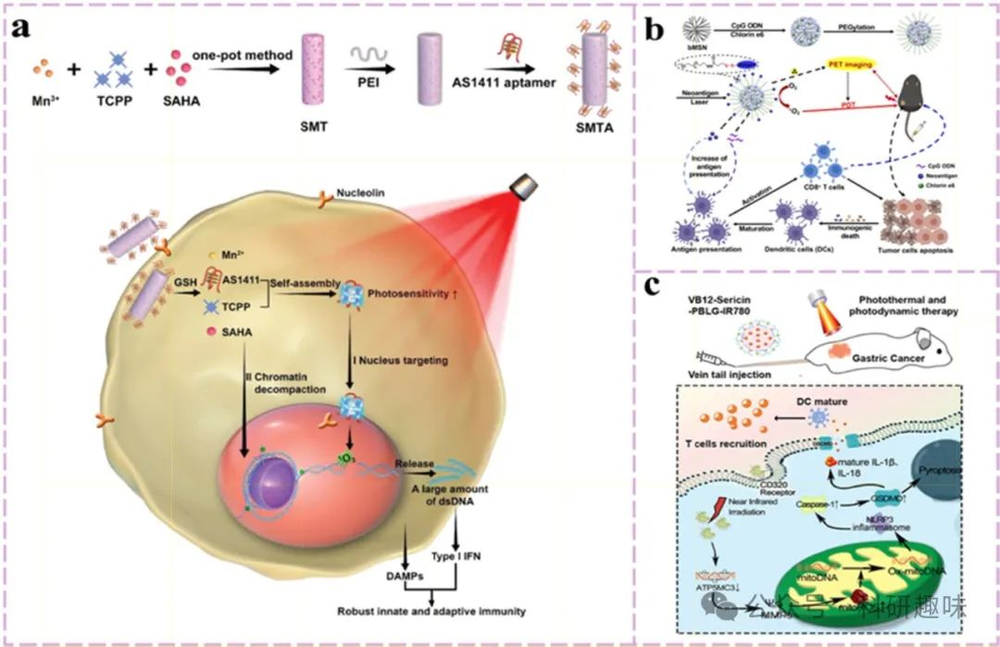

图 14. 利用 PDT 增强直流细胞抗原捕获能力的策略。

免疫原性细胞死亡（ICD）通过释放损伤相关分子模式（DAMPs）触发细胞凋亡过程，显著增强了细胞的免疫原性。然而，传统细胞凋亡往往呈现出“静默死亡”的特征，限制了免疫系统的有效响应。相比之下，热凋亡作为一种促炎性细胞死亡模式，其核心在于Gasdermin N端蛋白介导的质膜穿孔，导致细胞内容物的大量外泄，进而激发强烈的免疫反应，特别是树突状细胞（DC）的活化。这一过程的关键在于肿瘤细胞内Gasdermin家族成员GSDME的表达与活化。

在Caspase-3的催化下，GSDME被切割为GSDME-C（C端片段）和GSDME-N（N端片段），这一过程激活了肿瘤细胞的热解效应，即所谓的“化脓作用”。值得注意的是，尽管存在化学方法能够激活裂解酶，但其效能高度依赖于GSDME的表达水平，而GSDME在多种癌症中常表现为表达下调，这构成了治疗的一大障碍。

鉴于此，Guo等人提出了一种创新的光激活热蛋白沉积策略，利用丝裂霉素衍生物与聚(γ-苄基-L-谷氨酸)（PBLG）纳米载体，结合肿瘤靶向维生素B12（VB12）分子负载的光敏剂IR780（形成VB12-VB12-丝裂霉素-PBLG-IR780复合体系）（https://doi.org/10.1021/acsami.1c22804）。该策略通过增强肿瘤细胞对IR780的吸收，诱导线粒体活性氧（mitoROS）的爆发，进而激活GSDME依赖的热蛋白沉积机制，实现持续的免疫激活效应，包括免疫细胞的募集和免疫因子的释放。

综上所述，临床前研究表明，光动力疗法（PDT）增强的DC激活策略在多种癌症模型中展现出显著疗效，有效克服了传统DC改良剂在抗肿瘤效果上的局限性。此外，随着对DC亚群多样性及其在肿瘤微环境（TME）激活中作用机制的深入认识，针对特定DC亚群的靶向疗法与ICD的联合应用，为肿瘤治疗开辟了新的途径，有望开发出更加高效、精准的肿瘤疫苗。

### 4.4. 通过细胞外基质重编程增强 PDIT

细胞外基质（ECM）的重编程策略，通过调控肿瘤组织的血管生成，能够有效调节肿瘤微环境（TME）的氧合状态与能量供应，这一过程的核心在于抑制血管内皮生长因子（VEGF）的表达，此点已在4.1章节中详尽阐述。此外，鉴于癌细胞相关成纤维细胞（CAFs）作为肿瘤基质中最丰富的细胞类型，针对CAFs的靶向干预成为ECM重塑的另一关键途径。鉴于成纤维细胞活化蛋白α（FAPα）这一生物标志物在超过90%的人类肿瘤组织中普遍存在过表达现象，FAPα因此成为CAF靶向治疗的重要靶点。

Zhou等人开创性地设计了一种FAPα激活型治疗诊断探针（FMP）（https://doi.org/10.1002/adma.202211485），该探针创新性地融合了光动力疗法（PDT）与CAF特异性识别功能，旨在同时清除CAFs与癌细胞，进而削弱肿瘤细胞的侵袭与迁移能力。FMP由亚甲蓝（MB）基团与FAPα可裂解肽底物构成，后者通过氨基甲酸酯自硫醇连接，确保了探针的靶向性与响应性。在FAPα诱导的肽水解作用下，FMP能够主动靶向肿瘤区域，并释放活性MB分子，从而激活PDT并引导光声成像（PAI），实现了对肿瘤部位的精准治疗与监测。

然而，值得注意的是，直接靶向并灭活CAF可能导致组织平衡的破坏，反而促进肿瘤生长。因此，Xin等人提出了一种更为温和的策略（https://doi.org/10.1038/s41467-022-30306-7），他们将维生素D受体配体钙泊三醇（Cal）与典型的光敏剂吲哚菁绿（PS-ICG）共同封装于肿瘤衍生颗粒中，通过下调α-平滑肌肌动蛋白（α-SMA，CAF活化标志物）的表达，使CAF处于静息状态，而非完全消除，从而维持了组织稳态并抑制了肿瘤复发与转移。

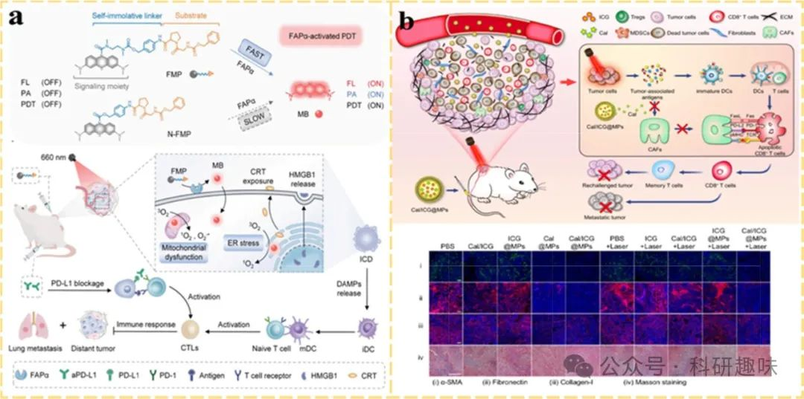

图 15. 通过细胞外基质重编程增强 PDIT 的策略。

更重要的是，PDT 与 CAFs 靶向疗法的结合不仅从机理上提高了疗效，而且由于 PDT 的局部光活化性质，如前面提到的情况，局部活化原药的设计只在激光照射部位释放 CAFs 靶向药物，避免了普通 CAF 靶向疗法的脱靶效应。

### 4.5. 通过针对癌症新陈代谢增强 PDIT

近年来，信息技术领域的突破促使科学界更加关注肿瘤微环境（TME）中非癌细胞的角色，这一认识复兴了对癌症特异性代谢途径靶向抑制策略的研究热情。该领域的研究焦点集中于代谢活跃的肿瘤细胞、免疫细胞及基质细胞间的复杂相互作用，这些细胞共同调控着肿瘤的生物学行为。

葡萄糖作为生物合成的基础，不仅为细胞提供能量，还作为碳骨架支撑生命活动。正常细胞依赖氨基酸和脂肪酸的代谢来维持其结构与功能，而癌细胞的生长与增殖则高度依赖于三羧酸循环（TCA）的中间产物、由氨基酸合成的新核苷酸（特别是嘌呤和嘧啶核苷酸）以及磷酸戊糖途径（PPP）中葡萄糖衍生的核糖。鉴于这些代谢特征，当前的治疗策略聚焦于精准打击肿瘤的葡萄糖代谢、氨基酸代谢及核酸代谢网络。

糖酵解，作为肿瘤葡萄糖代谢的独特且核心过程，其异常活跃是肿瘤的一个标志性特征。增加葡萄糖摄入可加剧肿瘤糖酵解，进而上调程序性死亡配体1（PD-L1）的表达，影响免疫治疗效果。因此，葡萄糖代谢途径被视为癌症治疗的新兴靶点。

Su等研究者创新性地设计了含有二硫键的有机硅交联胶束（S-S-OSCLMs）作为载体系统（https://doi.org/10.1016/j.biomaterials.2023.122017），该系统能够响应肿瘤细胞内高浓度的谷胱甘肽（GSH），精准递送己糖激酶2（HK2）抑制剂——丹酚酸B（Sal-B）以及Fe(Ⅲ)和Ce6的复合物（a）。与广泛使用的糖酵解抑制剂如3-溴丙酮酸和洛尼达明（它们分别针对甘油醛-3-磷酸脱氢酶和线粒体丙酮酸载体）相比，S-S-OSCLMs介导的HK2靶向策略显著降低了对正常细胞的潜在毒性。此外，Sal-B通过抑制PI3K/ATK/HIF-1α信号通路，不仅直接削弱糖酵解过程，还间接调控葡萄糖转运体1（GLUT1）的表达，改善TME的缺氧环境，从而增强了光动力疗法（PDT）的治疗效果。这一研究为开发高效、低毒的癌症代谢干预策略提供了新的视角和工具。

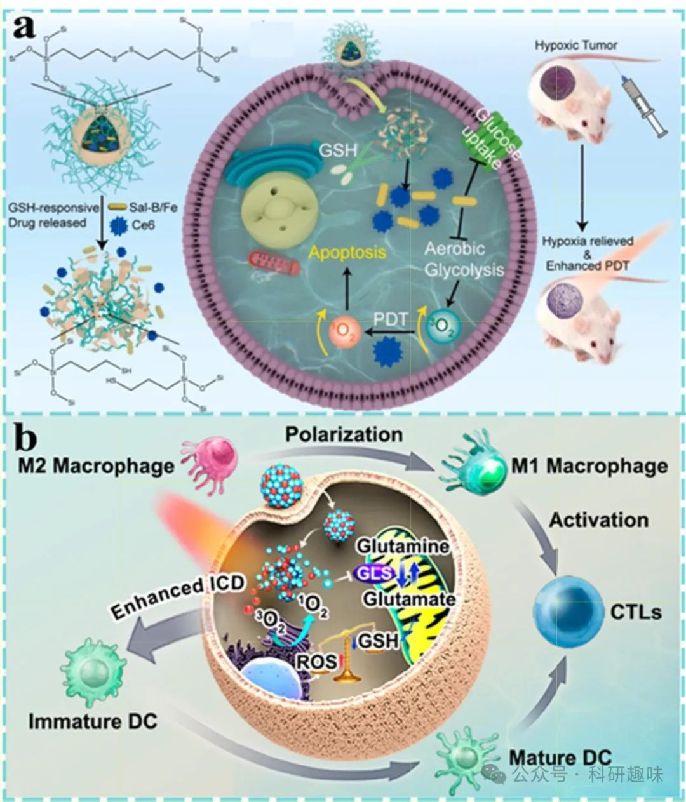

图 16. 利用新陈代谢干预的 PDT

鉴于癌细胞的快速增殖特性，其对合成代谢与能量的需求极为迫切，依赖多样化的代谢途径以维持生长与生存。除葡萄糖这一经典能量来源外，谷氨酰胺在提供合成代谢所需的碳源与氮源方面扮演着不可或缺的角色，并参与调控细胞内的氧化还原稳态。具体而言，谷氨酰胺酶（GLS）催化谷氨酰胺转化为谷氨酸，后者则是谷胱甘肽（GSH）从头合成的关键前体。肿瘤细胞通过上调GLS活性，促进GSH生成，从而有效清除活性氧（ROS），维护氧化还原平衡。值得注意的是，谷氨酰胺代谢与肿瘤免疫微环境（TIME）的塑造紧密相连，特别是免疫抑制性的M2型肿瘤相关巨噬细胞（TAMs）相较于M1型更依赖于此代谢途径。因此，靶向谷氨酰胺代谢成为了一种“一箭双雕”的治疗策略。

Mai等研究者巧妙利用疏水与π-π堆叠相互作用（https://doi.org/10.1021/acsnano.2c11037），设计并合成了GLS抑制剂化合物968（C968）与光敏剂Ce6共载的无载体纳米球C9SN。该纳米系统通过阻断GLS活性，扰乱氧化还原平衡（b），进而增强免疫原性细胞死亡（ICD）的治疗效果。同时，GLS的抑制促使M2样TAMs向抗肿瘤表型极化，并促进细胞毒性T淋巴细胞（CTLs）在肿瘤内的浸润与激活。这种“一箭双雕”的策略有望增强肿瘤免疫原性，改善TIME，从而协同提升光动力免疫疗法（PDIT）的疗效。

此外，脂肪酸与胆固醇代谢等其他代谢模式亦对免疫细胞功能产生深远影响。例如，细胞内不饱和脂肪酸水平上升可刺激巨噬细胞释放IL-1α等炎症因子，加剧炎症反应。当前，研究者正致力于通过调控肿瘤细胞与免疫细胞的代谢网络，以增强抗肿瘤免疫反应。Liu等人开发的双金属原子纳米酶，集成了多种酶活性（如CAT、GSHOx、OXD、POD、LOX及PLA2），通过靶向花生四烯酸代谢途径，触发铁代谢异常反应，并协同CD8+ T细胞分泌的IFN-γ重编程ACSL4相关磷脂代谢，展示了代谢干预在抗肿瘤免疫中的潜力。

尽管代谢干预与抗肿瘤免疫的协同作用已初露端倪，但肿瘤免疫逃逸的复杂代谢机制及免疫细胞的具体代谢需求尚未完全明晰，限制了其他代谢模式与PDT等疗法结合策略的探索。随着对TME中代谢调控机制的深入理解，联合疗法的治疗潜力将得到进一步挖掘，为抗肿瘤免疫疗法开辟更广阔的应用前景。

预览时标签不可点

素材来源官方媒体/网络新闻

 [阅读原文](javascript:;) 

  继续滑动看下一个 

 轻触阅读原文 

    

