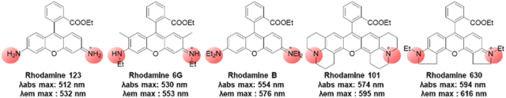
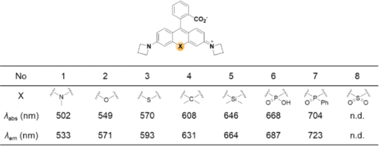
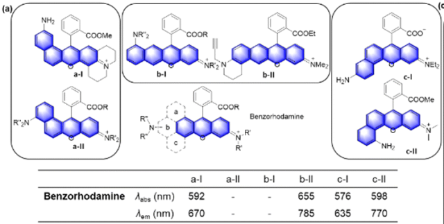
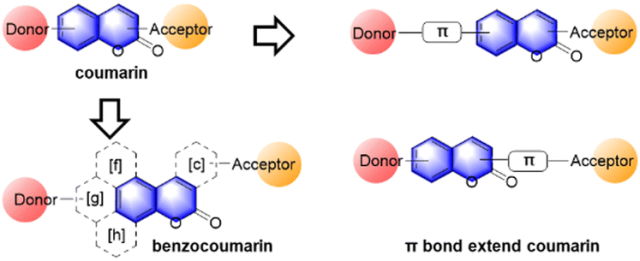
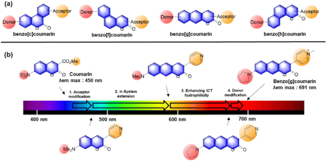
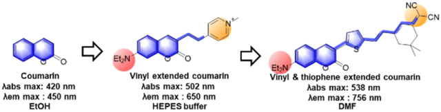
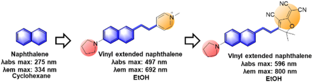
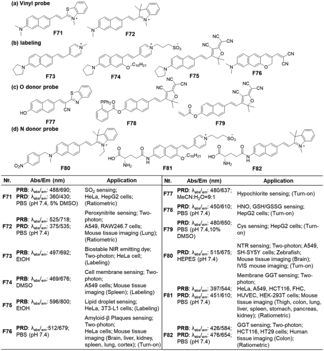
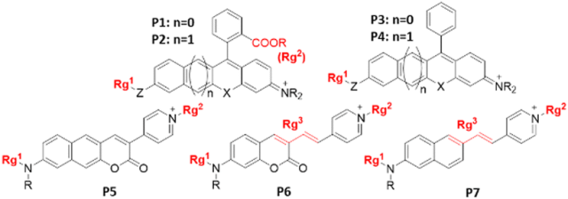

 

#  【Chem. Soc. Rev】超全的方法总结教你怎么把可见光荧光材料转换成近红外 
 
 原创

Fluorophores

荧光团

引言

有机荧光团具有非侵入性、高灵敏度和选择性以及实时成像能力等显著特点，是生物成像应用的关键。这些优势也为临床应用带来了巨大的希望。在对组织进行生物成像时，需要大量发射较长波长（最好是红色/近红外（NIR）波段）的荧光团，以减少自发荧光干扰并加深成像深度。值得注意的是，目前在荧光探针领域工作的科学家对 "近红外 "这一术语的使用还没有达成共识。当一种染料的发射光谱覆盖了 700 纳米以上的部分时，尽管其最大值低于 700 纳米，但仍经常被称为近红外染料。根据 IEC 60050-845:2007 标准，"红色 "波长区域范围为 620 至 750 纳米，而近红外波长区域范围为 700 至 1500 纳米，因此红色和近红外波长区域范围为 700 至 750 纳米。如果近红外染料的最大发射波长在 700 纳米以上，则可以接受。

氧杂蒽衍生物

作者介绍了两类常见的氧杂蒽类衍生物，一类是邻羧基取代的氧杂蒽类衍生物，一类是没有羧基，只有苯基取代的氧杂蒽类衍生物，但是调整这两类的取代物波长的方式大同小异，分别是氨基的调整、中心原子的调整及共轭长度的调整。

**氨基的影响：**

推-拉型荧光物质中的烷基胺充当电子供体基团，与它们的亚胺形式结合，显著影响荧光物质的发射特性。当从罗丹明 123（–NH2）转变到罗丹明 6G（–NHEt）和罗丹明 B（–NEt2）时，其发射波长分别从532 nm移动到553nm和576nm。二烷基胺取代的罗丹明（如罗丹明 B、罗丹明 101 和罗丹明 630）的发射波长排序为：二乙胺（576nm）&lt; 久洛尼定（595nm）&lt; 乙基吲哚（616nm）（见图 3）。从中可以看出，更好的电子供体氨基团有助于实现这些罗丹明染料最大发射波长的红移。然而，仅通过修改单氨基取代基不能使最大发射波长达到深红区，因此，在必要的情况下可以使用“二氨基”取代基。

**中心原子取代：**

氧杂蒽染料的 C-9 中心原子可以来自碳族，从而产生各种氧杂蒽类似物，也可以来自氮族或铬族（图 4）。在氧杂蒽染料中，中心氧原子的置换会导致不同的发射位移，其基本机制也各不相同。对于第 14 和 15 组原子，有解释说 X 原子（Si、Ge、Sn 和 P）可以通过外环 X-C 或 XO 键（例如 -SiMe2、-P(O)OH、-P(O)Me 和 -P(O)Ph）的 σ\*-π\* 共轭与附近荧光团的π\* 轨道之间的σ\*-π\* 共轭来稳定 LUMO 能级。对于第 16 组原子，杂原子的孤对电子占位和共振稳定性是激发能量的主要决定因素：S、Se 或 Te 的 X 原子显示出更高的孤对电子占位，这降低了激发能量，从而导致更长的吸收波长。图 5 列出了中心 C-9 上含有胺（氮）、硫、砜、碳、硅、膦酸盐或氧化膦的罗丹明类似物的最大吸收和发射波长。通过取代中心原子，发射波长红程度依次为 N、O、S、C、Si 和 P。加上已知的氮杂环丁烷基团的红移效应，-P(O)Ph 类似物的最大发射波长为 723 nm（pH 7.3 HEPES 缓冲液）。需要注意的是，用硅基（-SiR2）取代 C-9 氧原子以获得深红/近红外发射染料的方法受到了广泛关注，这可能是由于合成较为简单。例如，用二甲基硅基取代 C-9 氧原子会增加 C-10 的亲电性。因此，与相应的罗丹明类似物相比，螺内酯开环是在极性更高的介质中进行的。

**π-共轭延伸：**

延长荧光团的π-共轭长度是改变其吸收/发射最大值的常用方法。这里以苯并罗丹明染料为例，根据苯环的部位，它们可分为线型和弯曲型苯并罗丹明染料：苯并罗丹明 a-I、32b-II、33c-I34 和 c-II35。这些苯并罗丹明的发射波长明显红移，波长超过 635 nm，线性 b-II 的波长达到 785 nm。

香豆素

考虑到香豆素是典型的 ICT 染料，除了延长 π 共轭长度外，我们还可以通过提高供体/受体的能力来诱导其发射波长的红移。1984 年，Jones 和合作者研究了带有几种不同电子供体和受体基团的香豆素染料的光物理特性。结果发现，仅修饰供体和受体不足以使香豆素的发射波长超过 600 nm（λem）。因此，需要进行 π 延伸，才能产生在红/远红或近红外区域发光的香豆素衍生物。

**增加芳香环：**

已报道的苯并香豆素染料种类繁多，可按几何形状分为：苯并[c]香豆素、苯并[f]香豆素、苯并[g]香豆素和苯并[h]香豆素。其中，苯并[g]香豆素发出的波长比其他香豆素更长，因此有望用于生物成像。2017 年，Ahn 和合作者设计了一种新策略，将典型的 D-A 香豆素染料改性为发射远红光的苯并[g]香豆素。与供体/受体改性相比，π-系统扩展会导致更大的红移。

**扩展π-共轭**

我们也可以通过在 C-3 取代基和香豆素环之间插入乙烯基来扩展π-共轭，而不是像苯并香豆素那样通过环融合来增加电子离域，尽管这种方法不能保证含乙烯基的受体对某些活性生物物种（活性氧和氮物种）以及光化学反应具有足够的稳定性，但是它增加发射波长的效果显著。不仅是乙烯基，其他基团也可用于 π- 延伸，如炔基、噻唑、噻吩、苯并噻二唑或它们的组合。Avhad 及其合作者报告的乙烯基延伸进一步将发射最大值推高至 756 nm。请注意，对于如此大的乙烯基延伸，需要一个强大的电子受体基团来诱导足够的 ICT，从而实现显著的发射红移。如上所述，乙烯基延伸策略（图 16）会使产生的电子受体分子易受亲核和亲电物种的影响，如亚硫酸氢盐、生物硫醇、次氯酸、过硫酸盐等。含乙烯基的受体（包括半氰基）的化学和光化学稳定性似乎取决于整个染料体系：含有 2-吲哚啉或 2-苯并噻唑基团的乙烯基延伸香豆素的化学和光化学稳定性较差，而含有 4-吡啶基团的香豆素则具有足够的化学和光稳定性。

萘

萘基荧光分子发射波长的调控与香豆素前面两种染料类似，都可以通过修改电子供体/受体、增加π-共轭长度来实现，强的吸电子基团如三氰基呋喃环甚至可以将分子的最大发射波长推到800 nm。

**05**

分子的设计

如果撇开用于检测 pH 值、极性、粘度等环境参数的探针，我们可以根据目标检测模式将分子探针分为两类：(1) 结合诱导型和 (2) 反应/活性诱导型。需要注意的是，反应/活性诱导型也就是可激活探针提供的是时间上的累积浓度/活性水平，而基于结合的探针则允许我们监测目标分析物的动态浓度/活性信息。为了开发基于结合的探针，我们要探索与目标分析物结合后的荧光信号变化（波长或强度）。因此，在开发此类探针时，一般会使用光物理特性对环境变化敏感的荧光团，如电子推拉型双极性染料。然而，基于结合的探针，特别是针对酶的探针，其设计原理具有挑战性，因为我们应该考虑一种能与目标酶特异性结合的底物，并且结合过程应引起荧光信号的变化。另一方面，基于反应的探针近来蓬勃发展，因为目标分析物可以选择性地进行各种化学转化。比如，为了开发可激活探针，我们通常会在供体或受体位点引入一个活性基团（Rg）（图 20），引入活性基团可以打断螺内酯的开环过程，而共轭结构的一部分，如乙烯基单元，也可以成为某些分析物的反应位点（图 20 中的 P6、P7）。

当活性基团发生特定分析物的化学转化（裂解或转化为另一种结构）时，会涉及 ICT 变化，从而导致荧光信号变化。根据反应基团和荧光团的不同，荧光变化可以是Turn On、Turn Off或Ratio模式。即使反应基团起淬灭作用，我们也可以通过选择适当的荧光团来实现开启或比率信号。

另一个需要提及的一般性问题是，随着π-共轭长度的增加，探针即使在微摩尔浓度下也可能出现聚集导致淬灭（ACQ）现象，因此，在生物应用中始终需要检查探针的细胞聚集行为，而聚集诱导发光（AIE）探针可以在一定程度上解决这个问题。

此外，还有必要确保可激活探针对各种生物分析物的化学稳定性，尤其是那些含有 "活性 "官能团的探针。例如，含有迈克尔受体的探针会与亲核生物硫醇和亚硫酸氢盐阴离子发生共轭加成反应。此外，已知含有富电子乙烯基单元的探针会与活性氧发生氧化反应，如过亚硝酸、次氯酸等。

Dai, M.; Yang, Y. J.; Sarkar, S.; Ahn, K. H. Strategies to Convert Organic Fluorophores into Red/near-Infrared Emitting Analogues and Their Utilization in Bioimaging Probes. Chem. Soc. Rev. 2023, 52 (18), 6344–6358. https://doi.org/10.1039/D3CS00475A.

**关注并回复文章DOI获取全文：**

10.1039/D3CS00475A

[【Adv. Mater.】"背"上细菌不仅能促进M1型转变，还能重新极化肿瘤相关巨噬细胞](http://mp.weixin.qq.com/s?__biz=MzkzOTI1OTMwNg==&amp;mid=2247484219&amp;idx=1&amp;sn=ce0071d60c05faaa726917b535fd3359&amp;chksm=c2f2e7fef5856ee8679fe4281cd8de03747756f4be8d8d3a0a4ab545aaac9f27446fd86420bf&amp;scene=21#wechat_redirect)

[【Angew】定点开启，无毒副作用的光敏剂设计新方法](http://mp.weixin.qq.com/s?__biz=MzkzOTI1OTMwNg==&amp;mid=2247484193&amp;idx=1&amp;sn=0f1905dd02260722dbb84b9bac54e187&amp;chksm=c2f2e7e4f5856ef2f93a30a066edb3f5ee57744b277b59becb2084ec05cfe58b4250a6420c0d&amp;scene=21#wechat_redirect)

[【专刊】如何让化合物跨过血脑屏障进入大脑](http://mp.weixin.qq.com/s?__biz=MzkzOTI1OTMwNg==&amp;mid=2247484164&amp;idx=1&amp;sn=2d93cf1115c0fcaf2fdadaa02421f4c9&amp;chksm=c2f2e7c1f5856ed7f81de97106cb9f8035882fb0cb1b90ea0c18e0572d82ae1d80b3a938f048&amp;scene=21#wechat_redirect)

预览时标签不可点

素材来源官方媒体/网络新闻

  继续滑动看下一个 

 轻触阅读原文 

    

