 

#  【Chem. Soc. Rev.】前药激活有哪些策略，看完这篇综述你全知道 
 

Grenemal

读完需要

15

全文字数 4600 字

**Content**

**目录**

Abstract

1. Introduction

2. Chemical stimuli-induced prodrug activation

2.1 Azide reduction for drug release

2.2 IEDDA reaction for drug release

2.3 Desilylation for drug release

2.4 Metal-catalyzed drug activation

2.4.1 Metal-catalyzed cleavage reaction.

2.4.2 Metal-catalyzed ligation reaction.

3. Physical stimuli-induced prodrug activation

3.1 NIR light-induced cleavage chemistry

3.1.1 Drug release from organic compounds.

3.1.2 Drug release from coordination compounds.

3.1.3 Photodynamic therapy and its application in drug

release.

3.2 Ionizing radiation-induced cleavage chemistry

3.2.1 Radiation-induced oxidation for drug release.

3.2.2 Radiation-induced reduction for drug release.

3.3 Ultrasound

3.4 Boron neutron capture therapy (BNCT)

3.5 Miscellaneous

3.5.1 Magnetic fields.

3.5.2 Heat.

3.5.3 Electrical fields.

4. Conclusion and outlook

**Abstract**

## **摘要**

改善药物的药代动力学、降低药物的毒性以及提高药物的疗效是应对临床挑战的主要策略，近年来，生物正交化学的兴起极大地推动了前药策略的演进，通过化学和物理刺激实现了前药的激活。这种利用生物正交化学 "按需 "激活的方法为前药的研究和开发带来了革命性的变革，引起了广泛关注，成为一个备受期待的转化研究领域。

这篇综述系统总结了生物正交化学在前药激活方面的最新进展，主要聚焦于小分子前药和抗体药物共轭物的激活。此外，综述还探讨了将这些科研进展转化为临床实践的机遇和挑战。

**Introduction**

**引言**

1958年，阿德里安-阿尔伯特提出了“前药”（prodrug）一词，其目的在于改善候选药物的药代动力学和药效学特性，以提高其临床疗效和安全性。通过采用前药形式，一些体内特性较差的候选药物得以获得批准，例如，伊立替康（CPT-11）和拓扑替康（TPT）前药已被美国食品药品管理局（FDA）批准，而生物活性较强但溶解性较差的喜树碱（CPT）则未获批准。

前药的激活方式可以通过内源性或外源性刺激实现。内源性刺激利用酶或微环境因素激活前药，然而，因为病变组织和正常组织之间的差异有限，这种方法的特异性和选择性并不高，因此可能导致严重的副作用，最终导致治疗失败。外源激活策略则被认为是一种有前景的替代方法，其设计具有高选择性和特异性，实现按需激活前药，以最小的副作用提高疗效。

近年来，涌现了多种前药激活策略，包括生物正交化学刺激（如Diels-Alder（IEDDA）反应和金属催化）以及外部物理刺激（如超声和放射治疗诱导的前药激活）。
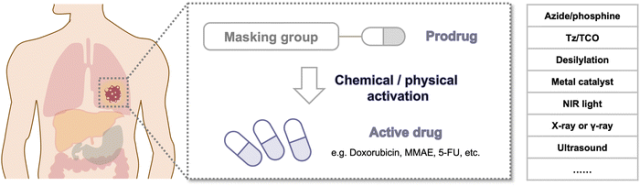
**Chemical stimuli-induced prodrug activation**

**化学刺激促进前药激活**

生物正交反应的蓬勃发展已经彻底改变了对生命系统的研究。这些生物相容的有机反应能够在体内高效进行，而不会干扰基本的生命过程。生物正交反应在创新治疗应用方面具有巨大潜力，特别是在前药激活策略方面。尽管基础研究在解决日益复杂的系统问题上取得了重大进展，但在生物正交反应在临床应用中的实际实施方面仍存在差距。为了缩小这一差距，必须开发出有效的肿瘤特异性药物释放策略，并同时尽量减少潜在的副作用。

为了实现这一目标，必须将激活剂和/或前药明确靶向到肿瘤。这种靶向给药方式能够提高局部浓度，实现高效释放，减少脱靶激活，并最大限度地减少前药/激活剂的用量，从而降低副作用。为了实现这一目标，人们采用了物理和生物靶向方法，开发了各种单一和二元靶向策略。物理靶向包括局部注射和外源性物理刺激，将原液/激活剂集中在肿瘤部位。生物靶向依赖于前药/激活剂与肿瘤之间的相互作用，如配体-受体相互作用和抗体-抗原相互作用，或增强的渗透性和滞留效应。
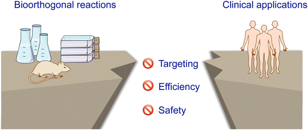
图 1 前药激活策略必须应对的挑战以及临床转化的障碍。

此外，为了有效激活前药，选择具有最佳速率常数的生物正交反应至关重要。通过表1我们可以看出，必须采用高速率常数和/或高比率的激活剂。如果药物激活速度较慢，可能导致前药在被激活之前就被清除，因此选择具有良好动力学特性的反应对成功激活前药至关重要。
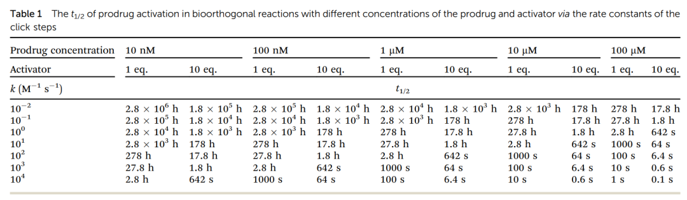
幸运的是，一系列 "点击释放 "的生物正交反应，包括叠氮还原反应、IEDDA、生物正交脱硅反应等，已经被开发出来以满足不同的要求（表 2）。
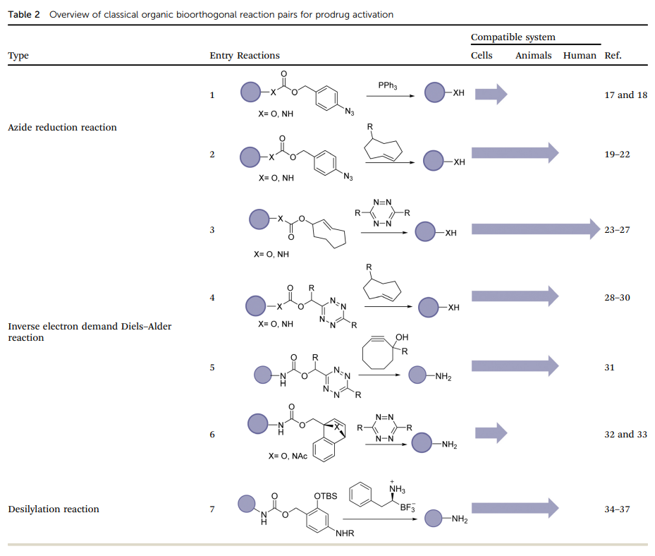

**Azide reduction for drug release**
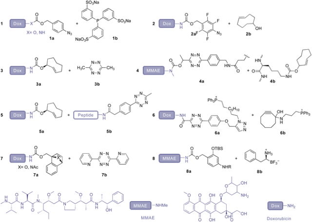

**IEDDA reaction for drug release**
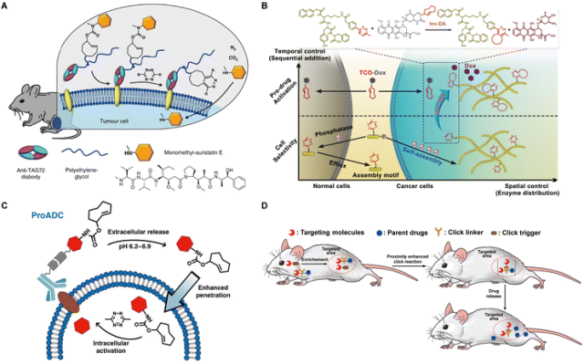

**Desilylation for drug release**
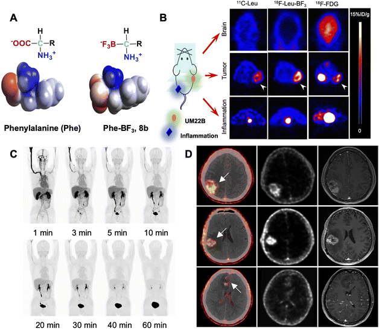

**Metal-catalyzed drug activation**

过渡金属催化反应作为生物正交反应的一个重要分支，在医学应用领域展现出巨大的前景。尽管金属催化的键裂解反应在生物系统中存在一定的局限性，但在去除掩蔽基团和释放功能性小分子方面已经得到广泛的应用。此外，金属催化剂还被创新性地应用作为酶辅助因子来催化偶联反应。

**Metal-catalyzed cleavage reaction.**

在过去的一个世纪中，过渡金属催化的去保护反应得到了广泛的研究。正如表3所示，金属触发的生物正交反应充分利用了其多功能性、可调性和组织穿透性。Meggers及其同事在2006年报道了一种以钌为催化剂的去烯丙基氧羰基（烯丙基氨酯）反应（表3，条目1）用于细胞成像。此后，包括钯、铜、铂和金在内的多种金属催化剂已成功开发，用于在细胞中触发烯丙基或炔基去保护反应。一些近期的综述已经涵盖了这些显著的进展。然而，金属催化的前药激活在生物介质中的实际应用仅在细胞水平进行了测试，相关的体内研究受到了潜在毒性和低催化效率等挑战的限制，从体外试验转化为体内试验面临诸多困难。
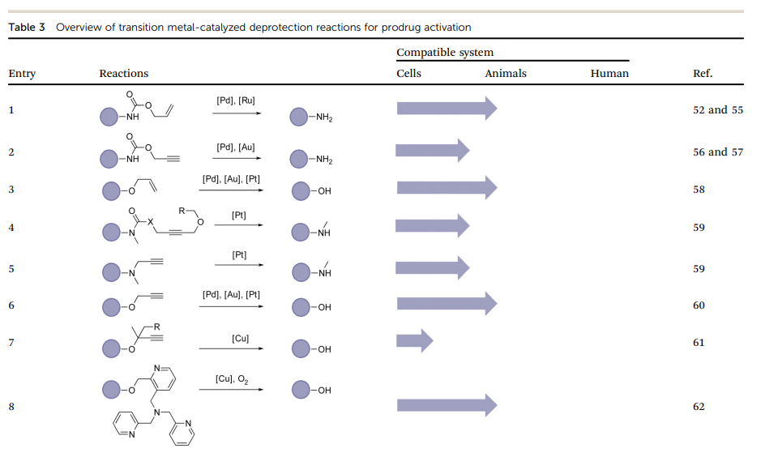
**Metal-catalyzed ligation reaction.**

除了金属催化的裂解反应外，金属催化的偶联反应也被广泛认可为在活体系统中广泛应用的生物正交反应。它们为在所需位置直接构建C–N、C–C和C–H键提供了方便而高效的手段。这些反应因其能够形成多样化的化学键而得到广泛应用，而通过传统的亲核或亲电加成/取代反应通常难以实现这样的多样性。
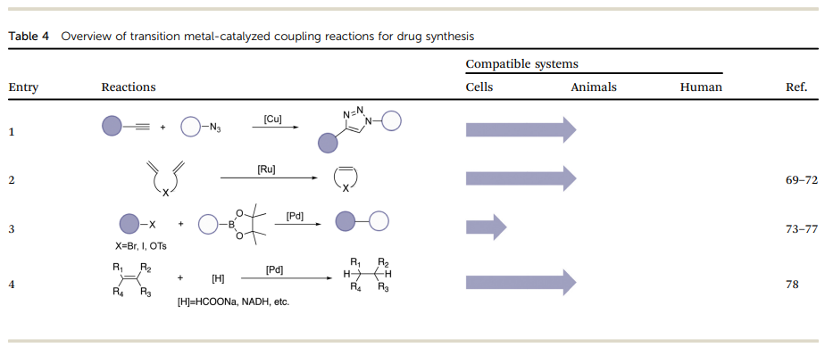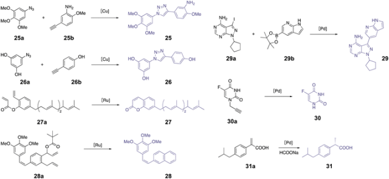

**Physical stimuli-induced prodrug activation**

**物理刺激促进前药激活**

光、电离辐射、中子束、超声波、磁场、热和电等物理刺激被视为体内前药激活的潜在激活剂。一些物理刺激已在临床诊断和癌症治疗中得到应用，有助于在临床转化过程中对激活剂进行评估。此外，物理刺激可以通过成像进行引导，并具有对肿瘤的靶向特性。然而，物理刺激也存在一些局限性。除了光之外，它们触发化学反应的能力相对有限，这在某些情况下限制了它们的适用性。此外，紫外可见光和近红外光穿透组织的能力也受到一定限制，因此只能在人体表皮内激活。

**NIR light-induced cleavage chemistry**

光脱保护基团（PPGs）可以临时掩蔽功能基团，并通过光激活实现它们的裂解，从而生成多功能生物活性化合物和荧光报告物，或在生理系统中启动反应。先前的综述已详细讨论了设计针对特定应用的PPGs的关键标准。大多数PPGs被短波长光激活（&lt;600 nm），而紫外光在组织中的穿透深度，如图10所示，小于1毫米。因此，近红外光已成为在临床应用中最有效的激活剂。值得注意的是，除了药物释放之外，光诱导的功能分子合成（例如，四唑）以及用于近距离标记的光诱导光催化反应也是光化学的重要应用。
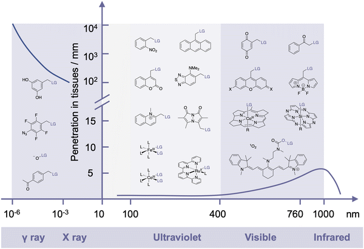
**Drug release from organic compounds.**

已知的许多PPG在紫外-可见光谱区间工作，但其应用受到组织穿透能力的限制。硝基芳基和香豆素基团，它们的吸收波长较短，限制了它们在体内的应用。然而，通过引入电子供体基团，香豆素基团的吸收范围得以扩展。此外，一些新型有机阳离子染料和BODIPY衍生物具有更长的吸收范围，使它们有望在体内应用于近红外光激活的前药释放。光敏分子的释放不仅可以用于药物释放，还可以用于光诱导的分子合成和光催化反应。其中，近红外光是临床应用中最有效的激活剂，具有潜在的临床应用前景。
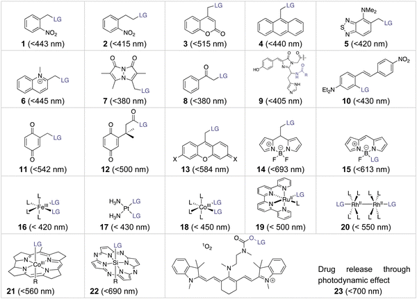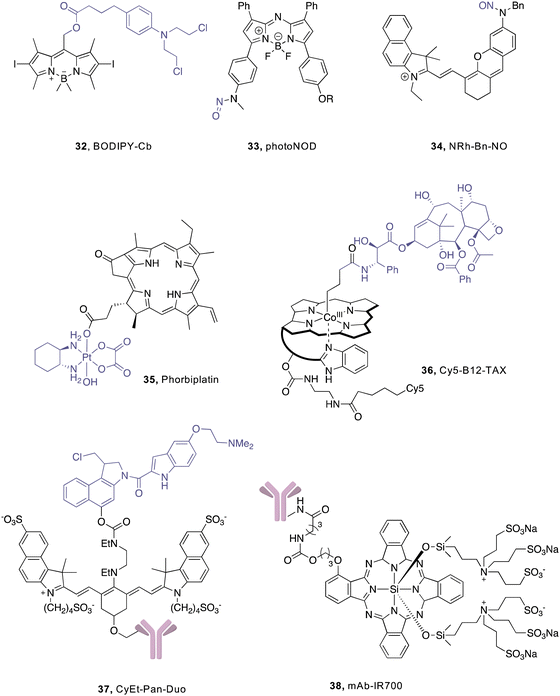
**Drug release from coordination compounds.**

过渡金属配合物是由金属中心与配体结合而成，通过光化学反应可以被激活。这些金属中心和配体的化学键具有多样性和可调性，为在生理条件下通过光激活产生化学或生物活性物质提供了更多可能性。

在铂类化疗药物领域取得了巨大成功的同时，伴随着严重的副作用。相比之下，铂(iv)前药的毒性较低。近红外激活的铂药物可以通过铂-O键解离，在癌细胞中释放染料和生成单线态氧，具有潜在的治疗效果。另一方面，光激活的Pt(iv)前药可以减轻铂类化疗的毒性。例如，近红外激活的卡铂和奥沙利铂铂基Pt(iv)光氧化剂在体内通过直接损伤细胞内生物分子和降低pH来增强对抗转移性肿瘤的效果。

**Photodynamic therapy and its application in drug release.**

在光敏剂方面，尽管有机PPG过去几十年来一直是生物大分子的常用工具，但由于其对紫外光的依赖性，限制了在生物系统中的应用。近红外作为一种治疗癌症的方法，但在如何将其推广到临床应用方面仍需解决挑战。对于前药的生物相容性，如铂（IV）前药和维生素B12等，也是一个重要问题。
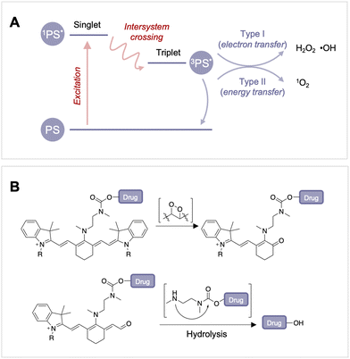

**Ionizing radiation-induced cleavage chemistry**

电离辐射在放射治疗中，相较于紫外线和近红外线，具备更高的能量，使其能够在穿透人体组织时减小能量衰减。该辐射主要通过引起 DNA 损伤导致细胞凋亡而产生生物效应。鉴于超过50%的癌症患者需要接受放疗，因此在治疗过程中最大限度地减少对正常细胞的辐射剂量以防止对健康组织造成伤害显得至关重要。

目前，先进的放疗设备和方法已经得到发展，能够在三维空间内以聚焦方式向肿瘤提供更大剂量的辐射。通过利用 CT 图像和计算机技术，三维适形放疗能够准确确定肿瘤的三维位置。该方法通过定制与癌症相匹配的照射区域形状，实现了对肿瘤的精确放射定位（图13A）。这种定制形状的照射区域有助于将对周围正常组织的毒性降到最低。

在放疗过程中，电离辐射与占据组织重量 70-80% 的水相互作用，引发水的辐射分解。这一过程产生两种主要的反应物（图13B）：水合电子（e-aq）和羟自由基（˙OH），其辐射产率（G 值）分别为 275 nM Gy-1 和 282 nM Gy-1（通常简化为 280 nM Gy-1）。˙OH 具有高氧化性，其标准电位为2.7 V，可与 DNA 发生反应，诱导细胞凋亡。相反，e-aq 和氢自由基（˙H）是强效还原剂，标准电位分别为 -2.9 V 和 -2.3 V。

相对于其他外部刺激，电离辐射具有高组织穿透性、时空分辨率和临床相关性等独特性质，因此在放疗诱导的前药激活策略方面具有广阔前景。
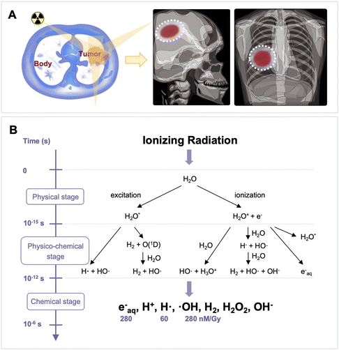
**Radiation-induced oxidation for drug release.**

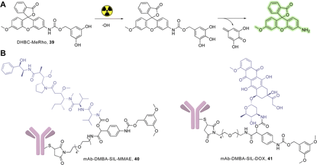
**Radiation-induced reduction for drug release.**

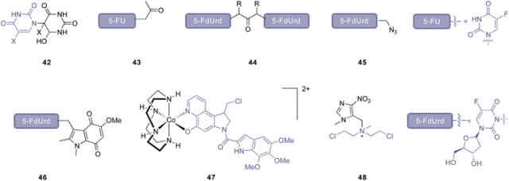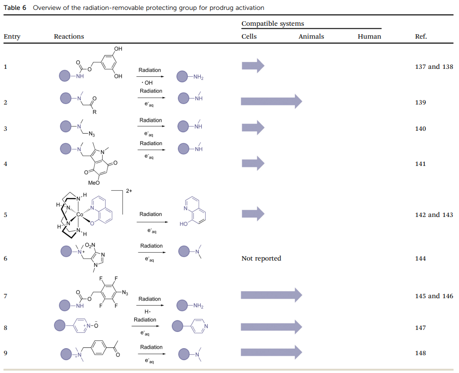

**Ultrasound**

超声是一种在心脏科、产科、泌尿科、放射科和血管科等临床成像中广泛应用的检测手段。手持式和便携式超声设备的普及提高了可及性和成本效益，而且由于超声不涉及电离辐射，因此非常安全。与其他外部刺激相比，机械辐射如超声具有明显的优势，例如穿透力优于紫外线-可见光，安全性优于X射线。

与光或电磁辐射相比，机械辐射的相互作用更为复杂，涉及非线性现象。在光学中，小的荧光团分子能够吸收光并发出荧光，而合成具有多个荧光团的聚合物时，光与聚合物之间的相互作用变得更为复杂。然而，与微米大小的气泡相比，小的机械分子在巨大的塌陷气泡附近更像微小的球体或薄片，这使得将机械力传递到这些小分子中的特定化学键变得更加困难。因此，通过共价连接将机械力传递给机械分子对于聚合物至关重要。对于含有机械分子的聚合物，拉伸流会产生溶解动力剪切力，拉伸聚合物链，并最终传递能量，从而决定机械分子的反应活性。
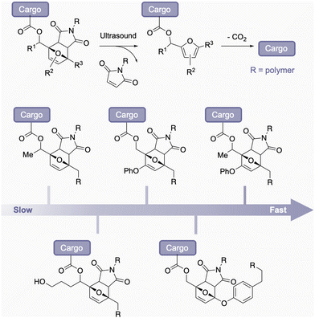

**Boron neutron capture therapy (BNCT)**

硼中子俘获疗法（BNCT）是一种二元靶向放疗方法，专门治疗局部浸润性恶性肿瘤。该治疗分为两个步骤。首先，患者接受注射一种含有稳定同位素硼-10（10B）的肿瘤定位药物。硼-10是一种非放射性核素，其天然丰度为19.8%，具有高亲和力，尤其对于低能量的“热”中子。在第二步中，患者接受表皮中子的暴露。随着中子穿透组织并失去能量，它们会转化为被10B原子捕获的低能“热”中子。这种俘获反应会释放高能量的α粒子和7Li核，具有很高的线性能量转移，能够对细胞造成致命伤害（图24）。在单个细胞的范围内（约5到9微米），α粒子和7Li核几乎能够完全沉积其能量。因此，对周围健康组织的损害风险极小。
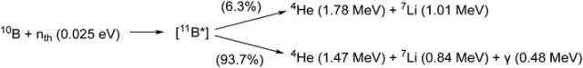
**05**

**Miscellaneous**

**Magnetic fields.**

磁热疗法是一种利用磁性纳米颗粒在外加磁场中的特性，通过产生局部热效应来治疗癌症的先进疗法。患者体内注入具有磁性的纳米颗粒后，施加外部的交变磁场，使这些纳米颗粒在磁场中迅速转变方向，从而产生热量。这局部升温的效应被用来有选择性地损害癌细胞，实现肿瘤治疗的目标。磁热疗法通过最小化对周围正常组织的伤害，提供了一种创新的、局部治疗的方式，然而，需要仔细研究和控制磁性纳米颗粒的生物相容性和安全性，以及确保在治疗中能够准确控制磁场和温度。
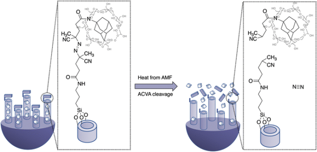

**Heat.**

激光消融是通过高能激光向组织传递强热和能量，以切除或消融组织，可应用于癌症治疗。研究人员还尝试将激光热量作为物理刺激释放药物，通过研究热触发的化学反应和金属复合物释放气体的方法

**Electrical fields.**

Bradley及同事提出了一种利用电场刺激前药的方法，使用涂有磺化含氟聚合物薄膜的电极，其中包含Ru(NH3)6Cl3，可调节还原电位。实验证明，在HCT116细胞中，将涂有涂层的电极浸入细胞培养基中1小时，施加-0.4 V的还原电位，3天后80%的细胞死亡。尽管电场激活前药在各种应用中显示出潜力，如脑部、眼部、脊髓和周围神经研究等，但目前更常用的是电记录和电刺激。

**Conclusion and outlook**

**总结与展望**

过去，化学研究人员通常先开发控释策略，然后再确定临床需求。未来的发展可能会涉及为满足特定临床需求而定制的前药激活策略。对于下一代前药激活策略，建议优先使用与临床相关的工具或制剂作为激活剂，因为这更符合临床实际，研发风险更低，有利于将其转化为临床实践。此外，跨学科合作对于开发高效解决方案以满足癌症治疗需求至关重要。生物正交策略和技术的不断进步对于提高前药激活的效率、特异性和安全性，从而促进前药疗法的临床转化至关重要。随着对肿瘤微环境的深入了解和治疗诊断技术的进步，生物正交化学将在开发个性化癌症治疗药物方面发挥越来越重要的作用。

Fu, Q.; Shen, S.; Sun, P.; Gu, Z.; Bai, Y.; Wang, X.; Liu, Z. Bioorthogonal Chemistry for Prodrug Activation in Vivo. Chem. Soc. Rev. 2023, 52 (22), 7737–7772. https://doi.org/10.1039/D2CS00889K.

**关注并回复文章DOI获取全文：**

10.1039/D2CS00889K

**点击蓝字 关注我们**

[【Chem. Soc. Rev】超全的方法总结教你怎么把可见光荧光材料转换成近红外](http://mp.weixin.qq.com/s?__biz=MzkzOTI1OTMwNg==&amp;mid=2247484693&amp;idx=4&amp;sn=3423d03007d3fd3189d9457caabf50e9&amp;chksm=c2f2e1d0f58568c681a105ec40651ecf82fe17496f59db5aa56ccce43efaf3fab1d4f45537fd&amp;scene=21#wechat_redirect)

[【Chem. Soc. Rev.】1+1&gt;2，光学荧光和X射线荧光如何有机结合？](http://mp.weixin.qq.com/s?__biz=MzkzOTI1OTMwNg==&amp;mid=2247484718&amp;idx=3&amp;sn=6a964df486e858149dcb2c03f00f39d9&amp;chksm=c2f2e1ebf58568fd237867d60b851211c7c29617f3db0137728f64dc810681869ab5ead544f9&amp;scene=21#wechat_redirect)

[【Adv. Mater. 】绕过分子设计，通过聚集实现光热转化效率的调控](http://mp.weixin.qq.com/s?__biz=MzkzOTI1OTMwNg==&amp;mid=2247484494&amp;idx=2&amp;sn=f51369b0cbc21192ed1cc5236d8e135b&amp;chksm=c2f2e08bf585699d1cf1835d54c052c662d2d67cab28b30daaa0ab7800648fc0cf1542c22069&amp;scene=21#wechat_redirect)

预览时标签不可点

素材来源官方媒体/网络新闻

  继续滑动看下一个 

 轻触阅读原文 

    

