 

#  【Chem. Soc. Rev.】1+1&gt;2，光学荧光和X射线荧光如何有机结合？ 
 

**成像技术可用于研究分子在健康和疾病状态下的相互作用，每种技术都提供了关于细胞环境的独特化学信息。多模态成像指使用可被多种成像模式检测到的单一探针，通过结合不同成像技术的结果，最大限度地从单一细胞样本中获取信息。特别是在生物成像领域，将光学荧光显微镜（OFM）的特异性和灵敏度与X射线荧光显微镜（XFM）的定量和元素特异性相结合，具有重要意义。这些技术的结合使我们能更深入地了解原生元素或治疗药物对细胞环境的影响。**

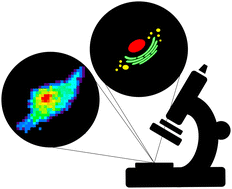
**Introduction**

**引言**

生命依赖于元素周期表中的各种化学元素，其中碳、氢、氧和氮构成了生物系统中的大部分原子。除了这些主要元素外，还需要其他许多元素的参与才能实现生命的繁荣。碱金属和碱土金属元素如钠、钾和钙在调节细胞膜内外的电位方面起着重要作用，非金属元素如磷和硫也至关重要，磷在连接DNA和RNA骨架中的糖，以及在代谢过程中扮演关键角色。

这些元素在细胞环境中的相互作用是细胞结构和功能的基础，而元素的失衡通常会引发病变。因此，要了解预防和治疗疾病所需的机制，就必须对这些元素的水平、分布和化学性质的变化进行表征。许多传统的检测方法依赖于使用技术如原子吸收光谱法 (AAS) 或电感耦合等离子体质谱法 (ICP-MS) 对批量样品进行测量。

为了解决这一问题，人们开发了各种成像工具和技术，从激光烧蚀ICP-MS (LA-ICP-MS) 到光学荧光成像，再到基于同步辐射的显微镜技术。这些成像技术利用特定能量光子与样品相互作用，通过不同波长的光产生有关细胞环境的图像信息。每种成像技术都有其适用的长度范围和特点，取决于所使用的电磁波谱区域。

细胞研究中的多模态成像方法相对于临床应用较为滞后，许多互补技术直到最近才开始得到采用。本综述着重介绍了两种技术的结合与互补，即光学荧光显微镜（OFM）和 X 射线荧光显微镜（XFM）。OFM提供了关于细胞亚结构和活性过程的空间信息，而XFM则提供了有关元素分布和浓度的信息。结合使用这两种技术，可以对必需金属和外源金属的分布变化进行高准确度和特异性的评估，为我们提供了更深入的细胞生物化学研究的见解。
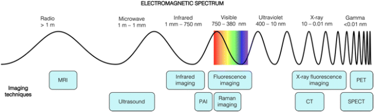
图1. 基于各种波长光的成像技术。MRI = 磁共振成像，PAI = 光声成像，CT = 计算机断层扫描，SPECT = 单正电子发射计算机断层扫描，PET = 正电子发射断层扫描。

**Optical fluorescence microscopy (OFM)**

**光学荧光显微镜（OFM）**

荧光成像可以用于检测细胞事件，具有较高的空间分辨率以分辨亚细胞结构，同时也能满足对细胞功能进行时间分辨研究的需求。通过使用合适的荧光分子染色细胞和组织样本，荧光显微镜可以对固定样本和活体样本进行成像，这些荧光分子可以是与抗体结合的商业分子，也可以是对特定细胞区域进行选择性染色的试剂，甚至可以是对细胞环境中特定元素产生荧光反应的传感器。

然而，荧光成像也受到一些影响因素的限制，如荧光团的光漂白、样品中的内源性荧光团以及由异质性或局部浓度引起的环境淬灭，这些会影响荧光信号的发射，从而可能使得荧光信号不完全反映实际的细胞分布情况。此外，荧光团的细胞摄取量也不是一个简单的定量过程。

值得注意的是，在大多数细胞或生物应用论文中，通常将这项技术简称为荧光显微镜，但为了区分可见光荧光和X射线荧光，本综述中使用了光学荧光显微镜或可见光荧光显微镜这两个术语。同时，在提及外荧光、共焦或超分辨率图像时，总是指OFM技术。

**光学荧光原理**

当可见光光子被分子吸收后，分子的电子结构会发生重新排列，使分子处于电子激发态，这种状态可以实现能量的转移。当能量以光的形式释放时，产生的光被称为荧光。如果激发态转化为三重态，然后在弛豫到基态时发光，则称为磷光。光学荧光显微镜可以检测到荧光和磷光，只要具备合适的激发光源和相应的发射滤光片。

生物样本中天然存在多种内源性荧光分子。细胞中的自发荧光信号可能会干扰荧光探针用于研究特定细胞过程的信号。通常情况下，自发荧光信号要比荧光探针的信号弱，但最好通过加入足够的非染色对照来确认这一点。然而，这会排除对动态过程的监测，并可能因样品制备导致目标分析物位置或浓度的改变，同时也高度依赖于抗体的特异性。商用抗体虽然使用明亮的荧光团，但不能对局部环境做出反应，因此无法提供特定位置的化学信息。使用荧光蛋白也存在类似的问题，通常需要基因改造来同时表达相关蛋白和荧光蛋白标签。由于这些问题影响了用荧光团标记生物大分子的方法，许多研究聚焦于开发外源的低分子量荧光探针，这种探针可以有选择性地染色特定的生物特征。重要的是，根据探针的设计，这些小分子荧光探针可以进行合成改良，以实现在细胞器等特定细胞位置的定位，以及/或在存在特定相关分析物（如金属离子或活性氧）时选择性地、灵敏地产生荧光反应。
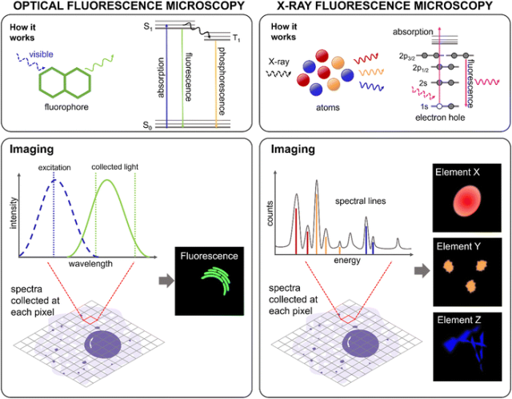
图 2 光学荧光显微镜（OFM）和 X 射线荧光显微镜（XFM）的原理。在光学荧光（左图）中，荧光团吸收可见光光子进入高能态。弛豫时，发出可见光光子。所使用的激发光源必须具有适当的激发波长（蓝色虚线），并在适当的范围内收集发射光（绿色线）。光学荧光显微镜收集固定波长范围内的光强，并对成像区域的每个像素进行收集。像素排列成图像，显示荧光分子在整个细胞中的分布。在 X 射线荧光（右图）中，X 射线光子激发核心电子，产生电子空穴。该空穴迅速被能量更高的电子填满，从而发射出具有 X 射线能量的光子，每种元素的光子能量各不相同。X 射线荧光显微镜收集这些光子，生成光谱，在成像区域的每个像素上都会出现不同元素的峰值。现代分析包括拟合每个空间像素的 X 射线光谱中的所有发射峰，形成显示整个细胞中元素分布和浓度的图像。

**光学荧光显微镜**

OFM用于检测荧光分子发出的可见光区域内和周围的光。不同显微镜配置可以产生具有不同空间分辨率的图像，选择显微镜取决于所需的信息，如光的强度、亚细胞结构或事件的位置分析等。同时，也强调了对活细胞或固定细胞成像以及荧光探针的选择可能取决于显微镜的性能。

文中介绍了三类常用的荧光显微镜技术：

- 宽场荧光显微术，它将激发光施加到样品的大面积上，收集整个样品的荧光，但容易产生伪影。
- 共聚焦激光扫描显微镜，通过将激发光聚焦通过针孔来实现更高的空间分辨率，减少了背景信号，最大程度减少了生物样品的辐射损伤。
- 超分辨率显微镜，利用确定性或随机过程获得具有更高分辨率的图像，解决了传统显微镜分辨率受到限制的问题。

此外，使用细胞渗透的小分子探针可以使细胞在合适的培养基中生长，并可以直接给药和成像。荧光传感器可以设计为对特定分析物做出响应，从而提供有关细胞元素组成的更多信息。

**X-ray fluorescence microscopy (XFM)**

**X射线荧光显微镜（XFM）**

基于同步加速器的X射线荧光显微镜（XFM）已成为一种高灵敏度的分析工具，用于调查生物模型中元素（主要是比硅重的元素）的分布和浓度。在过去的20年里，XFM在灵敏度、空间分辨率和成像速度方面取得了显著的发展，使其能够研究从整个生物体到亚细胞水平的元素分布，具有极高的空间分辨率和灵敏度，可达数百个原子。

一些同步加速器设施现在提供50纳米级别的空间分辨率，甚至有些光束线可以实现低至20纳米的空间分辨率，这为对细胞和小细胞器（如线粒体）进行详细的元素分析提供了新的可能。

XFM具有多项独特优势：可以在室温或低温下进行分析，标准大气压下工作，并可在准备充分的样品上进行数据收集。由于它依赖于样品中已有元素的固有荧光，因此无需添加额外试剂，从而减少了调整或扭曲元素分布的风险。此外，XFM是一种相对非破坏性的方法，可以在数据收集后将其他成像技术应用于样品。

尽管台式XFM平台在地质研究中得到了越来越广泛的应用，但本文主要关注基于同步加速器的平台，因为它们具有适用于细胞和亚细胞研究的许多优势，特别是在X射线能量和光子通量方面高于实验室来源。

**X射线荧光原理**

X射线成像技术在生物成像中具有特定而独特的能力，主要得益于X射线的穿透性。X射线与物质的相互作用机制多样，其中硬X射线与原子的光电相互作用成为XFM的基础，通过测量发射的X射线强度和能量，可以区分样品中元素的不同光谱特征。K边是最强烈的辐射来源，对于较重原子的探测，存在着电离K壳电子所需能量高的问题。使用L边吸收和相关发射是探测较重元素的一种常用方法，但会牺牲探测极限和可能产生干扰。X射线的穿透能力随能量增加而增加，重元素的X射线能量高，穿透物质的能力强，使其适合对深度剖面进行元素定量分析。

然而，当X射线入射能量高于相关元素的吸收边缘能量时，该技术对元素的化学形态不敏感，因此无法区分易溶元素和紧密结合元素的浓度。另一方面，XFM的一种变体可以提供相关元素不同化学形态/氧化态分布的信息，但目前尚未与OFM结合使用。

**X射线荧光显微镜（光束线）**

XFM通常在同步加速器设施中进行，因为这些设施能够将高能X射线束聚焦在样品上，从而提供最佳的检测限。XFM仪器的工作流程如下：

1. 通过电子在同步辐射储存环中加速产生X射线束，经过衍射进行单色化，然后通过各种聚焦元件（如区域板、毛细管光学元件等）聚焦到样品上。对于大约3 keV以上的X射线能量，KB镜可能是最方便的选择，因为它们相对容易对准、成本低、坚固耐用，而且其焦点不会随入射光束能量变化而变化，为数据采集提供了极大的灵活性。
2. 根据所需的步长和像素停留时间，通过聚焦的X射线束对样品进行光栅扫描，以实现空间扫描。停留时间越长，检测限越高，但也会增加每个样品花费的时间。
3. 通常情况下，样品发射的X射线由能量分辨型固态探测器记录，该探测器可捕捉样品中每个空间点的完整X射线能谱。
4. 通过仔细分析与扫描轨迹上每个像素相关的光谱，可以揭示样品中元素的分布情况。通过对整个相关区域进行扫描，可以生成每个元素的分布图像。

XFM的空间分辨率主要取决于X射线聚焦光学器件和光子通量。虽然可以相对容易地实现±10%的元素定量，但如果在光谱拟合过程中对矩阵效应进行适当校正，则可以显著提高精确度和准确性。

**In combination (multimodal imaging)**

**组合（多模态成像）**

OFM和XFM是用于研究细胞内相互作用、元素和生物分子的重要技术。然而，将它们结合在一起在样品制备和信息提取方面会面临一些挑战。

- 选择合适的基底：氮化硅膜是常用的XFM和OFM共同兼容的基底材料。在这种基底上培养细胞与在玻璃盖玻片上培养细胞相似，但细胞更容易从氮化硅表面脱离。可以使用聚赖氨酸预涂表面或甲醛固定方法来提高细胞的附着力和稳定性。
- 样品固定和处理：甲醇固定法比多聚甲醛更好地保留细胞形态。低温固定样品可以冷冻干燥或在光束线提供低温环境的地方进行冷冻储存和运输。
- 光学荧光图像获取：最好在进行XFM数据收集之前获取光学荧光成像，以避免样品暴露在大气和光线中可能产生的负面影响。可以使用相位对比、微分干涉对比（DIC）或透射图像来识别细胞状态，避免对异常样品进行进一步分析。
- 图像转换和分析：对于共聚焦或ROI内的元素浓度研究，需要进行图像转换以考虑不同成像平台之间的差异。这可以通过成像软件来实现。

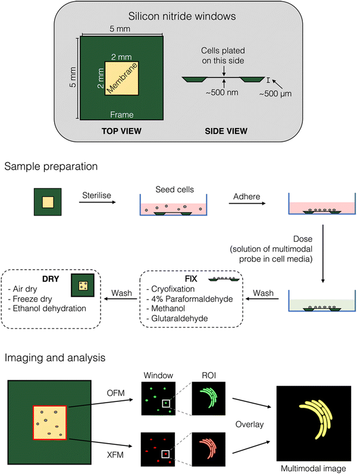
图 3 相关光学荧光显微镜和 X 射线荧光显微镜成像工作流程示例。(上图）细胞 XFM 研究首选的氮化硅膜（窗口）示意图，并标注了一些典型尺寸。(中）制备含有多模态成像探针的细胞样本的工作流程。(下图）相关成像的成像工作流程。

作为新兴研究领域，利用光学荧光显微镜（OFM）和X射线荧光显微镜（XFM）进行多模态成像正处于起步阶段。大多数报道的研究都是在不同样本上使用这两种成像模式来得出结论，然而，本综述将特别关注在相同样本上同时应用两种成像模式的研究。利用外源性标记的多模态OFM和XFM研究可以大致分为以下几类（见图4）：使用荧光标记物和OFM染色细胞结构，然后用XFM定位天然元素；使用对金属响应的荧光探针进行OFM，然后用XFM检测感兴趣的金属元素；追踪含有重元素的荧光标记治疗剂，并用OFM和XFM同时进行研究；研究发光金属配合物作为OFM和XFM活性药剂；追踪带有重原子标记的荧光物质。
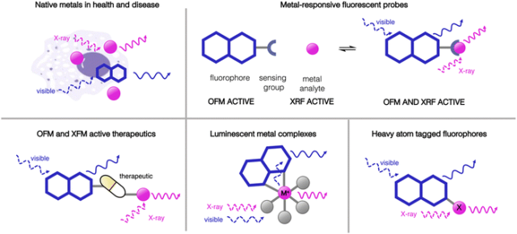
图4本综述中详细介绍了多模态OFM和XFM成像研究的样本类别示意图。

**Multimodal imaging with fluorescent probes**

**使用荧光探针的多模式成像**

本节回顾了 XFM 作为一种技术的使用情况，该技术可测量经单独有机荧光探针、染色剂或标记物处理的细胞中金属的分布和浓度。光学荧光探针的图像通常与 XFM 研究中获得的图像相关联，以提供疾病模型中相关金属在细胞中定位的更多信息。

**金属在疾病中的分布**

虽然 XFM 可用于检测和确定细胞内原生元素的空间分布和浓度，但仅靠 XFM 很难识别特定细胞器和结构。荧光标记技术提供了一种简单而稳健的方法来定位感兴趣的细胞结构，因此结合使用 OFM 和 XFM，可确定特定细胞器或特定蛋白质中的原生金属在生理和病理状态下的变化，比如铜、锌锰等。
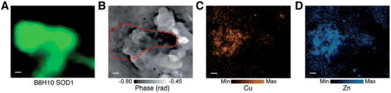
图 5 帕金森病患者人脑组织中 SOD1 蛋白聚集体的代表性多模态图像：(A) Cy3 荧光图，(B) X 射线层析图，(C) XFM 铜图和(D) XFM 锌图。

**金属响应荧光探针**

金属反应荧光探针可用于观察代谢活跃的活细胞中金属的生物分布变化。金属特异性探针由荧光团和传感基团组成，目标金属与传感基团结合会引起可检测到的荧光输出变化（图 9）。然而，这些探针的局限性在于它们通常以强度为基础，这意味着输出取决于细胞区块内探针的局部浓度。XFM 可监测金属浓度，而不受荧光探针（或更重要的金属探针复合物）存在的影响，因此是一种补充方法，可用于确定荧光响应的有效性，并识别金属分析物未提供荧光响应的任何位置。
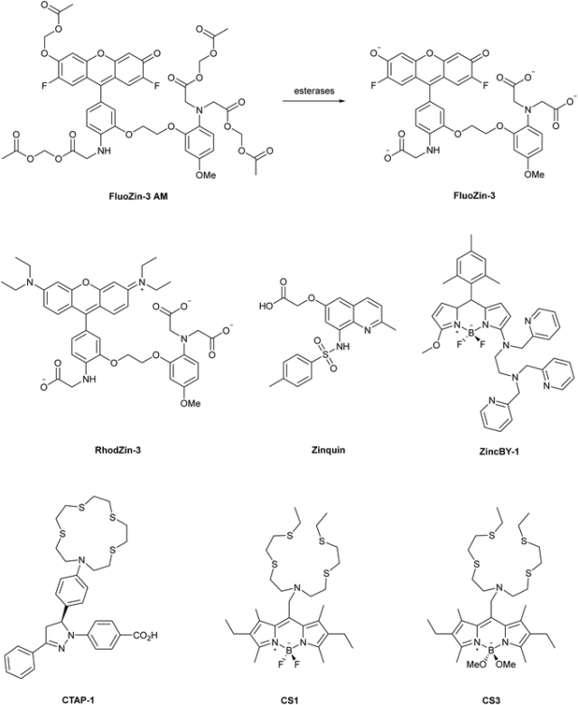

图 6 用 XFM 成像技术对细胞中的锌和铜进行成像的金属响应型荧光探针的部分实例。

**基于纳米颗粒的成像剂**

纳米颗粒作为成像剂、诊断学和治疗学的组成部分具有很大的潜力，但人们对其与生物系统的相互作用还不甚了解。纳米颗粒的一个优点是它们通常含有钛或金等非本地元素，XFM 可以很容易地检测到这些元素，从而深入了解它们在生物样本中的作用。将荧光标记与 XFM 结合使用，可以了解这些类型化合物的定位情况。
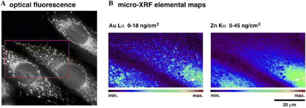
图 7 使用 (A) OFM 和 (B) XFM 对荧光标记的金纳米粒子进行相关成像。光学图像中的红框表示 XFM 扫描的感兴趣区域。

**Probes with both optical and X-ray fluorescence signals**

**具有光学和X射线荧光信号的探针**

虽然XFM技术可以直接检测样品中的原生元素，无需外源探针，但其也具备检测相关分子上的非原生元素标签的潜力。通过将有机荧光报告物与重原子标签结合，可以制备出多模态成像剂。本节着重介绍了可以在两种成像模式下检测的单一化合物的研究。在这些例子中，许多都涉及含有重金属的治疗剂，这些治疗剂要么本身具有发光特性，要么带有荧光标记。

**多模式治疗成像**

许多用于癌症治疗的治疗剂含有金属中心，这要归功于顺铂的影响，它是第一种获得现代临床批准的基于过渡金属的抗癌药物。这些金属中心可以通过X射线荧光显微镜（XFM）轻松检测到，因此引入荧光标记可以使它们在光学荧光显微镜（OFM）中被检测到。同时使用这两种成像技术可以更好地理解药物在细胞内的定位，并提供有关这些化合物在进入细胞环境后的稳定性和物种分布的信息,这些化合物包括铂配合物、钴配合物、锰配合物以及一些抗生素。
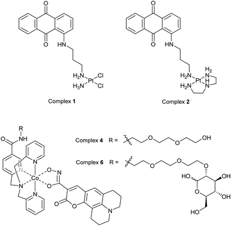
图 8 用于 OFM 和 XFM 多模态成像的含铂或钴的荧光标记治疗剂或类似物示例。
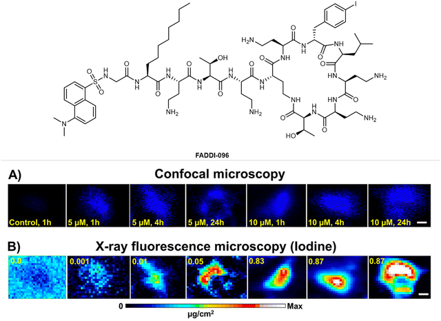

图 9 抗生素衍生物 FADDI-096 在 A549 细胞中的相关成像，用氯化丹酰氯荧光团和碘原子标记，图像收集时间如图所示。(A) OFM 图像，(B) 相应的碘 XFM 图像。

**Luminescent metal complexes**

**发光金属络合物**

发光金属配合物通常通过金属向配体电荷转移（MLCT）过程发出光，它们本质上是多模态成像剂，因为金属原子提供了XFM信号。这些剂已经在光学荧光显微镜（OFM）与振动光谱技术的组合中用于多模态成像，但也有报道称它们可以同时通过XFM和OFM进行检测。
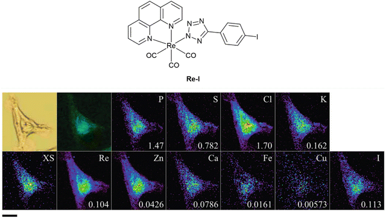
图 10 22Rv1 细胞中多模态复合物 Re-I 的相关成像，显示明视野（左上）、表观荧光图像（左下）和 XFM 测量的其他元素图。每个元素上的数值表示最大元素面积密度（微克厘米-2）。

**Multimodal nanoparticle imaging agents**

**多模式纳米颗粒显像剂**

对利用多模态成像技术研究不同类型的DNA结构引起了很大兴趣。研究中将四甲基罗丹明染料（TAMRA）连接到感兴趣的DNA序列上，然后与TiO2纳米颗粒结合，以评估它们在细胞环境中的稳定性。通过对钛的X射线荧光显微镜成像与TAMRA的共聚焦显微镜成像进行相关分析，表明这些共轭物在内吞入MCF-7乳腺癌细胞后仍保持完整（见图11）。
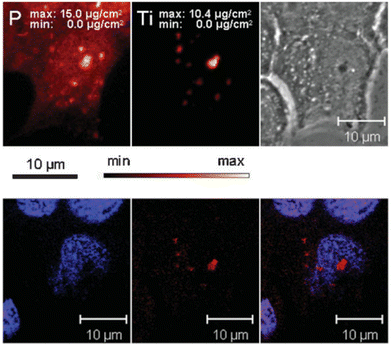
图 11（上）用 TiO2-DNA 纳米共轭物处理的细胞中磷和钛分布的 XFM 图像。(下图）用 DAPI（蓝色）和 TAMRA（红色）标记的同一细胞的光学荧光图像。

**Tracking heavy atoms with XFM**

**用XFM跟踪重原子**

迄今为止，只有少数有机荧光探针添加了重原子（如 Br 或 I），以便利用 XFM 监测和量化吸收。使用这种方法，探针可在多种模式下被检测到，其定位和浓度可通过 OFM 和 XFM 的组合来确定。这仍是量化细胞有机成像探针数量的少数方法之一。
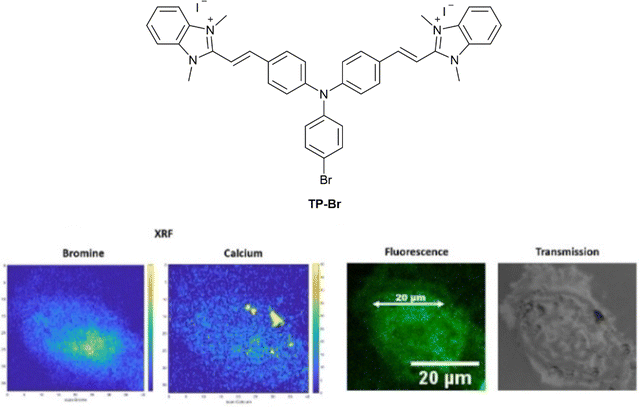
图 18 探针 TP-Br 在 HeLa 细胞中的相关成像，左侧为溴和钙的 XFM 图，右侧为光学荧光和明视野图像。

**Conclusions and perspectives**

**结论和展望**

本综述中讨论的 OFM 和 XFM 技术相结合所产生的信息可能大于各部分的总和；例如，OFM 中的荧光标记可对 XFM 中健康和疾病中元素沉积和变化的位置进行更可靠的分析，而 XFM 元素图则有助于了解 OFM 中常用荧光探针的选择性。本综述重点介绍了同时使用这两种技术的研究，以及研究人员使用这两种技术对完全相同的样本进行成像的研究。然而，在多模态成像研究范围内，很少有研究人员制作模态间的叠加图像，也很少有研究人员使用现有的相关性统计检验方法量化模态间的相关性。这可能具有挑战性，因为 XFM 和 OFM 产生的图像可能具有不同的分辨率和像素密度，但目前正在开发执行此操作的工作流程。

本文报道的几项研究报告了亚细胞器的 XFM，无论是通过元素浓度还是通过外源靶向探针。在解释这些结果时必须谨慎，因为在许多情况下，只能观察到外源探针与相关细胞器的部分共定位。重要的是要考虑活细胞和固定细胞之间以及用于 XFM 测量的干燥细胞和固定细胞之间这种定位的保留程度。

本综述重点介绍了可使用光学和 X 射线荧光技术组合探测的细胞模型、疗法和疾病的多样性。随着研究人员不断提高 OFM、XFM 和小分子探针开发的能力，新的多模态探针和方法将不断开发出来，使研究人员能够解决目前我们无法解决的有关细胞环境和金属组的问题。

**点击蓝字 关注我们**

**关注并回复文章DOI获取全文：**

10.1039/D3CS00509G

Graziotto, M. E.; Kidman, C. J.; Adair, L. D.; James, S. A.; Harris, H. H.; New, E. J. Towards Multimodal Cellular Imaging: Optical and X-Ray Fluorescence. *Chem. Soc. Rev.* **2023**, 10.1039.D3CS00509G. https://doi.org/10.1039/D3CS00509G.

[【Nat. Mater.】揭示纳米药物肿瘤传输的全新机制，EPR解释不了的现象ART可以！](http://mp.weixin.qq.com/s?__biz=MzkzOTI1OTMwNg==&amp;mid=2247484589&amp;idx=1&amp;sn=d9f9681755c99844c5f70e38c47fe1a2&amp;chksm=c2f2e068f585697e769eb43846b87d947e0f8724822ff54c1062202adab92cac022582ca8127&amp;scene=21#wechat_redirect)

[【Angew】如何提升生物成像的对比度？高荧光、细胞渗透性罗丹明染料引领活细胞蛋白质标记革新](http://mp.weixin.qq.com/s?__biz=MzkzOTI1OTMwNg==&amp;mid=2247484639&amp;idx=1&amp;sn=e578d29c33417364c52a2c8b0a150550&amp;chksm=c2f2e01af585690c84696e6d5b158b240a395679e63790b2b33199dc531b3c9c4a20f0409096&amp;scene=21#wechat_redirect)

[【 Nat. Biomed. Eng. 】同样使用ICG做手术导航，这种方法肿瘤识别精准率高达97%](http://mp.weixin.qq.com/s?__biz=MzkzOTI1OTMwNg==&amp;mid=2247484548&amp;idx=1&amp;sn=15c8c0c805c4ed45821482c8a7f429e7&amp;chksm=c2f2e041f5856957fc3e6ec801f48429bad92696c8e808f98682190c084d573b466669aaaab0&amp;scene=21#wechat_redirect)

预览时标签不可点

素材来源官方媒体/网络新闻

  继续滑动看下一个 

 轻触阅读原文 

   

