 

#  【Chem. Soc. Rev.】纳米革命：破解氢储存之谜，重塑未来能源格局！ 
 

Grenemal

读完需要

21

全文字数  7300 字

***目录***

1. Introduction

2. Mechanism of nanoscale engineering for boosted hydrogen

storage performance

2.1. Nanoscale mechanism of enhanced hydrogen storage in porous

materials

2.1.1. Effect of surface area and pore volume

2.1.2. Hydrogen spillover

2.1.3. Nanopump effect

2.1.4. Others

2.2. Nanoscale mechanism of enhanced hydrogen storage in

hydrides

2.2.1. Nanosizing effect

2.2.2. Nanocatalyst effect

3. Nanoscale tuning strategies for enhancing the hydrogen storage

capacity of porous materials

3.1. Specific surface area/pore volume optimization

3.2. Nanoscale pore size optimization

3.3. Doping of nanostructure

3.4. Nanoarchitecture construction

3.5. Nanohybrid material

4. Nanoscale tuning strategies for enhancing the hydrogen storage

capacity of hydrides

4.1. Nanoconfinement

4.1.1. Nanoscaffolding

4.1.2. Nanoencapsulation

4.2. Nanosized hydrides

4.3. Nanocatalyst loading and synergistic effect

5. Outlook and conclusion

**Introduction**

引言

氢气（H2）被视为一种清洁能源载体，与传统化石燃料相比，其燃烧不会产生二次污染。但是，氢气在实际应用中存在一些挑战，主要包括储存体积、重量、安全性、效率和成本的问题。目前，氢气的常见储存方法有高压压缩、低温液化和使用固态材料的吸附法。然而，这些方法各有局限性和风险。

在能源科学领域，氢能的未来是一个关键问题。全球科学家都在探索储氢材料的研发，这包括各种多孔材料和金属氢化物。特别是纳米材料，它们在纳米尺度上的结构和特性对氢气的存储有着深远的影响。这些纳米材料的特点和约束效应为研究者提供了新的视角和工具，用于改进和优化氢气的储存性能。
‍‍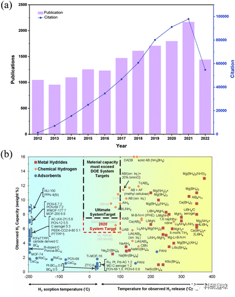‍‍
图 1 (a) 2012 年至 2022 年有关固态材料（包括多孔材料和金属氢化物）储氢的论文发表和引用情况。(b) 燃料电池技术办公室对一系列不同储氢材料的氢容量与氢释放温度的关系评估。

尽管过去有关储氢材料的综述已经发表，但很少涉及到纳米级别的多孔材料和金属氢化物的设计和调整。考虑到对多孔材料和金属氢化物储氢的兴趣日益增加，有必要进行更全面的综述。本综述将集中讨论储氢材料的纳米工程策略，旨在为理想的储氢材料设计提供指导。

**Mechanism**

机理

2.1. Nanoscale mechanism of enhanced hydrogen storage in porous materials

**2.1.1. Effect of surface area and pore volume**

在高于沸点（20.4 K）的温度和特定压力下，H2 分子在多数多孔材料的固体表面上以单层物理吸附的形式存在，这种吸附是由范德华力驱动的。由于气体分子与固体表面的相互作用能通常只有 4-7 kJ mol-1，这不足以引发键的解离，因此气体仍以分子状态被吸附。

实现物理吸附中的高存储容量通常需要低吸附焓和低温环境。物理吸附过程中不存在活化能势垒，导致了其动力学响应迅速。因此，多孔材料对H2的吸附增强归因于它们具有高表面积、大孔容积和优化的孔径。具体来说，BET比表面积每增加 500 m2 g-1 时，在10 bar以上的超量吸收量增加了大约0.24 wt%，而在10 bar以下仅增加了0.17 wt%。此外，总孔隙体积每增加0.1 cm3 g-1，氢的吸附量增加了约0.06 wt%。值得注意的是，在孔隙体积低于0.3 cm3 g-1时，氢的吸附量与超微孔（&lt;0.7 nm）的体积呈线性关系，每增加0.1 cm3 g-1的超微孔体积，吸附量增加了0.1 wt%。

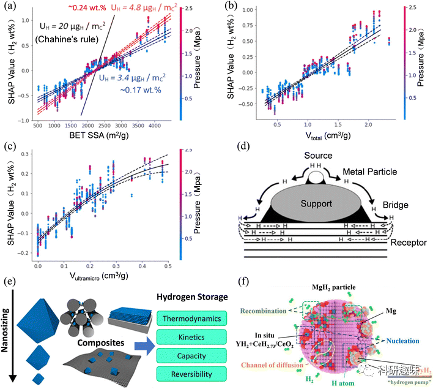
图 2 (a) BET 比表面积（SSA）的夏普利加法解释（SHAP）依存图。(b) 总孔隙体积的 SHAP 依赖关系图。(c) 超微孔体积的 SHAP 依赖关系图。(d) 基地催化剂系统中的氢溢出过程。(e) 金属氢化物的纳米化效应。(f) 金属氢化物中纳米催化剂对储氢的影响。

**2.1.2. Hydrogen spillover**

氢溢出效应描述了离解氢从一个表面迁移到另一个表面的现象，这是通过表面扩散实现的。这导致了吸附的物种进入一个被称为“接受表面”的新表面相，并与原始的吸附和活化表面相连接。这一过程可以分为三个阶段：首先，H2 分子与金属催化剂发生离解化学吸附；其次，催化剂表面上的氢原子迁移到其附近的基底；最后，接近催化剂的氢原子也可能扩散到远离催化剂的基底或表面。通过计算最小能量路径，可以绘制氢原子从催化剂到基底的迁移及其在基底内的扩散路径。在这一过程中，一次性的溢出涉及氢原子从金属颗粒传输到支撑体，而二次溢出涉及氢原子传输到另一个受体。

**2.1.3. Nanopump effect**

在层状二维材料中，如叠层石墨烯和多层 MXene，氢的存储性能受到了称为 "纳米泵效应" 的显著增强。这种效应描述了当石墨烯层间距缩小至6-7 Å时，由于吸附力增强，层间的氢密度明显提高。简而言之，石墨烯可以被视为一个 "纳米泵"，其结构内的氢压力因此增加。在氢与石墨烯的相互作用中，主导作用的是结合能相对较低的伦敦色散力。根据理论计算，在层间距离为 d ≥ 10 Å 时，双层石墨烯上的氢吸附焓相对较弱（-2.4 kJ mol-1），与单层石墨烯相似。但是，当层间距缩小至 6-7 Å 时，氢的吸附焓显著增加至 -13.1 kJ mol-1，进一步增强了 "纳米泵效应"。

**2.1.4. Others**

在氢吸附领域中，具有开放金属位点的MOF在室温下展现出显著的吸附能力，这种效应不是由物理吸附产生的，而是通过非解离化学吸附实现的。以CuI-MFU-4l MOF为例，其特点是具有单分散的Cu+位点，可以与H2形成π背键。与此对比，MOF-74的不同异构体，如[M2(m-dobdc)、M = Fe、Mn、Ni、Co]，其中金属位点的电荷密度增加，从而增强了MOF与H2的相互作用。

另一方面，一些掺杂了金属或金属化合物的多孔材料也展现出出色的氢吸附性能。这种提升可以归因于H2分子与金属原子之间的库巴斯相互作用。库巴斯相互作用涉及两种机制：σ-捐献和π-反捐献。简单地说，σ-捐献是电子密度从氢的σ键轨道转移到金属的未占据d轨道，而π-反捐献则涉及电子密度从金属的d轨道转移到氢的σ\*反键轨道。例如，与其原始材料相比，包括多壁碳纳米管、Co9S8装饰的rGO纳米复合材料以及钙、钪和钛掺杂的B-COF等都展现出了更高的氢吸附性能。

2.2. Nanoscale mechanism of enhanced hydrogen storage in hydrides

**2.2.1. Nanosizing effect**

纳米化技术在金属氢化物的氢吸附和解吸过程中起到了关键作用，特别是在动力学障碍和热力学稳定性方面（如图2e所示）。这种技术涉及到三种尺寸：颗粒、晶体和晶粒。首先，颗粒尺寸指的是单个材料颗粒的大小。当颗粒尺寸减小到纳米级别时，其表面积与体积的比值显著增加，为氢的吸附和解吸提供了更多的活性位点。其次，在晶体状态下，晶体尺寸会影响反应的成核、新相的生长及整体晶体的结构，进而影响到反应的动力学和热力学。较小的晶体尺寸往往加速了成核和新相的生长，并增加了反应场所如缺陷和晶界的数量。而晶粒尺寸与晶体尺寸紧密相关，但它具体描述的是多晶材料中单个晶粒的大小。较小的晶粒提供了更大的表面积，更多的成核点，以及更短的氢扩散路径。

此外，纳米颗粒的表面具有特殊的化学和电子性质，这有助于储氢。例如，这些表面可能富含氢化活性位点或暴露的悬键，从而增强材料的催化活性，加速氢的吸附和解吸速率。此外，纳米颗粒由于其小尺寸在材料中可能引入应变，从而改变电子和晶体结构，进一步提升其储氢性能。

**2.2.2. Nanocatalyst effect**

如图2f中展示的，纳米催化剂与金属氢化物之间存在协同效应，这有助于增强金属氢化物的储氢性能。首先，纳米催化剂的高表面积与体积比提供了更多的活性吸附位点，增强了氢分子的吸附和离解能力。这种吸附能力的增强使得氢分子中的H-H键更易于解离为H原子，从而降低了储氢所需的能量。其次，纳米催化剂在金属氢化物基体中引入了应变，从而改变了材料的电子和晶体结构，这进一步降低了氢解离和重组的能量障碍。这种结构调整使得能量方面的优势更为明显，并进一步降低了储氢的活化能。最后，纳米催化剂引入的缺陷和晶界提供了额外的反应位点，加速了反应动力学并降低了氢的释放温度。

在某些金属氢化物中，特别是当它们与合适的催化剂或催化材料相结合时，会形成所谓的"氢泵"，如DyH2/DyH3和Mg2Ni/Mg2NiH4。这种“氢泵”机制能够有效地促进氢分子的解离，使氢原子在吸收过程中更容易地扩散并进入金属晶格。在反向过程中，这些催化剂则有助于氢原子重新组合成氢分子，进而加速氢气的释放。

**Strategies for porous materials**

多孔材料策略

多孔材料，如碳、金属有机框架（MOF）和共价有机框架（COF），被广泛用于吸附H2，特别是在微孔介质中封装或捕获气体。碳材料，包括碳纳米管（CNT）、石墨烯、活性碳（AC）、生物质衍生碳以及MOF衍生碳，均具有不同尺度的孔隙结构，并已在氢储存领域进行深入研究。COFs是近期新兴的多孔材料，它们由特定构件组成，通过稳固的C、H、O、B和Si等元素的共价键相互连接，形成了明确的二维或三维框架结构。这些COFs具有高表面积、大孔隙率和超低密度的特性，非常适合气体存储和分离，因此引起了广泛关注。

为了在纳米尺度上提供更多的吸附位点，可以增大多孔材料的表面积和孔隙率，从而通过物理吸附方式增强H2的储存能力。同时，通过杂原子掺杂、分层纳米结构以及构建混合纳米材料等策略，可以改变材料的电子、结构和组成特性，从而显著地影响其氢吸附性能。鉴于此，本文着重探讨了优化多孔材料在纳米级别的调整策略，并评估了这些策略对增强储氢性能的潜在效果。

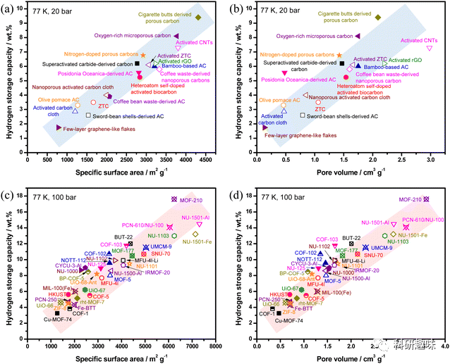
图 3 (a) 多孔碳材料储氢能力与比表面积之间的结构-性质关系；(b) 多孔碳材料储氢能力与孔隙体积之间的结构-性质关系；(c) MOFs 和 COFs 储氢能力与比表面积之间的结构-性质关系；(d) MOFs 和 COFs 储氢能力与孔隙体积之间的结构-性质关系。。

3.1. Specific surface area/pore volume optimization

多孔材料的储氢性能受其表面积和孔体积的影响。理论上，表面积越大，材料的储氢能力也越强。尽管在室温下，多孔材料的储氢能力与压力成线性关系并受到限制，但在低温（77 K）下，观察到了多孔材料的氢吸收能力与比表面积呈近似线性关系。以多孔碳材料为例，当比表面积从400 m^2/g增加到4200 m^2/g时，储氢能力也从2%增加到10%，两者之间存在明显的线性关系，如图3a所示。同样，在图3b中，多孔碳的储氢能力在0.2 cm^3/g至3 cm^3/g之间，对应于2%至10%的储氢能力，也展现了类似的线性趋势。这表明，多孔材料的总孔隙体积与可用表面积和氢分子的吸附位点数量密切相关。当总孔隙体积增大时，提供了更多的交互空间和表面积，从而使其能够吸附更多的氢气。

3.2. Nanoscale pore size optimization

吸附剂的孔隙大小在储氢方面扮演关键角色，因为它直接影响到表面积和孔隙体积的关系，并进一步影响到吸附焓。一般而言，孔隙越狭窄，氢与表面的相互作用强度和吸附能力就越大。因此，具有超微孔结构的多孔吸附剂，由于其强化的吸附热，在储氢领域具备显著的价值。
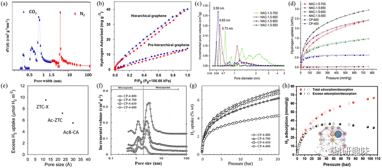
图 4 (a) 分层石墨烯基材料的孔径分布。(b) 分层石墨烯和预分层石墨烯的氢吸附等温线。(c) 掺 N 活性炭的 DFT 孔径分布。(d) 77 K 时活性碳和非活性碳的氢吸附等温线。(e) 氢吸收密度与多孔碳孔径的函数关系。(f) KOH/ 聚吡咯比例为 4 并在 600-800 °C 下活化的一系列活性碳在 77 K 下的孔径分布曲线和 (g) 氢吸附等温线。(h).NPF-200 在 100 巴以下的氢气总吸附和过量吸附等温线

根据表1的数据，多种吸附剂展示了各种孔径范围。有研究特别强调了小微孔（直径≤1 nm）的重要性，指出其具有高效的储氢性能，而直径超过1 nm的孔在77 K条件下的氢吸附效果相对有限。研究表明，在较低压力下，0.5-0.7纳米宽的孔是在77 K时最佳的氢吸附材料，因为这些孔的两侧势场可以有效重叠。对于大于1 nm的孔隙，它们更适用于提高高压下的氢吸附性能。因此，纳米级孔隙尺寸的优化显得尤为重要。

研究表明，吸附剂中的微小孔具有关键的储氢作用。在相对低压下，孔壁的势场重叠增强了氢与孔壁的相互作用，进而提高了吸附能力。在77 K下，宽度为0.5至0.7纳米的孔隙最为有效，能容纳大量氢气，特别是在高压条件下。具体来说，小于1.5纳米的纳米孔非常有效，而大于2.5纳米的介孔不适合储氢。此外，随着压力的增加，有效吸附氢气的孔径范围也会扩大。因此，纳米级孔径的优化对于最大化吸附能力至关重要。
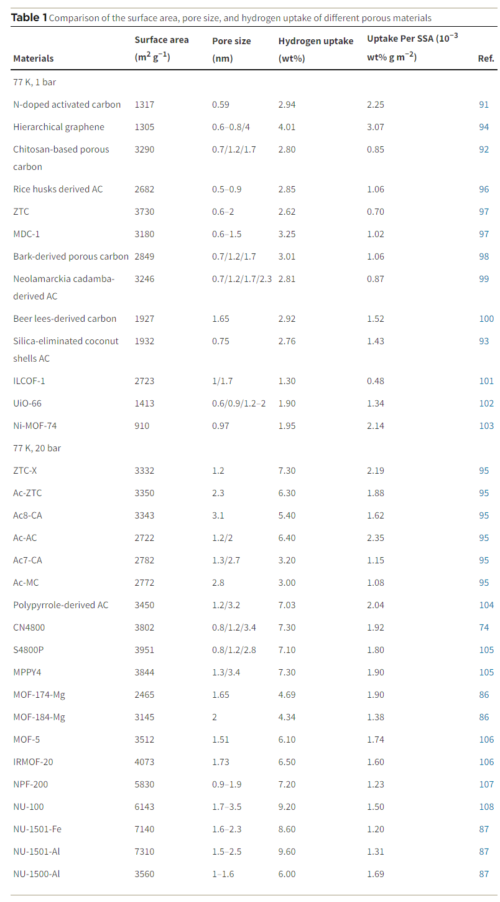
3.3. Doping of nanostructure

研究显示，对吸附剂，特别是碳材料进行掺杂或化学修饰可以显著调整其吸附性质，尤其是对氢的吸附和解吸。氮（N）掺杂能够增加碳材料的π电子密度，从而增强其氢吸附能力。例如，掺氮石墨烯和掺氮碳纳米管显示了增强的氢吸附。与此相反，磷（P）掺杂由于其较大的原子尺寸会引入结构畸变，但仍然能够通过改变碳材料的键合构型来提高氢吸附能力。硼（B）的掺杂可以激活碳材料的π电子，增强其导电性和氢吸附特性。掺杂过渡金属如Pd和Pt纳米结构也能够增强碳对氢的吸附能力，通过化学吸附和氢溢出机制。此外，掺杂金属到COFs中也被证明是提高氢吸附能力的有效方法，例如锂（Li）和过渡金属离子的掺杂都可以显著增强COF的氢吸附容量。
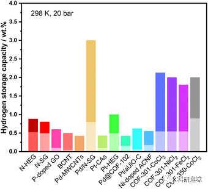
图 5 不同元素掺杂多孔材料的储氢性能比较（高亮颜色表示储氢能力的增强）。
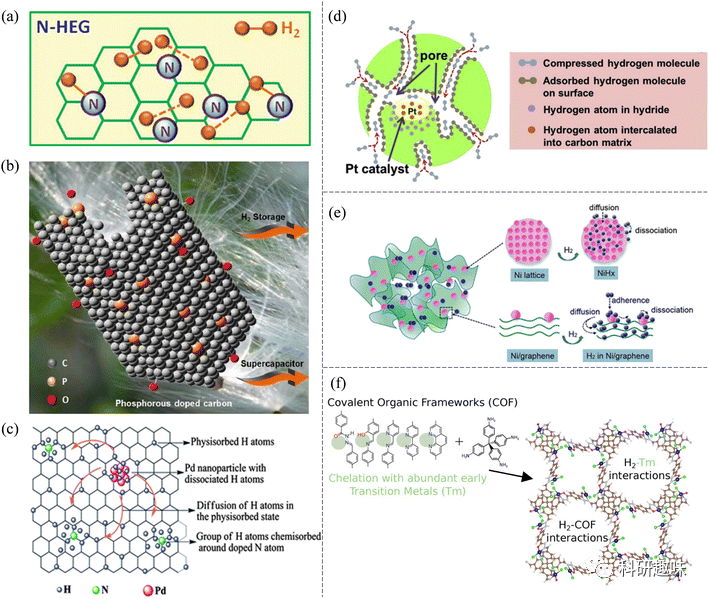
图 6 (a) N-HEG 氢化时可能形成的键的示意图。(b) 生物质衍生的含 P 多孔储氢碳示意图。(c) Pd/N-SG 中的氢吸附机制。(d) CAs-Pt 的储氢示意图。(e) 用于储氢的镍/石墨烯纳米复合材料示意图。(f) 含有丰富过渡金属螯合物的 COFs 中的储氢。

3.4. Nanoarchitecture construction

报道指出，构建分层纳米结构，如核壳纳米结构和三维纳米结构，是提高氢气吸附性能的有效方法。以核壳 MIL-101@UiO-66 为例，其比单个纯 MOF 样品具有更高的比表面积和孔隙率，形成了更多的孔隙，提高了氢气的吸附性能。类似地，核壳 ZIF-8@ZIF-67 结构在 77 K 和 1 bar 条件下的 H2 吸收率显著提高，强调了核壳设计在氢气存储中的关键作用。多孔纳米管网络，如由纳米管和正交立方体组成的网络，展现了卓越的气体存储能力和广泛的应用潜力。另一项创新的结构设计涉及相互连接的 SWCNT 组成的三维正交网络，计算结果显示其在 77 K 和 100 bar 条件下的氢吸收率可超过 20 wt%。缺陷工程自组装方法也被应用于制造三维纳米孔结构和钯嵌入多孔石墨烯异质纳米结构，展示了超高吸氢能力。此外，具有大量氟基团的 Ti2C 片层通过纳米泵效应辅助的弱化学吸附，在环境温度和 60 巴压力下表现出高达 8.8 wt% 的氢容量。
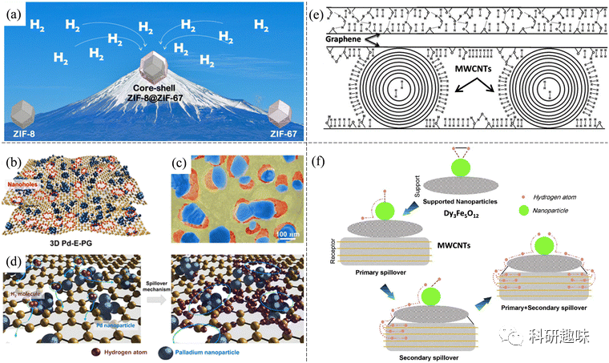
图 7 (a) 用于增强储氢的核壳沸石咪唑盐酸盐框架 (ZIF) 示意图。(b）三维 Pd-E-PG 纳米孔示意图。(c) 三维 Pd-E-PG 与 Pd NPs（蓝色）的 SEM 图像。(d) 氢原子沿纳米孔边缘附着的溢出机制示意图。(e) GO 和 GO/CNTs 混合材料储氢示意图。(f) MWCNT/Dy3Fe5O12 上的一次和二次溢出过程。

3.5. Nanohybrid material

纳米杂化材料是将不同材料的纳米级成分或结构融合成复合材料。构建这种纳米杂化材料并利用其结构效应或协同效应可提高储氢性能。例如，GO-MWCNTs 杂化物在室温和 50 巴下的氢容量达到 2.6 wt%，这得益于 GO 对 MWCNTs 的有效分离和分束。添加 Dy3Fe5O12 到 MWCNT 中，除了物理吸附，还发生了氢化学吸附，从而增强了氢在 MWCNT 上的吸附。石墨烯与 Zr-MOF（UiO-66）结合后，储氢量显著提高，部分原因是石墨烯与氢的协同作用。铂负载 MWCNTs@MOF-5 复合材料在室温下展现出高的氢吸收率。此外，六方氮化硼（h-BN）装饰可增强 MWCNTs 和酸处理 MWCNTs 的氢吸附能力，与原始 MWCNTs 相比，添加 5 wt% h-BN 的 A-MWCNT 的吸氢率提高到 2.3 wt%。

**Strategies for hydrides**

杂化材料策略

金属氢化物是由金属阳离子和氢化物阴离子组成的，是固态储氢材料的有力选择。这些材料可以分为三类：元素氢化物（如 LiH、MgH2）、金属间氢化物（如 AB5 型）和复合氢化物（如 NaAlH4）。元素氢化物吸氢需要较高温度，而金属间氢化物则具有更快的氢吸附/解吸动力学。复合氢化物在储氢能力和热力学性质方面都表现出色，但其多步脱氢机制可能带来挑战。纳米结构氢化物和纳米催化剂为提高氢化物的循环和吸附能力提供了策略，其研究对于推动动力学稳定的储氢系统发展至关重要。

4.1. Nanoconfinement

将纳米粒子固定在多孔宿主或支架中是一种有效的策略，有助于其维持较小的尺寸并防止聚集。这种策略确保了纳米粒子在整个多孔结构中的均匀分布。纳米束缚策略主要有两种形式：一种是将永久多孔性材料固定在纳米结构的宿主或支架中，被称为纳米支架；另一种是通过刚性基质或外壳来封装或包裹纳米材料，被称为纳米封装。表 2 对这两种策略应用于氢化物储氢性能的设计进行了比较和总结。

纳米强化技术充分利用了纳米级尺寸效应和界面效应。在纳米尺度上，粒子被精确地固定在特定的空间内，有效地防止了聚集并促进了脱氢过程。金属氢化物颗粒与支架材料之间形成的多个界面构建了一个紧密的网络，促进了原子的快速扩散和交换。这种优化的动力学条件有助于提高储氢性能。

值得注意的是，随着纳米颗粒尺寸的减小，其比表面积也相应增加。这增加了表面能量和活性原子的浓度，使其能够与其他原子产生更强烈的相互作用。因此，纳米颗粒展现出出色的表面化学反应活性和催化活性，加速了金属氢化物的整体储氢反应速率。

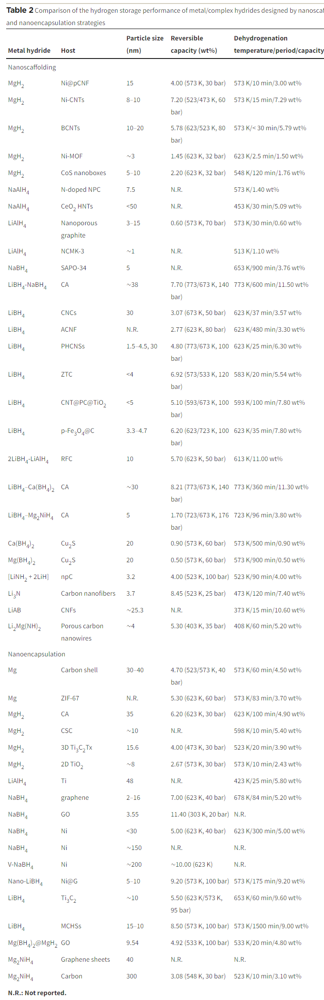
**4.1.1. Nanoscaffolding**

通过将纳米颗粒固定在多孔宿主或支架中可以显著改善储氢性能。这一策略的两种主要形式为纳米支架和纳米封装。在纳米支架中，宿主或支架材料拥有纳米级孔隙或沟槽，可作为封闭空间引入材料。这些受限材料被固定在孔隙中，从而有效地限制了其移动和聚集趋势。多种多孔宿主/支架材料，如多孔碳、MOFs等，都可被应用于这一策略。

以多孔空心碳纳米球（PHCNSs）为例，其高孔隙率和明确的孔隙结构被用作限制 LiBH4 的支架。PHCNSs巨大的表面积促进了LiBH4和PHCNS之间强烈的界面相互作用，从而提高了LiBH4的脱氢性能。类似地，采用纳米支架或纳米封装策略，通过多孔金属、MOFs、多孔氧化物、介孔硫化物等宿主材料限制金属氢化物，也显著改善了氢吸收/解吸的动力学和热力学性能。
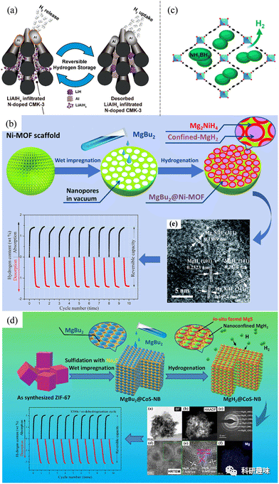
图 8 (a) LiAlH4@NCMK-3 的储氢机制示意图。(b) MgH2 纳米晶体在 Ni-MOF 支架中原位催化和纳米约束储氢示意图(c) 具有 MIL-53 拓扑结构的 MOF 中纳米 NH3-BH3 的氢气释放。（d）通过介孔 CoS 纳米盒支架中的纳米融合提高 MgH2 吸氢性能的示意图

具体而言，MOFs的灵活性在选择金属中心和有机连接体方面提供了巨大的灵活性，MIL-53结构的MOFs展现了在高温高压条件下的卓越稳定性。多孔金属作为金属氢化物的支架，由于不含氧且具有更高的热传导性，被视为理想的替代品。多孔氧化物作为催化纳米支架，在催化效应和纳米细化方面表现出潜力，如CeO2中空纳米管（HNT）被用于支持NaAlH4 NPs。多孔硫化物，如Cu2S和介孔CoS，被证明是有效的支架材料，可以稳定和限制金属氢化物，从而改善储氢性能。这些策略通过纳米结构的优化，提高了金属氢化物的整体储氢动力学。

**4.1.2. Nanoencapsulation**

在纳米封装方面，采用纳米级材料在基体或基底表面的分布或分散，如氧化石墨烯、石墨烯、MXenes和金属氧化物，能够有效防止材料的生长和聚集。这种策略的成功案例包括Züttel小组在碳载体上合成的NaBH4 NPs，其中沉积在碳载体上的NaBH4在较低温度（约403 K）时释放氢气，远低于纯NaBH4（高于773 K）。此外，纳米级碳支撑（如氧化石墨烯和CNT）有助于抑制NaBH4 NPs的团聚，提高了解吸氢的量。

类似地，采用不同碳基材料的纳米封装策略也被应用于MgH2 NPs。以MgH2@CSC为例，其在518 K时开始脱水，表现出卓越的脱氢/氢化动力学特性。这是因为CSC的层状结构形成相互连接的皱纹，有利于保持MgH2 NPs的高分散性和纳米尺寸。相似的策略也在平均粒径约为10纳米的MgH2纳米颗粒上形成的Mg(BH4)2异质结构层中成功调节了MgH2和Mg(BH4)2的粒径，降低了水合和脱水温度。

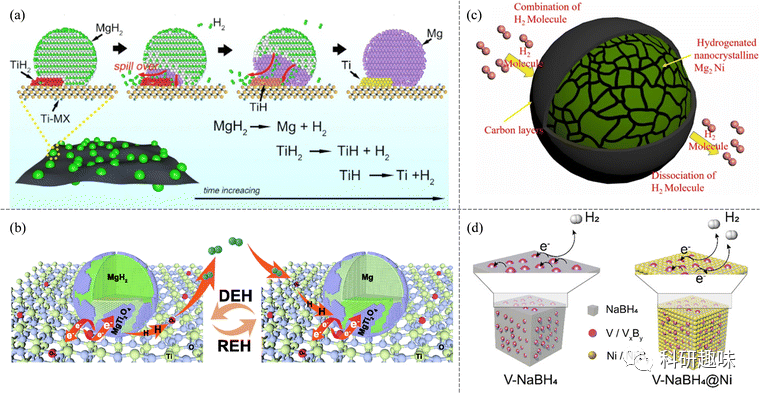
图 9 (a) 快速脱氢机制示意图。(b) MgH2/TiO2 异质结构的氢化和脱氢机制示意图。(c) 碳包覆纳米晶 Mg2Ni 的氢化和脱氢示意图。(d) 在 V/VxBy（V-NaBH4 中）和 V/VxBy 与 Ni/NixBy（V-NaBH4@Ni 中）存在的情况下，通过电子转移过程释放氢的机制示意图。

石墨烯的应用也在封装LiBH4 NPs中取得了成功。石墨烯和镍纳米晶体的存在抑制了LiBH4的生长，实现了元素B和BH4-的简便相互转化，使LiBH4在显著降低的温度下实现了高度可逆的氢循环。纳米细化和多相界面的效应，尤其是原位生成的催化TiH2，是该策略成功的关键因素，为高效的氢吸附和解吸提供了基础。

4.2. Nanosized hydrides

纳米化金属氢化物是提高储氢能力的有效策略。这种纳米化策略有多个优势，如增加氢分子接触面积、缩短氢扩散长度以及降低纳米粒子的能量障碍，从而实现更快的氢动力学和良好的氢可逆性。Aguey-Zinsou小组利用格氏试剂（二叔丁基镁）制备了纳米级的MgH2。其结果显示，使用特定的方法，他们成功合成了约150 nm的大型结构和约5 nm的小型纳米颗粒的MgH2，这种MgH2在低至373 K的温度下开始释放氢气。与此同时，Liu小组合成了4-5 nm的超细MgH2 NPs，并实现了6.7 wt%的可逆储氢。研究还显示，氢气的解吸性能与纳米颗粒的粒径有关，小型纳米颗粒有更低的解吸温度。DFT计算进一步证实，纳米团簇上的氢解离和扩散比块状材料更为有利。此外，通过改变NaBH4纳米结构的表面活性剂比例，可以调整其形状和熔点，从而在更低的温度下释放氢气。
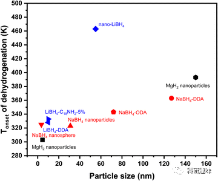
图 10 纳米金属氢化物材料（包括 MgH2、NaBH4 和 LiBH4）的储氢性能比较。

4.3. Nanocatalyst loading and synergistic effect

纳米催化剂负载是一种有效的氢化物改性策略，能够显著提高氢化物的脱/再水合动力学。这种催化剂具备的大表面积、丰富的晶界/缺陷以及短的扩散路径为提升脱/氢化动力学提供了强大的支持。根据表3，当前的纳米催化剂类型包括金属、金属合金、金属化合物（如金属氧化物、金属硫化物和金属卤化物）、碳以及其他多种纳米材料。
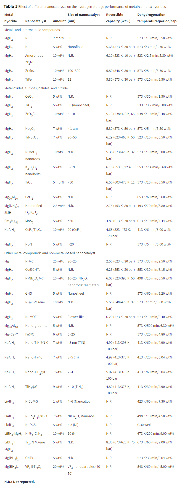

**Outlook and conclusion**

结论与展望

氢储存对于推动氢能系统和实现清洁能源非常关键。与传统方法相比，固态材料储存氢的方法更紧凑、安全且不需要极端条件。纳米尺度固态材料通过优化结构和特性，能够提高氢的储存效率。此外，纳米工程为固态储氢材料提供了新的设计策略，包括多种氢物理吸附剂和化学吸附剂。尽管有显著进展，但关于纳米尺度储氢材料的设计仍面临挑战，如材料的重量和氢的质量比。固态储氢的关键在于实现氢的高密度和安全存储，同时考虑经济性和实际应用条件。未来的研究需要深入模拟研究，并利用计算和机器学习方法来预测和优化储氢材料的性质。

Wang, Y.; Xue, Y.; Züttel, A. Nanoscale Engineering of Solid-State Materials for Boosting Hydrogen Storage. *Chem. Soc. Rev.* **2024**, 10.1039.D3CS00706E. https://doi.org/10.1039/D3CS00706E.

**关注并回复文章DOI获取全文：**

10.1039.D3CS00706E

   

