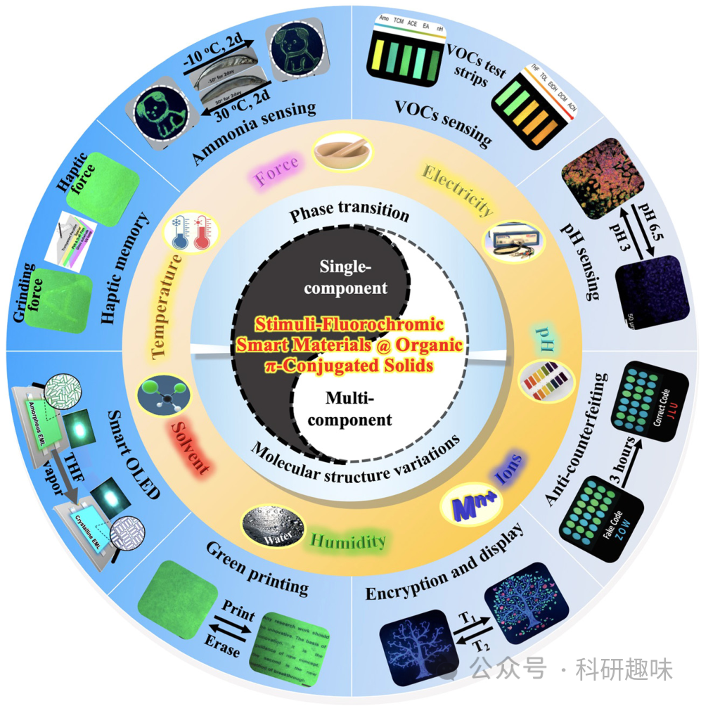
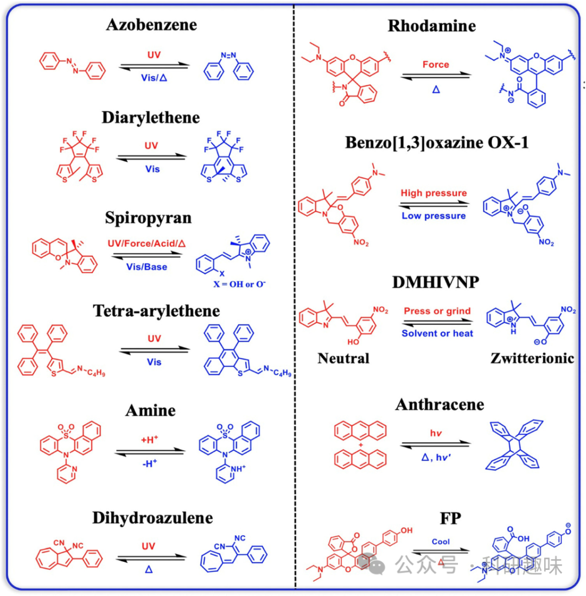
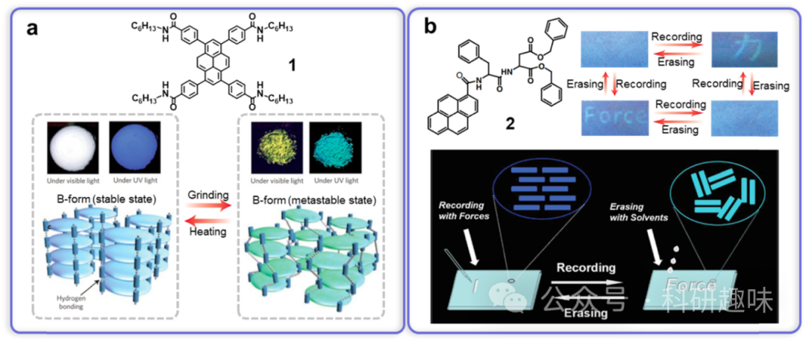
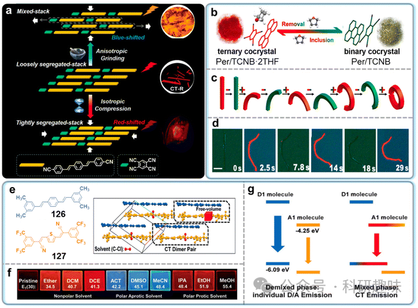

 

#  【Chem. Soc. Rev】刺激荧光智能有机材料：设计、性质和应用的全面综述 
 
 原创

Grenemal

读完需要

3

全文字数 676 字

***目录***

1. Introduction
2. Design strategies of stimuli-fluorochromic organic π-conjugated solids
3. Single-component stimuli-fluorochromic organic π-conjugated solids
4. Multi-component stimuli-fluorochromic organic π-conjugated solids
5. Applications
6. Summary and outlook

本文综述了刺激响应荧光智能有机材料的最新发展，设计策略，性质和潜在应用。从加密到绿色印刷，本综述提供了关于刺激荧光共轭固体（SFCSs）的创新研究及其先进应用的见解，旨在激发对这一领域的进一步探索。

在综述的第一部分，介绍了刺激响应荧光智能有机材料的研究背景和意义，概述了文章的结构和内容安排。刺激响应荧光智能有机材料是一类具有可逆可见响应的功能材料，其在多个领域具有广泛的应用前景。本综述旨在全面总结SFCSs的最新研究进展和潜在应用，为该领域的研究提供重要参考和启发。

在综述的第二部分，讨论了SFCSs的设计策略。这些策略包括分子结构设计、共轭结构调控和功能化修饰等方面。这些设计策略对于实现SFCSs的刺激响应和多重荧光发射具有重要意义。本部分详细介绍了这些策略的原理和实现方法，为后续的性质和应用研究提供了基础。

在综述的第三、四部分，系统总结了SFCSs在光学、电学、磁学和力学等方面的性质，以及其在外界刺激下的荧光行为和机制。这些性质和行为的深入了解为SFCSs的应用提供了重要的基础。

在综述的第五部分，探讨了SFCSs在数据存储、信息加密、传感器、光电器件、生物成像和绿色印刷等领域的潜在应用。这些应用领域展示了SFCSs在实际生活和工业生产中的巨大潜力。

在综述的最后一部分，总结了目前刺激响应荧光智能有机材料研究的主要进展和存在的挑战，展望了未来在材料设计、性能优化和应用拓展方面的发展方向。这些展望为SFCSs领域的未来研究提供了重要的指导和启示。本部分详细介绍了未来研究的方向和挑战，为该领域的研究提供了重要参考和启发。

Huang, Y.; Ning, L.; Zhang, X.; Zhou, Q.; Gong, Q.; Zhang, Q. Stimuli-Fluorochromic Smart Organic Materials. *Chem. Soc. Rev.* **2024**, 10.1039.D2CS00976E. https://doi.org/10.1039/D2CS00976E.

**关注并回复文章DOI获取全文：**

10.1039/D2CS00976E

**点击蓝字 关注我们**

预览时标签不可点

素材来源官方媒体/网络新闻

 [阅读原文](javascript:;) 

  继续滑动看下一个 

 轻触阅读原文 

   

