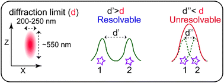
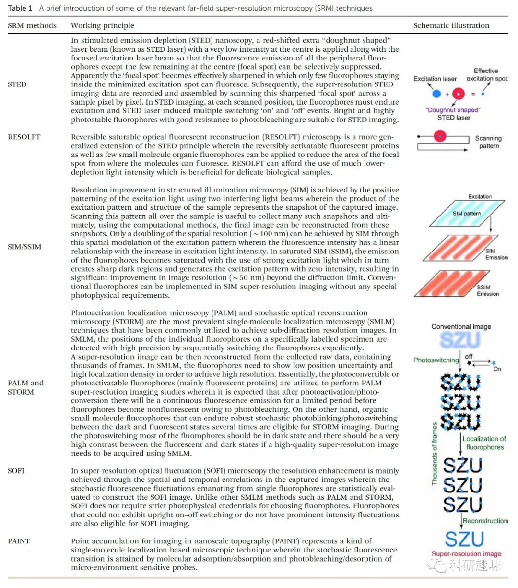
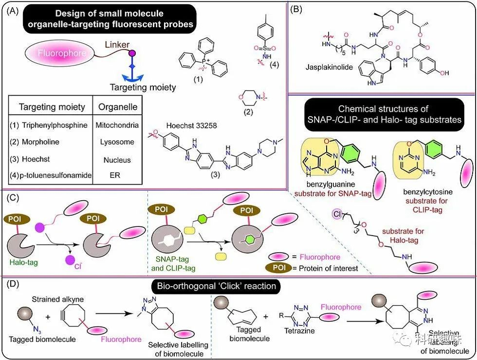
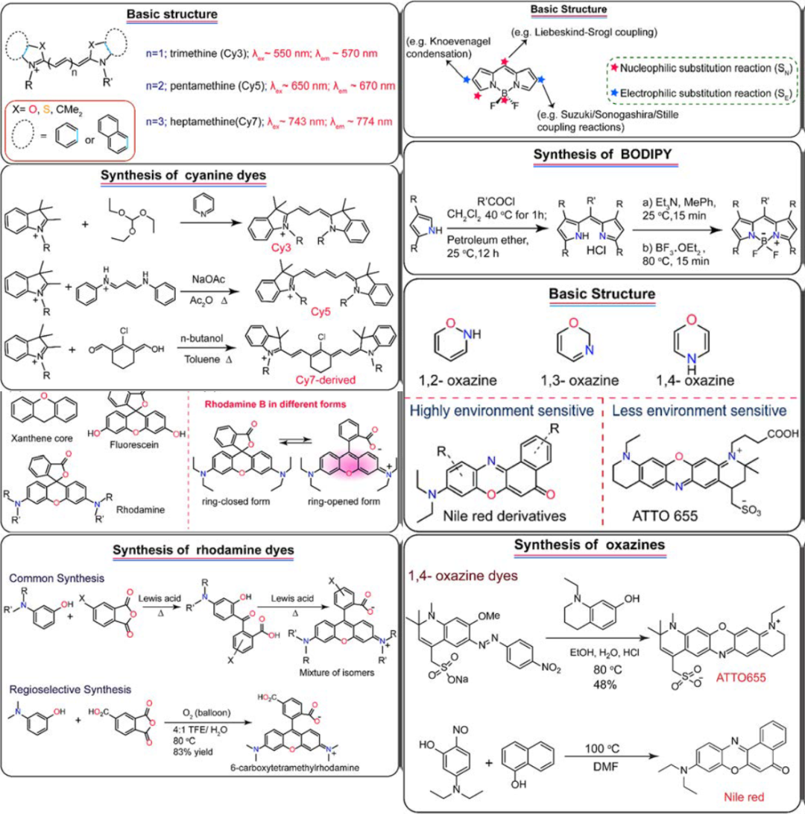
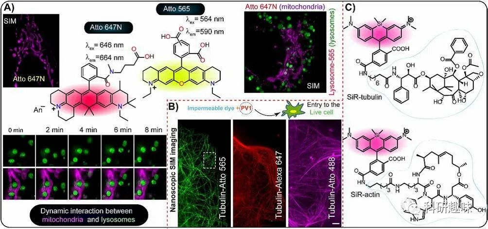

 

#  【Chem.Soc.Rev】深圳大学屈军乐/杨志刚，活细胞超分辨荧光显微成像荧光染料的选择与设计 
 
 原创

Super-Resolution

超分辨

在生物研究领域，超分辨率显微镜（SRM）的发明已经实现了对活细胞中极微细胞结构及其功能的纳米级可视化，超越了传统的衍射极限。这一突破为高级生物医学研究提供了新的可能性，使我们能够以前所未有的分辨率和清晰度揭示亚细胞水平上生理紊乱的复杂未知细节。然而，大多数SRM技术都高度依赖于荧光团（荧光标记物）的特性，这些荧光团需要根据具体应用进行定制。到目前为止，由于氧杂蒽类化合物、花菁类化合物、噁嗪类化合物和BODIPY等核心结构出色的光物理特性并易于合成的特性，他们已被广泛用于有机荧光探针设计的基本荧光团单元。这篇综述文章不仅全面讨论了基于这四种重要荧光团单元的超分辨率显微镜技术中荧光探针方面的发展，特别强调了它们如何有效地融入活细胞超分辨率生物成像应用，还对每种荧光染料核心的背景进行了批判性评估，以突出它们在开发用于SRM的新型荧光探针时的优点和缺点。

衍射极限及超分辨成像技术

传统光学显微镜受到光学衍射极限的制约，无法实现在横向方向上超过约200纳米的空间分辨率。这一衍射极限是由Ernst Abbe于1873年提出的，可用以下公式表示：d ≈ λ/2NA，其中d代表空间分辨率，λ表示光的波长，NA表示显微镜物镜的数值孔径。根据这个公式，由于光的衍射效应，距离d以外的物体无法被单独分辨，而会呈现为模糊的单一图像（见方案1）。因此，在传统荧光显微镜中，最佳的空间分辨率受到光的衍射效应的限制，这意味着无法分辨距离超过200-250纳米的物体。

虽然电子显微镜和原子力显微镜可以显著提高空间分辨率，但这些显微方法并不十分适合用于活细胞成像应用。因此，多年来，研究人员一直在探索多种新策略来突破衍射极限。一般而言，成功规避衍射极限的方法可以分为两种类型：

(a) 近场扫描光学显微镜（NSOM）：这种方法涉及在样品和探测器之间非常接近的距离内收集光信号，从而允许实现超越衍射极限的分辨率。NSOM使用探测器的尖端与样品之间的相互作用来获取信息。

(b) 远场超分辨率显微镜：这种方法采用各种技术和荧光标记策略，可以实现在远场条件下超越衍射极限的分辨率。这包括诸STED、STORM、SIM等方法，它们使用特殊的激光模式或光学构图来获得更高的分辨率。

这些方法的发展使得我们能够在活细胞中观察和研究更细微的结构和过程，为生物学研究提供了强大的工具。

影响超分辨成像效果的因素

在各种SRM技术（STED、RESOLFT、STORM和PALM方法）中，都引入了某种切换机制，以最小化发射信号的体积。对于SMLM（STORM和PALM），这可以通过荧光团在荧光态和非荧光态（暗态）之间的光开关来实现。而在STED中，则使用一束额外的激光（STED激光）来抑制焦外荧光团的信号。尽管如此，荧光信号在开/关之间的转换效率在决定荧光团是否能成功用于特定SRM研究中发挥重要作用。一些关键参数包括占空比、对比度、切换周期数、每次切换的光子数以及荧光团的关键特性，如光稳定性、亮度、消光系数、激发/发射波长和荧光量子产率，它们在很大程度上影响了超分辨率成像实验的效果。作者详细介绍了每个影响因素对成像结果的影响及如何利用这些特性提升成像效果。

活细胞成像的几大要素

荧光探针的生物相容性和细胞穿透性是任何成功的生物成像实验所必需的两个基本要素。荧光探针应具有最小的细胞毒性，并表现出良好的细胞穿透性，以便专门用于活细胞成像研究。荧光探针的特定定位是生物成像实验成功的另一个重要要求。荧光标记/染色的稳定性决定了整体成像效果。在深入探讨生物学洞察力时，有针对性地染色活细胞内感兴趣的区域是至关重要的。作者在这一部分深入讨论了影响活细胞超分辨成像的几个注意事项，并给出了自己的建议。

荧光探针的光稳定性和亮度是另外两个直接影响生物样本荧光成像研究的重要因素。高度光稳定的探针，亮度好，背景信号最小，可以在细胞环境中停留更长时间，通常是改善成像体验的首选。在这种情况下，基于小分子的有机荧光探针，在近红外（NIR）区域的激发/发射表现出卓越性能，因为它们不仅确保较少的光散射和更深的组织穿透性，还提供更高的对比度和背景比例（生物样本的自发荧光最低）。

适合进行超分辨荧光成像的荧光材料

作者在全面介绍四种常见染料在超分辨荧光成像中的应用之前，首先介绍了这些荧光团系统的基本化学、光物理和光谱特性，包括结构特征、合成要点、重要理化特性、光物理特性及生物成像能力，特别的，作者还对每种荧光材料的一些局限性继续了阐述。

**05**

超分辨成像的应用

接下来，作者使用最大的篇幅依次介绍了氧杂蒽类化合物、花菁类化合物、噁嗪类化合物和BODIPY为核心结构的化合物在超分辨成像技术中的各种应用，此外，还对一些不常用于超分辨荧光成像的材料如香豆素和芘等、近年来发展的聚集诱导发光材料、基于磷化物的荧光材料、基于螺吡喃的荧光材料、基于 1,2-二噻吩的荧光材料等做了介绍，同时也介绍了一些新兴的超分辨显微成像技术如膨胀显微成像技术（ExM）等。

**06**

总结

超分辨率显微镜（SRM）技术的进步使我们能够以前所未有的分辨率研究生物结构和细胞内过程，打开了全新的窗口。但在纳米级别的生物成像中，选择合适的荧光探针至关重要，而这些探针需要满足生物相容性、光稳定性和亮度等要求。这篇综述深入探讨了四种关键荧光团构件（呫吨、氰基、噁嗪和BODIPY）在超分辨率成像中的应用，以及它们的优劣势。还讨论了一些结构改动，如在近红外区域激发/发射、提高荧光量子产率和改善光稳定性，以提高荧光探针性能。未来，SRM方法有望在生物医学研究中取得更多突破，尤其是在研究COVID-19和癌症等重大疾病的治疗方面。此外，SRM技术还有望应用于材料科学，以获得纳米级别的结构和损伤信息。这一领域的未来发展将依赖于技术进步和新的标记策略。

Samanta, Soham, Kaitao Lai, Feihu Wu, Yingchao Liu, Songtao Cai, Xusan Yang, Junle Qu, and Zhigang Yang. “Xanthene, Cyanine, Oxazine and BODIPY: The Four Pillars of the Fluorophore Empire for Super-Resolution Bioimaging.” *Chem. Soc. Rev.*, 2023. https://doi.org/10.1039/D2CS00905F.

**关注并回复文章DOI获取全文：**
  
10.1039/D2CS00905F

[【Chem. Soc. Rev】超全的方法总结教你怎么把可见光荧光材料转换成近红外](http://mp.weixin.qq.com/s?__biz=MzkzOTI1OTMwNg==&amp;mid=2247484264&amp;idx=1&amp;sn=5e856045fbd75648a389d7e7258b58fb&amp;chksm=c2f2e7adf5856ebb91e48cd529d688af4b90dd3e9f8928f171dd883801ec9a8b08b5deb8c333&amp;scene=21#wechat_redirect)

[【Adv. Mater.】"背"上细菌不仅能促进M1型转变，还能重新极化肿瘤相关巨噬细胞](http://mp.weixin.qq.com/s?__biz=MzkzOTI1OTMwNg==&amp;mid=2247484219&amp;idx=1&amp;sn=ce0071d60c05faaa726917b535fd3359&amp;chksm=c2f2e7fef5856ee8679fe4281cd8de03747756f4be8d8d3a0a4ab545aaac9f27446fd86420bf&amp;scene=21#wechat_redirect)

[【Angew】定点开启，无毒副作用的光敏剂设计新方法](http://mp.weixin.qq.com/s?__biz=MzkzOTI1OTMwNg==&amp;mid=2247484193&amp;idx=1&amp;sn=0f1905dd02260722dbb84b9bac54e187&amp;chksm=c2f2e7e4f5856ef2f93a30a066edb3f5ee57744b277b59becb2084ec05cfe58b4250a6420c0d&amp;scene=21#wechat_redirect)

预览时标签不可点

素材来源官方媒体/网络新闻

  继续滑动看下一个 

 轻触阅读原文 

    

