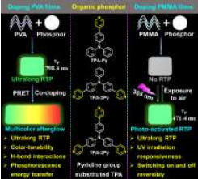
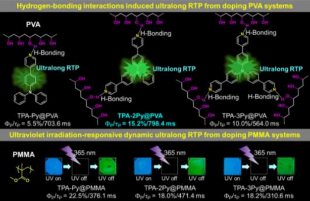
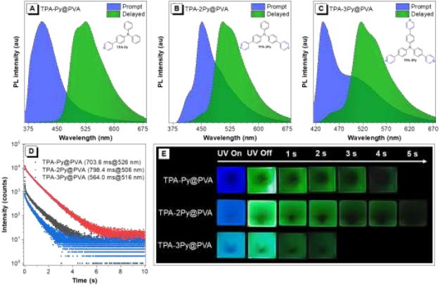
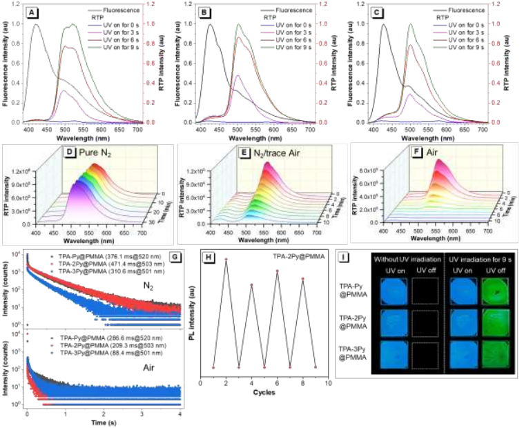
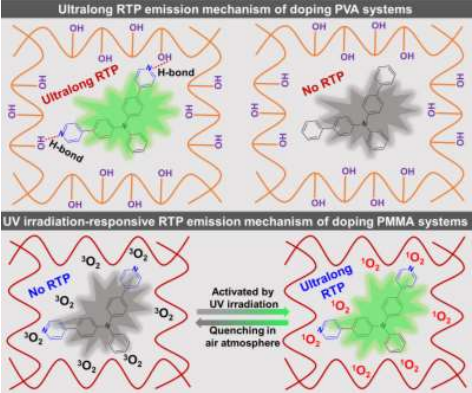
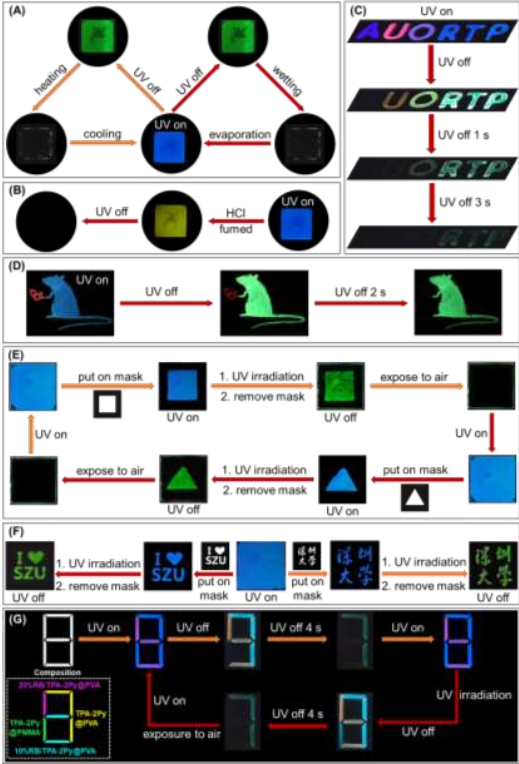

 

#  文章精读-可调有机余辉和紫外辐射响应超长室温磷光 
 

Room-Temperature Phosphorescence

室温磷光

具有超长室温磷光（RTP）特性的无定形聚合物具有非常广泛的应用前景。作者通过将吡啶取代的三苯胺衍生物嵌入聚乙烯醇（PVA）和聚甲基丙烯酸甲酯（PMMA）聚合物中，实现了一系列具有超长寿命、多色余辉和可逆响应紫外辐射的聚合物基RTP材料。

①

【 摘要 】

具有超长室温磷光（RTP）特性的无定形聚合物具有非常广泛的应用前景。作者通过将吡啶取代的三苯胺衍生物嵌入聚乙烯醇（PVA）和聚甲基丙烯酸甲酯（PMMA）聚合物中，实现了一系列具有超长寿命、多色余辉和可逆响应紫外辐射的聚合物基RTP材料。

②

【现象】

作者首先对三种材料的光物理特性做了详尽的研究，三种小分子在稀溶液或者固态都没有明显的荧光，但是当它们被参杂到聚合物中后，这些分子的光物理性质便会发生改变。一方面，将这些小分子掺入PVA基质中后，肉眼可以观察到持续几秒钟的亮绿色余辉，其中TPA-2Py@PVA表现出最佳的RTP特性，具有798.4毫秒的超长寿命和15.2％的高磷光量子产率。另一方面，在将这些小分子掺入PMMA基质中后，肉眼无法观察到明显的余辉。然而，在连续紫外线辐照下，可以激活几秒钟的亮绿色余辉，表明掺杂PMMA体系具有光激活的RTP特性。

③

【机理】

为了阐释这两种不同的现象，作者首先对这两个系列的材料进行了详细的光物理性质的表征，首先，所有小分子在稀溶液和超低参杂浓度下都具有磷光特性，这表明PVA和PMMA系统的超长RTP特性可以归因于这些小分子固有的超长单分子磷光，其次，在将吡啶基团改为苯基后，具有内在超长低温磷光的化合物（TPA-2Ph）在掺入PVA基体后没有显示出RTP，这说明吡啶基团和PVA基体之间的氢键相互作用对实现超长RTP特性的提供了关键帮助，而TPA-2Ph嵌入PMMA后其RTP特性也可以通过连续的紫外线照射激活，进一步说明了三线态氧对整个系统RTP性质的影响。

④

【 应用 】

基于这两种材料可调控的有机余辉和紫外线照射响应的超长RTP特性，作者将其应用到了高级防伪和信息加密中。

Xiong, S., Xiong, Y., Wang, D., Pan, Y., Chen, K., Zhao, Z., Wang, D. and Tang, B.Z. (2023), Achieving Tunable Organic Afterglow and UV Irradiation-Responsive Ultralong Room-Temperature Phosphorescence from Pyridine-Substituted Triphenylamine Derivatives. Adv. Mater.. Accepted Author Manuscript 2301874. https://doi.org/10.1002/adma.202301874

预览时标签不可点

  继续滑动看下一个 

 轻触阅读原文 

    

