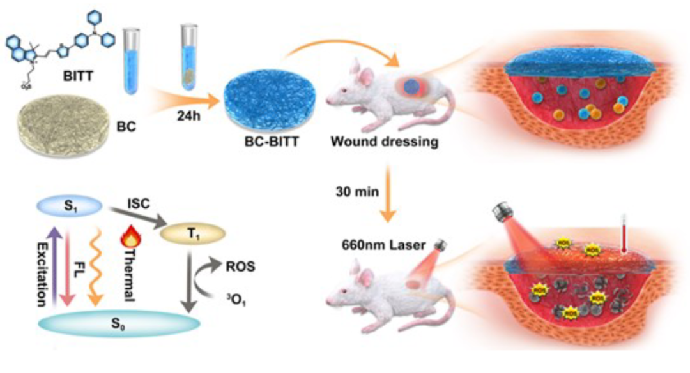
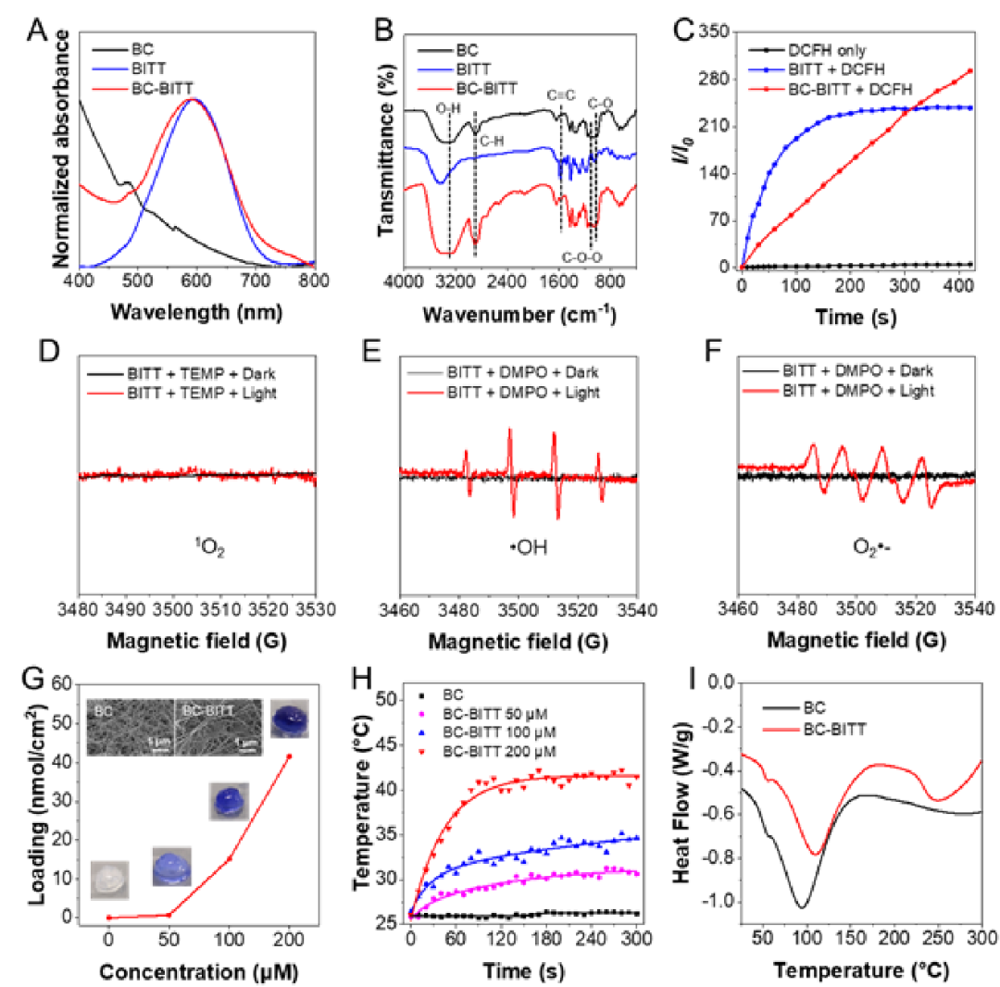
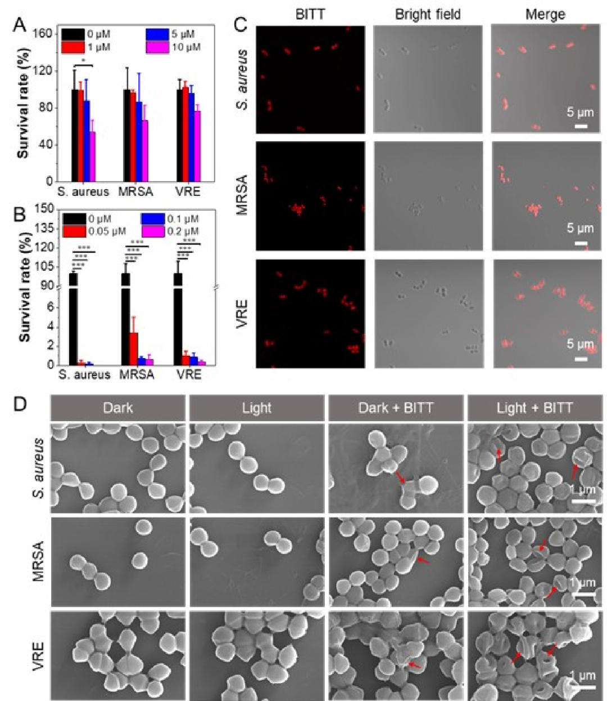
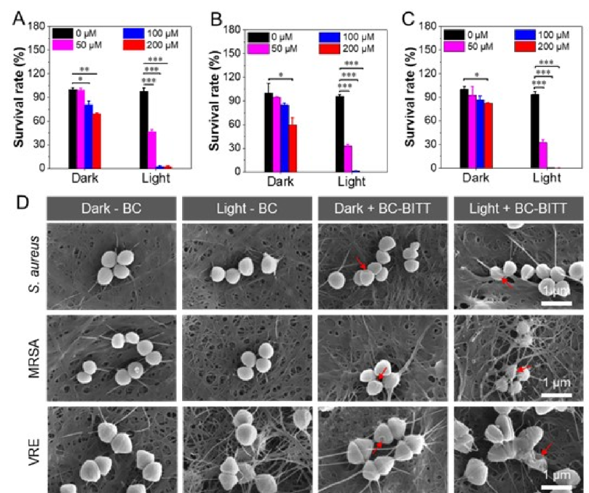
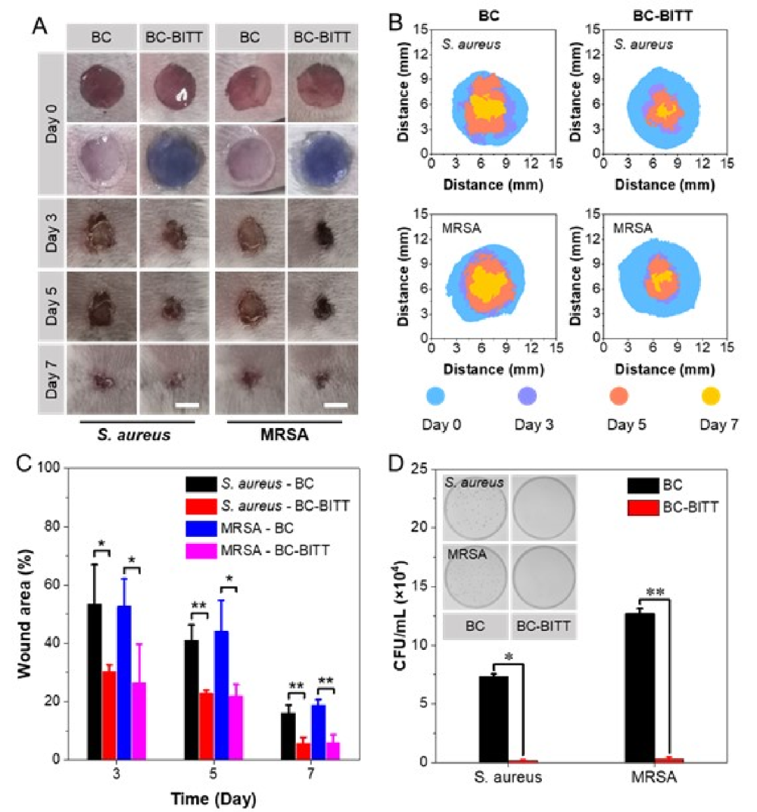
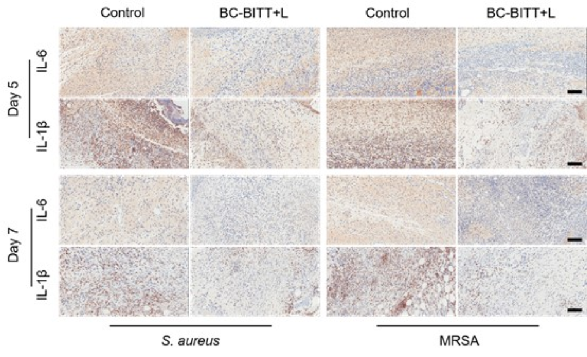

 

#  【Adv. Healthcare Mater.】细菌纤维素的可视化和耐药菌的消除 
 
 原创

Multidrug resistant (MDR) bacteria

耐药菌

在全球范围内，由病原菌引起的伤口感染的高发病率和死亡率已成为公共卫生的主要威胁。虽然抗生素在预防细菌感染方面发挥了重要作用，但预防性抗生素药物的使用不可避免地增加了多重耐药（MDR）或极耐药（XDR）病原菌的出现。根据世界卫生组织（WHO）的统计，近80%的MDR或XDR微生物是由于全球范围内过度使用或滥用抗生素造成的。

①

【**原理** 】

在这篇研究中，作者合成了具有AIE特性的荧光分子（BITT），并将其作为掺杂物，通过溶液浸泡法制备了基于BC的具有PDT和PTT协同抗菌作用的伤口敷料（BC-BITT）。BC-BITT保留了BC的透湿性和透气性，具有良好的抗菌效果。在660nm激光照射下，BC-BITT可以产生大量的ROS，对杀灭细菌起主导作用，同时，BC-BITT表现出一定的光热转换性能，对杀灭细菌起辅助作用。

图1.BC-BITT复合材料的制备和应用示意图

②

**【材料制备及表征】**

BC-BITT复合材料是通过溶液浸渍法制备的（图1）。这种方法不仅可以利用BC的高孔隙率，而且可以通过改变BITT溶液的浓度来控制BITT的负载率。如图2A所示，纯BC在400~800nm处没有明显的吸收峰，而BC-BITT复合材料和BITT溶液（在乙醇中）在595nm处有一个强烈的吸收峰，并且随着BITT浓度的增加，峰的强度也在增加。此外，BITT制备成复合材料之后并没有改变其荧光性质（最大发射波长在800 nm）。

在确定了BC-BITT的结构后，作者测试了其ROS产生能力，结果表明在660nm激光照射下（0.3W cm-2），用DCFH-DA作为指示剂，BC-BITT复合材料比BITT产生更多的ROS（图2C），并且随着BITT浓度的增加，总ROS的数量也增加。尽管BITT在产生总ROS方面优于商业光敏剂氯铵e6（Ce6）但作者更希望知道哪些类型的ROS在杀死细菌方面发挥更主要的作用。因此他们使用不同的指示剂分别验证了BITT产生O2•-、1O2和•OH的能力。结果表明BITT的O2•-和•OH的产生能力高于Ce6。此外，作者使用电子自旋共振（ESR）进一步确认了BITT产生ROS的能力，在白光照射下，对于BITT，O2•-和•OH的特征ESR信号（Figure 2E，F）与其在黑暗中相比显示出大幅增加，而1O2的信号在光或黑暗中均未显示出明显的峰值变化（Figure 2D）。

接着，作者验证了BC-BITT的光热性能，含有不同浓度BITT的BC-BITT材料在光照后其温度在短时间内都会迅速上升，而且温度随BITT浓度的增加而增加，当浓度为200μM时，5分钟内温度可达到约42℃（图2H）。

此外，BC-BITT作为伤口敷料，其热稳定性也是非常重要的。作者通过差示扫描热量计（DSC）和差示热重分析（DTG）研究了BC和BC-BITT的热稳定性能。结果表明，BC-BITT的热稳定性非常好，熔点高达109℃，高于BC的熔点（图2I）。BC-BITT的热分解温度也很高，完全满足普通应用的要求。

图2.A）BC、BITT溶液和BC-BITT的吸收光谱。B）BC、BITT和BC-BITT的FTIR光谱。C) 以DCFH-DA为指示剂，激光照射（660nm，0.3W cm-2）时BITT（1μM）和BC-BITT（200μM，1cm2）产生的ROS能力。D）1O2、E）-OH和F）O2的ESR信号。G）单位面积BC上BITT含量。H）BC-BITT在激光下的光热转换行为。I）BC和BC-BITT的差示扫描量热曲线。

③

**【体外抗菌性能】**

在确定了材料的基本性质后，作者通过平板计数法验证了BITT对细菌的抗菌效果，在没有激光照射的情况下，实验组的杀菌效果与对照组相比没有明显的变化（图3A），然而，在激光照射下（660nm，0.3W cm-2），BITT对三种革兰氏阳性细菌的抗菌效果超过99%（图3B）。为了进一步探索BITT对细菌的杀伤机制，作者对细菌进行了染色和扫描电子显微镜（SEM）表征，与黑暗组相比，激光照射下的细菌膜受到了严重的破坏（图3D），这表明，BITT会在光照下产生大量的ROS破坏细菌的膜结构以达到杀死细菌的效果。而制成纤维材料的BC-BITT也同样保留了BITT的抗菌能力（图4）。

图3.在A）黑暗或B）激光照射（660nm，0.3W cm-2）10分钟后，三种细菌的存活率（n = 3）。C) 用5μM的BITT培养30分钟后细菌的CLSM图像。D) 三种细菌的的SEM图像。

图4. 不同浓度的BC-BITT复合材料对A）金黄色葡萄球菌、B）MRSA和C）VRE在黑暗中或激光照射（660纳米，0.3瓦厘米）10分钟后的抗菌率。D) 金黄色葡萄球菌、MRSA和VRE与BC-BITT复合材料在黑暗中或在激光照射（660 nm, 0.3 W cm-2）10分钟后的形态的SEM图像。

④

**【 体内抗菌效果 】**

基于BC-BITT复合材料的体外实验结果，作者使用小鼠感染性伤口模型对BC-BITT复合材料作为伤口敷料的愈合效果进行了评估。激光治疗后，不同实验组小鼠在第3、5、7天的伤口如图5A所示。与BC组相比，BC-BITT复合材料的伤口明显变小，在第7天基本愈合。图5B是不同实验组在不同时间点的伤口图像的叠加，图5C是不同时间点的伤口面积的统计图。这两张图清楚地表明，无论对金黄色葡萄球菌还是MRSA感染的小鼠，BC-BITT复合材料的伤口愈合都比BC快。此外，作者还通过组织包被计算了伤口感染的细菌数量。如图5D所示，在第7天，BC-BITT复合材料组的细菌数量比BC组少几个数量级。而整个实验过程中小鼠体重都没有明显的下降。这也证明了BC-BITT复合材料对生物体的毒性是非常小的。

图5. A）BC-BITT复合材料治疗小鼠金黄色葡萄球菌和MRSA感染伤口。B) 四个小组7天内的伤口面积示意图。C）不同时间点的伤口面积的统计分析。D) 第七天伤口上的菌落数量

⑤

**【 抗炎效果 】**

伤口细菌感染通常会引起炎症，这也是影响伤口愈合速度的的一个重要因素。因此，为了评估BC-BITT在细菌感染伤口愈合过程中预防感染和减少炎症的作用，作者通过免疫组化法评估了小鼠第5天和第7天伤口部位两种典型促炎症因子（IL-6和IL-1β）的表达量。如图6所示，BC-BITT组在第5天表达了少量的两种促炎因子，而在空白对照组可以看到大量的棕黄色区域，表明对照组的两种炎症因子水平较高，炎症较为明显。

图6.第5天和第7天再生组织中IL-1β和IL-6的免疫组化染色图像。

⑥

**【 结论 】**

综上所述，作者通过溶液浸渍法开发了一种新型的伤口敷料BC-BITT复合材料，它具有光动力和光热疗法的协同抗菌作用，可以促进伤口愈合。用BC装饰AIE分子BITT，不仅保留了BC的保湿度、透气性和良好的生物相容性等优点，还赋予了BC良好的抗菌效果。在660nm激光的照射下，BC-BITT复合材料通过均匀、持续地产生ROS和释放热量，实现了光动力和光热的协同抗菌效果。金黄色葡萄球菌、MRSA和VRE的杀菌率都超过了99%。此外，BC-BITT复合材料可以显著减少感染伤口组织中的细菌，加速感染伤口的愈合过程。总的来说，BC-BITT复合材料伤口敷料为治疗感染性伤口提供了一种新的思路和解决方案，在临床伤口管理领域具有很大的潜力。

Shen, Z., Zhu, W., Huang, Y., Zhang, J., Wu, Y., Pan, Y., Yang, G., Wang, D., Li, Y., Tang, B. Z., Visual Multifunctional Aggregation-Induced Emission-Based Bacterial Cellulose for Killing of Multidrug-Resistant Bacteria. Adv. Healthcare Mater. 2023, 2300045. https://doi.org/10.1002/adhm.202300045

http://mp.weixin.qq.com/s?__biz=MzkzOTI1OTMwNg==&amp;mid=2247483762&amp;idx=1&amp;sn=440a62325ac837766d790470b2feb1ad&amp;chksm=c2f2e5b7f5856ca11307adc886208ba8631f4e6d1aff91f790f0ebce02f346d7467e9532211e&amp;scene=21#wechat_redirect[文章精读-阿兹海默症早期标志物检测](http://mp.weixin.qq.com/s?__biz=MzkzOTI1OTMwNg==&amp;mid=2247483762&amp;idx=1&amp;sn=440a62325ac837766d790470b2feb1ad&amp;chksm=c2f2e5b7f5856ca11307adc886208ba8631f4e6d1aff91f790f0ebce02f346d7467e9532211e&amp;scene=21#wechat_redirect)

[文章精读-可调有机余辉和紫外辐射响应超长室温磷光](http://mp.weixin.qq.com/s?__biz=MzkzOTI1OTMwNg==&amp;mid=2247483752&amp;idx=1&amp;sn=618754e0994c3e303b3d0a3163351fd3&amp;chksm=c2f2e5adf5856cbbc5d134e64bff527d9832eb9337aeb75d1e3dadb8273d2ff180eebe24fbd3&amp;scene=21#wechat_redirect)

预览时标签不可点

素材来源官方媒体/网络新闻

  继续滑动看下一个 

 轻触阅读原文 

    

