 

#  【Adv. Mater.】J-聚合物的结构之美：开启NIR-II生物成像新纪元 
 

Grenemal

读完需要

20

全文字数：6200 字

***目录***

**Introduction**

**Strategic Design Inducing the Formation of J-Aggregates**
Steric Hindrance Regulating StrategyElectronic Regulating StrategyIntermolecular Hydrogen Bond Regulating StrategyHydrophilic/Hydrophobic Interaction Regulation StrategyAtom-Programming StrategyAmbient Conditions
**Recent Progress of NIR-II J-Aggregated Sca�olds for Advanced**
BioimagingBODIPYCyanine DyesSquarainePorphyrin DerivativesDiketopyrrolopyrrole (DPP)Benzo[c]thiophene (BT)Quinazolinone Derivates
**Summary and Outlook**

**Introduction**

近红外荧光成像（NIR FI）已在基础研究和潜在临床实践中得到广泛应用。尽管传统的近红外一区FI（650-900 nm）在观察生物组织中的生理或病理系统方面具有显著优势，但由于明显的背景自发荧光、生物组织强烈的光吸收和明显的散射效应，其成像深度不足。而近红外二区（NIR-II，1000-1700 nm）荧光成像技术具有更深的组织穿透、更高的空间分辨率和更敏感的检测能力，在光学成像和光疗领域有着更广泛的应用前景。自从首次将单壁碳纳米管应用于体内NIR-II FI研究以来，越来越多具有理想光学和化学性能的NIR-II荧光团（包括稀土掺杂纳米粒子、无机量子点和金纳米团簇等）被精心合成，并成功用于NIR-II荧光生物成像。

与可能存在潜在慢性毒性的无机纳米材料相比，完全由有机π电子离域分子构成的有机半导体荧光团（OSFs）在构建NIR-II荧光团方面表现出卓越优势，包括可调节的光学光谱、易于修饰、优异的生物相容性和潜在的生物可降解性。例如，在2015年，戴等人设计制备了首个有机半导体小分子NIR-II荧光团，可通过肾脏快速排泄，用于无创前哨淋巴、淋巴管图和脑肿瘤检测。最近，2019年，田等人成功进行了首次在人体中应用商业和临床认可的吲哚菁绿（ICG）进行NIR-II荧光图引导的肝脏肿瘤手术。尽管已经制定了多种构建有机NIR-II荧光团的策略，但其中大多数基于结构修饰，需要复杂的修饰过程，如延长共轭链和建立复杂的结构。这些策略中，前者容易产生π-π堆积和聚集引起的淬灭效应，而后者需要经历冗长而复杂的修饰过程，从而限制了OSFs的合成和应用。因此，有必要专注于设计和开发可行且有效的构建策略，以获得具有理想生物相容性和可忽略慢性生物毒性的高亮度NIR-II OSFs。

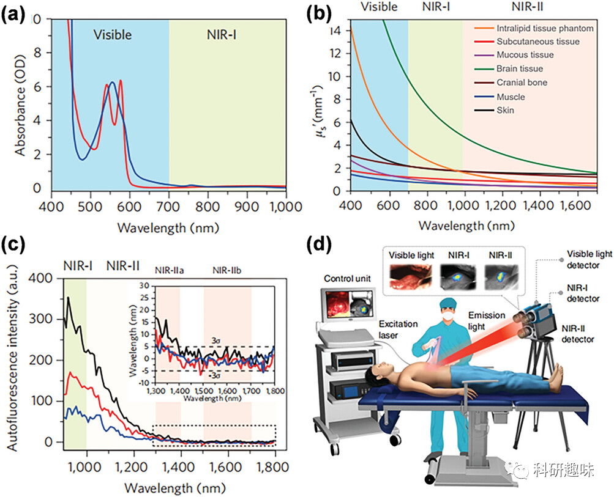
图1. a) 人体血液中氧合血红蛋白（红线）和脱氧血红蛋白（蓝线）的紫外-可见-近红外吸收光谱。b) 不同生物组织在 400 至 1700 nm 范围内的光学散射系数。c) 在 808 纳米光激发下，体外心脏组织（蓝色）、脾脏（红色）和肝脏（黑色）的自发荧光光谱。d) 首例人体 NIR-II FI 的外科肿瘤切除术。

***Strategic Design Inducing the Formation of J-Aggregates***

J-聚集体的形成通常需要分子结构的有序排列。然而，面对面排列的H-聚合比尾-头堆叠更容易形成。为了构建稳定的J-聚集荧光体，我们需要对有序组装结构进行分子调控，以制造头-尾堆叠。

**Steric Hindrance Regulating Strategy**

立体位阻是影响有机化学反应的重要因素，对化合物的性质和有机反应过程起着重要作用。在荧光分子的超分子组装中，如限制单键旋转和分子扭曲等臃肿基团的影响不仅能够增加化合物的稳定性，还能引起分子的聚集行为。

- **Zhao et al.的设计**：Hydroazaacene dicarboximide derivatives通过引入立体位阻策略巧妙设计，显示出J-聚集行为。
- **Hao's group的设计**：Phenanthrene-[b]-fused BODIPY (pf-BDP)通过引入大体积的mesityl单元，巧妙避免不良的H-聚集。
- **Liu et al.的设计**：Meso-[2.2]paracyclophanyl-3,5-bis-N, N-dimethylaminostyrl BODIPY (PCP-BDP2)通过引入大体积的[2,2]paracyclophane段，表现出J-聚集行为和NIR-II荧光发射。
- **Li et al.的设计**：引入三氰基呋喃末端基团，通过合适的对离子，如阳离子（Py）、钠离子（Na）和大体积的磷铵阳离子（Pc），实现分子J-型聚集。
- **Zhang et al.的设计**： 使用新型有机金属纳米平台（PpyPt NPs 4.76），引入具有位阻作用的苯环功能基团，实现高度特异性肿瘤定位的高效氧敏感NIR-II FI技术。

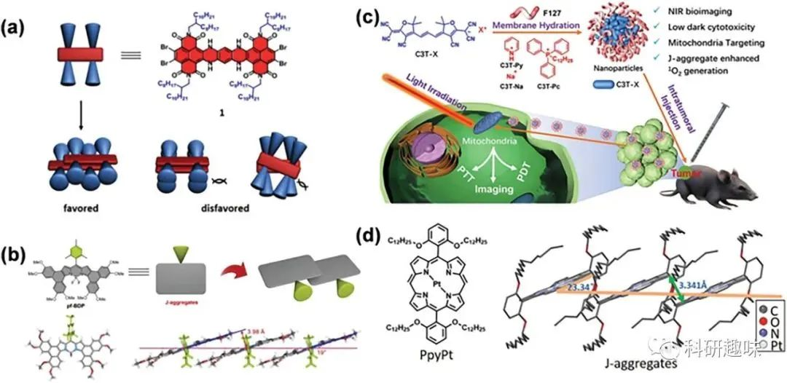
图2. 立体位阻诱导的J-聚集

**Electronic Regulating Strategy**

为了进一步丰富J-聚集策略库，除了考虑分子本身的空间立体化学结构外，还需要进一步探索分子内或分子间的电子效应。推-拉电子效应、偶极-偶极相互作用和静电相互作用是分子之间的主要相互作用机制。分子系统中电子分布的平衡对于设计NIR-II J-聚集物是至关重要的。通过电子调控策略来构建J-聚集分子，我们可以通过促进偶极矩的产生、建立D–A–D结构以及充分利用相反电荷来实现。分子系统中电子的不平衡分布可以有效诱导分子的定向排列，并促使J-聚集物的生成。基于这一原理，越来越多具有出色性能的J-聚集物已经被设计出来。

1.Tang团队的策略： 通过结构异构调控策略，Tang团队提出了一种构建J-聚集NIR-II荧光团的高效策略。

2.Wurthner团队的设计： 基于双激子偶合策略，Wurthner教授团队设计并合成了具有NIR-II发射的J-聚集Bis-SQ荧光团。

3.Guo等人的报道： 通过分子内激子分裂策略，Guo等人报道了一种通过乙烯桥联的aza-BODIPY J-二聚体。

4.Kim等人的设计： 基于静电相互作用，Kim等人设计了一种以肝素为特异性活化探针C10-Py+的BODIPY染料，与肝素结合时表现出J-聚集行为。

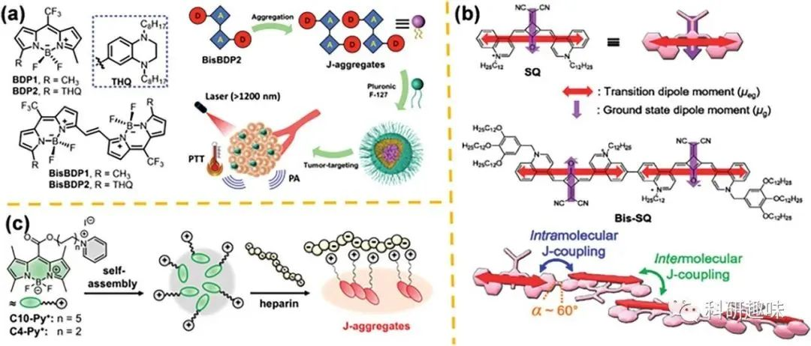
图3. 电子效应诱导的J-聚集

**Intermolecular Hydrogen Bond Regulating Strategy**

在过去的几十年里，人们对氢键的研究已经非常深入了，作为一种空前结构的调控手段，氢键能够很好的帮助分子形成J-聚集体，此外，氢键在优化有机光学功能分子的化学特性和光物理性能方面也起着至关重要的作用。特别是，分子间氢键的存在可以促使分子形成有序排列。

基于氢键制备的苝酰亚胺（PBIs）的J-聚集物是最典型的例子。由于PBIs骨架的平面苝酐，PBIs易于通过π-π堆积形成不利的H-型聚集体，这严重限制了其实际应用。为了克服这一挑战，Hecht及其同事设计了一种具有特定取代基的PBIs，通过在平面苝酐的湾位引入富电子的双噻吩单元，并将其附着在3,4,5-三(十二烷氧基)苯基基团上，改变了PBIs的聚集行为，并进一步促进了柱状螺旋结构的形成（图4a）。PBIs无取代基的酰胺位置可以进一步促进氢键的形成。
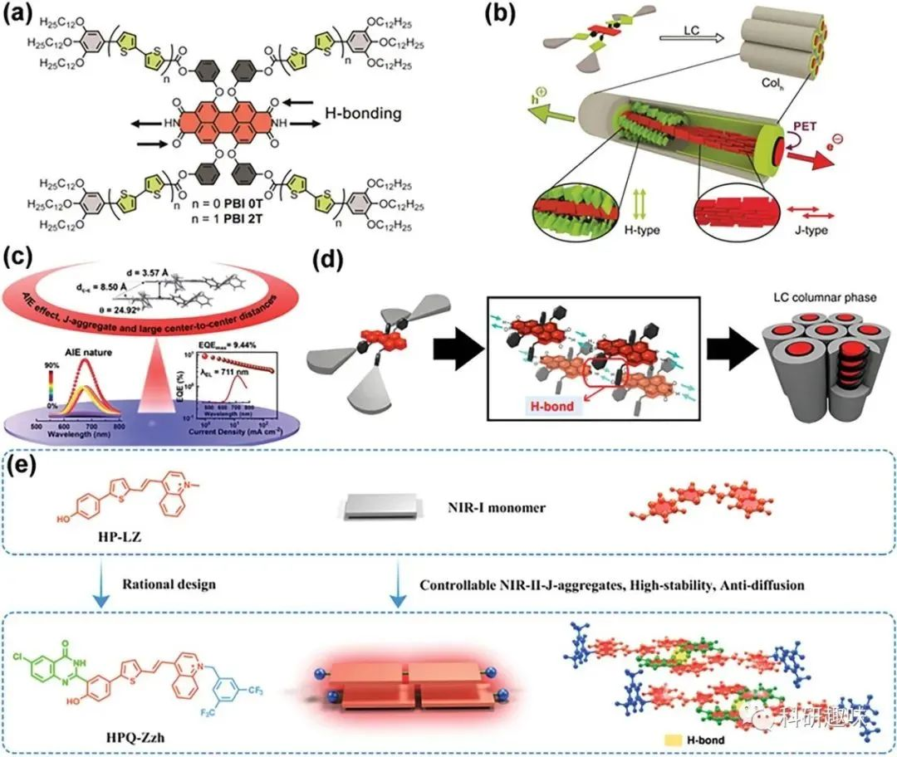
图4. 苝酰亚胺（PBIs）的J-聚集物

**Hydrophilic/Hydrophobic Interaction Regulation Strategy**

分子J-聚集体的亲水/疏水性质通常是一个不可忽视的关键因素。分子的亲水性使它们有可能在不同的介质中有序排列。分子骨架的疏水和亲水部分与周围介质之间的排斥和配位诱导了分子的有序自组装。通过将亲水基团引入疏水分子骨架或将疏水染料置于分子框架中，获得的两性分子可以轻松有效地诱导有序排列。此外，亲水/疏水相互作用可以通过限制分子运动来调节J-聚集物的生成。这是调节J-聚集物制备的一种简单而易行的方法。

最近，李的研究团队精心设计了一种刺激响应的核壳纳米平台，由亲水PEG壳和堆积的BODIPY（BD-PGMe）组成（图5a）。另一个通过两性诱导J-聚集的代表性范例是通过引入两性脂质体。例如，郑等人报道并合成了一种创新的aza-BODIPY-脂质体构建块，然后推动其用于肿瘤的多模态光学成像（图5b）。

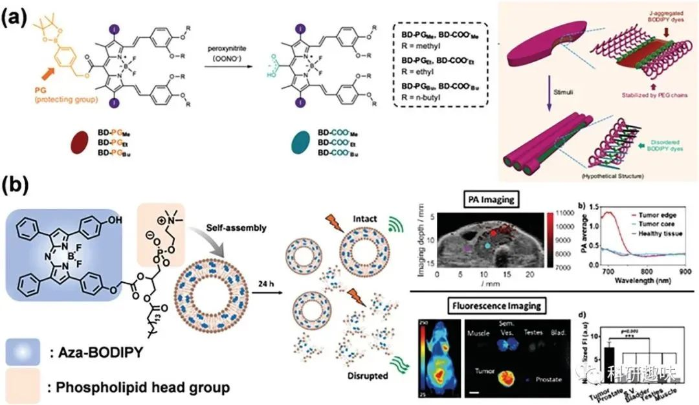
图5. a) 两种 BODIPY 的分子结构以及 J-聚集排列和刺激响应堆叠重排的示意图。b) 用于体内 PAI 和 FI 的 J-aggregated BODIPYsome 纳米粒子的形成。

**Atom-Programming Strategy**

与不可控的外部环境相比，分子结构的修改对于形成稳定的J-聚集体具有更多优势。分子工程中引入特定原子预期通过方向力诱导J-聚集，这种力源于原子间的电负性差异和形成共价键的倾向。例如，卤素键（X─B）具有适度强度和高方向相互作用，已成为实现有序自组装超分子系统的有效推动力。

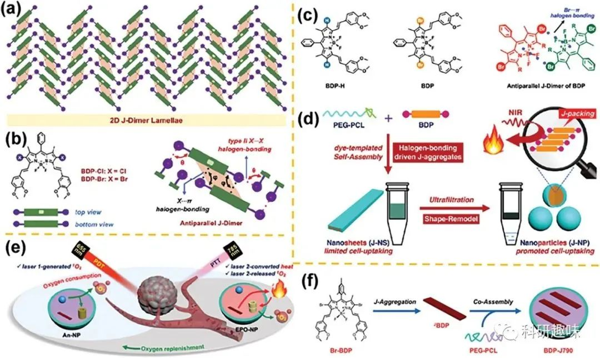
图6. 卤素键诱导的J-聚集

**Ambient Conditions**

除了修改荧光体本身，通过调整分子的外部条件，如温度、无机盐、外部模板调控等，也可以获得J-聚集体。与通过结构优化形成J-聚集体相比，通过环境条件调控实现有序叠加似乎是一种简便而灵活的途径。例如，张的团队最近提出了一种方便的策略，通过对水溶液中的H-聚集形态（FD-H）进行热处理来制备J-聚集的FD-1080（FD-J）（图7）。

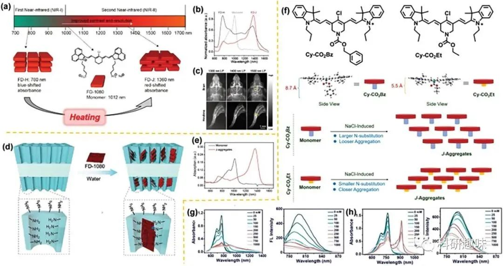
图7. 外部环境诱导的J-聚集

***R*** ***ecent Progress of NIR-II J-Aggregated Scaffolds for Advanced Bioimaging***

在过去的几十年里，学者们已经开发了许多J-聚集体，包括PBIs、BODIPYs、卟啉、方酸染料和花菁染料。然而，大多数报道的J-聚集体发射的信号位于传统的NIR-I或可见光区域。到目前为止，已经成功探索了几种包含BODIPY衍生物、花菁分子、方酸、卟啉衍生物、二酮吡咯吡咯、苯并[c]噻吩和喹唑啉酮衍生物的NIR-II J-聚集染料（方案1和图8）。

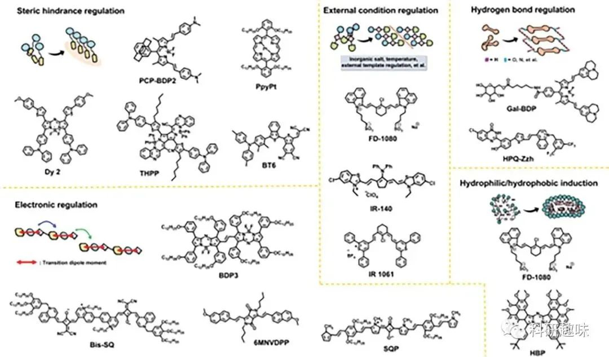
图8. 典型的J-聚集体萤光团。

**BODIPY**

BODIPY是新兴的近红外荧光体之一，具有小的斯托克斯位移、可调吸收/发射波长、灵活的化学修饰、低光漂白和高荧光量子产率（QYs）等优势，在生物医学领域具有多种应用，如生物成像、光动力疗法和光热疗法。迄今为止，已经有大量的研究致力于调整其光学发射和吸收至NIR-II窗口，尤其是通过修改化学结构形成NIR-II聚合物是实现NIR-II成像剂的有效途径。

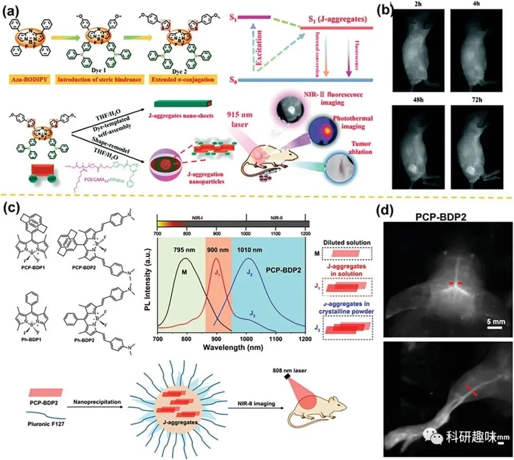
图9. 用于NIR-II成像辅助PTT的J-聚集纳米粒子

双激子耦合策略在J-聚集物的设计中展现出独特的优势。当荧光分子间和分子内跃迁偶极矩处于理想状态时，激子不仅限定在单个分子中，而且在整个荧光分子骨架中离域。通常，聚合物中的光物理性质优于单体，如明显的红移吸收和发射以及优越的光学稳定性。

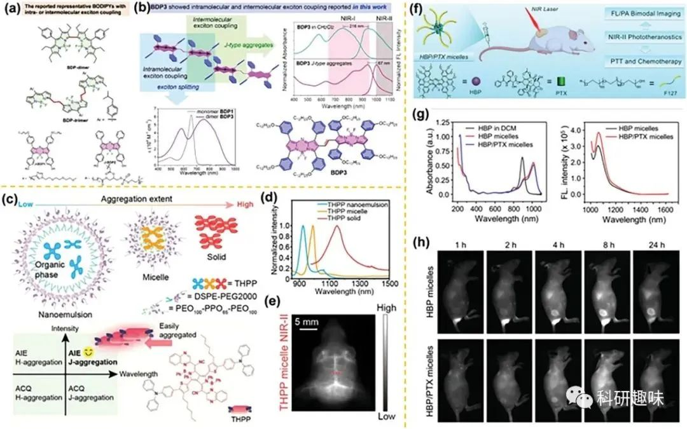
图10. 具有分子激子耦合作用的代表性 BODIPY 衍生物

在体内生物成像中，探索具有理想摩尔消光系数（MEC）和亮度的荧光分子至关重要。对于成像剂，这两个关键参数通常难以同时提高。例如，青菁染料在水溶液中常常表现出高MEC但易于聚集引起的猝灭（ACQ）。对于D–A–D型染料，可以通过引入三苯胺（TPA）等功能基团来避免ACQ，实现聚集诱导发光（AIE），但它们固有的低摩尔消光系数无法通过简单的供体修饰改变。因此，精心设计具有高MEC和卓越亮度的染料具有重要意义。为解决这一挑战，张等人精心设计并制备了一种新型的NIR-II J-聚集AIE荧光分子（THPP），其中融合环二硼二吡咯作为荧光核心，TPA作为AIE效应的功能基团（图10c）。值得注意的是，THPP在J-聚集物中表现出优越的MEC，并增强了发射和吸收，将最大吸收/发射波长显著延伸至970 nm/1010 nm，增强了荧光发射信号（约55倍）（图10d）。此外，稳定而刚性的结构使THPP具有优异的化学稳定性和光稳定性。

鉴于BODIPY在生物环境中的出色光学性能，越来越多的研究致力于构建基于BODIPY的多模态成像平台。如今，光声成像（PAI）和NIR-II荧光成像（FI）。尽管PAI拥有大的信号背景比、深层组织穿透力和时空分辨率，但对于复杂的深层病变，集成的多模态成像技术能够提供更准确的诊断信息。但是，开发一个同时具有NIR-II荧光和吸收的多功能光学纳米平台，对于准确的癌症诊断仍然是一个挑战。BODIPY已经在不同的生物医学应用中得到应用，包括荧光成像（FI）、光动力疗法（PDT）和光热疗法（PTT）。然而，基于BODIPY衍生物的体内NIR-II FI/PA的协同应用鲜有报道。近期，冯等研究团队精心设计并构建了一种环-融合的Aza BODIPY衍生物（HBP），具有NIR-II发射和NIR-I吸收，实现了NIR-II FI/PA的一体化。

**Cyanine Dyes**

在J-聚集领域，花菁染料也被视为实现长波长分子组装的分子支架。典型的花菁染料由共轭甲烷链和两个带有可控光学和物理性能的杂环基团组成，具有如吸收波长、荧光强度、光稳定性和溶解性等优势。迄今为止，花菁染料已广泛应用于生物医学中，但调控它们的聚集排列仍然是一个严峻的挑战。花菁分子通常在极性溶剂中具有明显的聚集倾向，这归因于染料分子之间的分子间π–π堆积效应和花菁主体之间的静电相互作用。
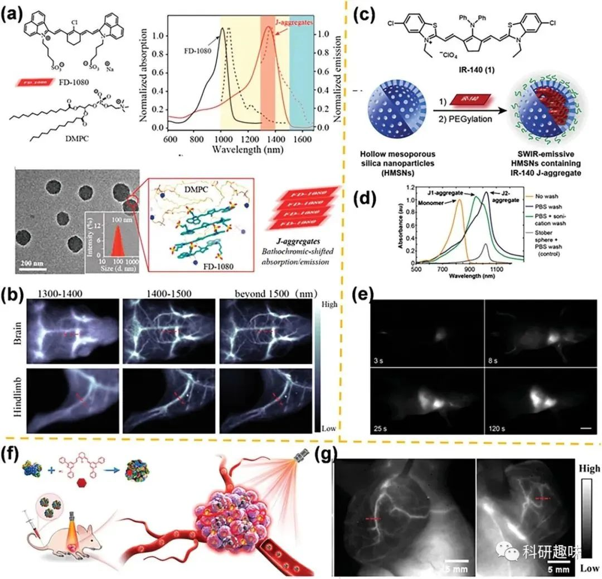
图11. 花菁类染料的J-聚集

**Squaraine**

探索新型的J-聚集支架对于拓展NIR-II分子库具有重要意义。作为一种光电分子，方酸及其衍生物已被应用于开发长波长荧光物质。方酸具有典型的中心缺电子四元环（A）和两个电子给体基团（D）在两侧，呈现出具有分子内D-A-D电荷系统的独特结构。由于固有的大π共轭系统，方酸染料在500至900纳米范围内表现出卓越的吸收特性。由于方酸染料之间存在强烈的范德瓦尔斯力和π-π相互作用，它们还具有强烈的聚集性能，倾向于在外部环境的影响下形成J-聚集体和H-聚集体。到目前为止，由于易于合成和良好的光物理性质（例如NIR吸收、理想的长波长发射、高摩尔吸收系数和强光稳定性），方酸衍生物已广泛应用于许多领域，如太阳能电池、发光二极管和生物医学。

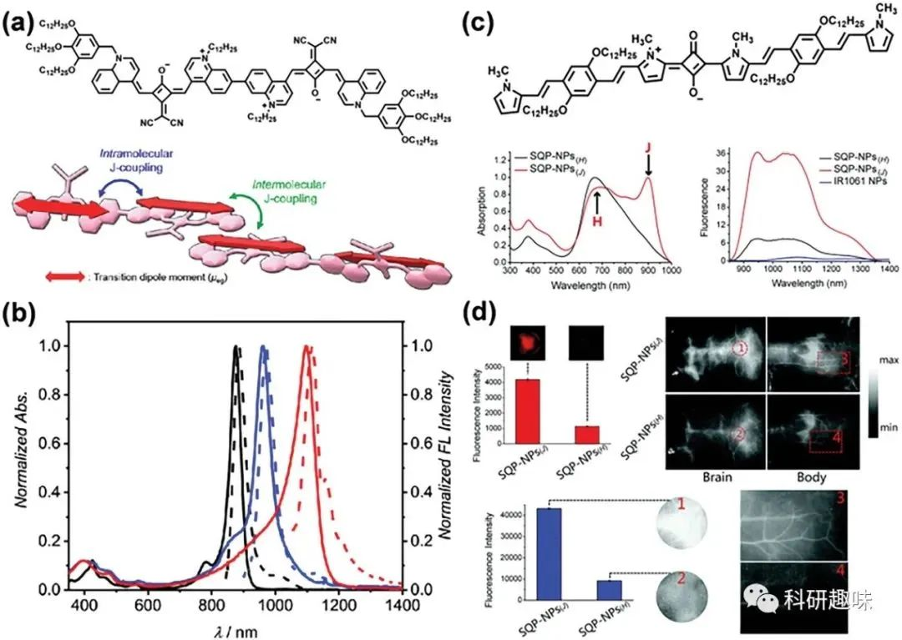
图12. 基于方酸的J-聚集体

**Porphyrin Derivatives**

与广泛开发的NIR-II J-聚集BODIPY和花菁染料相比，卟啉衍生物在实现长波长J-聚集方面的研究较少。卟啉衍生物是一种具有良好光学性能的大π-共轭体系。当卟啉的π-共轭体系得到进一步扩展时，其发射波长可以推向更长的窗口。由于其固有的π-共轭结构，卟啉衍生物表现出独特的光物理和电化学性质。然而，卟啉衍生物存在一些缺陷，如有限的选择性、在NIR区域的弱吸收/发射以及超疏水性，这些都制约了其在临床应用中的进一步应用。因此，通过合理设计长波长的卟啉分子对拓宽其生物应用至关重要。2022年，Li等人设计并制备了一种基于卟啉核的D–A骨架（P-PPor）和PBI的共轭聚合物。然而，由于ACQ效应，制备的P-PPor基纳米颗粒（PPor NPs）显示出荧光猝灭，限制了NIR-II荧光应用。相反，Zeng的研究小组设计并制备了一种两性小分子NIR-II卟啉荧光体（PPor），通过自组装在水溶液中，PPor NPs呈现70%的PCE和NIR-II荧光能力，因此实现了NIR-II FI引导的PTT。
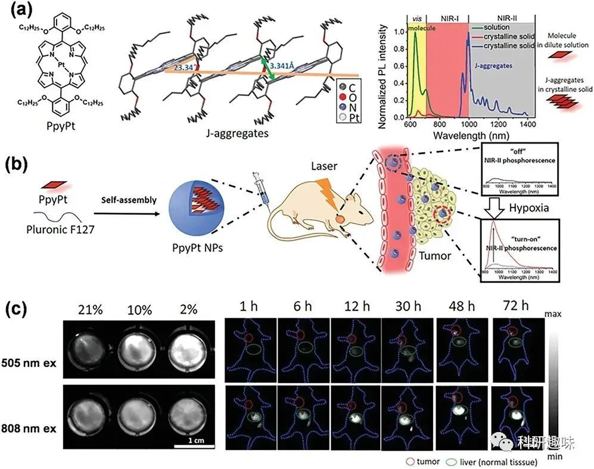
图13. 基于卟啉衍生物的J-聚集体

**Diketopyrrolopyrrole (DPP)**

发展新型NIR-II J-聚集物的道路永不停歇。Diketopyrrolopyrrole（DPP）具有刚性平面结构和多个反应位点（C═C，C═O，NH），使其能够通过分子修饰实现NIR-II成像。DPP表现出典型的ACQ效应，在有机溶剂中溶解时显示强荧光强度，而在聚集状态下由于分子内酰胺键、氢键和分子间π-π相互作用而显示弱荧光。通过DPP分子的烷基化，可以减少分子间氢键和π-π堆积，显著提高DPP的荧光效率。同时，由于大的共轭结构和强的电子吸引能力，通过共轭不同电子给体形成D-A结构，DPP衍生物表现出卓越的吸收，并将发射推向NIR区域。由于其强大的电子吸引能力、良好的光热稳定性、高荧光量子产率和易于修饰，DPP单元已广泛用于制备高性能荧光物质。

- **Cheng et al.（2018）**: 构建了基于DPP分子的半导体聚合物纳米探针，最大发射波长为1032 nm，用于体内荧光成像和辅助肿瘤手术。
- **Lu等人**: 成功制备了一种生物相容性良好、在1000 nm以上具有强烈发光的NIR-II小分子DPP-BT-TPA。
- **Tang等人提出的新方法**: 提出了一种“扩大吸收库”的新理念，选择了带有庞大π共轭结构的DPP单元来开发NIR-II荧光体，获得了具有良好PCE（60.4%）和NIR-II QYs（0.1%）的荧光体，发射峰位于1275 nm。

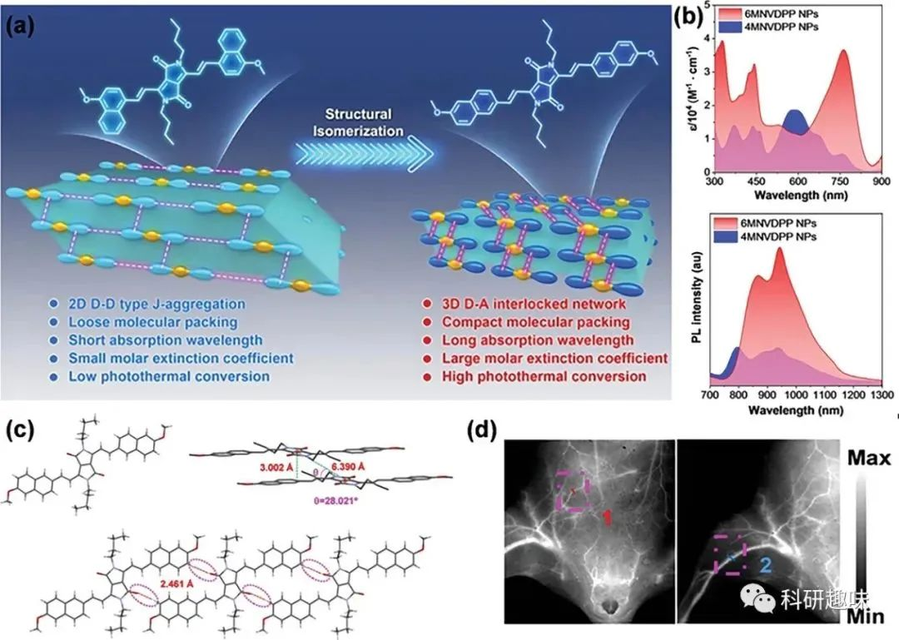
图14. 基于DPP的J-聚集体

Benzo[c]thiophene (BT)

为了进一步探索NIR-II J-聚集物库，学者们广泛研究了苯[c]噻吩（BT）衍生物。BT及其衍生物被证明是一种活跃的药理学单元，具有丰富的生物活性，其衍生物具有药用价值，包括抗微生物、抗癌、抗炎等。

- **唐研究组**: 通过引入苯并[c]噻吩作为构建模块，设计并合成了NIR-AIEgens，命名为TPA-BT-DPTQ。
- **李研究组**: 通过调控分子结构，设计了基于BT衍生物的稳定有机纳米颗粒，用于癌症光动力疗法（PDT）。

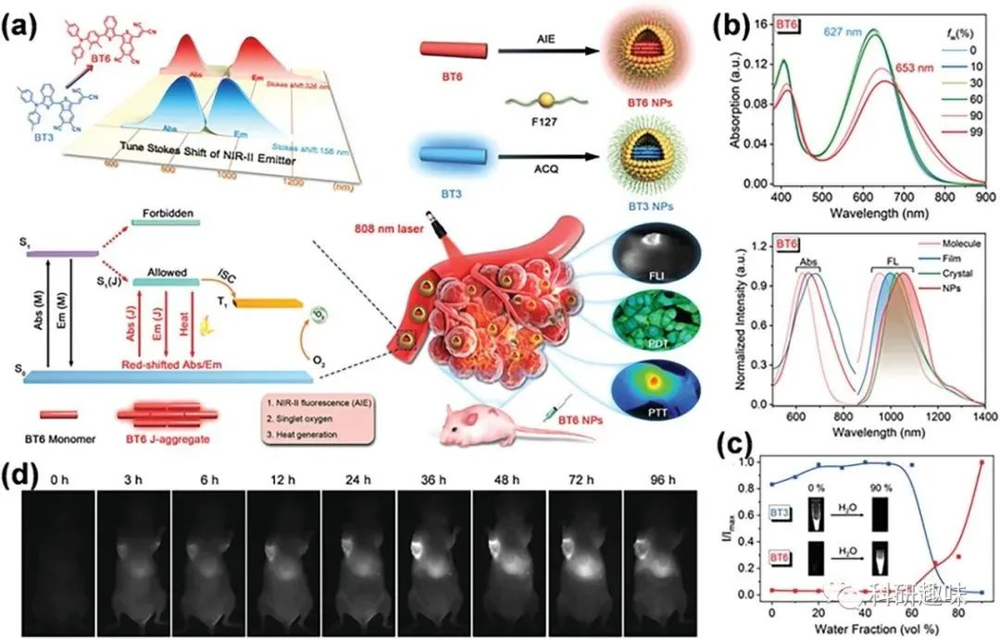

图15. 基于BT的J-聚集体

**Quinazolinone Derivates**

研究表明，J-聚集能够使有机荧光物质有序堆积，形成坚固的纳米聚集体，可以减小生物体内荧光成分的扩散，提升化学稳定性。然而，由于弱的分子间相互作用，传统的J-聚集在生理组织中容易崩解成单体，导致荧光信号稳定性不足，极大地阻碍了其在生物学中的应用。为解决这一问题，人们利用无机介孔硅或两性聚合物载体来维持和保护荧光物质，但这些方法难以构建可激活的J-聚集染料。

相对于传统的“始终开启”的J-聚集荧光探针，可激活的荧光物质在生物标志物刺激下能够改变特定的发射信号，具有特异性。最近，张等人创新性地提出了一种通过有序J-聚集的原位分子自组装方法，制备可激活的NIR-II荧光探针，克服了引入不稳定外源模板的问题。该方法利用喹唑醌衍生物（HPQ）的氢键和π-π相互作用构建智能NIR-II J-聚集体。
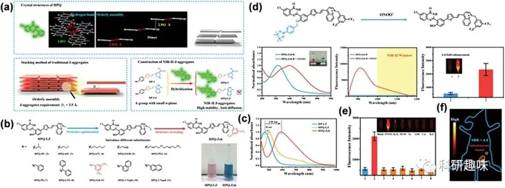
图16. 基于HPQ的J-聚集体

***Summary and Outlook***

鉴于NIR-II成像剂的清晰上升趋势，近年来受到了科学界的广泛关注。NIR-II荧光J-聚集物的出现为设计NIR-II成像剂带来了新的思路，但在荧光效率、发射波长、靶向追踪等方面仍有挑战。

1. 荧光效率：NIR-II J-聚合物显示狭窄发射带，需要通过分子工程策略改善构建块荧光或引入AIE染料以提高效率。
2. 发射波长： 利用NIR-IIb区域（&gt;1500 nm）的NIR-II J-聚合物有望在生物成像中取得更好效果，但当前研究仍面临挑战。
3. 靶向追踪： 实现NIR-II J-聚合物的靶向NIR-II成像对于临床实践具有潜在价值，需要继续研究。
4. 稳定性和生物相容性：NIR-II J-聚合物在生理条件下的结构、生物学和荧光稳定性对准确诊断至关重要。
5. 创新支架和治疗： 探索新型NIR-II J-聚合物支架和多功能NIR-II J-聚合物是当前研究的重点，可实现更为复杂疾病的精确治疗和诊断。
6. 总体而言，NIR-II J-聚合物在NIR-II FI领域有着独特优势，希望通过跨学科合作推动其在临床精准诊疗中的应用。

Hu, X.; Zhu, C.; Sun, F.; Chen, Z.; Zou, J.; Chen, X.; Yang, Z. J‐Aggregation Strategy toward Potentiated NIR‐II Fluorescence Bioimaging of Molecular Fluorophores. *Advanced Materials* **2023**, 2304848. https://doi.org/10.1002/adma.202304848.

**关注并回复文章DOI获取全文：**

**10.1002/adma.202304848**

**点击蓝字 关注我们**

[【Angew】创新硫代方酸荧光探针：突破单分子成像局限，延长光漂白寿命5倍！](http://mp.weixin.qq.com/s?__biz=MzkzOTI1OTMwNg==&amp;mid=2247484851&amp;idx=1&amp;sn=db2dbc72a5b207c591360393ab4e8212&amp;chksm=c2f2e176f5856860dccd2fc87d11b3b01e03ed9cce8d6d69457d7bffab3452e188c041f5a456&amp;scene=21#wechat_redirect)

[【JACS】荧光探针容易光漂白？这篇两张图的顶刊教你提高光稳定性](http://mp.weixin.qq.com/s?__biz=MzkzOTI1OTMwNg==&amp;mid=2247484851&amp;idx=3&amp;sn=43287eed709edc0f67f292e5dfa17fd5&amp;chksm=c2f2e176f5856860093b12a9befdeb07869d671437a46358286efa22fb79c083eb68d5ab90b8&amp;scene=21#wechat_redirect)

[荧光大讲堂第七讲-瞬态荧光](http://mp.weixin.qq.com/s?__biz=MzkzOTI1OTMwNg==&amp;mid=2247484800&amp;idx=1&amp;sn=c352e80abb1b8e009442c4c9456134d4&amp;chksm=c2f2e145f585685383067b54e5b1f3a9d1d5bdfa34ac54a5e33f05dcce32efdb51f5cf6719ab&amp;scene=21#wechat_redirect)

预览时标签不可点

素材来源官方媒体/网络新闻

  继续滑动看下一个 

 轻触阅读原文 

    

