 

#  【Adv. Mater.】基于生物仿生AIE纳米粒子的生物成像和治疗应用：突破性进展与未来挑战 
 

Grenemal

读完需要

40

全文字数 13000 字

**仿生AIE纳米药物**

Bioinspired AIE Nanomedicine

**目录**

ABSTRACT

1. INTRODUCTION

2. BIOMIMETIC AIE NANOMEDICINE CAMOUFLAGED BY BIOACTIVE VEHICLES

2.1. Biomimetic AIE Nanoparticles Camouflaged by Cancer Cells

2.2. Biomimetic AIE Nanoparticles Camouflaged by Dendritic Cells

2.3. Biomimetic AIE Nanoparticles Camouflaged by Natural Killer Cells

2.4. Biomimetic AIE Nanoparticles Camouflaged by Platelet

2.5. Biomimetic AIE Nanoparticles Camouflaged by Neutrophil

2.6. Biomimetic AIE Nanoparticles Camouflaged by Red Blood Cell

2.7. Biomimetic AIE Nanoparticles Camouflaged by Macrophage

2.8. Biomimetic AIE Nanoparticles Camouflaged by Bacteria

3. SUMMARY AND OUTLOOK

## **Abstract**

以高效率的聚集诱导发光（AIE）材料为基石的纳米药物，正在荧光成像与光诊疗技术领域中引领创新潮流。特别值得注意的是仿生物AIE纳米药物，这种药物由AIE发光体和生物相容性载体精心构建而成，其独特的结合方式在近年来呈现出迅猛的发展态势。这一发展的核心驱动力在于其固有的多重优势，包括但不限于出色的生物相容性、较长的体内循环时间、精准的靶向能力、免疫激活潜力以及卓越的光诊疗性能。

鉴于该领域的持续活力与广阔前景，本综述深入探讨了生物仿生AIE纳米医学的基本概念、重要突破及最新发展趋势。同时，基于当前的研究成果，我们也对面临的关键挑战及未来前景进行了详细的讨论与分析。.

**Introduction**

过去数十年间，纳米医学的迅猛发展为纳米技术和医疗领域带来了革命性的变革。然而，尽管纳米生物技术的应用取得了显著进展，治疗剂的有效靶向性仍然是一个亟待解决的关键问题。目前，治疗剂面临的主要挑战包括全身给药时的不当分布，如血液循环中的非特异性分布、网状内皮系统的捕获、免疫清除和组织蓄积，这些均妨碍了最佳靶点的准确识别。

因此，研发安全高效的载体以实现主动或被动靶向给药显得尤为重要。细胞膜涂层技术，作为一种生物启发的策略，已被广泛应用于解决上述问题。这种伪装技术使得人工合成材料能够模拟其亲代细胞的生物界面特性，包括抗原呈递和同源靶向能力，进而增强纳米药物在病变部位的招募和侵入能力，有效清除病原体。

此外，源自细胞膜的生物载体在激活自身免疫系统方面展现出独特优势。由于保留了细胞表面的自身标记，这些载体能够与免疫系统进行交互，介导T细胞的激活和增殖。因此，基于免疫原性细胞死亡（ICD）的免疫疗法被认为是一种重要的综合干预手段，对于重塑免疫抑制微环境、缓解不良肿瘤复发和转移具有重要意义。

人工内核作为纳米药物的核心组成部分，能够保持天然细胞膜的生物活性，具有细胞相互作用活跃、靶向特异性高、血液循环时间长、毒副作用小等显著优势。这些特性不仅提高了治疗效率，还为下一代精准的个性化纳米药物设计开辟了新的途径。

除了合适的载体外，高性能治疗剂在现代医学治疗与研究中同样扮演着决定性的角色。光驱动疗法，特别是光热疗法（PTT）和光动力疗法（PDT），正崭露头角成为非侵入性、空间共定位和即时响应的替代疗法。

光热疗法，作为化疗的无创补充，依赖于光热制剂与特定光激发的结合，诱导局部高温，通过热消融产生治疗效果，并同步产生光声信号，进而实现光声成像（PAI）和光热成像（PTI）。另一光疗分支，光动力疗法，则涉及光敏剂（PS）在光激发下向邻近氧物种的能量或电子转移，其公认机制与产生的细胞毒性活性氧（ROS）诱导的线粒体氧化损伤相关。

光治疗剂以其独特的光子吸收和发射行为，不仅具有潜在的外源性造影剂功能，还能实现高质量的荧光成像（FLI），为组织内部信息的描绘提供可靠工具。为了促进生物成像与光治疗在单一制剂中的互补整合，科研人员正致力于开发适应生理环境的多功能光治疗剂。

传统的有机荧光团在高浓度时易因π-π堆积导致严重光衰减，即聚集诱导淬灭（ACQ）。然而，具有聚集诱导发光（AIE）特性的发光体在生物医学研究中展现出巨大潜力，它们在聚集状态下能发出显著增强的光。这种前所未有的发射基于分子内运动（旋转/振动）限制理论。

与传统的ACQ荧光体相比，AIE发光体（AIEgens）因其出色的光稳定性、高光漂白阈值、大斯托克斯位移、可调的光物理性质以及对任何浓度的极高耐受性，成为生物成像应用的理想选择。此外，聚合态的非辐射热消耗受限，通过系统间交叉途径耗散能量的机会增加，为调节辐射与非辐射能量耗散之间的平衡提供了可能性。

已有研究表明，活跃的分子运动可通过非辐射衰变促进能量耗散。因此，精确控制有机分子的分子运动成为调节能量耗散平衡的关键。在这方面，拥有足够分子转子或振动器的AIEgens展现出在整合FLI、PDT和PTT方面的非凡潜力。简而言之，这些卓越特性使AIEgens能够在同一纳米平台上融合诊断、治疗与预防等多方面功能。.

在此背景下，细胞膜载体与多功能聚集诱导发光材料（AIEgens）的结合，构建了一种生物仿生的纳米药物，这代表了光诊疗学领域的双赢策略。此类纳米药物近年来发展迅速，并已引起全球范围内的广泛关注（方案1）。鉴于AIEgens在推动仿生纳米药物领域的迅猛发展和其重要意义，撰写一篇全面的综述文章以阐述其基本概念、开创性研究、最新动态及未来前景显得尤为重要。在本综述中，我们将通过介绍和探讨在药物传递、临床肿瘤治疗及其他疾病治疗中具有代表性的生物仿生AIE纳米药物，为读者描绘一幅详尽的全景图。我们将深入阐释具备光诊疗功能的AIEgens的设计理念，并系统梳理已应用于遮蔽AIE活性核心的各种细胞类型。接下来，我们将根据该领域的最新突破与趋势，深入探讨生物仿生AIE纳米药物在生物成像、光疗及免疫调节等方面的协同作用，展望至2024年的发展前景。最后，我们将对这一主题的未来展望进行总结。
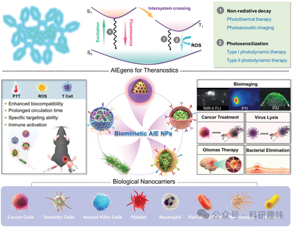
方案1：生物仿生AIE纳米粒子（NPs）在生物成像与光诊疗领域的设计与应用示意图。

**Biomimetic AIE Nanomedicine Camouflaged by Bioactive Vehicles**

在生物启发疗法的设计中，已经应用了多种细胞类型，诸如癌细胞、树突状细胞（DC）、自然杀伤细胞（NK）、中性粒细胞、血小板、红细胞（RBC）、巨噬细胞以及细菌。这些细胞各自具有独特的生物学特性，能够为治疗系统赋予特殊的生物学功能，进而触发广泛的抗原反应并激发强大的抗肿瘤免疫响应。本节将深入探讨和总结AIE纳米粒子（NPs）与源自细胞的生物载体——特别是外泌体以及由细胞膜制备的载体——之间的协同作用，旨在优化治疗效果并显著降低相关副作用。.

Biomimetic AIE Nanoparticles Camouflaged by Cancer Cells

癌细胞因其表面丰富的粘附分子而显著展现出活跃的细胞间同源粘附特性。受癌细胞强大的抗原递呈和同源结合能力的启发，癌细胞衍生膜（CCM）涂层在刺激和增殖各种T淋巴细胞以诱导肿瘤特异性免疫反应和赋予特异性靶向能力方面展现出重要的实际应用价值。基于这些天然特性，研究者们广泛探索了将分离的癌细胞膜作为AIEgens的表面修饰，通过将癌细胞膜的生物活性与AIEgens的多模式光疗干预相结合，集成于一个平台，以最大化治疗效果。

例如，通过利用一层分离的4T1细胞膜对AIE特色光诊疗进行生物修饰，成功实现了近红外II/PAI/PTI三模态成像引导的PTT抗肿瘤实践。研究揭示，电子供体（D）-受体（A）强度以及大体积π-共轭桥上的长烷基链取代基对于实现明亮的近红外-II发射和显著的AIE特性具有关键作用。基于这一原理，研究者们制备了一种名为DHTDP的光热剂，相较于具有较弱D-A强度或平面分子构型的对照分子（如图1A所示的DHTDM和DTDP），DHTDP展现出显著的AIE特性和优异的光热转换行为。

值得注意的是，4T1细胞膜包覆的DHTDP纳米粒子（DHTDP NPs@M）能够完美地继承DHTDP的卓越光热性能（图1B）。进一步的体内成像实验表明，DHTDP NPs@M表现出快速时间依赖性的近红外-II FLI、PAI和PTI信号放大（图1C-E），这反映了DHTDP NPs@M出色的同源肿瘤靶向性和肿瘤浸润性。此外，活体小鼠体内的4T1肿瘤在接受DHTDP NPs@M治疗后，由于PTT效应的显著增强而被完全消融，且未出现复发（图1F），同时小鼠体重也未出现明显下降。

迄今为止，生物仿生AIE纳米粒子（NPs）在乳腺癌、胃癌、结肠癌、脑肿瘤、结核病、炎症和病毒感染等多种疾病治疗中展现了广阔的应用前景。尽管大量实验数据表明，这些生物仿生AIE NPs在延长循环时间、免疫逃逸、同源靶向性能、减少副作用及提高疗效等方面取得了显著成效，但要实现其临床转化，仍需克服一系列挑战。

未来的研究应聚焦于深入理解其体内药代动力学，尤其是治疗药物的生物分布和肿瘤生物利用度，以确保其临床适用性。同时，通过扩大生物载体的种类，可以进一步提升治疗效果。例如，具有增强功能特性的杂交细胞膜或去核酸的类病毒颗粒，凭借其独特的生物活性结构和功能，有潜力治疗其他特殊疾病。这一目标的实现关键在于新型生物载体的创新设计。

此外，重新审视AIEgens分子的设计理念，对于纳米医学科学的发展至关重要。这要求开发新的功能化方法和优化AIEgens构象，以平衡荧光生物成像的质量和光动力治疗（PDT）或光热治疗（PTT）的功效。

在研究中，确保由不同化学/生物元素或模块组装而成的NPs的精确重现性和质量控制，也是一项亟待解决的关键基础问题。为实现生物仿生AIE纳米药物的大规模工业化生产，并应用于个体精准医疗，需要开发一种简单、高效且高安全性的制备方法。这依赖于制药学、光子学、纳米医学、生物学、化学和机械科学等跨学科技术的融合与发展。

尽管生物仿生AIE NPs的全面临床应用仍面临长期挑战，但我们坚信，这些努力将引领纳米医学的未来发展方向，特别是在实现时空可控的一体化功能方面。
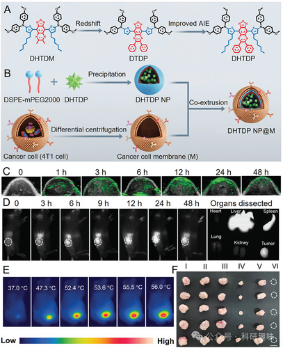
图 1. A) NIR-II AIEgen DHTDP 的分子设计原理。B) 拟生物 DHTDP NP@M 的制备。随时间变化的体内 C) PAI、D) 注射 DHTDP NP@M 后肿瘤组织的 NIR-II FLI 和 E) PTI。F) 第 15 天不同处理的肿瘤照片。I) PBS；II) PBS+L；III) DHTDP NP；IV) DHTDP NP+L；V) DHTDP NP@M；VI) DHTDP NP@M+L。

药物的精确释放是确保治疗效果的关键因素之一。为了实现药物释放的精准控制，一种有效的策略是采用具备对病理微环境多种刺激响应行为的智能载体。例如，将抗癌药物DOX和AIE光热剂TN共同封装于由癌细胞衍生膜（CCM）包裹的热响应/pH响应纳米凝胶（聚（N-异丙基丙烯酰胺-丙烯酸），简称PNA）中，得到的复合体系（P-TN-Dox@CM）在低pH值和光诱导的热响应条件下，展现出显著的药物猝发释放特性（如图2A,B所示）。

通过近红外荧光/光热双模式成像技术，P-TN-Dox@CM的卓越肿瘤特异性靶向能力得到了清晰的展现（如图2C,D所示），并且该体系能在极短的时间内（15分钟内）迅速升温至52.8℃，为影像引导下的精确诊断和治疗提供了实时可视化的导航。

化疗与光热治疗（PTT）的协同作用在肿瘤组织中发挥了显著效果，有效消除了4T1原位乳腺肿瘤，肿瘤生长抑制率高达92.9%（如图2E,F所示）。这一成果得益于CCM介导的同源靶向效应以及多管齐下的治疗效果，为癌症治疗领域带来了新的希望。

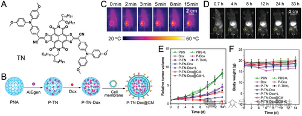
图 2. A) TN 的分子结构。B) P-TN-Dox@CM 纳米凝胶的制备。静脉注射 P-TN-Dox@CM 纳米凝胶后，4T1 肿瘤小鼠体内的 C) 红外热成像和 D) FLI。E) 肿瘤体积和 F) 体重的曲线。

在癌症免疫疗法中，一个常见的挑战是肿瘤细胞与免疫细胞之间的代谢竞争，这往往导致T细胞功能障碍和免疫逃逸。由于癌细胞的快速增殖，它们会消耗大量的关键营养物质，如葡萄糖和谷氨酰胺，这些营养物质对于免疫细胞（如淋巴细胞和巨噬细胞）维持其免疫功能至关重要。为了应对肿瘤免疫抑制和普遍存在的缺氧微环境，研究人员提出了一种创新的生物模拟策略，旨在通过重塑免疫细胞代谢来减轻免疫抑制效应。

这一策略的核心在于开发以癌细胞衍生膜（CCM）包覆的介孔二氧化硅纳米粒子（NPs）作为载体，该纳米平台（称为CTTPA-G）能够同时递送I型聚集诱导发光光敏剂TTPA（图3A）和谷氨酰胺拮抗剂。谷氨酰胺拮抗剂的引入通过减少癌细胞的营养供应来干扰其代谢过程，从而实现代谢干预疗法与光动力疗法的协同作用。

相比对照组，CTTPA-G展现出了更高的活性氧（ROS）生成能力（图3B），这一特性使得这种联合治疗策略具有类似“疫苗”的作用，能够激发强大的免疫反应和免疫原性细胞死亡（ICD）效应，从而抑制远端肿瘤的生长。令人鼓舞的是，这种治疗方法显著降低了转移病灶的进展速度。如图3C所示，肺转移的微弱迹象证实了CTTPA-G联合抗PD-1治疗所诱导的全身抗肿瘤免疫反应。
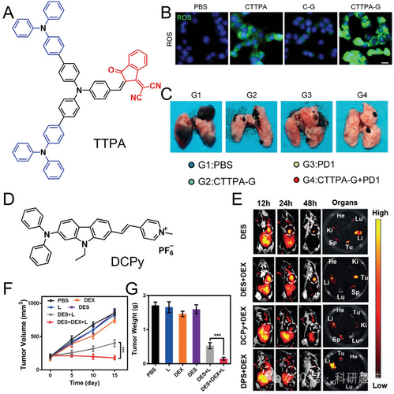
图 3.A) TTPA 的分子结构。B) 用 DCFH-DA 染色法测量指定处理组的 ROS（CTTPA 和（C-G）分别代表包裹 CCM 的 TTPA 或谷氨酰胺拮抗剂）。C) 肺转移照片。D) DCPy 的分子结构。E) 指定处理后主要器官的体内 FLI。F) 指定处理后的肿瘤体积和 G) 肿瘤重量。

除了CCM外，内源性肿瘤外泌体（EXO）作为一种药物载体，在肿瘤靶向给药领域展现出显著优势，这主要归因于其无免疫原性、优异的同源效应以及较长的循环时间。通过将基于AIEgen的光动力疗法（PDT）与生物EXO相结合，我们首次通过电穿孔方法成功构建了杂交纳米囊（DES）。在这项研究中，我们选用了名为DCPy的AIE活性光敏剂（图3D）。组织特异性成像显示，EXO的归巢效应显著增强了DES在肿瘤组织中的穿透效率（图3E）。为了克服局部缺氧对PDT的限制，我们同时引入了地塞米松（DEX）以恢复血管功能。结合DEX介导的瘤内血管正常化疗法，DES在抑制4T1乳腺癌肿瘤方面展现了出色的治疗效果（图3F,G）。这项工作为开发基于AIEgen的生物仿生PDT系统，以实现卓越的癌症光诊疗提供了新的思路。

在图4A中，展示了EXO包覆的铜单原子纳米酶（SAZs）表面吸附了AIE分子TBP-2的结构。这些Cu SAZs凭借其强大的过氧化物酶活性，能够进一步将I型PDT产生的H2O2转化为-OH，从而有效抑制肿瘤生长并触发肿瘤免疫原性细胞死亡（ICD）效应。在荧光成像（FLI）中，通过荧光信号的增强，我们可以清晰地观察到亮绿色的H2O2探针荧光和强烈的-OH生成（图4B）。与RBC膜包裹的系统相比，该级联催化系统表现出更深的肿瘤组织穿透性，这得益于EXO的优良同源靶向能力和持续的-OH生成。这一系统能够引发ICD并激发全身免疫反应（图4C）。其在SGC-7901胃癌皮下肿瘤模型和未完全切除的CT26肿瘤模型中的有效性已得到证实，显示出良好的临床应用潜力（图4D）。.
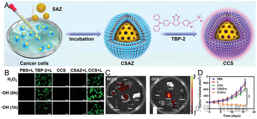
图 4. A) 级联催化系统（CCS）的制作。B) 通过 FLI 检测指定处理组的 H2O2 和 -OH。C) 对携带 SGC-7901 肿瘤的小鼠注射 CCS 或 RBC 涂层 RCCS 后 12 小时主要器官的体内外 FLI。D) 接受指定治疗后肿瘤体积的变化。

Biomimetic AIE Nanoparticles Camouflaged by Dendritic Cells

作为一类关键的抗原递呈细胞，树突状细胞（DC）在激活和刺激T细胞以引发抗癌免疫反应中占据核心地位。最近，DC膜生物仿生技术的开发为纳米药物提供了一种有效的策略，通过DC细胞膜上的配体（如MHC I、MHC II、CD80和CD86）与T细胞表面受体之间的特异性相互作用，实现了纳米药物的内源性T细胞靶向递送，从而显著提高了肿瘤递送效率。

此外，DC细胞膜已被证实能够显著促进T细胞分泌与细胞免疫紧密相关的细胞因子，如肿瘤坏死因子α（TNF-α），进而抑制热休克蛋白70（HSP70）的表达，使肿瘤细胞对热应激更为敏感。为了应对与HSP70相关的治疗抗性挑战，Gong及其团队报道了一种基于生物仿生的近红外-II AIE光热剂BPBBT纳米点，通过涂覆DC膜，赋予了其抗原呈递和T细胞靶向的“搭便车”能力（如图5A所示）。

在免疫细胞相互作用的介导下，这种纳米点在温和的温度（42-45°C）下即可展现出显著增强的光热治疗效率，而对正常细胞则无显著影响。借助AIE制剂优异的肿瘤靶向效率和体内近红外-II荧光成像（FLI）能力（如图5B、C所示），在4T1肿瘤模型上实现了卓越的抗肿瘤性能，同时保持了极高的安全性和生物相容性（如图5D-F所示）。这一研究为癌症光热免疫疗法提供了一种极具前景的替代策略。
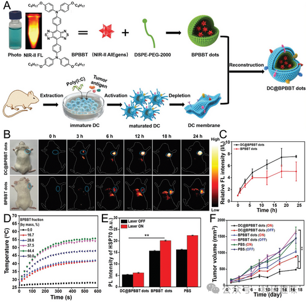
图 5.A) 制作 DC@BPBBT 点阵。B) 体内荧光成像记录的 DC@BPBBT 点阵随时间的分布。C) 肿瘤部位的荧光强度曲线。D) 不同质量比的 BPBBT 点在水中的光热效应。E) 指定治疗组肿瘤部位热休克蛋白 70 (HSP70) 的光致发光强度。F) 指定治疗后肿瘤体积随时间变化的曲线。

如图6A所示，Tang研究组开创性地通过涂布AIEgens光敏剂（PS）于树突状细胞（DCs）膜上，成功构建了一种具有“搭便车”能力的光活性抗原递呈平台。在此项工作中，他们精心设计了近红外AIE PS——MeTIND-4，该分子拥有紧密的D-A共轭骨架、强大的电子吸收受体以及高度扭曲的结构，这些特性赋予了MeTIND-4出色的分子内电荷转移能力和显著的红移发射。

共定位实验显示，DC包被的MeTIND-4（DC@AIEdots）通过疏水相互作用优先聚集在脂滴中（图6B）。通过扫描电子显微镜（SEM）和共聚焦激光扫描显微镜（CLSM）观察，可以清晰地看到T细胞表面显著附着有DC@AIEdots。在T细胞免疫缺陷的NOD/SCID小鼠模型中，肿瘤富集效率显著降低，这一发现进一步证实了肿瘤靶向递送是由T细胞介导的。

在DC@AIEdots处理组中，T细胞活化的关键标志物TNF-α和IFN-γ水平分别显著提高至14倍和11倍。与未包覆的AIEdots相比，DC@AIEdots因其独特的脂滴靶向能力和内源性T细胞的“搭便车”效应，使得其在肿瘤部位的累积量增加了1.6倍（图6C）。

体内研究显示，DC@AIEdots在4T1肿瘤BALB/c小鼠模型中产生了强烈的脱落效应，不仅有效消融了原发肿瘤，还通过强大的免疫反应显著抑制了远处肿瘤的增殖（图6D,E）。这一创新方法成功实现了基于DCs的免疫疗法与AIE介导的光动力疗法（PDT）在单一纳米系统中的高效结合。.

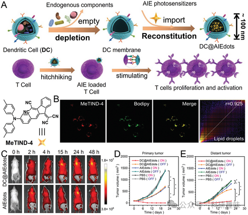
图 6. A) DC@AIEdots 的制作以及 DC@AIEdots 与 T 细胞之间的相互作用。B) 用 MeTIND-4 和 Bodipy 495/503 Green（用于脂滴染色）共同染色的 4T1 细胞共定位实验。C) DC@AIEdots 或 AIEdots 在主要器官中的时间依赖性分布。D,E) 不同治疗后肿瘤体积随时间的变化。

细胞外囊泡衍生的仿生纳米粒子（NPs）在根除原发肿瘤、远处肿瘤以及肿瘤转移灶方面展现出卓越的可行性和安全性，因而被视为一种极具潜力的抗癌疫苗替代方案。2022年，Wang及其研究团队提出了一种创新的生物合成策略，通过树突状细胞（DCs）的外泌作用生成DCs仿生AIE纳米粒子（DEV-AIE NPs），旨在实现光动力免疫疗法的协同作用。

这些外排的DEV-AIE NPs集成了亲代DCs和AIE光敏剂MBPN-TCyP的双重特性（如图7A所示）。通过共聚焦激光扫描显微镜（CLSM）观察，DEV-AIE NPs与4T1和CT26肿瘤细胞的线粒体均呈现显著的共定位（图7B），这与MBPN-TCyP的线粒体靶向性相吻合。在与4T1或CT26细胞共孵育后，DEV-AIE NPs诱导了强烈的绿色荧光，由ROS指示剂DCFH-DA发出，证明了其卓越的光动力疗法（PDT）效果。

此外，钙调蛋白（CRT）的迁移是免疫原性细胞死亡（ICD）的重要标志。DEV-AIE NPs处理的肿瘤细胞中CRT外显率的显著上升表明，与AIE-NPs或DEVs相比，生物基因DEV-AIE NPs具有更强的ICD效应。更值得注意的是，DEV-AIE NPs对肿瘤组织的募集和靶向能力明显增强（图7C）。

通过流式细胞术分析，我们发现DEV-AIE NPs显著提高了细胞毒性T淋巴细胞的百分比，这进一步证实了其引发的全身性肿瘤特异性细胞毒性T细胞反应和强大的ICD效应，足以完全抑制未经治疗的远处和转移性肿瘤。如图7D和E所示，DEV-AIE NPs处理组的肿瘤体积显著缩小。.

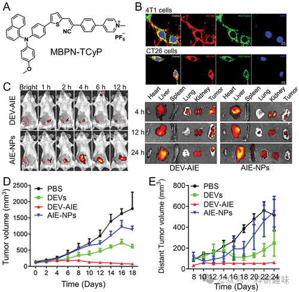
图 7. A) MBPN-TCyP 的化学结构。B) 激光共聚焦扫描显微镜记录的 4T1 细胞（上）和 CT26 细胞（下）中 DEV-AIE 与 MitoTracker（绿色）的共聚焦。C) 注射后不同时间段主要器官的 FLI。D,E) 不同治疗后的肿瘤生长曲线。

Biomimetic AIE Nanoparticles Camouflaged by Natural Killer Cells

自然杀伤（NK）细胞，作为骨髓来源的先天性淋巴细胞，在免疫系统中扮演着抗击感染和癌症治疗的关键角色。在抗肿瘤免疫疗法的研究中，NK细胞因其能够引发促炎性M1-巨噬细胞极化和利用其细胞膜上复杂受体协助治疗剂精确导航并靶向异常细胞的能力而受到广泛关注。尤为引人注目的是，NK细胞涂层的生物仿生纳米药物被视为一种紧密连接（TJ）调节剂，能够穿越由内皮细胞TJ构成的血脑屏障（BBB），这一屏障通常被视为中枢神经系统与外周血液循环之间的严峻挑战。

为满足穿颅成像和治疗所需的高对比度要求，开发一种高效近红外-II荧光成像（FLI）造影剂显得尤为必要，但同时也是一项技术挑战。2020年，研究者们通过精心设计的分子工程，利用强缺电子的双吡啶并(2,1,3)噻二唑作为受体，与烷基取代的(E)-2-(2-(噻吩-2-基)乙烯基)噻吩单元作为供体结合，成功开发出一种近红外-II AIE活性共轭聚合物PBPTV（图8A）。PBPTV展现出从400纳米到900纳米的宽吸收范围，最大吸收波长接近700纳米，并在960纳米波长处展现出具有AIE活性的发射，其长尾发射延伸到近红外-II区域，具有高达约8.6%的量子产率（QY）。

研究人员进一步探索了PBPTV与NK细胞膜的结合潜力，制备出具有PBPTV光热效应的NK@AIE点（图8B）。研究结果显示，NK@AIEdots保留了NK细胞膜表面原有的整合素（如LFA-1和VLA-4），这些整合素能够识别内皮细胞，并导致TJ断裂和肌动蛋白细胞骨架重组，从而在BBB上形成细胞间隙。与裸AIEdots相比，NK@AIEdots的BBB穿越效率显著提高至24%，是前者的8倍。体内外近红外-II荧光成像实验在正位脑肿瘤模型上证实了NK细胞膜出色的肿瘤靶向性和BBB穿越能力，使得肿瘤积累率更高（图8C）。此外，NK@AIEdots还展现出了令人满意的生物安全性，进一步验证了其在治疗脑相关疾病中的有效性。.

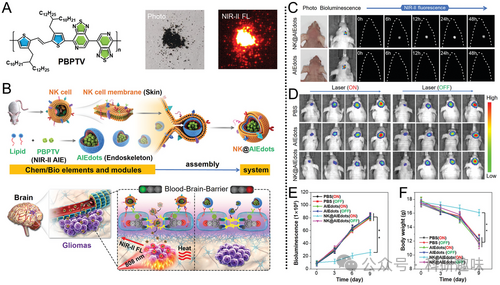
图 8. A) PBPTV 的分子结构和固体 PBPTV 的光学图像。B) NK@AIEdots 的制作以及 TJ 调制脑肿瘤成像和抑制。C) 神经胶质瘤在指定治疗后的近红外-II FLI。D) PTT 对正位胶质瘤体内生物发光图像随时间变化的影响。E) 肿瘤部位的生物发光强度随时间的变化。F) 指定治疗组小鼠的体重。

Biomimetic AIE Nanoparticles Camouflaged by Platelet

循环血小板，作为一种现成的仿生涂层选择，在病原体反应调节和血管损伤修复中展现出广阔的应用潜力。血小板膜囊泡因其表面携带的P选择蛋白能特异性地与肿瘤细胞高表达的CD44受体结合，从而具备了长期的血液循环能力和肿瘤靶向性。近期，有研究构建了一种包含TBP-2的血小板膜仿杯突增敏系统。该系统能够将药物精准地输送到肿瘤部位，并在局部肿瘤微环境中通过响应H和H2O2的刺激实现药物的逐步释放，有效地对抗乳腺癌的肺转移和再侵袭现象（如图9A所示）。

此外，TBP-2所引发的I型光动力疗法（PDT）效应能够生成-OH，这一物质进而消耗谷胱甘肽（GSH）。由于GSH在氧化还原反应中起到维持铜离子水平的作用，因此其消耗最终会导致细胞内铜离子过载。进一步的研究揭示，经过杯突增敏系统处理的肿瘤组织，其铜含量显著高于Cu2O处理组（高出2.93倍）和红细胞（RBC）膜包覆的杯突增敏系统处理组（高出1.53倍）。这种铜离子的积累会引发脂酰化蛋白的聚集，并导致铁硫蛋白的流失（如图9B所示），从而在抑制乳腺癌肺转移方面展现出显著的潜力（如图9C所示）。.
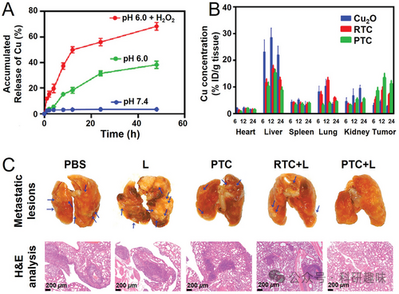
图 9. A) 不同条件下铜的累积释放曲线。B) 指定处理后不同时间点肿瘤组织和主要器官中的铜含量。RTC 代表涂有 RBC 膜的铜氧化系统。C) 指定治疗组肺部转移病灶和 H&E 分析。

在局部放疗的治疗过程中，对于抵御缺氧环境对治疗效果的不良影响，我们一直在寻求有效的策略。仿生纳米酶因其类似天然催化酶的活性，为维持局部氧气供应提供了新的可能性。例如，Duo等人首次研究了血小板模拟MnO2纳米酶（简称PMD）与DCPy的协同作用，通过介入性光动力疗法（PDT）来治疗原位结肠肿瘤。

在体内研究中，生物分布图显示，相较于红细胞（RBC）膜包裹的纳米粒子（RMD），PMD纳米粒子（PMD）在肿瘤区域的靶向积累效果更为显著，这与PMD治疗后肿瘤内Mn含量的显著增加相一致。由于肿瘤微环境在H2O2存在下呈酸性，DCPy得以释放，同时MnO2能够随时间有效地产生O2，从而改善肿瘤缺氧状态。

为了实现深部结肠肿瘤的治疗，研究采用了由光纤和内窥镜组成的介入装置，通过插入腹部并精确瞄准肿瘤部位，实现了对肿瘤的清晰观察。激光的精确穿透启动了PDT治疗，结合介入疗法和基于AIEgen的光导治疗，获得了显著的抗肿瘤活性。这一结果强调了PMD + L治疗策略相较于对照组的优越性，为未来的临床应用提供了有力的支持。

Biomimetic AIE Nanoparticles Camouflaged by Neutrophil

中性粒细胞（NEs）作为免疫系统中最丰富的细胞类型，其独特的穿透血脑屏障（BBB）并携带治疗药物特异性地渗透至深部炎症部位的能力，引起了广泛关注。2020年，Tang等人报道了一项重要研究，他们将近红外-II AIEgen（聚集诱导发光分子）2TT-oC6B封装进NEs中，作为高效的活体成像对比剂（图 10A）。所制备的AIE@NEs能够穿透完整的小鼠头皮和头骨，实现对脑部炎症的精准诊断，信噪比高达30.6（图 10B）。

在AIE分子设计理念的指导下，2TT-oC6B因其独特的扭曲骨架和转子结构，在≈1030 nm处展现出最大的发射峰，量子产率（QY）高达11%。如图10C所示，近红外-II荧光成像（NIR-II FLI）技术清晰地揭示了体内脑部炎症的时间依赖性变化，荧光信号随时间持续增强，并在注射AIE@NEs后12小时达到最强、最清晰的状态。

值得注意的是，与作为阴性对照的吲哚菁绿（ICG，一种临床广泛使用的近红外染料）相比，AIE@NE处理的小鼠的光致发光信号高出6.5倍。这一显著优势表明，AIE@NE在炎症部位的穿透深度更深，成像质量更高，为脑部炎症的精确诊断和监测提供了强有力的工具。.

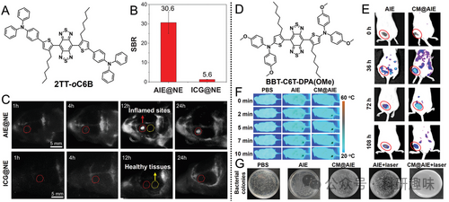
图 10 A) 2TT-oC6B 的分子结构。B) 注射指定样品 12 小时后脑炎症近红外-II荧光成像的 SBR 值。C) 不同处理后脑炎症的体内近红外-II荧光成像。D) BBT-C6T-DPA(OMe) 的分子结构。E) 不同处理后伤口发炎部位的体内 FLI。F) 小鼠静脉注射指定样品后在 980 纳米激光照射下的红外热成像。G) 不同处理后伤口组织中细菌 CFU 的照片。

NEs（中性粒细胞）在炎症部位的高招募率是其独特特点之一，这归因于其复杂的膜受体系统，能够灵敏地感知并响应病原体释放的各类趋化因子，从而引导NEs向炎症组织聚集。因此，NEs保护的纳米颗粒（NPs）在抗击细菌感染和炎症方面发挥了关键作用。

在近期的研究中，研究人员巧妙地利用NEs的这一特性，将NIR-II AIE光热分子BBT-C6T-DPA(OMe)（图 10D）包覆在NEs膜上，构建了一种新颖的抗炎平台——CM@AIE NPs。该平台在抗药性细菌感染的治疗中展现出了显著潜力。

值得注意的是，ICG标记的CM@AIE NPs通过荧光成像（FLI）技术可以轻易地与正常组织区分开来（图10E），这凸显了其出色的归巢能力和较高的免疫逃逸能力，使得它们能够有效地到达发炎的伤口部位。

CM@AIE NPs的光热转换效率高达28.94%，这为其在光热治疗中的应用提供了有力支撑。在耐甲氧西林金黄色葡萄球菌感染的小鼠模型中，通过静脉注射CM@AIE NPs并结合激光治疗，实现了感染部位温度的显著升高（达到24°C，图 10F）。此外，该治疗策略还显著减少了皮下脓肿模型愈合过程中的促炎细胞因子水平（图 10G），进一步证明了CM@AIE NPs在预防金黄色葡萄球菌感染和缓解炎症方面的有效性。

Biomimetic AIE Nanoparticles Camouflaged by Red Blood Cell

红细胞（RBCs）因其卓越的有效载荷能力、生物相容性、可降解性和高度的可变形性，成为高效药物递送系统的代表。为了模拟红细胞的自然生物功能以实现“隐形”效果，研究者们致力于开发基于红细胞膜的生物仿生递送平台。2021年，Hong研究小组成功地运用RBCs膜封装了结合有AIE活性聚电解质P2-PPh3和聚肌苷酸：聚胞苷酸（Poly(I:C)）的纳米颗粒（NPs）（图 11A）。这里的Poly(I:C)是一种能够刺激并增强抗肿瘤免疫反应的收费样受体激动剂，而AIE活性聚电解质则赋予系统额外的光敏性。该复合纳米药物设计用于肿瘤的光动力免疫疗法。

这种策略显著提高了纳米药物逃避肝脏和肾脏巨噬细胞检测的能力（图 11B），并实现了对病变部位的选择性聚集。更为重要的是，AIEgen介导的光动力疗法（PDT）与Poly(I:C)的协同效应引发了强大的免疫激活反应，相较于单独使用PDT或Poly(I:C)，这种组合显著提高了治疗效率（图 11C）。

在临床应用中，这种制剂也展现出了对肺部肿瘤转移的有效治疗。如图 11D所示，经过治疗后，皮下肿瘤显著缩小，肺部转移性肿瘤沉积物也明显减少，这充分证明了M@AP制剂通过免疫调节对原发性和继发性肿瘤均具有良好的治疗效果。这一发现为天然细胞膜包覆的AIEgens在基础研究和临床转化应用中开辟了新的可能。.
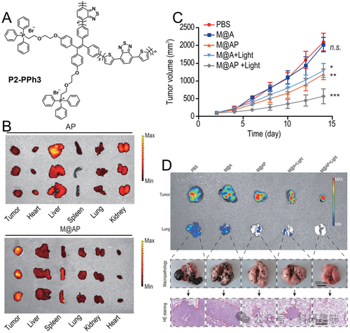
图 11. A) P2-PPh3 的化学结构。B) M@AP 和 AP 的生物分布（无膜涂层）。C) 不同处理下的肿瘤体积曲线。D) 活体成像系统（上图）、肉眼（中图）和 H&E 染色（下图）显示的肺转移情况.

Biomimetic AIE Nanoparticles Camouflaged by Macrophage

巨噬细胞，作为人体血液、各类组织和器官中广泛存在的一种白细胞类型，因其膜表面携带的多样化病毒相关受体而具有卓越的病毒靶向能力，从而在抗病毒药物设计中展现出引人注目的功能性涂层作用，备受科研领域的关注。Liao及其研究团队便报道了一种基于近红外-II AIEgens（TPE-BT-DPTQ）的巨噬细胞样纳米颗粒（简称TBD@M NPs）（如图12A所示）。他们利用受疫苗病毒感染的小鼠模型，作为研究猴痘病毒的替代模型，深入探讨了这种纳米颗粒的抗病毒效果。

在这项研究中，巨噬细胞作为药物载体的潜力得到了进一步证实。与对照组相比，使用TBD@M NPs后，在尾部病变区域观测到的近红外-II荧光成像信号强度显著增强，且持续时间更长（如图12B所示）。这一结果不仅凸显了巨噬细胞对病变组织的特异性靶向能力，还展现了其作为药物递送系统的巨大潜力。

随后，研究人员对TBD@M NPs的抗病毒效果进行了全面评估。他们发现，在808纳米激光照射下，这种仿生疗法能够显著减少病毒载量，通过光热效应促进伤口愈合，并有效缓解组织坏死（如图12C所示）。此外，在尾部病变组织中，促炎细胞因子（如IL-1β、IL-6、TNF-α和IFN-γ）的表达水平显著降低，进一步证实了TBD@M NPs对炎症反应的抑制作用。

值得注意的是，即便健康小鼠接种了经TBD@M NPs处理的病变组织悬浮液，其健康尾部也几乎未观察到炎症反应。这一发现不仅展现了TBD@M NPs在减轻炎症反应方面的优异性能，还揭示了其在阻断病毒传播方面的巨大潜力（如图12D-F所示）。这一研究成果不仅为抗病毒药物设计提供了新的思路，也为未来抗击病毒感染提供了新的治疗策略。
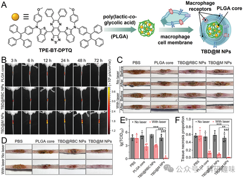
图 12. A) TBD@M NPs 的制备。B) 疫苗病毒感染小鼠尾部瘢痕病变经指定处理后的 NIR-II FLI。TBD@RBC NPs 代表涂有 RBC 膜的阴性对照。C）感染尾部伤口和 D）不同处理下重新接种尾部的照片。E) Vaccinia 病毒滴度检测（TCID50 检测）和 F) 7 天后重新接种的尾部病变组织的组织坏死比例计算。

除了抗病毒作用外，巨噬细胞在抵御外源性病原菌感染中发挥着至关重要的首道防线作用。其中，病原体的初步刺激是刺激巨噬细胞表面病原体靶向受体表达增强的有效手段。Liao及其研究团队首次尝试使用分枝杆菌（与结核杆菌有遗传相似性）激活的巨噬细胞膜，来包覆近红外-II AIE活性光热剂TPE-BT-BBTD，以探索其在结核病治疗中的应用（图13A）。这些精心制备的纳米颗粒（NPs）被命名为BBTD@PM NPs，其吸收光谱极为广泛，可覆盖至近红外-II波段。

在1064 nm（0.3 W/cm²）激光照射下，BBTD@PM NPs在短短10分钟内即可使局部温度上升至70°C，从而展现出显著的光热治疗（PTT）效果。在与H37Ra杆菌共培养5分钟后，由于BBTD@PM NPs外部结核杆菌特异性受体的高表达，这些纳米颗粒与H37Ra杆菌产生了明显的共定位现象，相比之下，红细胞（RBCs）或未活化的膜包覆NPs则几乎不与H37Ra杆菌结合（图13B）。

这一特性使得BBTD@PM NPs在高分辨率NIR-II成像中能够清晰地识别肺部原位肉芽肿（图13C,D）。通过静脉注射后，在胸腔外以1064 nm波长进行照射，肺部组织中H37Ra的菌落形成单位（CFU）显著减少，这充分展示了BBTD@PM NPs优异的光热性能（图13F,G）。

这些研究不仅验证了巨噬细胞膜包裹的AIE NPs在治疗结核病方面的潜在益处，也为未来的临床试验和应用提供了有力的支持。
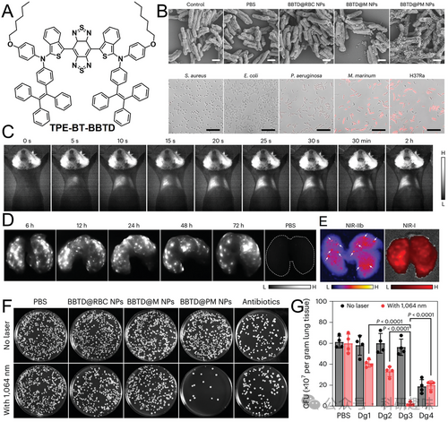
图 13. A) TPE-BT-BBTD 的分子结构。B) H37Ra 杆菌与不同 NPs 结合的扫描电子显微镜图像（上图），以及 DiO 标记的 BBTD@PM NPs（红色）与不同细菌物种共孵育的共聚焦图像（下图）。M. marinum 和 H37Ra 都属于分枝杆菌。C) 静脉注射 BBTD@PM NPs 后，结核病小鼠和 D) 离体肺的近红外-II FLI。E) 比较近红外-II 和近红外-I成像，以区分白色箭头所示的极小肉芽肿。F) 不同处理 14 天后肺组织中 H37Ra 杆菌的菌落测定和 G) CFU 计数。

Biomimetic AIE Nanoparticles Camouflaged by Bacteria

细菌作为生物模拟载体的研究，在疫苗配方中展现出其独特的价值。自1868年德国医生W. Busch开始系统性地研究细菌在癌症治疗中的应用以来，这一领域已经发展了一个多世纪。细菌因其独特的性质，如优先在肿瘤组织中定植、可通过基因工程进行改造以及生产生物活性天然产物的能力，在多种疾病的治疗中获得了新的应用前景。

尽管细菌介导的癌症治疗已取得显著进展，但疗效与安全性之间的平衡问题，以及非病原菌对癌细胞的低侵入效率，仍是当前面临的挑战。为此，将AIEgen（聚集诱导发光分子）附着于缺氧靶向非病原菌表面，为构建高效生物杂交系统提供了新策略，从而实现了瘤内的有效积累。

此外，AIEgen的光疗活性也被用于破坏细菌膜，进而实现细菌向癌细胞内的蛋白质输送。例如，Liu等人利用具有良好生物相容性和生物降解性的非病原菌大肠杆菌（E. coli）作为生物载体，将含有TD（AIE光敏剂）的纳米颗粒（TDNP）包覆其上，形成TDNPP-E. coli。与无细菌载体的游离PS NPs相比，TDNPP-E. coli展现出了更高的递送效率（图 14A）。

在这项研究中，阳离子聚合物聚乙烯亚胺被用于调节TDNPP的表面电荷，并促进其在大肠杆菌表面的包覆。荧光显微镜成像显示，与单独的PS NPs相比，生物杂交TDNPP-E. coli在Hela细胞中的内化效果更佳，且在细胞核中的积聚能力增强（图 14B、C）。经照射处理后，TDNPP-E. coli对肿瘤细胞的杀伤效率高达80%以上（图 14D）。

TDNPP-E. coli-GFP在Hela细胞中的显著内化现象，以及GFP绿色荧光与TDNPP红色荧光的融合（图 14E），证实了表达GFP蛋白的大肠杆菌（E. coli-GFP）能够有效侵袭癌细胞并输送蛋白质，这为细胞内蛋白质输送提供了新的策略。
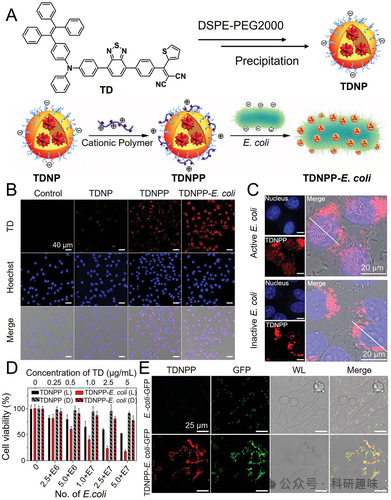
图 14. A) TDNPP-E. coli 的制作。用 B) TDNPs、TDNPPs、TDNPP-E. coli 和 C) TDNPP 包被活性或非活性大肠杆菌处理 HeLa 细胞的共聚焦荧光显微镜图像。(蓝色，细胞核；红色，TD 组）。D) E) 与 E. coli-GFP 和 TDNPP-E. coli-GFP 培养 4 小时后 HeLa 细胞的共聚焦显微镜图像。Copyright 2019 美国化学会.

Duo等人提出了一种创新的结合细菌载体的混合AIEgen（聚集诱导发光分子）系统，旨在针对耐缺氧的正位结肠肿瘤实施高效的光动力治疗（PDT）。由于大肠杆菌对缺氧组织具有显著的选择性趋向性，它们被精心挑选作为TBP-2的缺氧靶向载体，通过产生O2和-OH来介导PDT治疗过程。

在研究中，当通过静脉注射给予基于细菌的混合AIEgen系统（AE）后，观察到缺氧肿瘤区域的荧光信号显著增强，而对照组中掺杂PLGA的TBP-2则未观察到明显的荧光增强现象。实验结果表明，该系统展示了光和浓度依赖性的肿瘤抑制效果，为肿瘤治疗提供了新的策略。

此外，通过使用由光纤和内窥镜组成的先进介入治疗装置，研究团队能够清晰地观察到位置较深的正位结肠肿瘤，并轻松地进行介入激光照射。这种高效的治疗效果和几乎不变的体重变化表明，AE治疗模式结合介入白激光照射具有良好的治疗耐受性，为患者提供了一种潜在的安全有效治疗手段。

这些研究工作为开发针对特定肿瘤模型的细菌-生物仿生混合AIEgen系统开辟了新的途径，有望在未来推动癌症治疗领域的进步。

**Summary and Outlook**

在过去的十年里，AIE科学在治疗学领域取得了显著的进步，这主要归功于其高对比度和高空间分辨率的生物成像特性，以及成像引导的光疗优势。本综述旨在概述基于AIEgen的生物仿生系统在生物成像和治疗应用中的最新进展。

为了克服传统纳米医学在系统生物屏障、生物安全性和靶向递送方面的挑战，我们采用了多种创新策略。生物仿生AIE纳米药物的构建依赖于一种自下而上的制备方法，包括细胞膜包覆技术和细菌负载策略，以结合生物活性载体。通过这种方法，我们可以利用生物载体的独特生物特性，与各种生物大分子进行高效、特异的相互作用，从而实现对肿瘤的精准靶向。

这些生物活性纳米载体主要包括细菌、细胞膜制造的纳米囊泡以及来自不同细胞来源的外泌体。它们通过细胞膜表面特定生物大分子的功能，为生物仿生AIE纳米粒子（NPs）提供了独特的伪装，使其成为具有独立疗法和独特给药疗法前景的医疗平台。

例如，肿瘤细胞膜包覆的纳米药物具有天然优势，其表面携带丰富的肿瘤抗原，能够触发肿瘤特异性免疫反应。此外，免疫细胞衍生的膜包覆不仅在抑制原发性肿瘤生长方面取得了显著效果，还能通过诱导全身免疫反应和产生长期免疫记忆，减少肿瘤复发和抑制癌症转移。特别是，树突状细胞（DCs）因其卓越的抗原处理和呈递能力，在诱导和协同T细胞治疗癌症方面展现出巨大潜力。

巨噬细胞表面的多种病毒相关受体在增强抗病毒管理方面发挥着关键作用。同样，作为先天性免疫系统的核心组成部分，中性粒细胞对受损组织、病原体和其他炎症细胞释放的趋化因子具有极高的敏感性，使其成为组织损伤、炎症和感染情况下强有力的包覆材料。

总之，通过精细调控AIEgens的化学结构和选择合适的生物载体，我们能够拓宽这些纳米粒子在应对复杂疾病方面的应用范围，为未来的医学治疗提供新的可能性。迄今为止，生物仿生AIE纳米粒子（NPs）在乳腺癌、胃癌、结肠癌、脑肿瘤、结核病、炎症和病毒感染等多种疾病治疗中展现了广阔的应用前景。尽管大量实验数据表明，这些生物仿生AIE NPs在延长循环时间、免疫逃逸、同源靶向性能、减少副作用及提高疗效等方面取得了显著成效，但要实现其临床转化，仍需克服一系列挑战。

未来的研究应聚焦于深入理解其体内药代动力学，尤其是治疗药物的生物分布和肿瘤生物利用度，以确保其临床适用性。同时，通过扩大生物载体的种类，可以进一步提升治疗效果。例如，具有增强功能特性的杂交细胞膜或去核酸的类病毒颗粒，凭借其独特的生物活性结构和功能，有潜力治疗其他特殊疾病。这一目标的实现关键在于新型生物载体的创新设计。

此外，重新审视AIEgens分子的设计理念，对于纳米医学科学的发展至关重要。这要求开发新的功能化方法和优化AIEgens构象，以平衡荧光生物成像的质量和光动力治疗（PDT）或光热治疗（PTT）的功效。

在研究中，确保由不同化学/生物元素或模块组装而成的NPs的精确重现性和质量控制，也是一项亟待解决的关键基础问题。为实现生物仿生AIE纳米药物的大规模工业化生产，并应用于个体精准医疗，需要开发一种简单、高效且高安全性的制备方法。这依赖于制药学、光子学、纳米医学、生物学、化学和机械科学等跨学科技术的融合与发展。

尽管生物仿生AIE NPs的全面临床应用仍面临长期挑战，但我们坚信，这些努力将引领纳米医学的未来发展方向，特别是在实现时空可控的一体化功能方面。

## **参考文献**

**Ref**

Li, Z.; Tang, B. Z.; Wang, D. Bioinspired AIE Nanomedicine: A Burgeoning Technology for Fluorescence Bioimaging and Phototheranostics. Advanced Materials 2024, 2406047. https://doi.org/10.1002/adma.202406047.

**点击蓝字 关注我们**

预览时标签不可点

素材来源官方媒体/网络新闻

 [阅读原文](javascript:;) 

  继续滑动看下一个 

 轻触阅读原文 

   

