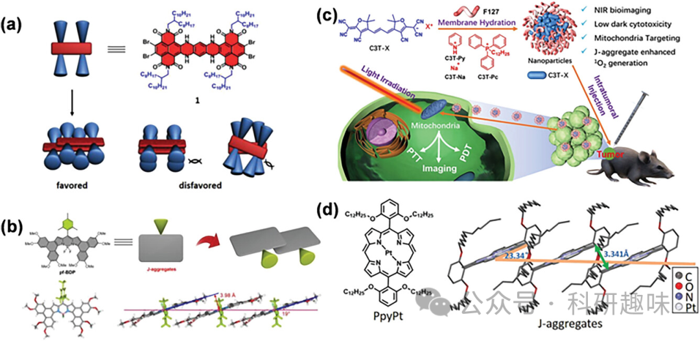
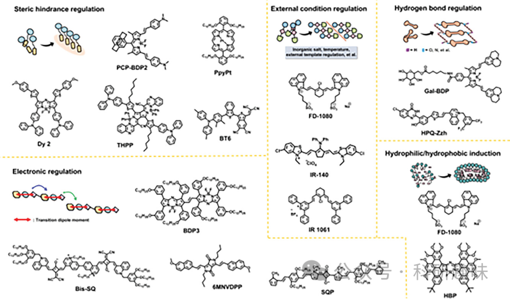
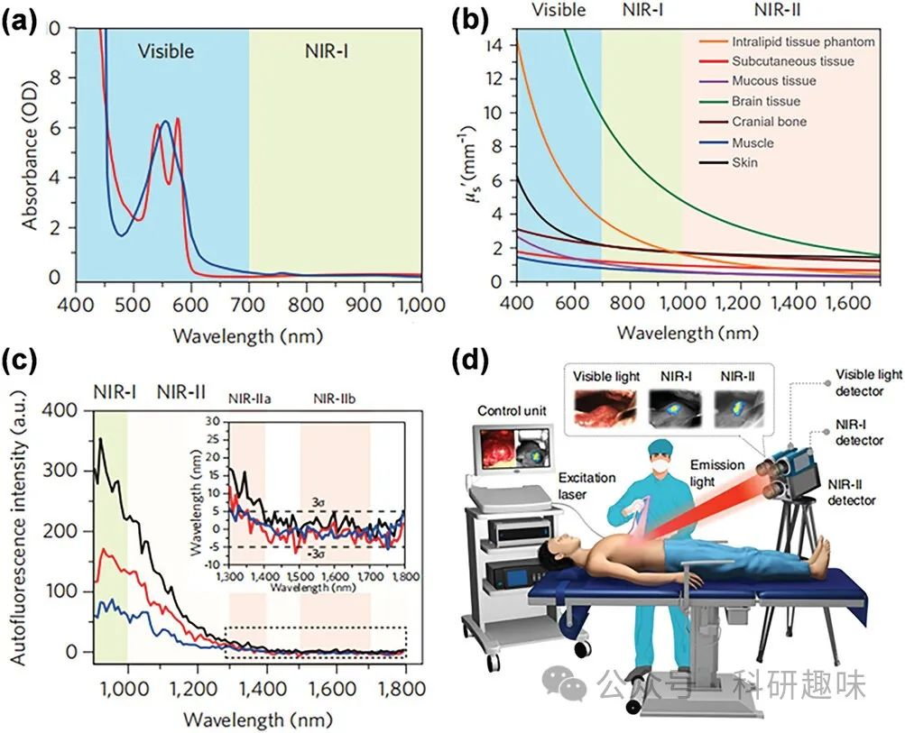

 

#  【Adv. Mater.】探索NIR-II J-聚集体：形成策略、生物成像与治疗诊断的前沿应用 
 

Grenemal

读完需要

3

全文字数  847 字

综述：本文介绍了J-聚集策略在NIR-II荧光生物成像中的应用。通过调控分子结构和外部条件，实现了NIR-II J-聚集体的形成，并探讨了其在生物成像和治疗诊断中的应用。文章分析了J-聚集体在深层组织成像和高分辨生物传感中的优势，并总结了近期关于NIR-II生物成像和治疗诊断中J-聚集体的研究进展。

**NIR-II J-聚集体的形成策略**

本部分主要介绍了NIR-II J-聚集体的形成策略。文章指出，通过分子结构设计和外部条件调控可以实现NIR-II J-聚集体的形成。其中，分子结构设计是实现J-聚集体形成的关键。通过引入受体-供体结构单元和构建共轭体系，可以实现分子间的相互作用，从而促进J-聚集体的形成。同时，外部条件如溶剂选择和温度控制也对J-聚集体形成起到关键作用。通过这些策略，可以实现NIR-II J-聚集体的精确调控和优化。

**NIR-II J-聚集体在生物成像中的应用**

本部分重点讨论了不同的NIR-II J-聚集体在生物成像中的应用，包括常见的BODIPY类染料、花菁类染料、方酸类染料、卟啉类染料、DPP类染料、BT类染料等。文章指出J-聚集体具有较高的光学性能和较长的激子寿命，适用于深层组织成像和高分辨生物传感。同时，通过合理设计J-聚集体结构，实现了生物成像信号的增强和背景信号的降低，为生物成像提供了新的可能性。文章还介绍了J-聚集体在肿瘤检测、血管成像、手术导航和光热治疗等方面的应用。这些研究为NIR-II J-聚集体在生物成像中的应用提供了新的思路和方法。

**NIR-II J-聚集体在治疗诊断中的应用潜力**

最后，文章探讨了NIR-II J-聚集体在治疗诊断中的应用。通过将J-聚集体与药物载体结合，实现了针对性的肿瘤治疗和诊断。同时，J-聚集体在光热治疗和光动力治疗中也展现出潜在的应用前景。这些研究为NIR-II J-聚集体在治疗诊断中的应用提供了新的思路和方法。文章还介绍了J-聚集体在光热治疗和光动力治疗中的应用，这些研究为NIR-II J-聚集体在治疗诊断中的应用提供了新的思路和方法。

综上所述，本文系统地介绍了NIR-II J-聚集体的形成策略、生物成像和治疗诊断中的应用，并展望了其在生物医学领域的潜在应用前景。这些研究为开发新型生物成像和治疗诊断技术提供了重要的理论和实验基础。

Hu, X.; Zhu, C.; Sun, F.; Chen, Z.; Zou, J.; Chen, X.; Yang, Z. J‐Aggregation Strategy toward Potentiated NIR‐II Fluorescence Bioimaging of Molecular Fluorophores. *Advanced Materials* **2024**, *36* (1), 2304848. https://doi.org/10.1002/adma.202304848.

**关注并回复文章DOI获取全文，点击左下角阅读原文可直接跳转：**

10.1002/adma.202304848

**点击蓝字 关注我们**

预览时标签不可点

素材来源官方媒体/网络新闻

 [阅读原文](javascript:;) 

  继续滑动看下一个 

 轻触阅读原文 

   

