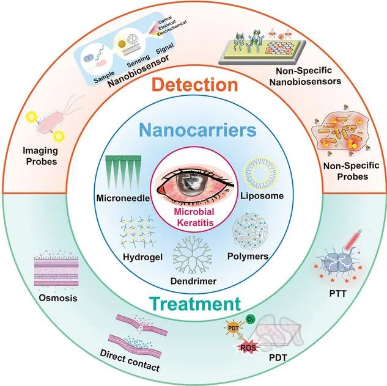
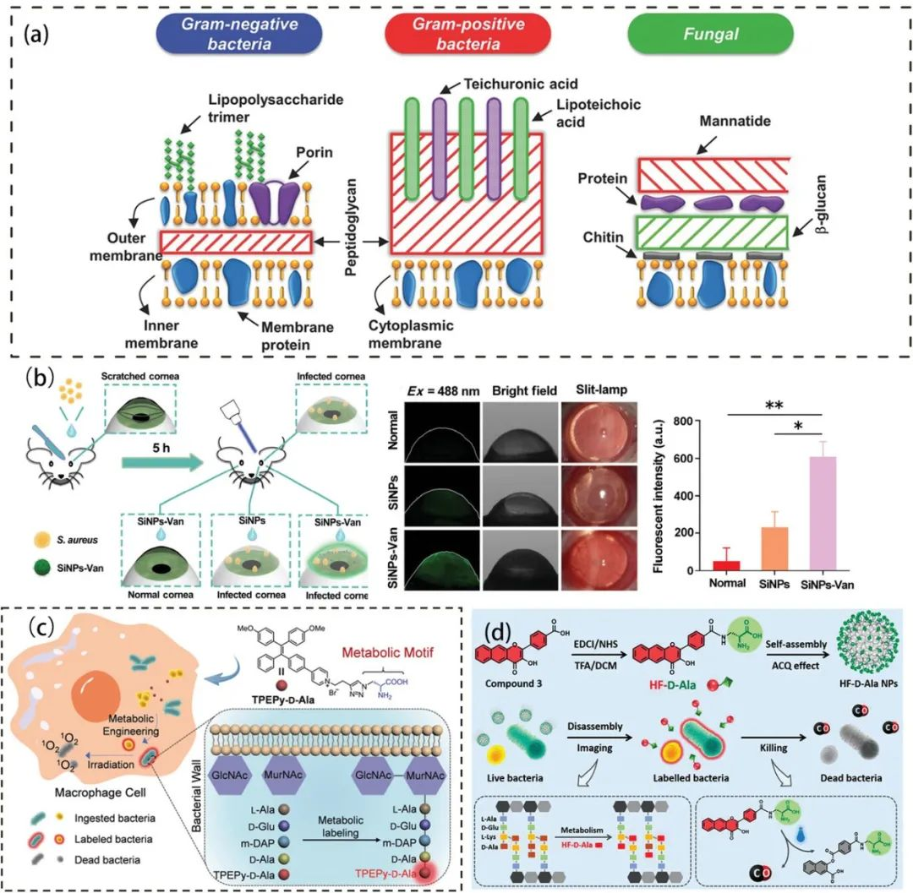
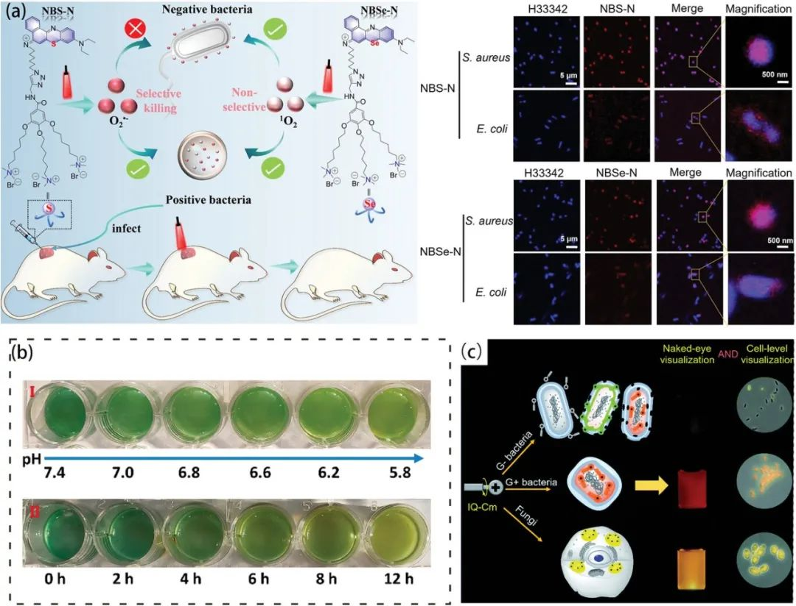
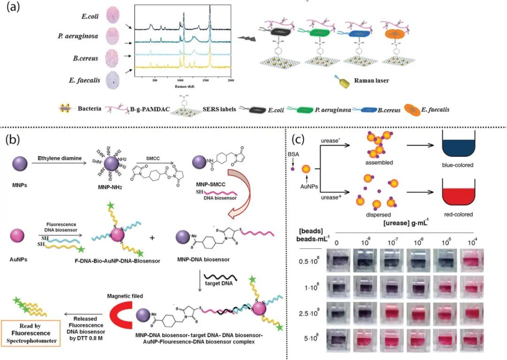
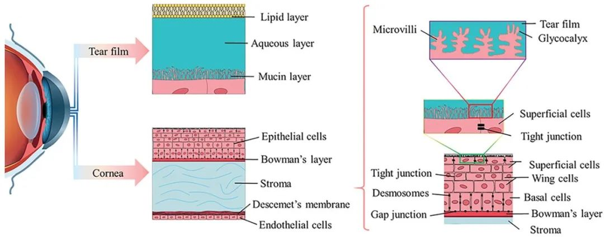
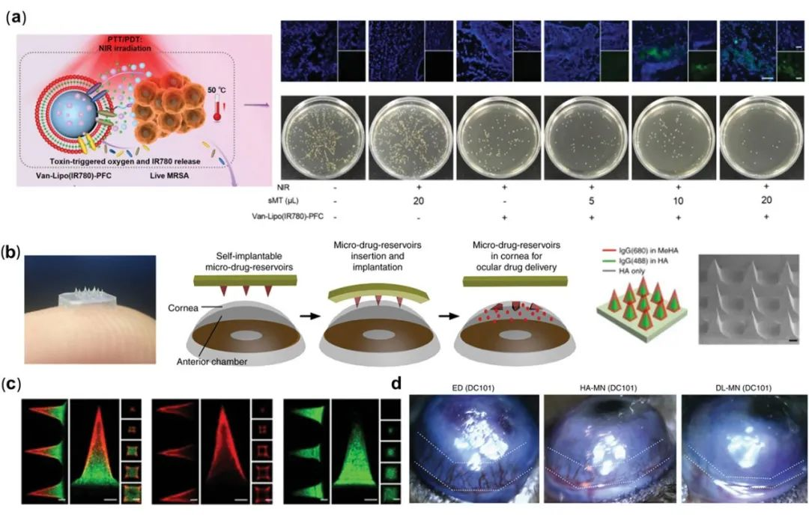
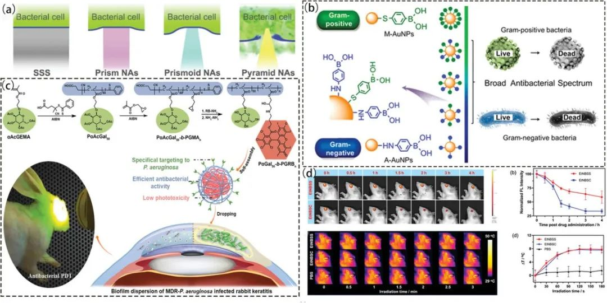
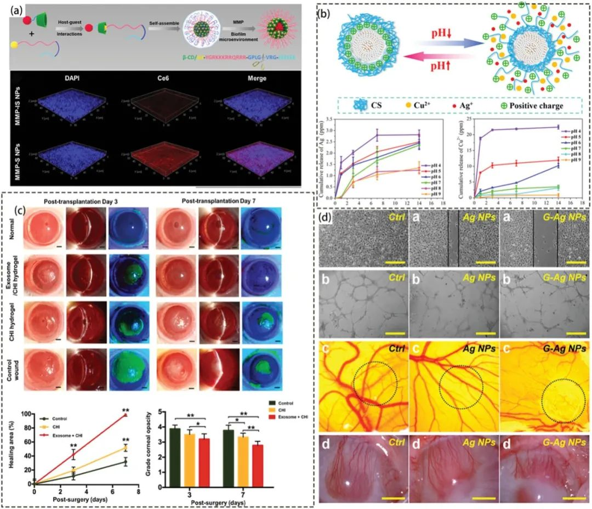

 

#  【Adv. Mater.】纳米药物新综述，用于检测和治疗眼部细菌感染 
 
 原创

Grenemal

读完需要

14

全文字数：4400

## **摘要**

Abstract

眼部细菌感染是导致失明的常见原因，对生活产生严重影响。传统治疗方法在眼部细菌感染方面效果不佳，因此需要研发新技术，以实现准确诊断、精确治疗。随着纳米科学和生物医学的迅速发展，多功能纳米系统在克服眼部细菌感染挑战方面备受关注。鉴于纳米技术在生物医学领域的优势，可用于检测、药物输送和治疗眼部细菌感染。这篇综述讨论了最新的纳米系统进展，包括纳米材料在眼部细菌感染中的应用，以及它们对生物利用度、组织透过性和炎症环境的影响。综述深入探讨了眼部障碍、药物制备和代谢对给药系统的影响，强调了眼科医学面临的挑战，并鼓励未来基础研究和临床应用中的眼科抗菌纳米医学。

**引言**

Introduction

眼部细菌感染是导致视力受损和失明的主要原因之一，与隐形眼镜使用、眼外伤和眼表疾病有关。治疗通常需要使用抗生素和可能的皮质类固醇，但传统治疗方法存在限制，如低吸收率、药物耐药性和病原体复制速度降低。早期诊断和治疗是关键，但传统病原体检测方法效率低下。纳米材料的应用提供了新的解决方案，可用作荧光探针和生物传感器，快速、灵敏地检测活细菌。此外，纳米材料还能克服药物输送中的障碍，直接杀死细菌并改善治疗效果。因此，纳米材料在眼部细菌感染的诊断和治疗中具有巨大潜力，为未来的治疗提供了新的思路和前景。

**用于病原体检测的纳米材料**

Nanomaterials for Pathogen Detection

早期确定眼部细菌感染的病原体类型对治疗至关重要，但传统检测方法耗时长且样本量有限。纳米材料的出色特性提供了新的解决方案。其较大的比表面积允许连接多种识别元件，可用于快速、灵敏的检测。可控的结构大小提高了分析性能的准确性和可重复性。光学、磁性和电化学检测方法结合纳米技术，实现了对病原体的快速检测。纳米荧光成像探针可省略一些样本采集步骤，同时纳米生物传感技术可快速检测小样本量。这些纳米技术有望改善眼部细菌感染的早期诊断，为更有效的治疗提供支持。

**纳米荧光成像探针**

Nanofluorescent Imaging Probes

纳米荧光成像探针由识别元件和成像元件组成。识别元件将识别信号传递给成像元件，从而通过原位成像检测病原菌。由于具有很高的光化学稳定性，许多纳米材料，包括聚集诱导发光光敏剂（AIEgens）、金属纳米颗粒（NPs）、碳基纳米材料和上转换 NPs（UCNPs）都被用作细菌荧光检测的成像元件。这里，作者讨论了用于病原体检测的纳米荧光成像探针，这些探针由识别元件和成像元件组成，成像元件通常使用高光化学稳定性的纳米材料，如聚集诱导发光光敏剂（AIEgens）、金属纳米颗粒（NPs）、碳基纳米材料和上转换NPs（UCNPs）等，而识别部分又可以细分为特异性识别探针和非特异性识别探针。

**特异性识别探针：**这些探针针对不同病原体的特定细胞壁结构，如革兰氏阳性菌（GPB）和革兰氏阴性菌（GNB）。它们使用特异性的识别元件，如抗生素、抗体、肽等，用于靶向识别病原体。

**非特异性识别探针**：细菌细胞壁的特性可用于构建非特异性目标识别探针，如表面电荷、疏水性和渗透性。在这些方面，GPB 和 GNB 具有不同的特性。此外，与非感染部位相比，感染部位的理化性质也存在明显差异；前者具有弱酸性、低氧和过量 H2O2。

**纳米生物传感器**

Nanobiosesors

纳米生物传感器在定性诊断方面具有关键意义，同时也能根据发射信号的强度进行定量诊断，以评估疾病的严重程度。这些传感器通常由生物识别受体、传感器组件以及数据处理器构成。它们能够将受体识别到的生物信号转化为电、电化学、光学、核磁共振或其他检测信号。根据其识别的原理不同，纳米生物传感器可以分为特异性纳米生物传感器和非特异性纳米生物传感器两种类型。

**特异性纳米生物传感器**：针对特定细菌表面或细胞内成分，例如蛋白质、糖蛋白、糖类和特异性肽，用于快速检测细菌。这些传感器利用不同的化学物质与目标细菌结合，通过光学、电化学等方式测量信号，实现高准确性的细菌识别。

**非特异性纳米生物传感器：**利用细菌表面的特殊性质，如表面电荷和疏水性，来进行细菌检测。它们通过静电相互作用或与微生物环境的相互作用来识别不同的细菌，实现高准确性的细菌检测，而不仅限于特定种类的细菌。

**用于眼表给药的纳米材料**

Nanomaterials for Ocular Surface Drug Delivery

局部使用抗生素仍然是治疗感染性角膜炎的一线疗法。然而，由于存在局部给药屏障，局部用药的生物利用度仅为5%，只有频繁给药才能维持药物浓度，这大大限制了药物在眼部细菌感染中的使用。因此，了解眼表局部给药屏障和传统给药方法的局限性，开发纳米给药平台可以最大限度地提高眼部抗感染治疗的有效性。在这一节，作者将从眼表局部给药屏障、传统眼表给药模式和新型眼表给药系统载体三个方面深入探讨眼表给药。

**眼表局部给药障碍**

Ocular Surface Local Drug Delivery Barriers

眼表局部给药的生理和解剖屏障限制了药物在眼部病变部位的有效分布。生理屏障包括鼻泪管引流、眨眼反射和流泪等行为，这些行为会使药物迅速从眼球表面清除。解剖屏障包括泪膜屏障、角膜屏障和结膜屏障。泪膜由三层构成，其中包含亲水性和疏水性药物的屏障。角膜的最外层由三到六层富含脂质的上皮细胞组成，对大多数亲水性药物起到屏障作用。结膜是一个薄而透明、血管丰富的粘膜，具有渗透性，导致药物流失到全身循环中。因此，了解眼表局部给药的障碍对于提高眼部抗感染治疗的效果非常重要。

**传统的眼表给药模式**

Traditional Ocular Surface Drug Delivery Modalities

眼部细菌感染通常采用无创和方便的局部治疗方法。然而，由于存在药物吸收屏障，只有约20%的药物能够留在结膜囊中。为了实现预期治疗效果，需要频繁注射高浓度药物，这可能导致不良反应和患者依从性差。相比之下，将药物直接注入眼部组织可以增加药物在受损部位（如角膜基质和巩膜）的浓度和释放时间。但侵入性给药方法可能会引起不适并导致感染。因此，为了提高局部滴注制剂中药物的溶解度、角膜前停留时间和眼部生物利用度，人们开发了多种眼部制剂，包括溶液眼药水、乳剂、悬浮剂和软膏。

- **滴眼液:**是最常用的局部用药，其药物成分均溶解在溶液中。滴眼液的药物渗透呈脉冲式波动，随后浓度迅速下降，因此需要添加增粘剂和渗透促进剂来延长角膜前滞留期和增加角膜药物渗透性。增粘剂如羟甲基纤维素、羟乙基纤维素和羧甲基纤维素钠可增加眼药水的粘稠度，从而延长角膜前滞留期。另外，渗透促进剂如螯合剂、表面活性剂和防腐剂可以通过改变角膜的完整性来促进药物吸收。然而，它们也可能破坏角膜表面泪膜和粘液层的稳定性，刺激和伤害角膜和结膜上皮细胞。
- **乳剂:**是由油相、水相、乳化剂和助乳化剂组成的两相不溶体系。疏水性药物与油结合并在水介质中形成水包油乳剂，这种乳剂对眼睛的刺激较小，耐受性较好，常用于眼科制剂。例如，对于眼部感染，1% 阿奇霉素眼药水是常规用药。研究表明，水包油型乳剂能增强阿奇霉素在角膜上的停留时间和渗透力，并能在局部使用乳剂后持续释放药物。
- **悬浮剂:**是分散在水性溶剂中的疏水性药物的分散体，由分散剂和增溶剂稳定。它们能提高药物在泪液中的溶解度，防止药物沉淀或结块，从而延长药物的作用时间和释放时间。混悬液的作用时间取决于颗粒大小：小颗粒能迅速被眼部组织吸收，而大颗粒则能在结膜囊中保留较长时间，使药物缓慢释放。然而，悬浮剂的物理稳定性较差，容易导致药物沉淀，引发视力模糊和患者依从性差的问题。
- **眼科软膏:**将药物分散在软膏基质中。许多抗感染药物如阿昔洛韦、红霉素、万古霉素和更昔洛韦都可以制成软膏以提高疗效。然而，药膏的粘性可能导致眼部不适，如视力受损、眼睑结痂和流泪，尤其是在夜间，舒适度会大大降低。因此，目前的研究重点是探索和开发更多创新的眼部给药技术

**新型眼部给药载体**

Novel Ocular Drug Delivery Vectors

创新的眼部给药方法不仅继承了传统药物的优点，还能够改善其不足之处，例如降低刺激性、提高生物利用度和生物相容性、延长释放时间、实现控释和靶向能力等。为了改进角膜炎的治疗，研究人员已经开发了多种药物载体，如脂质体、脂质 NPs、多糖 NPs、聚合物 NPs、树枝状大分子、微针和水凝胶等。

1. **脂质体（Liposomes）**：这些双分子层的结构可增强药物渗透性，降低毒性，并改善药物的包裹和释放。它们可以通过多种机制渗透角膜上皮细胞，如吸附、脂质交换、融合和内吞。
2. **脂质纳米颗粒（Lipid NPs）**：包括固体脂质纳米颗粒（SLN）和纳米结构脂质载体（NLC），它们较低成本，药物泄漏较少，并常常通过修饰来提高在眼部的停留时间。
3. **多糖纳米颗粒（Polysaccharide NPs）**：多糖具有亲水官能团，可以通过氢键和静电作用增强在粘膜上的粘附力，延长药物在眼部的停留时间。
    1. 基于壳聚糖的混合纳米颗粒（CS-Based Hybrid NPs）：壳聚糖（CS）是阳离子多糖，可通过静电作用和氢键粘附在粘膜上，具有良好的给药效果和抗菌能力。
    2. 其他多糖纳米颗粒（Other Polysaccharide NPs）：透明质酸（HA）、海藻酸钠（SA）和果胶等多糖也可通过氢键粘附在粘膜上，用于眼部给药。
4. 聚合物纳米颗粒（Polymeric NPs）：由聚乳酸（PLGA）、聚乳酸（PLA）、聚己内酯（PCL）和聚乙二醇（PEG）组成，药物可通过粘附或包裹在内部来携带。
5. **树枝状大分子（Dendritic Macromolecules）**：这些树枝状聚合物与角膜上皮细胞产生相互作用，增强角膜通透性，并具有药物携带和释放能力。
6. **微针（Microneedles）**：可绕过泪液稀释，将药物直接输送到角膜深处，提高治疗效果。
7. **水凝胶（Hydrogels）**：预制和原位水凝胶可以长时间附着在角膜上，使药物释放得到控制。

**用于眼部细菌感染灭菌的纳米材料**

Nanomaterials of Sterilization for Ocular Bacterial Infections

除了在细菌检测和眼部给药方面具有显著优势外，灭菌纳米材料还具有强效、广谱的杀菌特性。与传统抗生素相比，灭菌纳米材料具有更多优势，如抑制炎症、减少瘢痕组织和新生血管、促进组织愈合等，这对改善长期预后至关重要。

**杀菌方式**

Sterilization Modalities

根据抗菌纳米材料对细菌的作用方式，其杀菌机制可分为直接接触、渗透、催化氧化、光热和综合作用。

1. **直接接触**：纳米材料通过物理损伤、静电作用和多靶点侵袭等方式直接接触细菌细胞，导致细胞死亡。
2. 渗透：溶液中的纳米材料释放微小抗菌颗粒，这些颗粒可以穿透细胞并与细胞内的成分发生反应，抑制细菌生长和复制。
3. **催化氧化**：纳米材料为分子氧提供电子，产生活性氧物质 (ROS)，通过破坏细菌细胞壁或损伤 DNA 来导致细菌失活。
4. 纳米酶：纳米材料具有类似天然酶的催化活性，可以产生大量 ROS，迅速有效地杀菌。
5. **光动力纳米材料**：利用特定波长的光激活光敏剂，产生 ROS 和单线态氧，与细菌发生反应，导致细菌失活和死亡。
6. 光热：光热剂吸收光能并将其转化为热能，升高细菌周围温度，造成细菌死亡。
7. **联合抗菌**：纳米材料可以结合多种杀菌机制，以提高抗菌效果，如联合光热和光动力疗法。

**特异性抗菌**

Specific Targeted Sterilization

纳米细菌药物还具有传统抗生素无法比拟的优势，例如可以穿透和破坏生物膜，实现有针对性的药物释放，减轻炎症，促进眼部愈合，减少瘢痕和新生血管，这些对于改善预后和提高视力至关重要。

1. **抑制生物膜**：纳米材料可以协同抑制生物膜，这对于克服生物膜的抗药性和提高杀菌效果非常重要。一些纳米药物还通过与生物膜中的分子相互作用来实现更有针对性的效果。
2. **有针对性的炎症治疗**：设计了pH敏感的纳米细菌药物，以应对感染部位的酸性pH值。这有助于降低全身毒性，同时有效治疗感染。
3. **减少活性氧（ROS）**：感染性角膜炎伴随着ROS的产生，纳米药物可以用于清除ROS，从而改善炎症反应和细胞损伤。
4. **促进角膜愈合和减少瘢痕**：一些纳米药物能够促进角膜愈合，降低角膜溃疡引起的混浊，有助于保持视力。这些药物还可以降低瘢痕的形成。
5. **减少新生血管**：纳米材料可以帮助减少感染部位的新生血管，从而降低慢性炎症和其他并发症的风险。

**结论和未来展望**

Conclusion and Future Perspectives

纳米材料在眼部细菌感染的治疗中具有巨大的潜力。它们可以作为药物载体，改善药物的渗透和附着，延缓药物释放，提高给药效果并减少全身毒性。此外，纳米材料还可以通过非抗性途径消灭致病细菌，克服它们的高度抗药性，减少慢性炎症反应，改善预后。

然而，目前的纳米材料也存在一些问题，如可能会在眼内积聚，造成角膜和玻璃体混浊以及视网膜损伤，导致眼部功能障碍。因此，未来的研究需要解决这些问题，以优化纳米材料的使用。

总的来说，纳米材料的发展为改善眼部细菌感染的治疗提供了新的可能性，但也需要进一步的研究和优化。

Huang, X.; Li, L.; Chen, Z.; Yu, H.; You, X.; Kong, N.; Tao, W.; Zhou, X.; Huang, J. Nanomedicine for the Detection and Treatment of Ocular Bacterial Infections. Advanced Materials 2023, 2302431. https://doi.org/10.1002/adma.202302431.

**关注并回复文章DOI获取全文：**

10.1002/adma.202302431

[【Chem. Soc. Rev】超全的方法总结教你怎么把可见光荧光材料转换成近红外](http://mp.weixin.qq.com/s?__biz=MzkzOTI1OTMwNg==&amp;mid=2247484407&amp;idx=4&amp;sn=20538e93b1cb8e74b66e872569f55862&amp;chksm=c2f2e732f5856e24df4157abb14c5393b3a352a3e34480b00f4c0c24962197a863a02beeeb76&amp;scene=21#wechat_redirect)

[【Chem.Soc.Rev】深圳大学屈军乐/杨志刚，活细胞超分辨荧光显微成像荧光染料的选择与设计](http://mp.weixin.qq.com/s?__biz=MzkzOTI1OTMwNg==&amp;mid=2247484407&amp;idx=3&amp;sn=0ab7bfaa53c9a2a8a1987fdd9f4bfdec&amp;chksm=c2f2e732f5856e244dae8731203b591f7e1f5b530aaaf67c473849f3832ca3f85a0307f5ad90&amp;scene=21#wechat_redirect)

[【Nat. Rev. Bioeng.】重磅综述，基于微针的生物传感器](http://mp.weixin.qq.com/s?__biz=MzkzOTI1OTMwNg==&amp;mid=2247484325&amp;idx=1&amp;sn=41abf435330ab036ece931665dfb5537&amp;chksm=c2f2e760f5856e765a8abb630f7f408e592e59c2016b00d2a001737383e90695d0a4199c6c5a&amp;scene=21#wechat_redirect)

预览时标签不可点

素材来源官方媒体/网络新闻

  继续滑动看下一个 

 轻触阅读原文 

    

