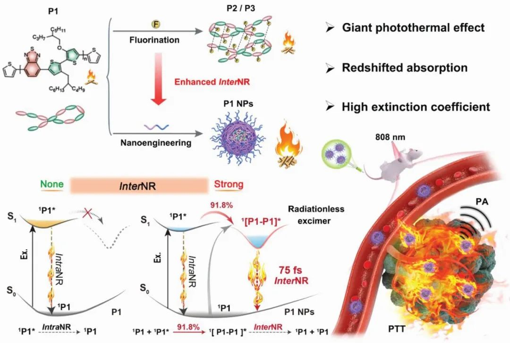
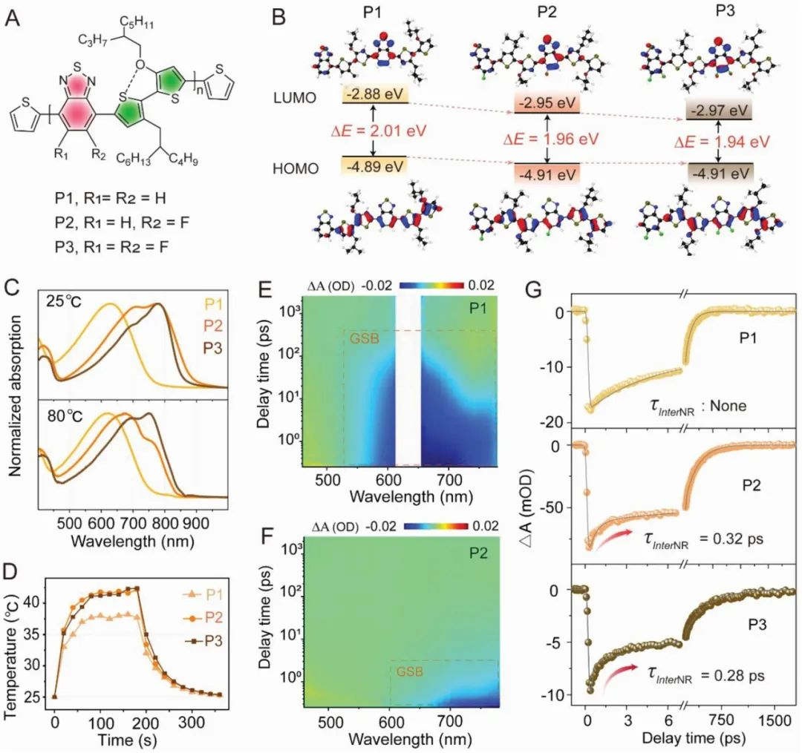
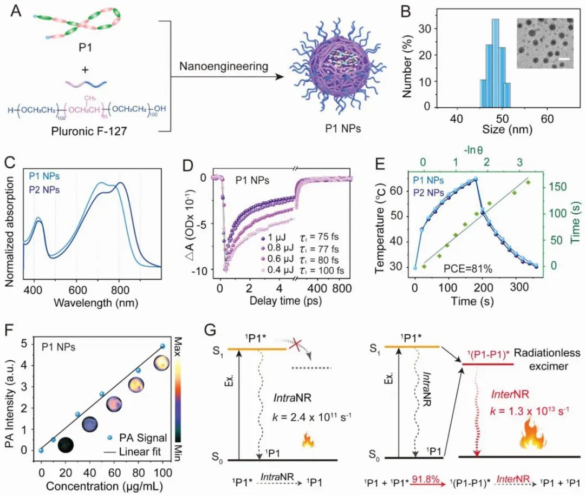
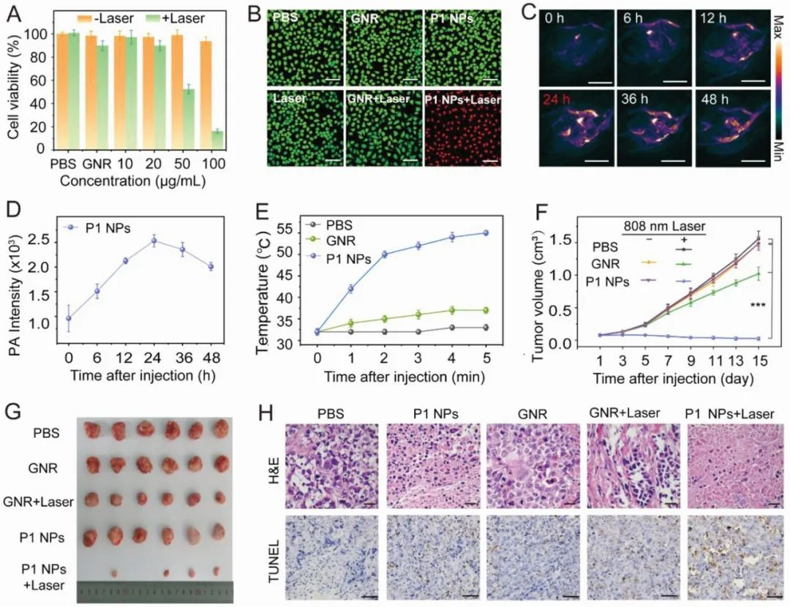

 

#  【Adv. Mater. 】绕过分子设计，通过聚集实现光热转化效率的调控 
 
 原创

Photothermal

光热

有机光热材料（OPM）是光声成像引导的光热治疗（PTT）的优良载体，可以在近红外光下产生局部热量，改善组织穿透和空间控制。目前提升吸收波长的策略主要集中在利用扭曲的D-A结构，但这种方法会降低材料的吸收能力，此外，这些策略对分子和空间的要求很高，导致合成过程复杂且耗时，限制了其广泛应用。除了分子内衰减，分子间的非辐射衰减同样会消耗能量，降低有机光热材料的性能，但是关于这方面的研究鲜有报道。

①

【设计、合成与表征】

P1-P3是以苯并噻二唑为强受体，3-烷氧基-3′-烷基-2,2′-位噻吩（TRTOR）为供体，通过Stille偶联反应合成的（图1A）。值得注意的是，作者在结构中引入了C-F健，它不仅缩小了化合物吸收的带隙（图1B），而且还产生了分子间的C-F--H氢键。

稳态吸收光谱显示，P2/P3之间通过分子间的C-F--H氢键形成二聚体（图1C）。与计算预测一致，P2和P3都显示出强烈的近红外吸收，最大波长约为780 nm，而没有引入氟原子的P1的最大吸收波长仅为630 nm。此外，P1在溶剂极性增加后显示出大幅度的吸收红移，而P2/P3的变化并不明显，作者推测P2/P3的异常现象可能是聚集形成了二聚体，而二聚体在高温下容易解离，因此作者通过P2和P3在高温下的吸收蓝移验证二聚体的猜想，二聚体的形成不仅影响了材料的吸收，同时对其光热转化效率的影响也比较大，P1、P2和P3的PCE依次为11.2%、12.6%和16.1%（图1D）。在邻二氯苯中，P1-P3的飞秒时间分辨光谱（fs-TA）展现出显著的基态漂白（GSB）信号（见图1E、F），相比于P1，P2/P3呈现出更快的非辐射衰变，尤其值得注意的是，P2中存在0.32 ps的飞秒成分，P3中存在0.28 ps的飞秒成分，而P1中则不存在，更有趣的是，在高温下，P2中的飞秒成分消失，而P3中的飞秒成分从0.28 ps延长到0.44 ps，因此，作者推断这种飞秒成分可能源于引发分子间非辐射衰变的二聚体。相对于常规分子内非辐射衰变，这种约十倍加速的分子间非辐射衰变速率在产生光热效应方面更为高效，从而解释了P1-P3的递增PCE。

**这些发现引发了一个有趣的问题，即是否通过其他简单策略，如聚集控制，引起更短寿命的二聚体可以启动更快的分子间非辐射衰变以进一步提高PCE。**

图1.a, A）P1-P3的分子结构。B) 基于B3LYP-D3(BJ)/6-311G(d,p)水平的密度泛函理论，P1-P3的二聚体的最高占用分子轨道和最低未占用分子轨道的计算结果。C) P1-P3在室温和高温下的o-DCB中的吸收光谱。D) o-DCB中P1-P3的温度是激光照射时间（730纳米，0.8瓦厘米-2）的函数，然后是自然冷却过程。E,F) 分别在630和808纳米激光脉冲下光激发后o-DCB中P1和P2的伪彩色fs-TA图谱。G）通过代表性波长（P1@700 nm，P2/P3@768 nm）采取的o-DCB中P1-P3的动力学轨迹和拟合线。

②

【光热性质及机理】

为了验证假设，作者将P1封装到F-127基质中来促进P1的聚集，以增强分子间非辐射衰变（图 2A），作为对比，作者通过简单的纳米工程制备了P2纳米颗粒，但是P3由于其较差的溶解性，无法制备成纳米颗粒。透射电子显微镜（TEM）和动态光散射（DLS）揭示了P1/P2 NPs具有均匀的球形形态，尺寸分别约为45和50 nm（图2B）。计算得到P1 NPs在780 nm处的摩尔消光系数为46.5 L g^−1 cm^−1（图 2C），远高于大多数报道的近红外有机光热材料。这些现象表明，由氟化引起的二聚体在P1/P2 NPs中是极少量的，而聚集引起的二聚体占主导地位。

飞秒时间分辨光谱显示出P1 NPs和P2 NPs中有非常高效的分子间非辐射衰变（图 2D），并且高达约90%的激发的P1/P2 NPs是通过这种超快的分子间非辐射途径回到基态的，而正式这些特征使得P1/P2 NPs的具备超高的光热转换效率，分别达到81%和79%（图 2E）。值得注意的是，这个光热转换效率值优于商业光热治疗剂金纳米棒（GNR），并且在报道的近红外有机光热材料中处于最高水平。意外的是，没有分子间C-F···H氢键的P1 NPs也具有与P2 NPs相似的分子间非辐射衰变动力学，进一步证明了简单纳米工程策略在增强分子间非辐射衰变以产生巨大光热效应方面的竞争优势。凭借这些优点，P1 NPs表现出与浓度线性相关的出色光声（PA）信号（图2F），此外，P1 NPs中产生巨大光热效应的分子间非辐射衰变动力学的机制可能是源于激基缔合物（图2G）：光照射后，相隔非常近P1分子形成了大量的激基缔合物（P1–P1）\*，之后它们通过超快的分子间非辐射衰变转变为两个基态P1，并伴随着巨大的光热效应。这第一次提供了对分子间非辐射衰变的起源和动力学的全面洞察。

图2.A) NPs的制备示意图。B）P1 NPs的DLS。插入的图片是P1 NPs的TEM图像。(比例尺：100纳米）。C）P1/P2 NPs的吸收光谱。D）P1 NPs在768纳米处的泵能量依赖的动力学曲线。E）P1/P2 NPs在808 nm照射（0.8 W cm-2）3分钟后自然冷却至室温的光热曲线。绿线：在冷却期间的线性时间数据与-ln θ的关系。F) 808纳米激发下P1 NPs的浓度依赖性PA强度，插入的图片是相应浓度下的PA成像。G）准分子介导的NR间衰减的示意图。(左图：O-DCB中的单分子P1，右图：P1 NPs）。

③

【体内、体外活性】

接下来作者评估了P1 NPs用于光热治疗的可行性。首先，作者验证了P1 NPs在水溶液中热稳定性和光稳定性，并确定了P1 NPs低的暗细胞毒性和高的光毒性（图3A），此外，作者采用了活/死细胞染色进一步地验证了纳米粒子光热诱导细胞凋亡的能力。

在体外研究结果的鼓舞下，作者用肿瘤小鼠模型评估了P1 NPs的体内PTT疗效。在进行体内抗肿瘤研究之前，作者通过实时的PA成像确定了肿瘤区域积累的最佳时间点为24小时（图3C,D）。在808纳米的激光照射5分钟内，体内光热图像显示P1 NPs处理的小鼠的肿瘤温度迅速升高到55℃（ΔT≈23℃）（图3E），而在相同条件下，GNR或磷酸盐缓冲盐水（PBS）处理的小鼠并没有明显的升温（GNR的ΔT≈5℃，PBS的ΔT≈1℃）。而光热治疗得到的结果也符合预期，与对照组的快速肿瘤生长相比，P1 NPs + Laser治疗组的肿瘤完全被根除（图3F，G），此外，H&E染色和TUNEL检测结果进一步表明P1 NPs+激光会造成癌细胞凋亡和坏死（图3H）。

图3. A）Hela细胞在808nm激光下与不同浓度的P1 NPs或GNR共同培养后的相对活力。B）不同处理后钙黄素-AM/PI染色的Hela细胞的显微镜图像。C) 小鼠通过静脉注射P1 NPs（200 µL，1 mg mL-1）全身给药后的实时PA成像。D)对注射后不同时间点的肿瘤部位的PA强度进行量化。E) 激光照射期间肿瘤区域的温度变化。F）不同治疗组的肿瘤体积变化（n = 6，\*\*\*p &lt; 0.001）。G) 不同治疗后第15天收获的肿瘤图像。H）治疗后15天牺牲的小鼠的肿瘤组织的H&E染色和TUNEL染色

④

【结论】

作者通过合理调控分子间非辐射衰变，实现了高光热转化效率的近红外有机光热材料的便捷获取。超快光谱进一步证明了激基体介导的分子间非辐射衰变，在产生更好的光热效应方面优于传统的分子内非辐射衰变。利用这种理论，作者通过简单的聚集控制策略，充分利用分子间非辐射衰变，制备了具有81%超高光电转换效率的高性能光热材料。同时，所得到的近红外光热材料在体内表现出高效的光热诊断治疗效果。

这项研究首次提供了对分子间非辐射衰变的深入解析，这种新的调控方式对开发更先进的近红外光热材料具有指导意义。此外，对分子间非辐射衰变的深入理解还对有机太阳能电池、有机发光二极管和近红外荧光成像等领域具有重要意义，这些领域同样需要抑制分子间非辐射能量损失。

Miao, X.; Yao, W.; Chen, R.; Jia, M.; Ren, C.; Zhao, H.; He, T.; Fan, Q.; Hu, W. Excimer‐Mediated Ultrafast Intermolecular Nonradiative Decay Enables Giant Photothermal Performance for Optimized Phototheranostic. Adv. Mater. 2023, 2301739. https://doi.org/10.1002/adma.202301739.

**关注公众号并回复doi，可获得原文下载链接**

[Nature Chemistry:聚集增强的亲金属作用的纳米光敏药物](http://mp.weixin.qq.com/s?__biz=MzkzOTI1OTMwNg==&amp;mid=2247483910&amp;idx=1&amp;sn=994ab76a56b8b8e2cb2ec77a9ac878c8&amp;chksm=c2f2e6c3f5856fd5775acc3e6fac5912dfc75de533bbdfe072ca265df7dfa63f5ebc2988dcb3&amp;scene=21#wechat_redirect)

[JACS:荧光材料何必只做成像](http://mp.weixin.qq.com/s?__biz=MzkzOTI1OTMwNg==&amp;mid=2247483894&amp;idx=1&amp;sn=cf6ef0d3c2deaf9c549a264449cc3bb3&amp;chksm=c2f2e533f5856c2595509d15f8e384f8d88b00685f0dfe4d82af30339211bec69a907905363a&amp;scene=21#wechat_redirect)

[JACS:还在用叠氮-炔？快来试试新型的生物正交反应](http://mp.weixin.qq.com/s?__biz=MzkzOTI1OTMwNg==&amp;mid=2247483883&amp;idx=1&amp;sn=6efed231961a5b2f378ab44c1fe718ee&amp;chksm=c2f2e52ef5856c38a8f02ae4314f4a7fe7165c0f077be7b6352af23746c9d7f6fe8c16d4c7bc&amp;scene=21#wechat_redirect)

预览时标签不可点

素材来源官方媒体/网络新闻

  继续滑动看下一个 

 轻触阅读原文 

    

