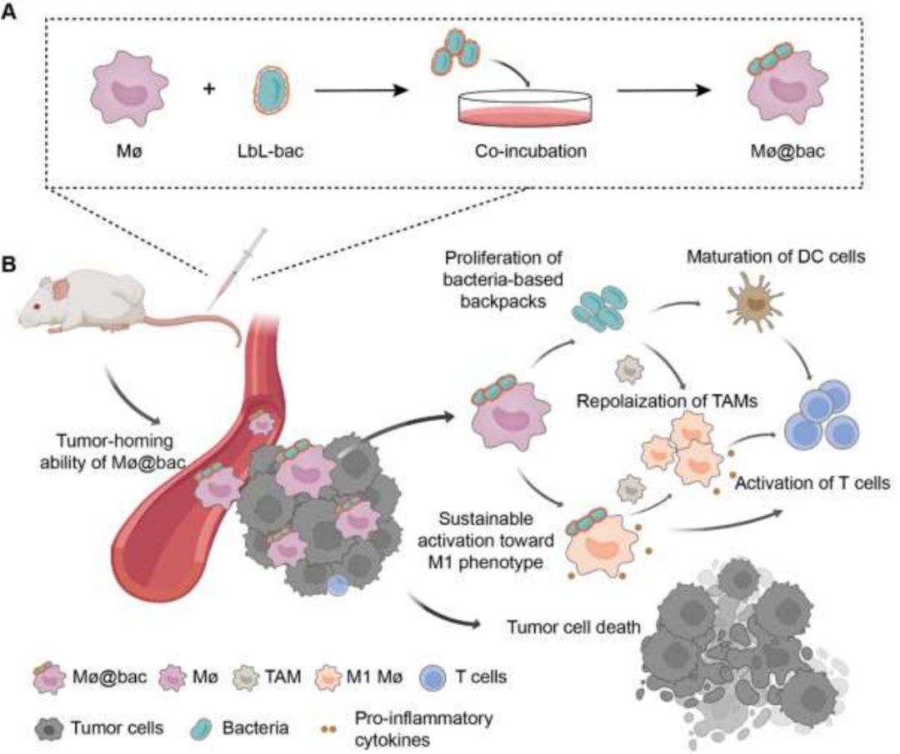
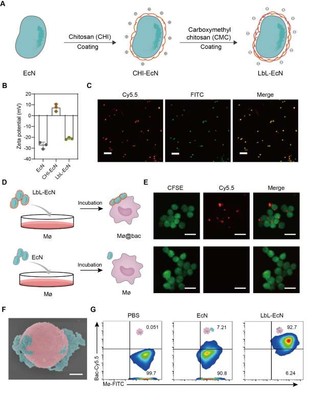
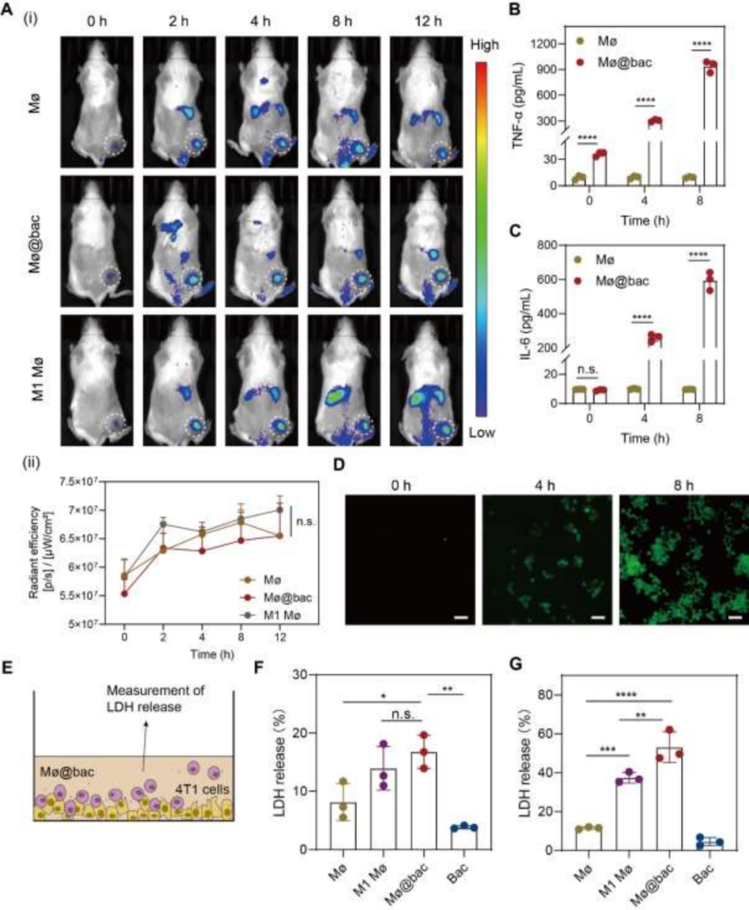
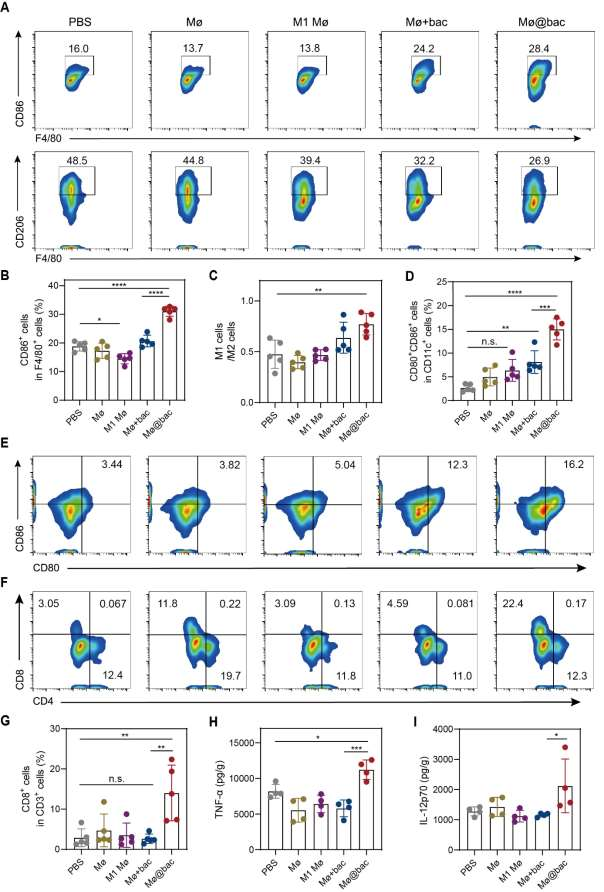

 

#  【Adv. Mater.】"背"上细菌不仅能促进M1型转变，还能重新极化肿瘤相关巨噬细胞 
 
 原创

Adoptive Cell Therapy

过继性细胞治疗

过继性细胞治疗已经成为有望用于癌症治疗的一种方法。然而，由于免疫抑制性肿瘤微环境（TME）内的细胞表型会动态地从抗肿瘤状态转变为促肿瘤状态，因此对实体肿瘤的巨噬细胞转移效果受到了限制。

引言

作者提出了一种基于细菌的背包（Mø@bac）概念，细菌可以附着在巨噬细胞上，利用细菌的天然免疫原性来引导体内细胞极化。这些附着在巨噬细胞上的细菌被称为“背包”。它们不仅富含促炎因子，还能在肿瘤组织中繁殖，从而持续激活Mø@bac朝着M1表型发展。此外，Mø@bac可以重新极化内源性的肿瘤相关巨噬细胞（TAMs），从而改造免疫抑制性的肿瘤微环境。

材料制备

作者选用非致病性品系大肠杆菌 Nissle 1917（EcN）作为背包构建的模型细菌。细菌表面的粘附性纳米涂层是通过逐层组装制成的，由两层多糖交替构成，分别是壳聚糖（CHI）和羧甲基壳聚糖（CMC）（图2A）。由于EcN带负电荷，阳离子聚合物CHI首先通过与EcN共培养15分钟而沉积在表面。之后，EcN呈现出相反的ζ电位+7 mV（图2B）。然后， CMC吸附在EcN表面，导致ζ电位为-20 mV（图2B）。共聚焦激光扫描显微镜（CLSM）、透射电子显微镜（TEM）图像及扫描电子显微镜（SEM）都表明了两者的有效结合（图2C）.

之后，LbL-EcN与巨噬细胞共培养以获得覆盖有细菌的巨噬细胞（Mø@Bac）（图2D）,同样，通过共聚焦激光扫描显微镜（图2E）和透射电子显微镜（图2F）可以证实两者的有效结合,并且，作者使用流式定量的分析了这两者结合的效率（图2G），通过优化LbL-EcN的浓度，作者可以做到超过92.7%的巨噬细胞上都附着有细菌，并且这些细菌可以长时间滞留在细胞表面。

体外测试

为了探究Mø@bac的肿瘤的细胞毒性，作者首先在小鼠皮下瘤模型中研究了Mø@bac的运输时间，结果表明，Mø@bac可以在2小时内到达肿瘤部位，并且在12小时内可以稳定的积累（图3A）。而对炎症细胞因子 IL-6 和 TNF-α、活性氧物质ROS及一氧化氮合酶的定量测定表明Mø@bac组的小鼠的几项验证指标都有显著提升，因此作者推断Mø@bac可以向促炎表型极化，并产生细胞毒性分子来杀死肿瘤细胞。而肿瘤消融实验也证明了，与Mø相比，Mø@bac对4T1细胞的肿瘤溶解效率要高得多（图3E-G）。此外，作者还验证Mø@bac可以抵抗免疫抑制性TME并在体内维持其M1表型的假设，在注射了药物两天后，使用流式细胞术分析了 CD80（M1 标记物）和 CD206（M2 标记物）的表达情况，结果表明，虽然 M1 Mø 在接种前表现出较高的 M1 表型表达，但 Mø@bac 在实体瘤内至少 48 小时内强烈表现出促炎症表型的特征。而由于 Mø@bac 不断极化为 M1 表型，作者因此推断 Mø@bac 可以激活 TME 中周围的免疫细胞，尤其是 TAMs，从而促进免疫反应，而这一推断也Transwell实验得到了证实，作者将 TAMs 的这种极化归因于以下因素：(i) 细菌背包释放的细菌成分的免疫原性；(ii) Mø@bac 以类似旁分泌物的方式分泌的促炎因子。

体内

由于 Mø@bac 的免疫激活功效已在体外得到验证，作者接下来进行了小鼠体内测试。首先，作者评估了材料的安全性，作者收集了注射后 1、4、7 和 10 天的小鼠血液样本，并使用生化分析仪和血常规分析仪进行了分析，结果表明，经过Mø@bac处理的小鼠在多项生化指标上没有出现异常，表明这种材料具有一定的生物安全性，同时也不会引发炎症。

接着，作者通过对比肿瘤体积的变化确定了Mø@bac的肿瘤抑制效果，与空白组相比，Mø@bac的肿瘤抑制率达到了64.5%，但这是多种因素共同作用的结果，首先作者发现，服用 Mø@bac 可使 CD86 的表达率从 16.0% 上升至 28.4(图 A),同时，Mø@bac 使 CD206 的水平从 48.5% 降至 26.9%，且 M1/M2 的比例明显高于 PBS 处理组。这表明 Mø@bac 能够降低 TME 中 TAMs 的比例，从而大大提高免疫疗法的疗效。此外，作者还检测了淋巴结中 DC 细胞的成熟情况，结果表明 Mø@bac 使 DC 成熟率从 3.44% 显著提高到 16.2%（图 4E），与 PBS 处理的肿瘤相比，Mø@bac 处理的肿瘤的 TNF-α 和 IL-12p70 分别增加了 1.7 倍和 1.4 倍（图 4F，I）。这些结果表明，Mø@bac不仅能使TAMs重新极化为M1表型，还能促进DC细胞的成熟和杀伤肿瘤的T细胞的增值，从而促进更强大的抗肿瘤免疫反应。

**05**

结论

总的来说，作者报道了一种基于细菌的背包策略，通过将细菌附着在巨噬细胞表面（Mø@bac），可以可持续地控制体内移植巨噬细胞的表型特征。实验证明，Mø@bac能够在相对短的时间内迁移到肿瘤部位，在肿瘤微环境中保持其M1表型，并增强抗肿瘤功效。此外，Mø@bac能够重新极化内源性肿瘤相关巨噬细胞，刺激细胞毒性T细胞，并重塑肿瘤免疫抑制性微环境。如在皮下和原位4T1乳腺肿瘤模型中展示的那样，与仅注射Mø或M1 Mø相比，Mø@bac的给药显示出了更强大的抑制肿瘤能力。值得注意的是，与仅与细菌混合（Mø+bac）相比，这种基于细菌的背包对细胞表型的调控效率更高。同时，由于纳米涂层的保护，Mø@bac没有显示出任何全身性炎症反应，具有进一步临床应用的巨大潜力。

An, J.; Han, Z.; Qin, Y.; Li, C.; He, J.; Zhang, X. Bacteria‐based Backpacks to Enhance Adoptive Macrophage Transfer against Solid Tumors. Advanced Materials 2023, 2305384. https://doi.org/10.1002/adma.202305384.

**关注并回复文章DOI获取全文：**

10.1002/adma.202305384

[【Angew】定点开启，无毒副作用的光敏剂设计新方法](http://mp.weixin.qq.com/s?__biz=MzkzOTI1OTMwNg==&amp;mid=2247484193&amp;idx=1&amp;sn=0f1905dd02260722dbb84b9bac54e187&amp;chksm=c2f2e7e4f5856ef2f93a30a066edb3f5ee57744b277b59becb2084ec05cfe58b4250a6420c0d&amp;scene=21#wechat_redirect)

[【JACS】荧光探针容易光漂白？这篇两张图的顶刊教你提高光稳定性](http://mp.weixin.qq.com/s?__biz=MzkzOTI1OTMwNg==&amp;mid=2247484125&amp;idx=1&amp;sn=8bf9c01a22d0f49adedea18944bd8772&amp;chksm=c2f2e618f5856f0ea0672f190bcc2c23148d07cef50c856ea61095f4cebdbe795ee75919fc1d&amp;scene=21#wechat_redirect)

[【Angew】发愁吸收波长不够？看看这种设计思路](http://mp.weixin.qq.com/s?__biz=MzkzOTI1OTMwNg==&amp;mid=2247484091&amp;idx=1&amp;sn=4be856d9ec100c467cb9bf607fb4f0ec&amp;chksm=c2f2e67ef5856f6822e7b085b4d6c2d116f82297e80dd8bf26fff6d0485e5b2ebeaad06ba539&amp;scene=21#wechat_redirect)

预览时标签不可点

素材来源官方媒体/网络新闻

  继续滑动看下一个 

 轻触阅读原文 

    

