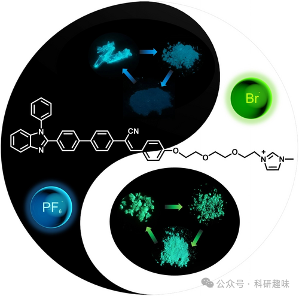
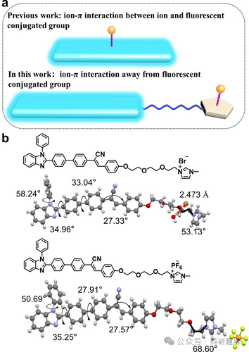
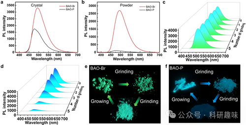
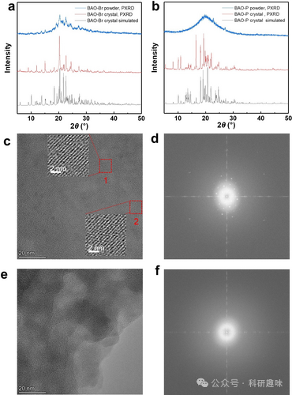
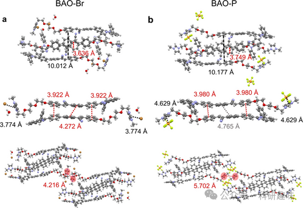
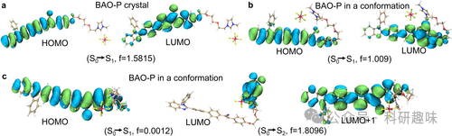
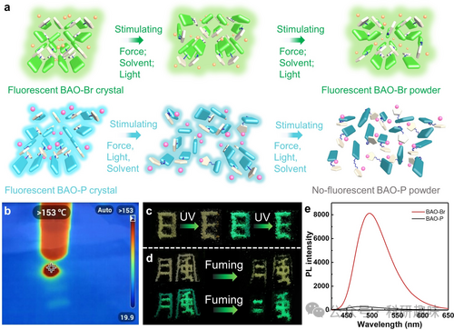

 

#  【Angew】一个离子引发的不同，Br还是PF6，不仅影响聚集模式，更影响荧光性能 
 

Grenemal

读完需要

13

全文字数 4000 字

**有机荧光聚集体**

Organic Fluorescent Aggregates

•

两种含有相同共轭基团和不同阴离子(Br 和 PF6)的有机固态发光分子在外部刺激下表现出完全不同的荧光行为。基于溴离子的分子在晶体和无定形粉末中表现出很高的荧光量子产率。以六氟磷酸根离子为基础的分子在晶体中具有高荧光量子产率，而在无定形粉末中的荧光量子产率则非常低。

**Introduction**

有机分子聚集体，凭借其可调的化学结构、多变的分子构象与堆积，以及多样化的非共价相互作用，展现出了丰富的光物理与光化学特性。这些特性使得有机发光聚集体在光电器件、光波导以及传感等领域得到了广泛应用。自H-聚合物、J-聚合物到聚集诱导发光(AIE)概念的提出，有机发光聚合体的种类与数量得到了迅速扩展。尽管单组分分子聚集体的光致发光特性通常较为确定，但某些分子聚集体在结晶多晶体形成或外部刺激(如光、热、力等)作用下，其分子结构、堆积或构象会发生变化，进而展现出不同的光致发光现象。这些分子被视为智能响应材料，能够在特定刺激下提供反馈信号。

当前，这些分子对外界刺激的反应模式主要涵盖化学反应和物理变化两类。化学反应涉及化学键的断裂、生成以及异构化，但这类反应的分子官能团种类相对较少。物理变化则包括分子堆积模式、分子间距离和相互作用力的变化。然而，单纯依赖物理变化实现光致发光变化的响应分子系统仍缺乏普适性的分子设计策略。因此，探索响应性有机发光聚合体的新分子构建策略显得尤为重要。

有机分子的光致发光性能受到其共轭结构、分子内与分子间相互作用的显著影响。这些相互作用包括π-π相互作用、C-H⋅⋅π相互作用、离子-π相互作用、氢键和卤素键。特别地，利用离子-π相互作用设计有机发光聚合体已成为一个新兴且前景广阔的研究领域。这种策略将离子的特性与发光特性相结合，为生化成像分析等领域提供了新途径。通过在固态非发光或弱发光共轭分子中引入离子-π相互作用，可以有效转化为固态强发光共轭分子。这是因为离子-π相互作用能够削弱不利于光致发光性能的π-π相互作用，通过增加分子间距离或构型扭转来实现。

当前研究主要聚焦于在共轭分子中引入不同离子以探究其对发光性能的影响。这些分子中，离子位于发光共轭基团上，与发光共轭基团产生离子-π相互作用。然而，对于离子-π相互作用与荧光共轭基团之间存在柔性烷基链间隔时，分子聚集体在刺激下的发光行为的研究尚显不足。

图1. (a) 本研究与之前研究的对比图。(b) 通过 SCXRD 获得的 BAO-Br 和 BAO-P 的分子结构和分子构型。

**Results and Discussion**

为了深入研究BAO-Br和BAO-P的光学性质，作者首先测量了它们在稀溶液中的紫外可见吸收光谱和光致发光光谱。BAO-Br和BAO-P在不同稀溶液中的紫外可见光谱和光致发光光谱基本一致，这表明在单分子分散状态下，这两种分子具有相似的光物理性质，且荧光基团相同，受离子影响较小。进一步地，BAO-Br和BAO-P在不同含水量的二甲基亚砜(DMSO)/水混合溶液中的PL光谱变化说明，这两种化合物再形成聚集体时均表现出较高的荧光强度，表明它们具有典型的聚集诱导发光(AIE)特性。

如图2a所示，在相同的测试条件下，BAO-Br晶体的荧光强度高于BAO-P晶体，且BAO-Br晶体的发射峰波长相较于BAO-P晶体红移了约20 nm。令人惊讶的是，图2b显示这两种分子在非晶态粉末中的荧光强度差异更为显著。BAO-Br仍保持了较高的荧光强度，而BAO-P的荧光强度则大幅下降。荧光量子产率(QY)也验证了这一观察结果。如表1所示，晶体态和粉末态的BAO-Br具有相似的发射波长和荧光量子产率，QY分别为69.51%(晶体)和68.36%(粉末)。对于BAO-P，虽然晶体态和粉末态的发射波长相似，但荧光量子产率从晶体态的39.97%显著下降到粉末态的1.35%，这进一步证明了分子排列对其荧光强度具有显著影响。在研磨过程中，作者观察到BAO-Br和BAO-P的荧光量子产率发生了相应变化，这两种分子的荧光寿命与荧光量子产率具有相同的变化趋势。在77 K时，无论是晶体还是粉末，BAO-Br和BAO-P的荧光寿命均比室温下的样品延长了十几纳秒，这是由于在77 K时非辐射跃迁受到了抑制。

图 2. (a) BAO-Br 和 BAO-P 晶体的聚光光谱。(b) BAO-Br 和 BAO-P 粉末的 PL 光谱。(c) BAO-Br 晶体在研磨过程中的 PL 光谱变化。(d) BAO-P 晶体在研磨过程中的聚光光谱变化。(e) 磨削过程中 BAO-Br 的荧光物理图像。(f) 磨削过程中 BAO-P 的荧光物理图像。

Table 1. Photophysical properties of crystals and powders of BAO−Br and BAO-P.

|  | λem (crystal) | λem (powder) | QY (crystal) | QY (powder) | Fluorescence lifetime (crystal) | Fluorescence lifetime (powder) |
| --- | --- | --- | --- | --- | --- | --- |
| BAO-Br | 494 nm | 493 nm | 69.51 % | 68.36 % | 11.39 ns | 11.73 ns |
| BAO-P | 474 nm | 471 nm | 39.97 % | 1.35 % | 5.49 ns | 0.97 ns |

为了详尽描述BAO-Br和BAO-P在从晶体至粉末状态转变时荧光强度的变化，图2c-2f呈现了它们在研磨过程中的PL光谱及相应的物理形态图像。对于BAO-Br晶体，尽管其物理形态发生显著变化，但其研磨前后的PL光谱却呈现出高度的一致性。然而，随着研磨时间的延长，BAO-P晶体的荧光强度显著衰减至几乎无法探测的水平。值得注意的是，当将BAO-P粉末重新生长为晶体时，其荧光强度得到了显著恢复。**这一现象不涉及任何化学反应，而是纯粹由物理变化所导致。**

为了深入理解这一现象背后的机理，作者首先借助X射线衍射(XRD)技术对BAO-Br和BAO-P的晶体及粉末样品进行了相结构分析。如图3a所示，BAO-Br晶体展现出尖锐的衍射峰，与计算所得曲线高度吻合，表明其高度有序的晶体结构。经过多次研磨后，BAO-Br粉末的XRD图谱中仍可见到一些尖锐的衍射峰(如2θ=15.1、20.4、22.6等)，这表明即使在粉末状态下，BAO-Br依然保持了一定的结晶性。相比之下，BAO-P粉末的XRD图谱(图3b)几乎未出现尖锐的衍射峰，表明其粉末样品处于完全的无定形状态。

图 3(a) BAO-Br 的 XRD 图样；(d) BAO-P 的 XRD 图样。(c) BAO-Br 粉末的 HRTEM 图像。(d) BAO-Br 的电子衍射图。(f) BAO-P 的电子衍射图案.

在晶体形态时，它们都维持着规则的扁平片状构造。然而，在粉末形态下，BAO-Br展现为小片状，而BAO-P则表现为无定形。这一点得到了高分辨率透射电子显微镜(HRTEM)图像和电子衍射图的进一步证实。如图3c和3d所示，BAO-Br粉末清晰可见晶格条纹，且其电子衍射图谱上出现衍射点，这标志着晶体结构的存在。这可能是BAO-Br在晶体和粉末状态下均能保持相似荧光特性的一个关键因素。相对地，图3e和3f揭示出BAO-P粉末既无晶格条纹，也无衍射斑点，表明其处于非晶态。BAO-Br与BAO-P粉末在微观结构上的差异，可能源于溴离子与咪唑环之间更为强烈的结合能，以及BAO-Br分子更为紧密的堆积方式。

图 4通过 SCXRD 分析获得的两种分子填料模式的分子间距离。(a) BAO-Br；(b) BAO-P.

在化学和材料科学中，分子的构象对有机分子的荧光性能具有显著影响，特别是在有机发光聚集体中。图5展示了对BAO-P分子的三种稳定构象的详细分析和理论计算。

图5中呈现了最高占据分子轨道(HOMO)和最低未占据分子轨道(LUMO)的分布。值得注意的是，HOMO和LUMO均主要定位于BAO-P晶体中的荧光共轭基团上。在这种构象下，BAO-P分子能够展现出强烈的荧光性能。

然而，当烷氧基链和六氟磷酸根阴离子发生移动时，一种新的分子构象出现，其特点是LUMO位于咪唑阳离子附近。具有这种构象的BAO-P分子，其荧光性能会显著减弱。

这种荧光性能的变化归因于离子-π相互作用和分子间相互作用的减弱。在外界刺激的作用下，BAO-P分子的构象发生变化，进而影响了其荧光性能。因此，对BAO-P分子构象的深入理解和控制，对于优化其荧光性能具有重要意义。

图 5 BAO-P 的 LUMOs 和 HOMOs。(a) BAO-P 晶体。(b) BAO-P 的一种构象。(c) 另一种构象中的 BAO-P.

图6a描绘了两种分子在外部刺激下的堆积状态变化示意图。在外部刺激下，BAO-Br分子仍能保持微晶或有序堆积的状态，这归因于其较强的离子-π相互作用和分子间作用力，因此其荧光变化相对较小。然而，对于离子-π相互作用和分子间作用力较弱的BAO-P分子，在外部刺激下，其堆积模式和分子构象会发生显著的变化，导致荧光强度出现明显的变化。

利用BAO-P分子的荧光可变性和BAO-Br分子的荧光稳定性，可以制备出刺激响应型材料，这些材料在信息存储和防伪等领域具有潜在的应用价值。使用365 nm波长、400 mW cm²的点光源照射由小BAO-P晶体组成的数字“8”，该数字逐渐转变为“3”、“7”，并最终变为数字“1”。这种变化归因于BAO-P聚集体强大的光热效应(如图6b所示)，当达到熔点后，其分子构象发生变化，导致荧光淬灭。相比之下，光热效应对BAO-Br聚集体的影响并不显著。此外，BAO-Br的熔点高于BAO-P，这也进一步证实了BAO-Br中存在更强的分子间相互作用。

在图6c中，展示了由两个晶体组成的数字“8”在365纳米光照射下的变化过程，该数字最终转变为了字母“E”。其中，字母“E”由小的BAO-Br晶体组成，而缺少的数字“1”则是由小的BAO-P晶体构成。这一现象进一步体现了两种分子在外部刺激下的不同响应特性。

图 6 (a) 两个分子在外部刺激下的堆积状态变化示意图。(b) 紫外线照射下 BAO-P 晶体的红外热成像照片。(c) 紫外光照射下 BAO-Br 和 BAO-P 小晶体变化的物理图像(从左到右：室内光照下和 365 纳米光照下)。(d) BAO-Br 和 BAO-P 小晶体在溶剂熏蒸下变化的物理图像(从上到下：室光下和 365 纳米光下)。(e) 两种晶体在溶剂刺激下的聚光光谱.

此外，这两种晶体在响应溶剂刺激时表现出显著的差异。为展示其实际应用潜力，作者以中国著名的泰山石刻为设计灵感，如图6d所示。两个汉字“月”和“风”由精心布局的BAO-Br和BAO-P小晶体组成，其中核心部分采用BAO-Br晶体，而边缘则选用BAO-P晶体。在二氯甲烷的熏蒸作用下，汉字边缘的BAO-P晶体转变为无荧光的粘稠状态，而BAO-Br晶体则几乎保持不变。这一变化导致“月”和“风”两个汉字的荧光边界消失，形成新的汉字组合，寓意着“风月无边”——中文中用以描述大自然美景无穷无尽的意境。

图6e详细展示了两种晶体在溶剂刺激下的荧光光谱变化。经二氯甲烷激发后，BAO-Br晶体的荧光强度远高于BAO-P晶体。这一对比凸显了BAO-P晶体在各类刺激下易于发生荧光变化的特性，而BAO-Br晶体在相同刺激下则能维持稳定的荧光表现。这种性质差异在化学和材料科学领域具有重要的应用价值，特别是在信息存储、显示技术和传感材料等方面。

**Conclusion**

在外部刺激(如研磨、光照和溶剂熏蒸)下，BAO-Br分子能够保持一定的结晶性，这一特性通过X射线衍射(XRD)和高分辨率透射电子显微镜(HRTEM)得以验证。值得注意的是，无论是晶体还是无定形粉末形态，BAO-Br均展现出高荧光量子产率。然而，BAO-P晶体在荧光量子产率上显著高于其粉末形态。

研究结果表明，在相同的外部刺激下，BAO-Br的荧光强度保持稳定，而BAO-P的荧光强度则出现显著变化。这一独特现象为信息存储和防伪领域提供了潜在的应用价值。本项工作通过间隔荧光共轭基团与离子-π相互作用位点，为响应性有机发光聚合体的设计提供了一种有效的策略。

## **参考文献**

**Ref**

Zhu, G.; Liu, Z.; Qi, Q.; Xing, J.; Li, Q. Responsive Organic Fluorescent Aggregates Based on Ion‐π Interactions Away from Fluorescent Conjugated Groups. Angew Chem Int Ed 2024, e202406417. https://doi.org/10.1002/anie.202406417.

**点击蓝字 关注我们**

相关阅读

Fluorescence

荧

光

**1**

[【JACS】不要光，不要氧，无副作用，新型ROS治疗试剂实现更智能的癌症治疗](http://mp.weixin.qq.com/s?__biz=MzkzOTI1OTMwNg==&amp;mid=2247488411&amp;idx=1&amp;sn=705561c7c1dfc50cf9e83ab2c78c0434&amp;chksm=c2f2f75ef5857e48a06ff806844244f72abefb445b1990cbf488ca179e44646435440d6e515f&amp;scene=21#wechat_redirect)

**2**

[【Adv. Mater.】探索NIR-II J-聚集体：形成策略、生物成像与治疗诊断的前沿应用](http://mp.weixin.qq.com/s?__biz=MzkzOTI1OTMwNg==&amp;mid=2247485467&amp;idx=2&amp;sn=c0603094ac8f55137abd3379a3811858&amp;chksm=c2f2ecdef58565c8830a1bab61e4f9c1ebc7ac25c2f1faa269ac5cf0c45d9362492b0d29cc06&amp;scene=21#wechat_redirect)

**3**

[【Adv. Mater. 】绕过分子设计，通过聚集实现光热转化效率的调控](http://mp.weixin.qq.com/s?__biz=MzkzOTI1OTMwNg==&amp;mid=2247485319&amp;idx=2&amp;sn=4464d9c06d14e019029bd24be6f100e1&amp;chksm=c2f2e342f5856a548dc9cb01a13b626335787014bdd168f174af56133b6ec3adb5dee902d558&amp;scene=21#wechat_redirect)

预览时标签不可点

素材来源官方媒体/网络新闻

 [阅读原文](javascript:;) 

  继续滑动看下一个 

 轻触阅读原文 

   

