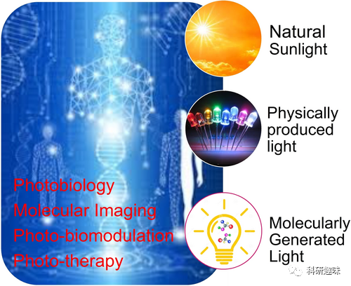
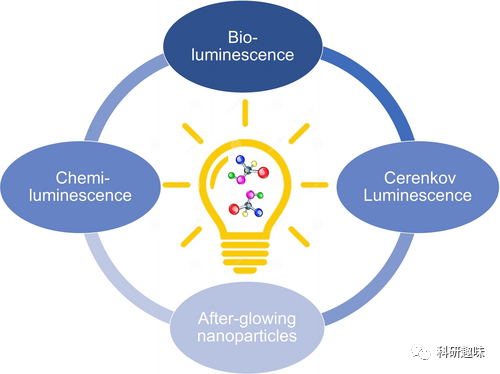
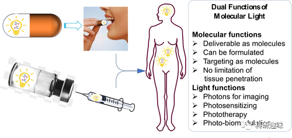
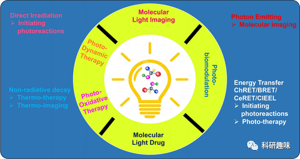
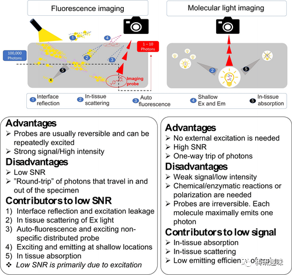
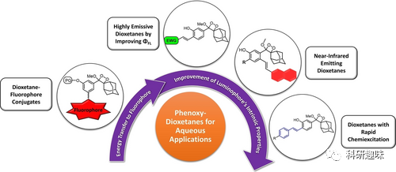
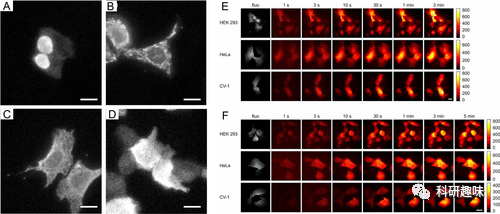
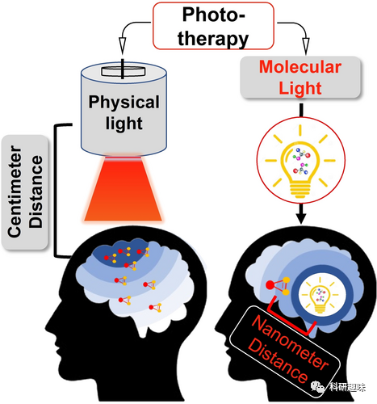
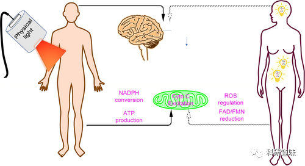
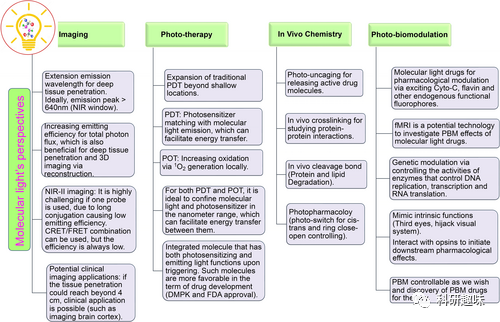

 

#  【Angew】分子光，更有潜力的活体成像及光动力治疗方法！ 
 

Grenemal

读完需要

24

全文字数 7700 字

**Content**

**1 Introduction**

1.1 Light and medicine

1.2 Molecular light

**2 Molecular light applications**

2.1 Molecular light imaging

2.2 Bioluminescence imaging

2.3 Chemiluminescence imaging

2.4 Cerenkov luminescence imaging (CeLI)

2.5 Auto-bioluminescence imaging

2.6 Molecular light for microscopic imaging

**3 Molecular light for photo-therapy**

3.1 Molecular light for photodynamic therapy (PDT)

3.2 Molecular light for photo-oxidation therapy

**4 Molecular light for photo-biomodulation (PBM)**

4.1 Photo-modulating pharmacological effects

4.2 Genetic manipulation

4.3 Brain disorders

**5 Perspectives of molecular light**

**6 Challenges and limitations**

**7 Conclusion**

**1 Introduction**

**Light and medicine**

人类生活与光线密不可分，自然阳光影响着我们的昼夜节律，室内光线则支持着各种活动。尽管光在进化中扮演着不可或缺的角色，其功能似乎主要局限于视觉。然而，大量研究表明光对人类健康有治疗和生物功能，光医学在医学领域得到广泛应用。尽管光的穿透能力有限，多数研究集中在浅表组织，但如果能有效将光传递至深层组织，光的生物功能将迎来更广阔的可能性。

然而，如何将光有效地送入深层组织是一个挑战。与包装药物分子不同，将自然阳光和照明光包装成药剂并在体内传递是不可行的。要实现像分子一样的光传递，光必须与分子有关联。实际上，光可分为自然光、设备产生的物理光和分子产生的光三大类，其中分子产生的光被称为 "分子光" 或 "自发光" 分子。

图1. 光的几种常见来源

**Molecular light**

分子光具有三大来源：生物发光通过荧光素及其荧光素酶之间的酶促反应产生、化学发光通过化学反应产生、以及塞伦科夫发光通过介质中分子的极化产生。这些分子光具有共同特征，其中分子是光的载体，光与发光分子的高能中间体或激发态相关，且可用于体内生物医学应用。

图2. 分子光的主要来源

分子光的特性使其具有双重功能，既是分子又是光源。它几乎可以无限穿透组织，这是与自然光和物理光显著区别的地方。能量释放/传递的途径主要有四种：光子发射、化学或生物发光共振能量转移、照射附近分子以及非辐射衰变。这些途径为分子光在体内的多种应用奠定了基础，包括分子成像、光动力疗法、体内光反应和作为分子光药物在生理效应、光药理学、光生物催化、光酶、以及基因和蛋白质表达方面的应用。在接下来的章节中，将介绍分子光在这些方面的应用见解和最新进展。

**2 Molecular light applications**

**Molecular light imaging**

光学成像模式中，分子光学成像可分为基于吸收和基于发射的两类。基于吸收的成像包括近红外光谱成像（NIRS）和光声成像（PAI），而基于发射的成像则包括荧光成像和分子光成像。分子荧光成像是临床前研究中常用的技术之一，但其存在几个激发光引起的内在局限性，例如对其他含荧光分子的样本自发荧光的干扰、较短波长激发光在穿透组织时的问题等。这些问题造成了荧光成像信噪比低的重要原因。

图3. 分子光的双重性

幸运的是，分子光学成像可以解决部分荧光成像的问题，因为其不需要外部激发光，可以提供较高的信噪比。例如，生物发光成像很容易达到大于1000的信噪比。化学发光成像在信噪比方面也具有优势。相比之下，荧光成像的信噪比通常较低。分子光学成像不同于荧光成像的重要优势之一是其在相同发射波长下的组织穿透能力更强，尤其是在近红外荧光的辐射效率方面。最近的研究表明，化学发光成像可以实现比荧光成像更大范围的组织穿透。

图4. 分子能量释放的四种形式及其对应的生物医学应用

分子光学成像已被广泛用于分子成像，包括生物发光成像（BLI）、化学发光成像（ChLI）、Cerenkov发光成像（CeLI）和分子余辉成像（MAI），尤其在临床前动物研究中应用广泛。近年来，一些研究表明CeLI在临床研究中具有潜力，但尚未在临床诊断和手术指导方面得到FDA批准。

**Bioluminescence imaging**

这一章节总结了近年来在分子光学成像领域取得的令人印象深刻的研究进展。BLI（生物发光成像）因其无需外部激发光、特异性高等特点，在体内肿瘤成像中具有极强的信号和高信噪比，被广泛应用于生物医学研究。

图5. 荧光成像和分子光成像的途径及优劣势

其中的几个研究重点：

- **近红外BLI用于脑深部成像和功能研究**：利用萤火虫荧光素酶及其改进版本在小鼠中实现对神经元活动的监测，尤其是针对 c-fos-tTA 小鼠模型，这种技术对神经元活动 BLI 有着显著应用。
- **BLI用于阿尔茨海默病研究**：对Aβ（β淀粉样蛋白）物种的水平进行报告，在AD（阿尔茨海默病）小鼠模型中监测Aβ斑块的释放变化。
- **纳米荧光素酶（NanoLuc）的应用**：利用分子量较小的荧光素酶及其改进版本，实现更广泛的应用，如Antares的开发用于肿瘤追踪和CAR-T细胞监测。
- **深度学习用于从头设计荧光素酶**：利用人工智能和机器学习方法设计出新型的、具有高选择性和小分子量的人工荧光素酶，可能用于多重和正交BLI。
- **自由移动的秀丽隐杆线虫的自主BLI**：构建了一种名为AMBER的生物发光传感器，用于监测线虫的膜电位变化，具有较高的信噪比和记录自由移动线虫神经元活动的能力。
- **体内监测的便携式生物发光平台**：展示了一种可行性，通过注射荧光素酶的方式，实现在小鼠体内监测酶活性水平，甚至扩展至大型动物和人类尸体。
- **用BLI测定微生物群和人体粪便的胆盐水解酶活性**：通过萤火虫荧光素与胆汁酸共轭，实现对肠道微生物群中酶活性的监测，可能对研究肠道微生态起重要作用。
- **用于监测线粒体膜电位的BLI**：利用BLI监测不同器官的线粒体膜电位变化，提供一种低成本、高信噪比的方法。
- **近红外-II BLI**：利用BRET/FRET/FRET与纳米粒子结合，实现在近红外-II窗口进行分子光成像，提供较高信噪比和空间分辨率。

**2.3 Chemiluminescence imaging**

相比于荧光成像，化学发光技术有其局限性，如信号较低、探针不可逆以及对化学反应产生高能中间产物等。然而，近年来研究者们通过利用Schaap二氧杂环丁烷等高能中间体，重新探索了化学发光技术。Shabat小组等人发表了一系列关于具有高发射效率和长发射波长的Schaap二氧杂环丁烷衍生物的文章，展示了其潜在应用。

图6. 开发适用于生物成像的苯氧基-二氧杂环戊二酮化学发光探针的方法和进展

与生物发光成像不同，化学发光成像无需外源酶启动化学反应，避免了生物工程的复杂性。但是，化学发光成像的信号特异性通常比生物发光成像低，因为生物发光成像中，高信号特异性源自工程荧光素酶。尽管在信噪比上化学发光成像与生物发光成像相比较低，但一些化学发光探针具有自动氧化功能，不依赖于酶或反应触发，如含有咪唑并[1,2-a]吡嗪-3(7H)-酮（IPO）分子的成像探针。这些探针不仅可以作为不依赖荧光素酶的化学发光探针，还能在没有荧光素酶辅助的情况下与氧气发生反应，被称为“自氧化”。然而，自氧化反应可能降低了信号特异性，因为体内的氧气固有氧化作用可能产生背景信号。

最近的研究中，设计了一种基于IPO的化学发光探针ADLumin-1，用于检测Aβ物种。这个探针对氧气敏感而不是对活性氧物种敏感，当ADLumin-1与Aβs结合时，自动氧化产生的化学发光信号被进一步放大。这种探针不仅在体外和体内对Aβ物种有较高的敏感性，而且可能在错误折叠蛋白成像以及其他领域如tau成像和α-突触核蛋白成像方面具有潜在应用。

尽管化学发光的绝对强度通常比生物发光低约10000倍，但对提高发射效率和延长发射波长的探索仍在进行。某些研究致力于提高发射效率和延长发射波长，例如，提出了ChRET（化学引发的电子交换发光）的概念，通过化学引发的电子交换传递能量。此外，分子余辉成像作为一种新型的化学发光成像技术，近年来也得到了积极研究，具有潜在的组织穿透能力和临床应用前景.

**Cerenkov luminescence imaging (CeLI)**

CeLI（Cerenkov Luminescence Imaging）是一种新兴的成像技术，利用放射性同位素或示踪剂产生的带电粒子（如 β+ 和 β-）在运动过程中发出的Cerenkov辐射进行成像。这种辐射发光的光谱覆盖了从紫外线到可见光谱（200-900 nm）的范围，其中500 nm-900 nm的辐射可用于体内成像目的。CeLI具有诸多优势，包括可以使用经FDA批准的成像剂和相对廉价的光学成像设备。

然而，CeLI存在成像信号较低的缺点。尽管近年来成像设备的检测灵敏度有所提高，CeLI在临床研究中的可行性仍然受到限制。大多数研究都集中在对浅表肿瘤，如甲状腺、前列腺和颈部等，进行成像。

CeLI的显著优势之一是可以使用量子点等荧光探针来增强其强度。这些荧光探针可以通过CeRET（Cerenkov Radiation Energy Transfer）和CIEEL（Cerenkov-Induced Electrochemiluminescence）机制来增强CeLI的强度。此外，功能性Cerenkov剂还可用于测量特定的生物参数，如肿瘤能量失衡和还原环境。

CeLI也可以与其他成像技术结合使用，例如与正电子发射计算机断层显像（PET）结合，以提高成像的灵敏度和准确性。在临床研究中，CeLI已被用于评估前列腺切除术中的手术边缘。

总体而言，CeLI作为一种新兴的成像技术，具有许多潜在应用，尤其是在结合荧光探针和其他成像技术的情况下，为生物医学研究和临床诊断提供了新的可能性。

**05**

**Auto-bioluminescence imaging**

原则上，任何参与 ROS 反应的内源性荧光团都能产生自身生物发光。然而，大多数内源性荧光团的发射时间很短，这妨碍了现有光子检测设备对自身生物发光的检测，因此很少将其用于成像。Kobayashi 等人证实，人体皮肤的自发生物发光可用于成像，生成 "发光脸 "图像，尤其是脸部和颈部。

**06**

**Molecular light for microscopic imaging**

与荧光成像相比，分子光成像在宏观或中观尺度成像方面具有一定的优势，因为它具有较高的信噪比（SBR）。分子光成像的优势在于其信号与背景的比例更高，使得目标更为清晰可见。然而，分子光成像的一个挑战是产生的光通量较低，这在显微成像中限制了其应用。

图8. 细胞的生物光显微成像

随着CCD、光子计数CCD和电子倍增CCD等超低照度成像相机性能的提高，一些研究小组已经证明荧光素分子光可用于单细胞成像。使用短焦距成像镜头和传统CCD相机，甚至已经有公司将这种成像系统投入市场。一些研究小组通过共表达荧光素酶与细菌的luxCDABE和frp基因，实现了单个哺乳动物细胞的自主生物发光显微成像。

另一种有趣的方法是相位成像分析，可以用于区分光谱相似的荧光团。这种方法可用于进行多重生物发光显微成像，通过相位成像分析，可以轻松分辨活细胞中的多种生物发光报告体。相位成像还提供了定量和瞬时的读数，可用于直接测量单细胞中的共振能量转移，为研究蛋白质-蛋白质和蛋白质-配体之间的相互作用动力学提供了潜在的工具。

有趣的是，尽管迄今为止还没有关于化学发光显微成像在生物医学研究中的详细报道，Chen等人最近证明，通过电致化学发光，金纳米粒子的显微成像分辨率可达100纳米。这表明化学发光技术在高分辨率显微成像领域可能具有潜在的应用前景。

总的来说，分子光成像在宏观或中观尺度上能够提供高信噪比，特别是随着成像设备性能的不断提高。相位成像分析等新兴技术也为多重生物发光显微成像提供了更多可能性。未来，随着技术的进步和创新，分子光成像有望在生物医学研究中发挥越来越重要的作用。

**3 Molecular light for photo-therapy**

尽管分子光的总光子通量远远低于外部光源（例如激光），但分子光可以在接近目标的几纳米范围内工作，与目标之间的距离大大缩小。这使得分子光在能量传递方面表现出独特的优势，尤其是对于光敏剂的激活。

图9. 通过武力产生的光和近距离分子光的治疗

研究者通过理论计算评估了分子光的光敏效率，以氯素e6（Ce6）作为光敏剂，并使用生物发光共振能量转移（BRET）作为分子光。根据他们的研究，使用传统的物理光源（比如LED或激光）照射时，每个Ce6分子在最小衍射限制区域内需要高达1 mW/cm²的辐照强度。然而，利用BRET引发的光敏化，如果BRET效率为100％，则一个荧光素/荧光素酶反应产生的一个光子就足以激活一个Ce6分子。如果BRET效率约为50％，则两个光子可激活一个Ce6分子。相比之下，BRETing激活Ce6的效率比传统的远场吸收（激光或LED）高约6830倍。

这意味着分子光通过近场能量转移的方式可以在更低的光子通量下实现相对高的光敏效率，即使光子总数较低，但其能够通过近距离的能量转移实现对光敏剂的有效激活。

**Molecular light for photodynamic therapy (PDT)**

作者在这一部分讨论了分子光在光动力疗法中的应用，特别是使用分子光作为替代光源以克服组织穿透性限制。以下是一些关键点：

- **Cerenkov分子光的应用：** 2012年，研究者们证明了18F-FDG的Cerenkov发光可用于体内化学，启动笼状荧光素的光清除反应。通过同时给药笼型荧光素和18F-FDG，Cerenkov分子光促使硝基苄基笼型荧光素释放荧光素，从而在表达fLuc的肿瘤中引发了生物发光。
- **ROS的生成增强**： 光动力疗法、放射疗法和放射动态疗法中产生ROS是关键之一。使用多种增敏剂，如纳米级金属有机框架（MOF）和金属有机层（MOL），可以增强ROS的生成效果。放射性核素（18F-FDG或64Cu）与TiO2纳米颗粒的结合被证明可以增强光动力疗法的效果。
- **分子光在光动力疗法中的应用：**尽管Cerenkov发光与光敏剂的结合可用于局部放疗，但为了清晰地证明分子光在光动力疗法中的应用，化学发光和生物发光可能是更好的选择。研究中使用的组合包括发光酚和聚合光敏剂，以及纳米粒子CLP，其中包含发光酚分子和光敏剂氯素-6（Ce6）分子。
- **自发光系统的应用**： 通过设计量子点（QD）共轭物，上面装饰有RLuc8酶，可以产生自发光系统。这种系统在小鼠深部成像中表现出巨大潜力，克服了组织穿透的限制。
- **新型蛋白复合物的构建：**2020年，研究者构建了包含RLuc和产生ROS的蛋白KillerRed的蛋白复合物，用于光导疗法。这一方法旨在克服光导疗法的组织穿透性限制和光敏剂副作用。

总体而言，这些研究探索了分子光在光动力疗法中的应用，通过创新的方法克服了传统外部光源的一些限制，提高了治疗效果。

**Molecular light for photo-oxidation therapy**

作者在这一部分介绍了基于光氧化的光疗方法在治疗阿尔茨海默病（AD）中的可行性研究。以下是一些关键点：

- **改造Aβ特异性配体为光敏剂**：研究小组使用不同的Aβ（β淀粉样蛋白）特异性配体，并通过添加重金属原子（如溴化物和碘化物）对其进行改造，使其成为光敏剂。这些化合物包括硫黄素、姜黄素、CRANAD-2、BODIPY的衍生物以及融合偶氮苯-硼复合物。
- **光氧化反应降低Aβ聚集体的疏水性**：在LED光的照射下，这些改造后的化合物可以引发Aβ聚集体的光氧化反应，从而降低粘性肽的疏水性，减弱这些肽在体外的神经毒性。
- **体内治疗实验**：结合LED照射和光敏剂，研究小组在转基因注意力缺失症小鼠模型中成功降低了Aβ水平，表明这种光疗方法对治疗AD具有潜力。
- **新型Aβ特异性光敏剂的开发**：研究小组开发了一种高灵敏度的Aβ特异性光敏剂，称为CRANAD-147，其中以姜黄素为支架，重氮氨酸为光敏分子。该光敏剂与Aβ聚集体结合后，与具有Aβ特异性的化学发光化合物ADLumin-4的分子光相结合，有效地光氧化Aβs。
- **分子光在脑部研究中的首次应用**：这项研究表明，在治疗AD的脑部研究中，分子光的效率与外部光源相当。这是首次使用分子光进行脑部光疗的报道。

总体而言，这些研究为使用基于光氧化的光疗方法治疗深层病灶，尤其是阿尔茨海默病，提供了有希望的结果。

**Molecular light for photo-biomodulation (PBM)**

这一部分强调了光对人体健康的影响，包括光抑制褪黑激素分泌的证明。虽然人体内存在内源性光感应器和光敏剂，但关于分子光在体内诱发生物调节效应的研究较少。作者提到分子光可能在体内具有光生物调节作用，但至今尚无关于分子光光生物模调（PBM）效应的研究报告。这为分子光在光生物学领域的潜在应用提供了一个新的探索方向。

**Photo-modulating pharmacological effects**

作者强调了光在药理作用中的重要性，特别是对特定波长的吸收所产生的影响。内源性光敏分子如细胞色素C、黄素和视黄醛被提及，其中细胞色素C与PDT中使用的光敏剂卟啉密切相关。PBM与细胞色素C的联系可能源于细胞色素C作为含有卟啉发色团的血红蛋白，与线粒体呼吸电子传递链有关。PBM能够引发细胞内光化学反应，提高线粒体功能和ATP合成，还可能诱导脂质氧化和蛋白质降解。

图10. PBM的相互作用与影响

黄素类分子如FAD和FMN，以及黄素蛋白也是内源性光敏剂。它们作为多种酶的辅助因子，在一些生化反应中发挥作用。虽然已知这些分子可能发生光诱导还原，但它们的PBM效应尚未深入研究。

除了细胞层面的作用，PBM还在促进毛发生长、伤口愈合等方面显示出有效性。在实验性自身免疫性脑脊髓炎模型中，670纳米近红外光的PBM能够通过调节免疫细胞和上调抗炎细胞因子（如IL-4、IL-10）来改善小鼠的症状。

**Genetic manipulation**

大多数PBM研究主要关注蛋白质水平的变化。通过cDNA芯片分析，Zhang等人发现，在低强度红光照射的人成纤维细胞中，p38丝裂原活化蛋白激酶（MAPK）信号通路和血小板衍生生长因子信号通路参与了细胞生长。另一项研究表明，荧光可以在不同动物种类的脊椎动物器官内激发一致的免疫和炎症基因反应。从RNA-seq基因聚类分析中发现，受荧光影响的通路主要受TNF和IL1B调节，预计会诱发急性期反应（APR），从而导致炎症和免疫反应。有趣的是，这三种动物的皮肤和大脑都表现出炎症和免疫反应的增加。

虽然已经深入研究了物理产生的光和自然阳光的PBM作用，但就分子光的PBM作用而言，目前尚无相关研究报告。然而，来自外部光PBM研究的证据可能为未来分子光PBM研究提供一些启示。

**Brain disorders**

由于许多研究表明PBM可以治疗脑部疾病，因此研究大脑中相关的光感元件可能非常有趣。光感蛋白是一类含有顺式视黄醛分子作为发色团的蛋白质，对光敏感，可被光异构化为全反式异构体，从而改变蛋白质构象并启动信号级联。这些蛋白的吸收可能导致非视觉光传导级联，这可能反过来影响细胞膜上的蛋白质构象，并可能导致细胞骨架调节级联。虽然细菌蛋白已经广泛用于光遗传学研究，但脑内蛋白的非视觉PBM效应的研究却相对较少报道。

经颅PBM已用于神经学和神经精神病学的治疗。一些研究表明，PBM治疗可以增加小鼠脑源性神经营养因子（BDNF）和突触生成。其他研究表明，PBM可以在小鼠体内挽救Aβ25-35引发的神经毒性。最近的一些试点临床试验表明，PBM可以显著改善痴呆症和注意力缺失症患者的认知能力。

**5 Perspectives of molecular light**

这段部分作者主要探讨了分子光在生物医学研究中的潜在应用，包括光动力疗法（PDT）、光学成像、光疗法、体内光化学和光药理学等方面。

图11. 分子光在成像、光治疗、体内化学和PBM方面的一些展望              
以下是一些总结和可能的讨论点：

光动力疗法（PDT）和光学成像：

文中强调了分子光在PDT中的潜在应用，包括替代外部光源，通过分子光达到更长时间的治疗效果。

对于光学成像，特别是在小动物模型中，分子光的成像能力被认为是有效的，而且在临床潜力方面表现出乐观态度。

光疗法和体内光化学：

分子光在光敏剂和发光分子之间的纳米范围内的距离问题被提及，强调了这对于能量转移的促进非常关键。

提到了将光敏和发光功能整合到一个分子中，以减少分子数量并简化药物开发。

PBM（经颅光疗法）和分子光药物：

强调了分子光作为PBM的内源性荧光团的潜在应用，通过分子光了解PBM效果。

将发光化合物视为"分子光药物"，用于研究其传递后的药理和遗传效应，同时提到了分子光药物的挑战和区分光和分子药理效应的复杂性。

体外应用和光化学：

分子光在体外研究中的应用，包括ELISA、Western印迹等，以及其在检测弱相互作用、蛋白质-蛋白质相互作用（PPI）、药物发现和诊断方面的潜在应用。

未来挑战和展望：

提到了分子光效率的理论建模和分子光在体内研究中效率的问题，以及分子光在体内启动光反应的可行性。

对于分子光的应用在临床上的可行性，包括药物开发、治疗、成像等方面，提出了一些未解决的问题，需要更深入的研究。

**6 Challenges and limitations**

分子光的实际应用确实面临一些挑战：

**1.成像的组织穿透问题：**

- 分子光在组织穿透方面面临障碍，限制了其在成像中的有效性。
- 在NIR-II窗口中，更长的发射波长更可取，但设计具有这些性质的小分子是具有挑战性的。
- 目前的NIR-II荧光物质通常具有较长的共轭系统，这使其量子产率较低，使其对于分子光成像效果较差。

**2.NIR-II窗口中的亮度：**

- 在NIR-II窗口实现高亮度是分子光面临的主要难题。

**3.分子光疗法：**

- 光动力疗法和光氧化疗法是最常见的形式。在这两种情况下，都需要光敏剂来引发ROS的产生。
- 分子光化合物和光敏剂需要足够靠近，这是具有挑战性的，尤其是对于没有共轭的小分子系统，其中两种化合物都需要同时结合到目标上。
- 纳米颗粒可以将它们靠近，但纳米颗粒的传递有时也可能面临挑战。
- 与光感剂无关的分子光光疗法，如光药理学操作，不需要光敏剂，而是依赖于顺反异构的转换；然而，这在体外和体内研究中都很少被探索。
- 寻找不依赖于ROS触发发光的分子光化合物可能是一个挑战（其他挑战与PDT和POT类似）。

**4.光生物调制：**

- 利用分子光进行光生物调制面临明显的挑战。
- 由于调制的目标不清晰，设计特定/选择性的分子光化合物几乎是没有根据的。
- 分子光最有可能的靶点与opsin、细胞色素c、NADPH和FMN有关，因为它们具有荧光团。
- 分子光与这些靶点之间的相互作用可能既有益处也可能有害，可能增强这些靶点的功能，同时也可能干扰其正常功能，引起不需要的副作用。

尽管使用分子光确定光生物调制的确切靶点似乎像是大海捞针一样具有挑战性，但尖端技术如单细胞测序、蛋白质组学和空间分辨转录组学可能被用来找到线索。

**7 Conclusion**

"分子光"的概念确实为我们对分子与光之间内在关联的理解开辟了新的视角，为探索这一现象提供了新的框架。虽然在生物医学成像领域已经对分子光进行了广泛研究并有了详实的文献记录，但将分子光作为一种药物的概念则引入了一个新领域，这个领域目前还相对未被深入挖掘。

拥有一种分子光药物（“发光”药物）并将其输送到人体内，这一想象可能对研究来说是相当令人惊奇的，而这个领域将会在大量努力的投入下变得“发光”。

这个领域的成功很可能取决于克服各种挑战，比如优化设计分子光化合物以用于治疗目的，确保有效的输送机制，并解决与亮度和特异性相关的问题。开发这种“发光”药物可能为药物发现、诊断和治疗监测的创新方法打开新的途径。

随着这一领域的不断发展，将分子光融入药物开发中可能有助于更深入地理解分子与光在生物系统中的相互作用，推动基础研究和临床应用的进步。

Hu, X.; Zhu, C.; Sun, F.; Chen, Z.; Zou, J.; Chen, X.; Yang, Z. J‐Aggregation Strategy toward Potentiated NIR‐II Fluorescence Bioimaging of Molecular Fluorophores. Advanced Materials 2023, 2304848. https://doi.org/10.1002/adma.202304848.

**关注并回复文章DOI获取全文：**

10.1002/adma.202304848

**点击蓝字 关注我们**

[【Adv. Mater.】J-聚合物的结构之美：开启NIR-II生物成像新纪元](http://mp.weixin.qq.com/s?__biz=MzkzOTI1OTMwNg==&amp;mid=2247484908&amp;idx=1&amp;sn=b2d96774336bff20887188a41101eb07&amp;chksm=c2f2e129f585683f84727d4d001052aa10b17cd72b82f5ad1f345834f7b6401d33bdeb13760a&amp;scene=21#wechat_redirect)

[【Angew】创新硫代方酸荧光探针：突破单分子成像局限，延长光漂白寿命5倍！](http://mp.weixin.qq.com/s?__biz=MzkzOTI1OTMwNg==&amp;mid=2247484851&amp;idx=1&amp;sn=db2dbc72a5b207c591360393ab4e8212&amp;chksm=c2f2e176f5856860dccd2fc87d11b3b01e03ed9cce8d6d69457d7bffab3452e188c041f5a456&amp;scene=21#wechat_redirect)

[【 Nat. Biomed. Eng. 】同样使用ICG做手术导航，这种方法肿瘤识别精准率高达97%](http://mp.weixin.qq.com/s?__biz=MzkzOTI1OTMwNg==&amp;mid=2247484761&amp;idx=2&amp;sn=349418f0dbfea6d18b3e4f74810bf07c&amp;chksm=c2f2e19cf585688a76556f8c026fdd0e5fa6f4e5aacfe0ef05d4059a19c6edb5a49fab87683a&amp;scene=21#wechat_redirect)

预览时标签不可点

素材来源官方媒体/网络新闻

  继续滑动看下一个 

 轻触阅读原文 

   

