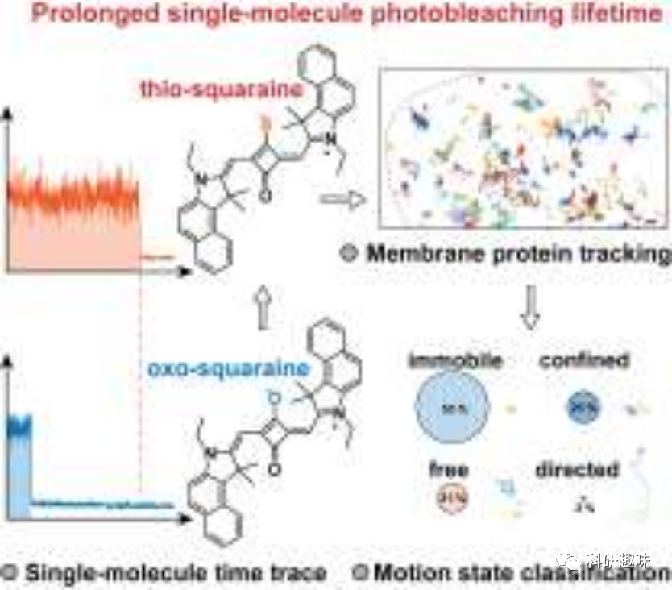
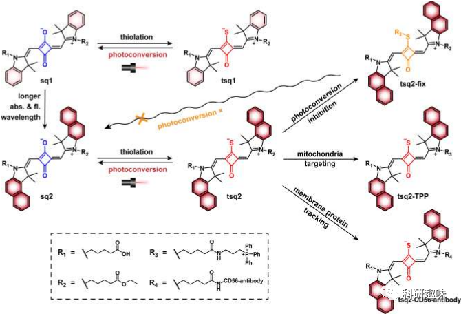
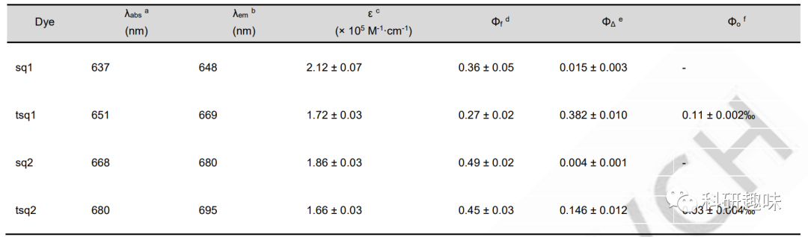
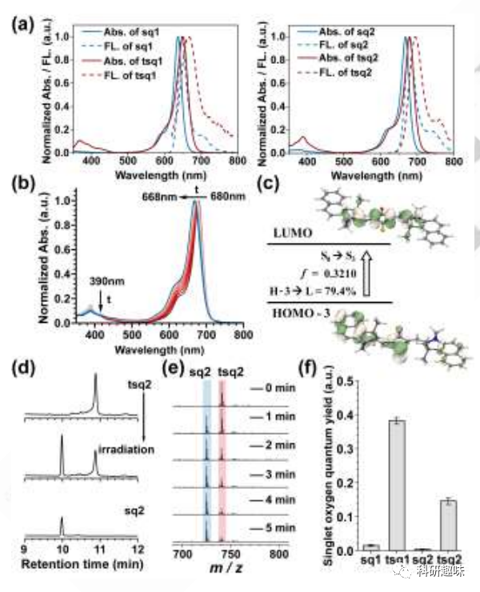
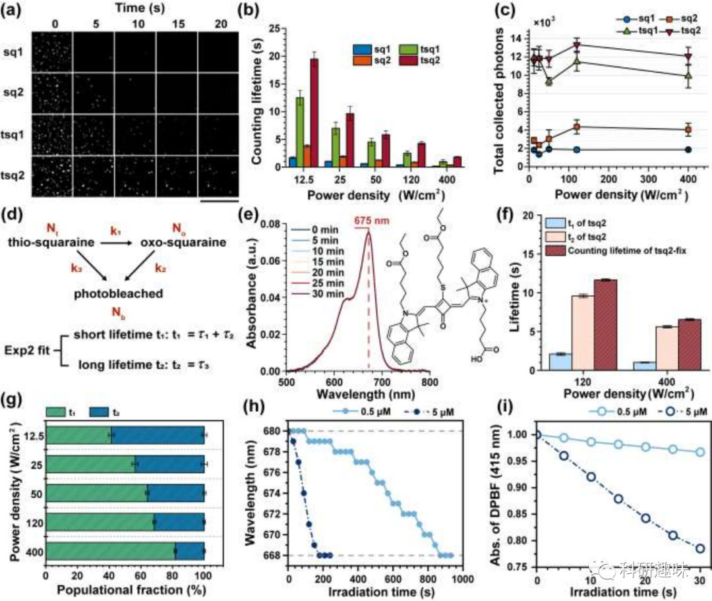
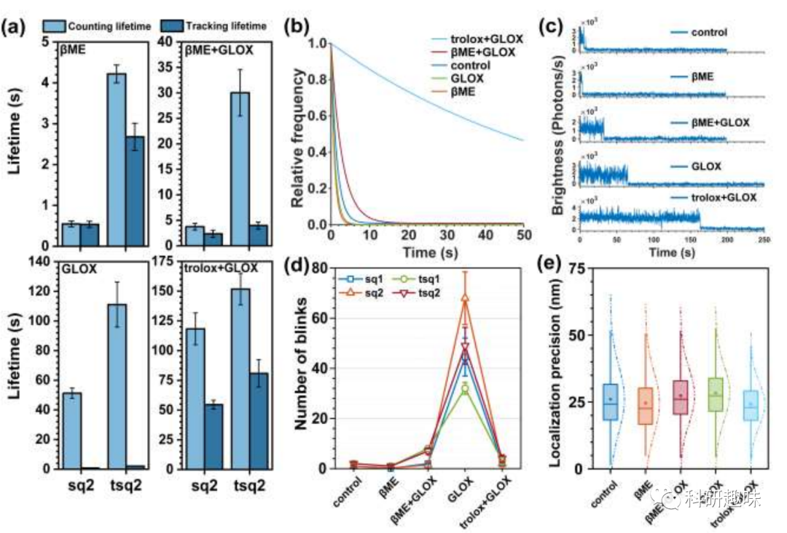
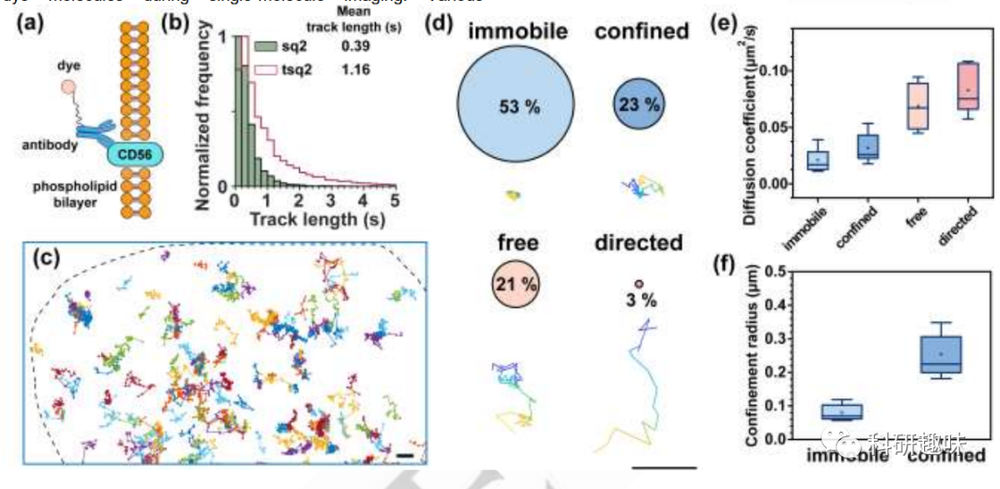
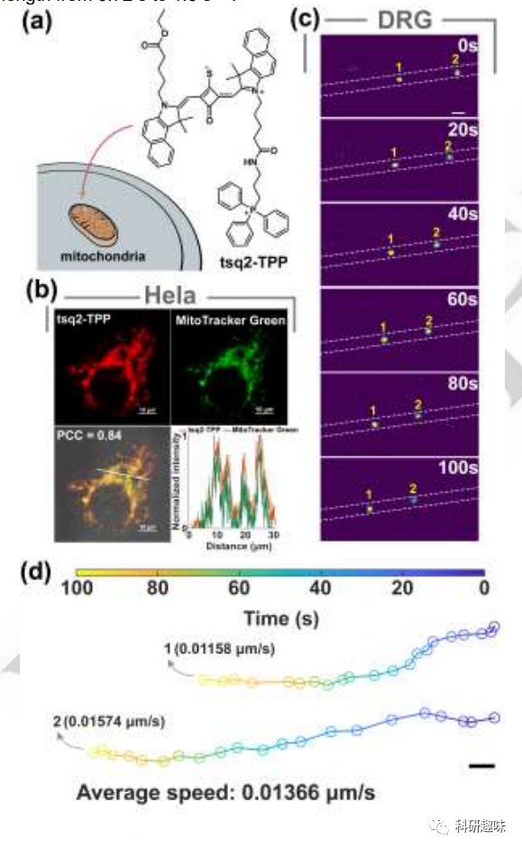

 

#  【Angew】创新硫代方酸荧光探针：突破单分子成像局限，延长光漂白寿命5倍！ 
 

Grenemal

读完需要

15

全文字数 4500 字

***目录***

**Abstract**

**Introduction**

**Results and Discussion**

**Photoconversion in bulk.**

**Optical properties of squaraine dyes in single-molecule imaging.**

**Photoconversion of squaraine dyes in single-molecule imaging.**

**Effect of imaging buffers on squaraines’ single-molecule properties.**

**Single-molecule tracking of CD56.**

**Mitochondrial tracking.**

**Conclusion**

***Abstract***

这项研究致力于提升荧光探针在单分子成像中的应用效果，通过开发一种新的硫代方酸染料策略来解决光漂白寿命短的问题。通过对方酸中心环丁烯的硫代化，研究者观察到光漂白寿命延长了约5倍。单分子数据分析表明，这种改进主要归因于硫代作用提高的光稳定性。与溶液测量结果不同，硫代喹啉在辐照下迅速氧化成其氧化类似物，导致光稳定性较差。这种差异归因于单分子环境的因素，包括分子间距离较大和流动性受限，减少了荧光团之间的相互作用，最终影响光漂白和光转化率。研究者展示了硫代方酸探针在各种成像缓冲液中的卓越性能，成功地应用于单分子跟踪CD56膜蛋白和监测活体神经元中线粒体的运动。这项研究有望促进单分子成像探针的发展，特别是在大规模测量表现不佳的情况下。

***Introduction***

单分子定位显微成像（SMLM）是一项用于研究生物系统的强大技术，主要关注纳米尺度的分子运动和细胞器结构。SMLM通过超越衍射极限的信息提供超分辨率成像和单分子追踪。其中，所用荧光探针的特性，如亮度和抗光漂白能力，直接影响技术的质量。一般采用的探针包括荧光蛋白和有机荧光染料，而后者由于其超亮、小体积和易修饰等优点而受到青睐。然而，有机染料的光稳定性通常受到光漂白和闪烁的制约。

研究者在这项工作中提出一种新方法，通过硫代的单原子取代策略来提高方碱染料的光稳定性。该策略通过硫代羰基取代实现，通常情况下，这种取代会导致荧光团的淬灭效应。然而，对于一些方酸分子，硫代取代并不会引起这种淬灭效应。通过独特的电子供体-受体-供体结构，硫代分子阻止了对这些方酸荧光的显著淬灭。硫代方酸染料在单分子成像环境中表现出与溶液测量不同的行为，其光漂白寿命延长，大约是氧化类似物的5倍，是红色染料Cy5的两倍。这种光稳定性硫代-方酸探针成功用于单分子追踪CD56膜蛋白和监测活体神经元中线粒体的运动。

图1. 研究中涉及的分子结构式

***Results and Discussion***

以吲哚啉及其衍生物作为供体基团的方酸染料是生物成像的常规选择，作者合成了常规吲哚啉和苯并吲哚啉氧代方酸染料（如图1所示），并通过Lawesson反应得到相应的硫代方酸染料。这些化合物分别命名为sq1、tsq1、sq2和tsq2（"sq"表示氧代方酸，"tsq"表示硫代方酸），并对这些染料的光物理特性进行了表征（表1）

不出所料，硫代会导致方酸染料的吸收红移，其中硫代方酸染料tsq2的吸收峰为680纳米，而氧代方酸染料sq2的吸收峰为668纳米（如图2a所示）。与其他荧光团不同，硫代方酸染料显示出的荧光量子产率仅略微降低，而不像其他类型的荧光团一样引起明显的荧光淬灭。这可能是因为硫代方酸染料中的激发和发射过程仍然主要受到荧光团核心的最高占据分子轨道（HOMO）和最低未占据分子轨道（LUMO）之间的转变支配.

表1. 合成染料分子的光物理特性

**Photoconversion in bulk**

在635纳米波长激发下，作者观察到硫代方酸向氧代方酸的光转化现象（图2b,c）。高效液相色谱法（HPLC）和质谱（MS）进一步证实了这种光转化现象（图2d和2e）。在经过635纳米波长照射后，用高效液相色谱法测量tsq2时，作者发现了与sq2相同保留时间的额外成分。质谱分析证实，光转化产物是相应的sq2，这可以从照射后新出现的m/z = 724的峰得到证明。类似的情况也适用于tsq1。为了量化光电转换特性，作者测量了它们的光电转换量子产率（PCQY），即转化的分子数与吸收的光子数之比。tsq1和tsq2的PCQY分别为0.11 ± 0.002 ‰和0.03 ± 0.004 ‰（表1）。tsq1的较高PCQY可能是由于其更高的单线态氧量子产率所致（图2f）。

图2. 方酸染料在溶液测试中的一些光物理特性。a）吸收和发射光谱；b）tsq2在635 nm光照前后归一化的吸收光谱；c）tsq2在390nm处激发分析；d）tsq2在光照后的HPLC分析；e）tsq2在不同照射时间的质谱分析；f）单线态氧产率。

**Optical properties of squaraine dyes in single-molecule imaging.**

作者通过将染料与NH2-(PEG)3-生物素进行共价耦联，然后利用生物素与链霉亲和素的相互作用将其固定在盖玻片上进行单分子测量。采用这种单分子样品制备方法消除了分子聚集或堆积的影响，确保收集到的信号来自单个分子。如图3a所示，每个染料分子在每帧图像上都呈现为单个荧光点。硫代方酸的荧光点比相应的氧代方酸的荧光点持续时间更长，表明其光漂白寿命更长。作者利用单指数衰减函数对荧光点数量随时间的变化进行拟合，得到了计数光漂白寿命（计数寿命）。硫代染料的计数寿命比相应的氧代长约5倍（图3b）。此外，与常用的商业染料Cy5相比，tsq2的光稳定性更好，其光漂白寿命是后者的两倍。

作者还观察到苯并吲哚啉方酸比以吲哚啉为供体基团的方酸具有更长的计数寿命，这可能是因为额外的芳香环产生了更大范围的电子离域，增强了方酸的光稳定性，类似于氰基染料。然后，作者评估了所有方酸染料的单分子亮度（光子发射率，pps：光子/秒）。结果表明硫代方酸的光子发射率约为相应氧化类似物的80-90%。尽管亮度略有下降，但由于硫代方酸染料具有较长的光漂白寿命（图3c），因此收集到的光子总数仍然比氧代方酸多，这对于SMLM的生物应用是有利的。

图3. 方酸染料的单分子测定结果。a）单分子测定的时间图片；b）方酸在不同激光功率下的漂白时间；c）方酸在不同激光功率下所收集的光子数；d）光漂白模型；e）tsq2-fix的分子式和吸收光谱；f）tsq2-fix的光漂白寿命；g）在不同功率密度下，通过 Exp2 拟合得到的短寿命 t1 和长寿命 t2 的比例；h）在 635 nm 波长的照射下，tsq2 的最大吸收波长发生蓝移；i）用 DPBF 监测在 635 纳米辐照下 tsq2 生成单线态氧的情况

**Photoconversion of squaraine dyes in single-molecule imaging.**

根据以上结果，作者得出硫代方酸及其光转化的氧化类似物具有一定的相似性，它们可以作为一个紧密的荧光实体，由于其显著的光谱相似性，能够无缝照亮预期目标。作者建立了一个光电转换和光漂白模型，以进一步研究硫代方酸在单分子成像条件下的光电转换行为。硫代方酸在单分子成像条件下经历两种途径：i）硫代方酸态→氧代方酸态→光漂白态；ii）硫代方酸态→光漂白态。通过实验测量，作者使用双指数函数拟合每帧荧光点数量随时间的变化，得到两个寿命常数t1（较短的寿命常数）和t2（较长的寿命常数）来描述这两种途径。

为了确定这些寿命常数各自对应的过程，作者合成了另一种硫代方酸，即tsq2-fix。它与tsq2的不同之处在于硫原子上连接了一条酯链，从而 "固定 "了硫原子，使其不再发生光电转换。通过单分子表征，作者发现它的寿命更接近于较长的寿命t2。这些结果表明，t2应对应于硫代方酸的直接光漂白，而t1则描述了硫代方酸的光转化过程，然后是方酸的光漂白。在单分子成像条件下，硫代方酸比氧代方酸表现出更好的内在光稳定性，因此光漂白时间更长。作者还研究了光电转换对辐照度的依赖性（图3g），值得注意的是，功率密度的增加与与光电转换比例的增加相对应。

**Effect of imaging buffers on squaraines’ single-molecule properties.**

成像缓冲液在单分子成像中扮演容纳染料分子的介质角色，这种缓冲液可以包含各种成分，如还原和氧化系统（ROXs）、氧清除剂系统等，这些成分通常能够提高有机染料的光稳定性。在研究中，作者调查了方酸染料在不同成像缓冲液中的性能（图4a），在所有这些缓冲液中，硫代方酸的计数寿命都比其母体氧代方酸要长（图4a）。此外，作者还计算了所有方酸的追踪寿命的平均值。追踪寿命定义为从观察开始到光漂白或第一个黑暗期的拟合时间，与单分子追踪高度相关。通常情况下，有机染料的追踪寿命要短于闪烁导致的计数寿命。根据作者的单分子成像结果，在所有成像缓冲液中，硫代方酸的追踪寿命都比氧代方酸长约3倍（图4a）。在纯GLOX缓冲液中，出现了明显的闪烁现象（图4c和4d），这显著缩短了这些方酸染料的追踪寿命（图4a）。GLOX中出现闪烁的原因可能是除氧导致三重态寿命增加，从而导致严重的光闪烁和光子发射率降低。βME和trolox等三重态淬灭剂可以用于抑制这种闪烁，提高这些染料在单分子成像中的性能。值得注意的是，在有trolox和GLOX的条件下，这些染料相较于其他成像缓冲液表现出最高的光子发射率、较长的计数和追踪寿命以及最多的光子收集总量。tsq1和tsq2的追踪寿命分别可达54秒和80秒，定位精度约为25纳米，时间分辨率为100毫秒/帧（图4e），这显示它们在单分子追踪方面具有巨大的潜力。

图 4. 不同成像缓冲液中方酸的单分子特性。a） sq2 和 tsq2 在不同成像缓冲液中的光漂白寿命。b）tsq2 在不同成像缓冲液中的亮态持续时间拟合曲线。c) 不同成像缓冲区中 tsq2 的典型轨迹；d) 不同成像缓冲区中方酸的闪烁次数；e) 不同成像缓冲区中 tsq2 的定位精度（100 毫秒/帧）。

**Single-molecule tracking of CD56.**

作者选择了tsq2作为单分子追踪膜蛋白CD56的标记探针，因为它的追踪寿命更长，光子收集总数更高。在用于生物应用之前，作者检测了其对细胞活力的影响，发现其对细胞活力的影响微乎其微。之后，作者使用与CD56抗体共价标记的tsq2对U2OS细胞中的CD56进行了单分子追踪。尽管tsq2-CD56-抗体和sq2-CD56-抗体的定位精度非常相似，分别为25.2 nm和24.4 nm，但tsq2的追踪长度更长，达到1.16秒，比sq2的0.39秒长约300%。这一改进可与四甲基罗丹明相媲美。随后，作者根据tsq2单分子追踪数据将CD56的运动状态分为四种类型：不动、受限、自由和定向。不动状态的扩散系数和限制半径最小，占发生率的53%，表明大部分膜蛋白保持静止。限制状态是指运动被限制在一个狭窄的范围内，发生概率为23%。自由状态出现的概率为21%，扩散系数较大，因为膜蛋白在附近没有遇到障碍物，表现出布朗运动。定向状态的发生概率为3%，具有最大的位移和扩散系数。根据每种运动状态出现的概率计算得出的加权平均扩散系数为0.05 μm2/s，与文献报道的数值非常接近。

图 5. U2OS 细胞中 CD56 的单分子追踪。a) CD56 标记示意图；b) 单分子轨迹长度的直方图分布。c）CD56 的单分子轨迹。d) CD56 的代表性轨迹，气泡大小和数字代表每种运动状态的概率。e) 每种运动状态的扩散系数；f) 固定运动和限制运动的限制半径。

**Mitochondrial tracking.**

线粒体是细胞的主要供能器官，在细胞代谢中发挥着关键作用。为了实现对线粒体的定位，作者将染料与线粒体靶向基团三苯基膦（TPP）进行了共价偶联，生成了tsq2-TPP。实验结果显示，tsq2-TPP能够有效地靶向活体Hela细胞和U2OS细胞中的线粒体。与MitoTracker Green共同标记时，两种细胞系的皮尔逊相关系数分别达到0.84和0.80。随后，作者使用tsq2-TPP对背根神经节（DRG）神经元中的线粒体进行了追踪。神经元中的线粒体主要通过微管上的马达蛋白运输。通过tsq2-TPP标记，神经元中的线粒体呈现为移动的荧光点。DRG神经元中线粒体的平均移动速度为0.01366 μm/s，与文献报道的数值（0.0084 μm/s）相似。这些结果表明，tsq2-TPP是一种有前景的细胞器追踪候选物。

图6. 用于线粒体追踪的 tsq2-TPP。a）tsq2-TPP的结构式；b) 在共聚焦显微镜下成像的 Hela 细胞中，tsq2-TPP（左上图，红色）和 MitoTracker Green（右上图，绿色）的双色共聚焦分析；左下图显示了合并图像以及皮尔逊相关系数（PCC，0. 84）；右下图显示合并图像中沿白色实线的两个通道的强度分布（橙色曲线：tsq2-TPP；绿色曲线：MitoTracker Green）。比例尺：10 μm；c）全内反射荧光显微镜显示了 tsq2-TPP 在 DRG 神经元中线粒体的迁移。d）线粒体的运动轨迹，属于（c）图中用黄色数字表示的线粒体。

Conclusion

总的来说，研究结果显示，单原子硫代方法显著提高了方解石在单分子成像中的光稳定性。作者深入研究了硫代夸父酰胺及其相应的氧代夸父酰胺在大分子和单分子水平上的光学特性。在大分子环境中，硫代夸父酰胺在光电转换过程中发生边缘蓝移。然而，在单分子成像条件下，尤其是tsq2的计数寿命比氧代方酸长约5倍，比Cy5长约2倍，硫代方酸却表现出显著的光稳定性。这些观察结果似乎违背直觉，但可以通过硫代氧代喹啉的光转换率与浓度的关系来解释。在单分子成像中，由于浓度较低，分子间距离较远，光敏化产生的单线态氧的概率大大降低，因此硫代方酸的光电转换速度要比大分子条件下慢得多。此外，在各种成像缓冲液中，硫代quaraines总是表现出比其母体氧代quaraines更长的光漂白寿命和总收集光子数。作者利用开发的硫代quaraines成功追踪了膜蛋白CD56和线粒体的运动，证明了它们在活细胞中进行单分子追踪和细胞器追踪的能力。总体而言，这项研究预计将对单分子成像探针的开发，特别是那些在大量测量中性能较差的探针的开发提供重要启示。

Liu, J.; Zhao, B.; Zhang, X.; Guan, D.; Sun, K.; Zhang, Y.; Liu, Q. Thiolation for Enhancing Photostability of Fluorophores at the Single‐Molecule Level. Angew Chem Int Ed 2023, e202316192. https://doi.org/10.1002/anie.202316192.

**关注并回复文章DOI获取全文：**

10.1002/anie.202316192

**点击蓝字 关注我们**

[【 Nat. Biomed. Eng. 】同样使用ICG做手术导航，这种方法肿瘤识别精准率高达97%](http://mp.weixin.qq.com/s?__biz=MzkzOTI1OTMwNg==&amp;mid=2247484761&amp;idx=2&amp;sn=349418f0dbfea6d18b3e4f74810bf07c&amp;chksm=c2f2e19cf585688a76556f8c026fdd0e5fa6f4e5aacfe0ef05d4059a19c6edb5a49fab87683a&amp;scene=21#wechat_redirect)

[【Chem. Soc. Rev】超全的方法总结教你怎么把可见光荧光材料转换成近红外](http://mp.weixin.qq.com/s?__biz=MzkzOTI1OTMwNg==&amp;mid=2247484693&amp;idx=4&amp;sn=3423d03007d3fd3189d9457caabf50e9&amp;chksm=c2f2e1d0f58568c681a105ec40651ecf82fe17496f59db5aa56ccce43efaf3fab1d4f45537fd&amp;scene=21#wechat_redirect)

[【Nat. Mater.】揭示纳米药物肿瘤传输的全新机制，EPR解释不了的现象ART可以！](http://mp.weixin.qq.com/s?__biz=MzkzOTI1OTMwNg==&amp;mid=2247484589&amp;idx=1&amp;sn=d9f9681755c99844c5f70e38c47fe1a2&amp;chksm=c2f2e068f585697e769eb43846b87d947e0f8724822ff54c1062202adab92cac022582ca8127&amp;scene=21#wechat_redirect)

预览时标签不可点

素材来源官方媒体/网络新闻

  继续滑动看下一个 

 轻触阅读原文 

    

