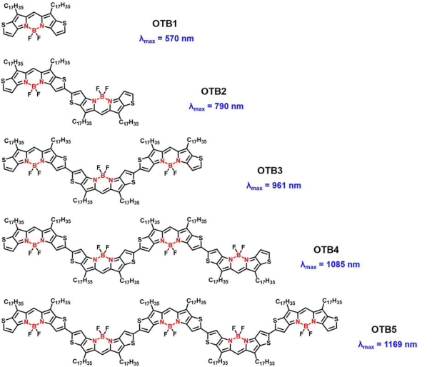
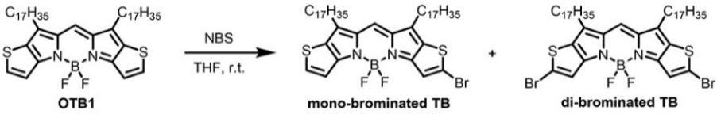
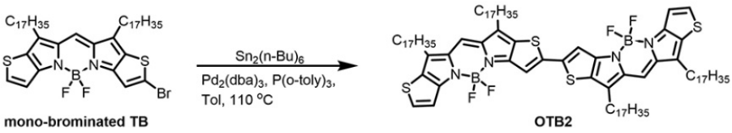
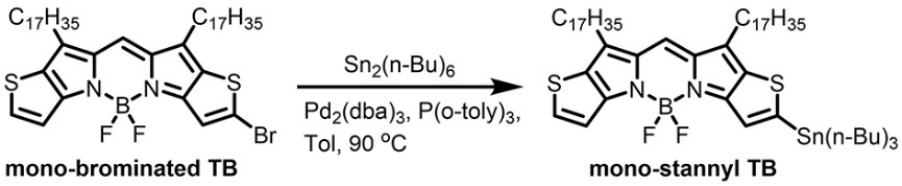
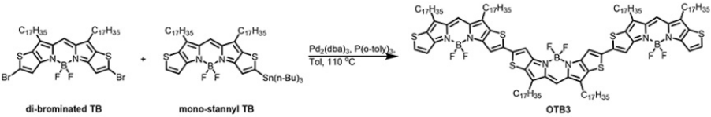
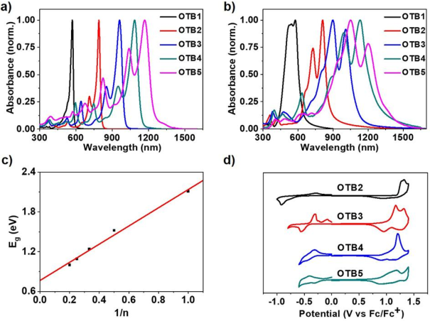
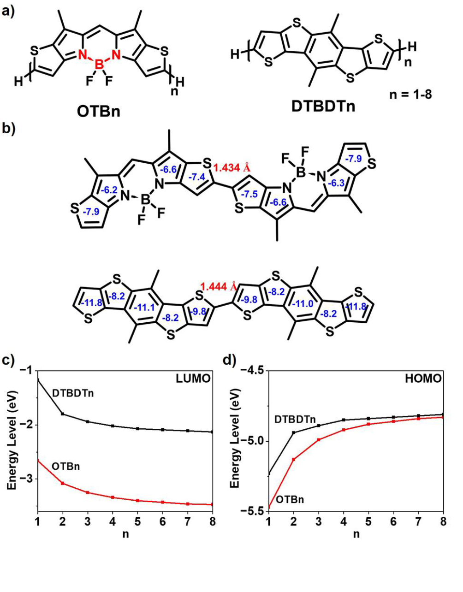
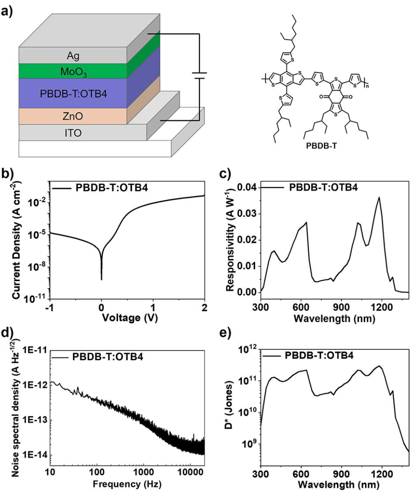

 

#  【Angew】发愁吸收波长不够？看看这种设计思路 
 
 原创

NIR-II Absorbing

近红外二区吸收

这项研究中，作者以含有共振 N-B←N 单元的噻吩并 4,4-二氟-4硼杂-3a,4a-二氮杂-s-茚（TB）为重复单元，合成了一系列单分散低聚物。TB 五聚体的最大吸收波长为 1169 纳米，是迄今为止所报道的低聚物中波长最长的。以 TB 四聚体为电子受体的有机光电探测器（OPD）在零偏压条件下于 1180 纳米波长处的比检测率为 2.98 × 1011 琼斯。这是近红外二区 OPD 的最佳性能之一。

**制备**

OTB的合成并不复杂，作者以OTB1为起始原料，首先通过NBS溴化得到单溴取代及双溴取代的TB，单溴取代的TB可以在催化剂的存在下发生分子间偶联，得到二聚物OTB2，而为了得到三聚物，作者首先将单溴取代的TB进行了Sn取代，然后两当量的Sn取代TB与一当量的双溴取代TB偶联，便得到了OTB3，至于更长的低聚物OTB4和OTB5,则是类似的方法得到。
  

图 1.OTB低聚物的合成路径及结构式

**光谱表征**

接下来，作者对所合成的化合物进行了光物理特性的表征，在氯仿溶液中，OTB1、OTB2、OTB3、OTB4 和 OTB5 的最大吸收波长（λmax）分别为 570 nm、790 nm、961 nm、1085 nm 和 1169 nm。随着分子长度的增加，低聚物的吸收光谱从可见光范围明显红移到近红外 II 范围。摩尔吸收系数从 OTB1 的 1.9 × 105 M-1 cm-1 增加到 OTB5 的 5.8 × 105 M-1 cm-1。从溶液到薄膜，OTB1 的λmax 红移了 6 nm，OTB2 的λmax 红移了 21 nm，而长低聚物的λmax 红移了 30 nm 以上。这表明随着分子长度的增加，低聚物骨架的分子间相互作用增强。根据氯仿溶液中的起始吸收波长，作者计算了单分散低聚物的光带隙（Eg）。如图 3c 所示，Eg 与 OTB 低聚物重复单元的倒数之间呈线性相关。相关系数为 0.98。更具拟合结果作者外推出 Eg 的极限值为 0.77 eV。这表明五聚物中的有效共轭并未达到饱和，增加重复单元的数量可导致基于 TB 的低聚物的吸收光谱进一步红移。在 OTB1 和 OTB2 的溶液中可以检测到荧光，而在长寡聚体的溶液中则检测不到荧光。

图2. a) 单分散低聚物在氯仿溶液中的吸收光谱；b) 薄膜中的吸收光谱。c) 单分散低聚物的光带隙与重复单元倒数的关系。d)薄膜中单分散低聚物的循环伏安图。

**理论计算**

为了研究共振 N-B←N 单元对基于 TB 的低聚物的电子结构和光电特性的影响，作者选择了二噻吩并[2,3-d;2′,3′-d′]苯并[1,2-b;4,5b′]二噻吩（DTBDT）作为对照（图3a）。DTBDT 是一种富电子结构单元，已被广泛用于开发高性能有机光电材料。首先，作者在 B3LYP/6-311+G(d,p) 水平对 TB 和 DTBDT 的二聚体进行了NICS计算（图 3b）。每个芳香环的芳香度可以用 NICS(0) 值来表示，负的 NICS(0) 值越小，芳香度越低。DTBDT 二聚体中芳香环的 NICS(0) 值范围为 -8 ppm 至 -12 ppm。相比之下，TB 二聚体中芳香环的 NICS(0) 负值较小，范围在 -6 ppm 到 -8 ppm 之间。较小的负 NICS(0) 值表明，N-B←N 单元降低了芳香环的芳香度，提高了 TB 中的有效共轭。另外，两个 TB 单元之间的 C-C 键长度比两个 DTBDT 的短，这表明 TB 二聚体比 DTBDT 二聚体的共轭效果更好。上述结果都表明，共振 N-B←N 单元提高了低聚物的有效共轭，从而导致带隙减小和吸收光谱红移。

图3c 和3d 分别显示了 TB 低聚物和 DTBDT 低聚物的 LUMO 能级和 HOMO 能级与重复单元数的关系。虽然两种低聚物表现出相似的 HOMO 能级，但 TB 低聚物的 LUMO 能级远低于 DTBDT 低聚物，导致带隙较小。随着重复单元数的增加，TB 低聚物的 HOMO 能级上移和 LUMO 能级下移比 DTBDT 低聚物更为明显。这是由于在前者有共振 N-B←N 单元的情况下，共轭作用比后者更有效。

图3. a） OTBn和DTBDTn化合物的化学结构（n = 1-8）。b）NICS（0）芳环的值（蓝色）和二聚体的C-C键长度（红色）. c）LUMO和d）HOMO能级.

**器件**

长低聚物 LUMO/HOMO 能级和近红外 II 区的强光吸收表明，它们可用作电子受体，用于制造具有近红外 II 光响应的光电二极管型 OPD 器件。作者使用 OTB4 作为电子受体，并选择市售的PBDB-T（见图 4b） 作为电子供体来构建 OPD。器件结构为 ITO/ZnO/PBDB-T：OTB4/MoO3/Ag（图 4a）。暗电流密度是光电探测器的一个关键参数。图 4b 显示了 OPD 器件在暗处的电流密度与电压 (J-V) 特性。在零偏压下，该器件的暗电流密度（Jd）低至 6.40×10-10 A cm-2，响应率 (R)最高为0.036A W-1 (1180 nm处)（图4c），另外，评测OPD 检测微弱光信号能力的一个关键指标是比检测度，而作者制备的器件其在1180nm处的比检测度高达 2.98 × 1011 Jones。

图4. a） OPD器件结构示意图和PBDB-T的化学结构。b） 基于OPD器件的PBDB-T的J−V特性.c）响应度曲线，d）噪声频谱密度和e）零偏置下OPD器件的比检测率。

**结论**

作者开发出了单分散 TB 低聚物，它具有的共振 N-B←N 单元提高了有效共轭，并导致低聚物的吸收光谱发生红移。五聚体 OTB5 的最大吸收波长为 1169 nm，起始吸收波长为 1241 nm，光带隙为 1.00 eV。单分散低聚物可用作电子受体，构建具有近红外 II 光响应的高性能 OPD 器件。这项工作为设计近红外 II 吸收小分子指明了一种新策略，并为近红外 II OPD 提供了一种优良的电子受体材料。

Xu, J.; Zhang, Y.; Liu, J.; Wang, L. NIR‐II Absorbing Monodispersed Oligomers Based on N–B←N Unit. Angew Chem Int Ed 2023, e202310838. https://doi.org/10.1002/anie.202310838.

**关注公众号并回复**

**10.1002/anie.202310838**

**可获得原文下载链接**

[【Biomaterials】不喝酒也会就酒精肝，非酒精性脂肪肝怎么治疗？](http://mp.weixin.qq.com/s?__biz=MzkzOTI1OTMwNg==&amp;mid=2247484070&amp;idx=1&amp;sn=ddb4abe02a40c21f436e651e97f4dc7d&amp;chksm=c2f2e663f5856f75d96a041aab2f889327ac3cf956c58b43334c898982327f293c7303c5e624&amp;scene=21#wechat_redirect)

[【Anal. Chem.】\[华中师范大学冯国强团队\] 急性深肾损伤怎么判断，查一下SO2浓度先](http://mp.weixin.qq.com/s?__biz=MzkzOTI1OTMwNg==&amp;mid=2247484059&amp;idx=1&amp;sn=385fc8fcdb95972f56307c53d338d2af&amp;chksm=c2f2e65ef5856f4856a8959c1a2a0eeff93a440fcb1d554bd19001530cbc6a0176ddb0a0c124&amp;scene=21#wechat_redirect)

[【JACS】\[清华大学储凌课题组\]荧光成像新选择，自恢复蛋白标签](http://mp.weixin.qq.com/s?__biz=MzkzOTI1OTMwNg==&amp;mid=2247484033&amp;idx=1&amp;sn=a845fb8aaf2d3588b6a713aae760779c&amp;chksm=c2f2e644f5856f52deed411562ca58cb3998d9f5f2a3573c25ae1ac345cfb17444b1c78ecce0&amp;scene=21#wechat_redirect)

预览时标签不可点

素材来源官方媒体/网络新闻

  继续滑动看下一个 

 轻触阅读原文 

    

