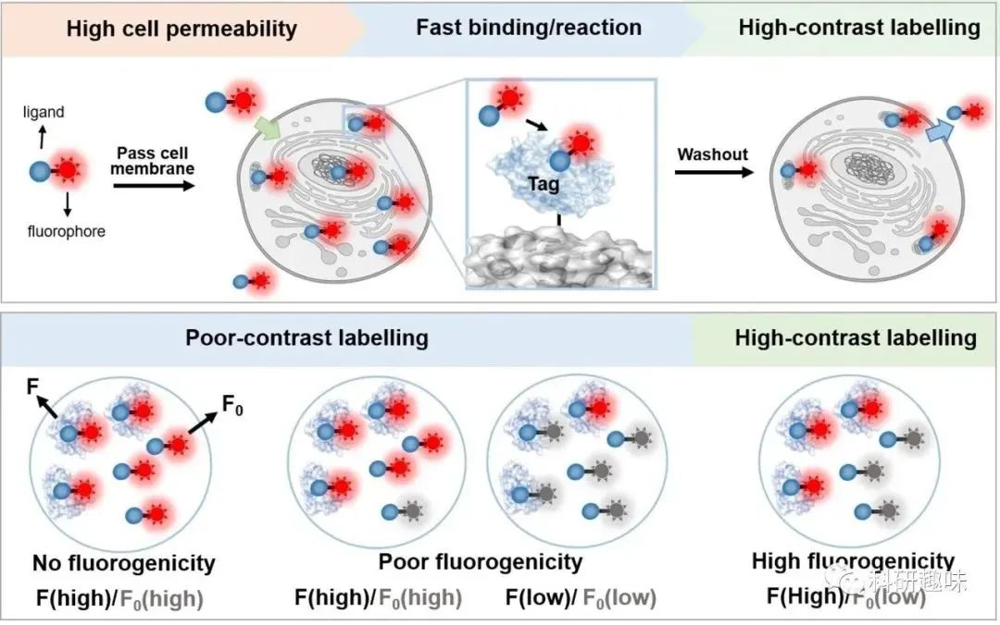
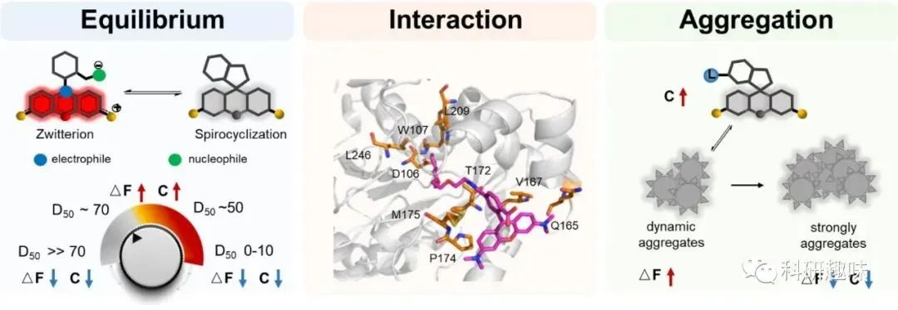
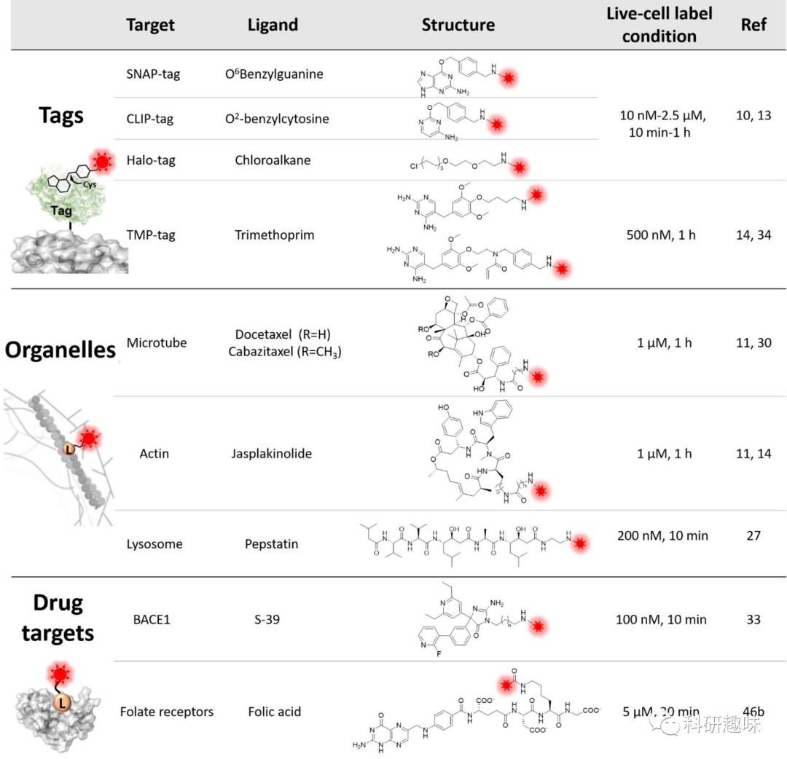
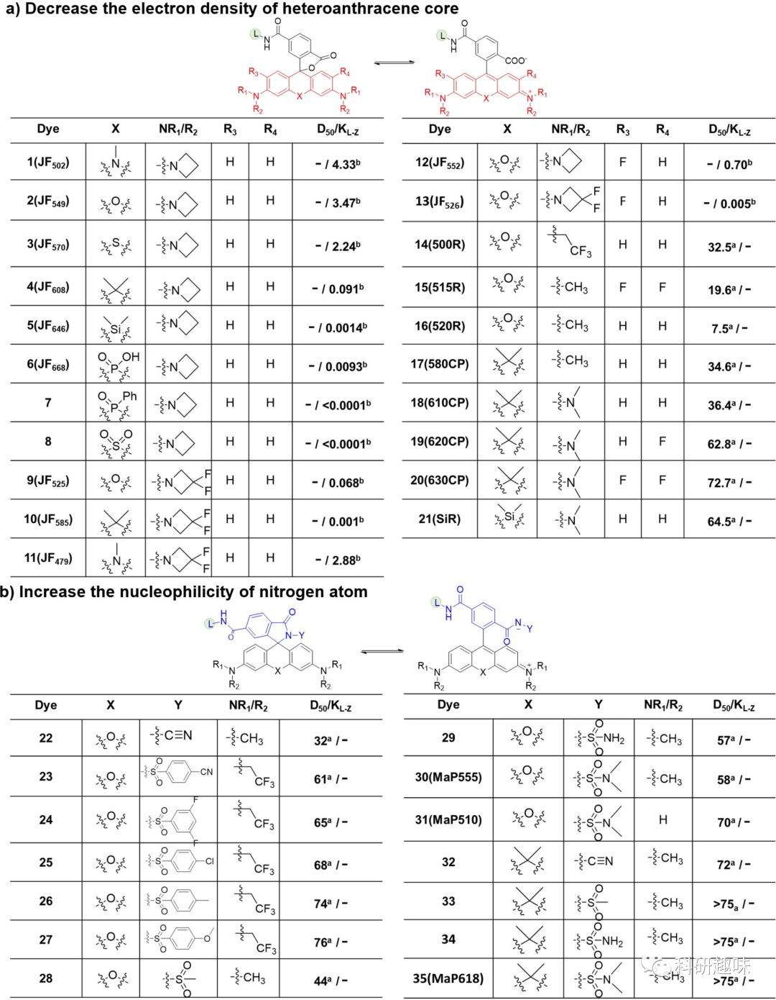
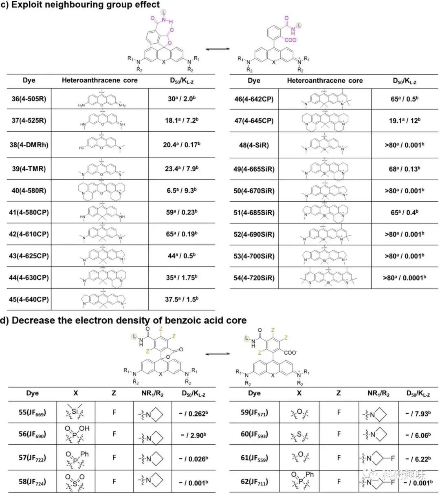
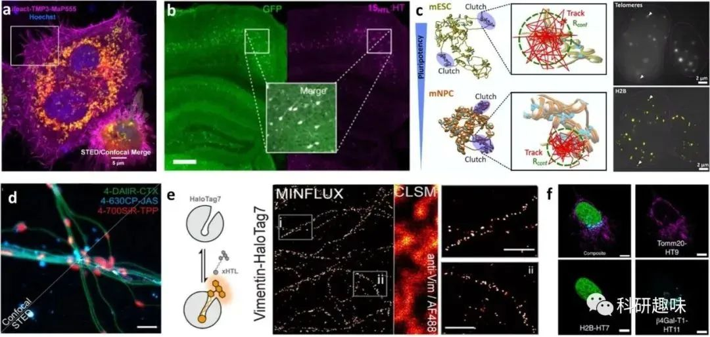
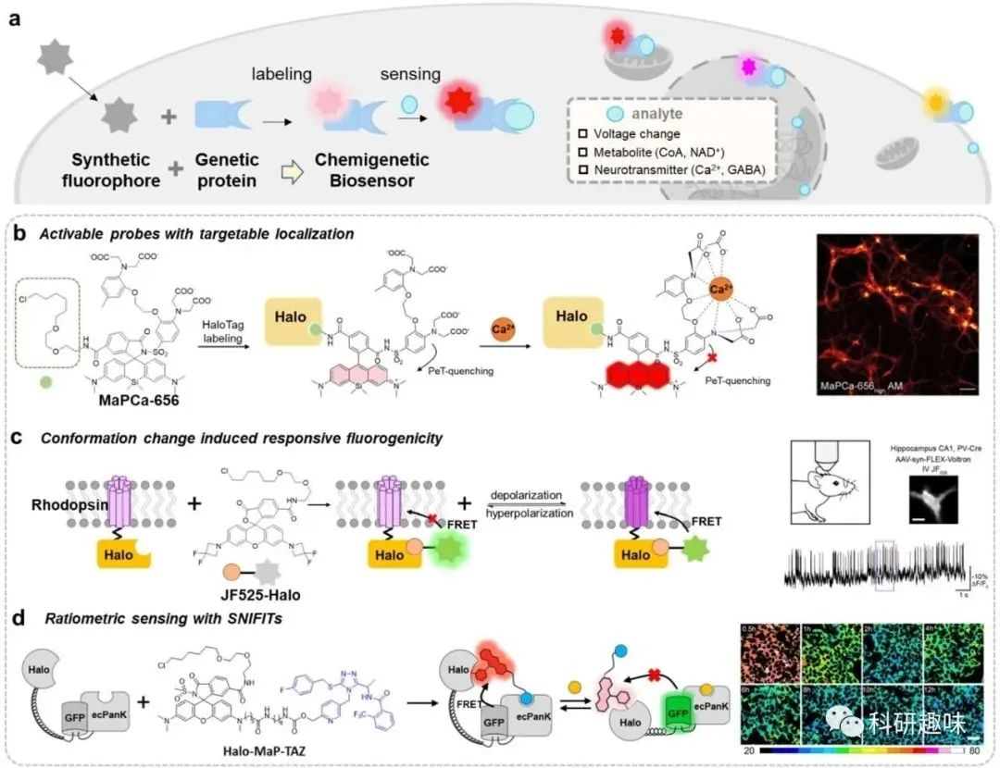

 

#  【Angew】如何提升生物成像的对比度？高荧光、细胞渗透性罗丹明染料引领活细胞蛋白质标记革新 
 

荧光显微镜技术的发展为可视化蛋白质和揭示其在活体生物系统中的功能提供了新的机遇。小分子有机染料具有优异的光物理特性、体积小、光稳定性高，是蛋白质成像中强有力的荧光报告物。然而，由于传统有机染料的细胞渗透性不足和背景信号较高，用它们对目标蛋白质进行高对比度的活细胞标记仍然是生物成像和生物传感领域的一大挑战。在过去的十年中，人们开发出了新一代的荧光亮度和细胞渗透性染料，通过微调罗丹明的细胞渗透性、非荧光螺环态（未结合）和荧光态（蛋白质结合）之间的可逆平衡，大大提高了活细胞蛋白质标记的效果。在本综述中，作者将介绍这些致荧光和细胞渗透性罗丹明的机理和设计策略，以及它们在生物成像和生物传感中的应用。

**Introduction**

引言

蛋白质在几乎所有细胞活动中都发挥着至关重要的作用，而基于荧光的成像技术为实时研究活细胞内的蛋白质功能提供了强大的工具。在活细胞蛋白质成像中，使用稳定、高亮度的萤光团标记目标蛋白质是至关重要的。虽然荧光蛋白常被用于活细胞成像中，但小分子有机荧光团也因其优异的光物理特性、小尺寸及高光稳定性被广泛使用。

图1. 通过提高荧光亮度和细胞渗透性实现高对比度成像的示意图。

为有效标记细胞内蛋白质，与目标配体共轭的有机荧光团应快速通过细胞膜，并与目标蛋白质发生特异性结合/反应。因此，活细胞中的高对比度蛋白质标记需要荧光团具备反应位点和细胞渗透性，而罗丹明染料在这两方面都具备一定的优势。

图2. 在生物成像和生物传感中使用荧光亮度和可渗透的罗丹明实现高对比度活细胞蛋白质标记在这篇综述中，作者将全面概述这种新一代荧光团的优势、机制和设计策略，此外，作者还将重点介绍这些探针在各种应用中取得的进展，包括多色/荧光寿命成像、单分子追踪、超分辨率显微镜和化学遗传生物传感器。

**荧光可变性和细胞渗透性的罗丹明**

Fluorogenic and cell-permeable rhodamines

**高对比度蛋白质标记**

成像对比度是指标记靶标发射的荧光信号与背景之比，可以通过增强靶标的亮度和减少背景信号来改善（见图1）。罗丹明或其衍生物在未结合时主要存在于非荧光或弱荧光状态，显示出低背景信号，因此具有出色的成像对比度。然而，它们在与靶标蛋白相互作用时会转变为强荧光异构体。在活细胞成像中，罗丹明的荧光亮度可以通过靶标蛋白表达细胞与共培养的正常细胞之间的荧光信号比值来表征。罗丹明的荧光可变性极大地增强了图像对比度，甚至可以实现免洗成像。

利用可渗透细胞探针也有助于提高图像对比度。高细胞渗透性不仅确保了探针迅速进入细胞，还使得容易清除多余的探针，从而产生低非特异性信号，因此增加了图像对比度（见图2）。像香豆素和BODIPY这样的有机染料在优化极性（氢键供体和受体）和亲脂性（log P）后可以迅速穿过细胞膜。传统的罗丹明主要以亲水的荧光形式存在于未结合形式中，通常具有较低的细胞渗透性。然而，通过促进疏水和不带电的螺环态的转变，罗丹明的细胞渗透性可以得到显著增强，从而实现了快速和高对比度的活细胞蛋白质标记。

**如何提高荧光可变性和细胞渗透性**

设计和优化针对特定靶点的荧光可变性和细胞渗透性罗丹明是一项复杂的工作。如图 3 所示，要开发出成像性能优越的罗丹明，需要考虑三个关键因素：

1. 实现荧光形式与螺内酯/螺内酰胺形式之间的微调平衡
2. 确保荧光形式与目标实体之间的有效相互作用
3. 优化探针的动态聚集

图3. 影响罗丹明的荧光亮度和细胞渗透性的三个关键因素：ΔF 代表荧光亮度。C 代表细胞渗透性。在活细胞成像中，D50 在 40-80 之间的罗丹明染料通常具有良好的荧光亮度和细胞渗透性。

平衡调节

罗丹明及其衍生物在螺内酯/螺内酰胺和荧光形式之间具有可逆的平衡状态（见图3）。在细胞内极性环境中，传统的罗丹明（例如四甲基罗丹明，罗丹明X，罗丹明110）主要存在于高荧光和亲水的荧光形式。然而，当置于非极性有机溶剂中时，荧光团中央的碳原子与苯环的羧酸或酰胺基团之间的相互作用会破坏π共轭结构，这种转变会导致非荧光和疏水的螺内酯/螺内酰胺形成（见图3）。

罗丹明荧光和非荧光状态之间的平衡可以通过D50值进行表征，该值表示在非极性溶剂和水的混合物中，荧光物种的一半存在于开放形式时的介电常数（见图4）。此外，该平衡还可以通过平衡常数（KL-Z）来定量化，如图4所述。通过修改罗丹明的化学结构，可以改变荧光和非荧光状态之间的可逆平衡状态。具有较低D50（&lt;30）或较高KL-Z（Log KL-Z&gt;0）的传统罗丹明染料在未结合时主要存在于荧光形式。将D50值移动到40–80范围内或将Log KL-Z值移动到-3至-2范围内通常会产生非荧光形式和细胞渗透性的罗丹明，这些罗丹明可以在结合到靶标时从非荧光的螺内酯/螺内酰胺转变为荧光的荧光形式。

相互作用

蛋白质改变平衡的能力可能归因于罗丹明荧光形式与结合蛋白表面上存在的氨基酸之间的相互作用（见图3）。最近的研究表明，同一种罗丹明，如MaP618，由于其与荧光形式相互作用的多样性，当结合到不同的蛋白质（例如HaloTag和SNAP-tag）时，可以展现出不同的荧光活性特性。同时，当形成了强疏水性非荧光的螺环态（D50≫80或Log KL-Z&lt;−4）时，与蛋白质结合后，相互作用无法将平衡转向荧光的荧光形式，这可能会显著降低标记蛋白的亮度。此外，谨慎选择和使用配体和连接剂对于优化相互作用和结合亲和力至关重要。在这方面，作者提供了一份基于最近报告的荧光活性罗丹明的配体及其靶标列表（见表1）。

聚集

需要注意的是，向疏水螺环状态移动平衡可能会导致探针聚集，特别是在与疏水配体共轭时。探针聚集体的动态形成可进一步减少背景信号并增加成像对比度 。不过，据观察，平衡过度偏移导致的过度聚集状态会显著降低细胞通透性和与靶标的结合效率，从而可能导致细胞毒性。

表 1.荧光亮度和细胞渗透性罗丹明中使用的代表性配体、其靶标和标记条件。

**调节罗丹明平衡的策略**

调节罗丹明的螺环态和荧光形式之间的平衡是优化荧光活性并增强细胞渗透性的首选方法。

1. 第一种促进螺环化的方法是通过减少杂蒽单元中的电子密度。例如，在罗丹明的X位置引入硅、碳、磷和硫等原子，而不是氧原子，可显著降低杂蒽分子中的电子密度，从而促进了中心碳原子与苯环中的羧酸的螺环化反应（图 4a）。另一种方法是在R1、R2和R3位置共轭吸电子基团（例如F、CF3CH2和取代的氮杂环丙烷）。这种方法可将平衡从齐聚物微调为螺环形式，同时导致吸收和发射波长蓝移，有趣的是，适当降低杂蒽分子的电子密度还能提高染料的光稳定性，不过，需要注意的是，过度降低电子密度可能会大大降低量子产率，并增加杂蒽分子与细胞内亲核物（如谷胱甘肽）发生反应的敏感性。
2. 加强螺环化的第二种策略是将罗丹明中的羧基转化为酰胺基（图 4b）。通常情况下，传统罗丹明中的酰胺基团（如烷基胺和苯胺）会偏向于形成螺内酰胺，与蛋白质结合后无法转变为荧光形式。在羧基上引入了缺电子酰胺可以在一定程度上解决这个问题，包括酰基氰胺、酰基磺胺、酰基磺酰胺和取代的酰基苯磺酰胺，值得一提的是，转化为缺电子酰胺对母体荧光团的光谱特性几乎没有影响。
3. 此外，可以通过修改苯环来调整罗丹明的平衡（见图4c）。在苯环中的4'-共轭位置放置一个酰胺基团可以产生邻基效应，它与相邻的羧酸基团形成分子内氢键，从而在未结合状态下稳定螺内酮形式，重要的是，这种方法也保留了母体荧光团的优异光物理特性。

值得强调的是，上述开发荧光活性罗丹明的方法可能会过度偏移平衡（D50≫80）。因此，非荧光的螺内酯形式会成为主导形式，即使在结合蛋白质后也无法“打开”和发出荧光。为了解决这个问题，可以在苯环系统中引入了氟原子，以减少罗丹明的螺环化，实现了罗丹明两种状态之间的适当平衡。值得注意的是，这些修改策略可以单独或组合应用，以精确控制罗丹明的平衡，用于标记不同蛋白质和各种成像技术。

图4. 调整罗丹明异构体之间平衡的策略。L 代表配体。在 b 和 c 中，X 代表 O、C(CH3)2 和 Si(CH3)2，R1-R3 代表 H 或烷基。表中列出了荧光染料的 D50 值和 KL-z 值。

**活细胞蛋白质成像**

在过去的十年里，荧光活性和细胞渗透性的罗丹明在标记各种蛋白标签（例如SNAP-Tag、HaloTag、CLIP-Tag和TMP-Tag）、细胞骨架（例如肌动蛋白和微管）、核酸（例如DNA和RNA）、细胞器（例如溶酶体、线粒体、高尔基体和内质网）以及药物靶标（例如叶酸受体和β-分泌酶1）方面变得越来越受欢迎（图5）。

图5. 用于活细胞显微镜生物成像的含荧光的罗丹明。(a) 使用不同的探针（TMP3-MaP555、CA-SiR和BG-fluorescein）标记的Hela细胞的四色共聚焦和STED图像。(b) 用探针 15HTL 标记的表达 GFP-HaloTag 融合蛋白的动物的固定冠状小鼠脑切片图像。(c) 使用JF549标记的HaloTag-H2B的单颗粒轨迹。(d) 使用不同探针（4-DAIIR-CTX、4-630CP-JAS和4-700SiR-TPP）标记的离体小鼠活体神经元中的微管、肌动蛋白和线粒体的共聚焦和STED图像。(e) 使用SiR-T5标记的表达vimentin-HaloTag7的U2OS细胞的二维MINFLUX成像。(f) 使用MaP618-CA探针标记的表达Halo-Tag变体的U2OS细胞的荧光寿命多重成像。

**原位化学生物传感器**

在原位构建化学生物传感器以用于细胞内分析物时，实现对有机荧光物质特异性、高对比度地标记细胞内靶标是关键一步。荧光活性和细胞渗透性的罗丹明为此提供了解决方案，通过实现对标记物的高对比度和快速标记，促进了杂交生物传感器的生成以及在活细胞内相同位置的测量。与此同时，未结合的螺环酮型罗丹明的“关闭”荧光还能避免在测量过程中受到非特异性信号的干扰（图6b–6d）。

图6. 利用罗丹明原位生成化学基因生物传感器

**Conclusions and outlooks**

结论与展望

总之，细胞渗透性和致荧光罗丹明的开发已取得显著进展，可对活细胞中的目标蛋白质进行高对比度标记。然而，要进一步提高它们的性能并满足新兴成像技术不断发展的需求，还需要继续努力。值得注意的是协同策略的潜力，如结合振动结构和抑制 TICT（分子内电荷转移扭曲）效应，可同时改善有机染料的光物理特性和光稳定性45 。

**点击蓝字 关注我们**

**关注并回复文章DOI获取全文：**

10.1002/anie.202307641

Si, D.; Li, Q.; Bao, Y.; Zhang, J.; Wang, L. Fluorogenic and Cell‐Permeable Rhodamine Dyes for High‐Contrast Live‐Cell Protein Labeling in Bioimaging and Biosensing. Angew Chem Int Ed 2023, 62 (45), e202307641. https://doi.org/10.1002/anie.202307641.

[【Nat. Mater.】揭示纳米药物肿瘤传输的全新机制，EPR解释不了的现象ART可以！](http://mp.weixin.qq.com/s?__biz=MzkzOTI1OTMwNg==&amp;mid=2247484589&amp;idx=1&amp;sn=d9f9681755c99844c5f70e38c47fe1a2&amp;chksm=c2f2e068f585697e769eb43846b87d947e0f8724822ff54c1062202adab92cac022582ca8127&amp;scene=21#wechat_redirect)

[【 Nat. Biomed. Eng. 】同样使用ICG做手术导航，这种方法肿瘤识别精准率高达97%](http://mp.weixin.qq.com/s?__biz=MzkzOTI1OTMwNg==&amp;mid=2247484548&amp;idx=1&amp;sn=15c8c0c805c4ed45821482c8a7f429e7&amp;chksm=c2f2e041f5856957fc3e6ec801f48429bad92696c8e808f98682190c084d573b466669aaaab0&amp;scene=21#wechat_redirect)

[【J. Med. Chem.】 突破性科技：低氧活化智能探针，实现癌症双重诊断成像及靶向治疗细菌感染！](http://mp.weixin.qq.com/s?__biz=MzkzOTI1OTMwNg==&amp;mid=2247484540&amp;idx=1&amp;sn=53867266225d932f639e4c17feda2e70&amp;chksm=c2f2e0b9f58569afb5b863d684957bfaede41cafb609300b382713fb26222fbeafb7a45b2919&amp;scene=21#wechat_redirect)

预览时标签不可点

素材来源官方媒体/网络新闻

  继续滑动看下一个 

 轻触阅读原文 

    

