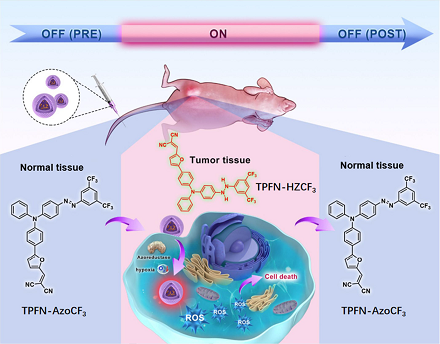
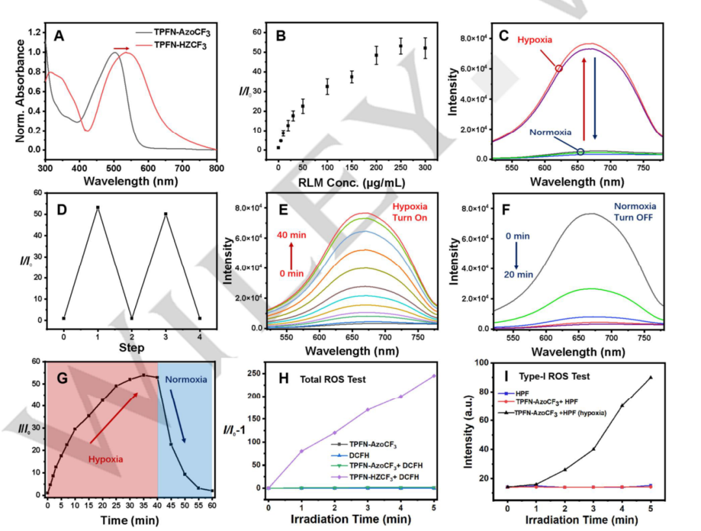
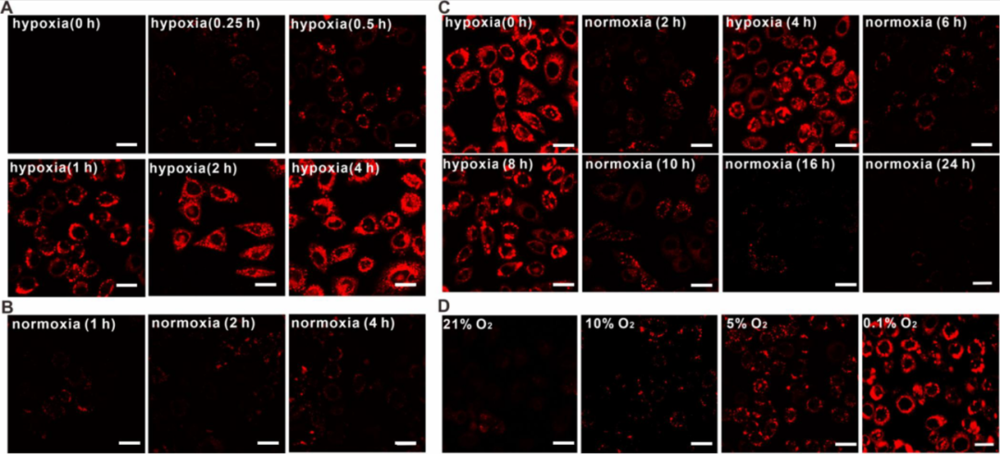
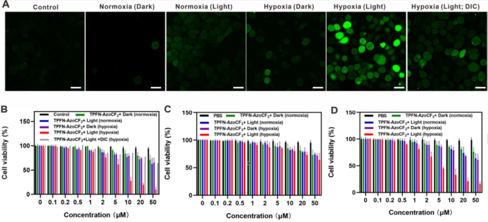
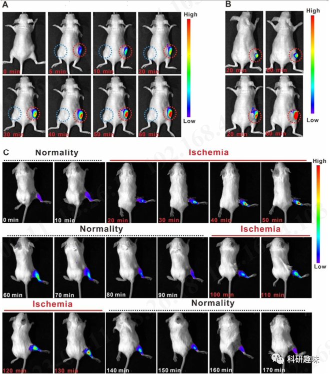
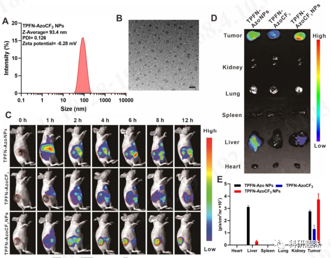

 

#  【Angew】定点开启，无毒副作用的光敏剂设计新方法 
 
 原创

Photodynamic Therapy

光动力疗法

光动力疗法(PDT)应用的两大限制是光敏剂(PS)在PDT前后的光毒性和肿瘤微的缺氧条件。尽管刺激响应形PS能成功解决PDT前的光毒性问题,而I型PS能在缺氧环境中有效生成活性氧(ROS),但用于解决PDT后光敏剂毒性问题的方法非常有限。

导言

光动力疗法(PDT)是一种高效的非侵入性癌症治疗策略,它利用光敏剂(PSs)产生的活性氧(ROS)来消灭癌细胞。然而,PSs的相对严重副作用仍不可忽视,因为传统PSs采用“始终开启”模式,可能引起如灼伤、发红和结痂等严重光毒性,并要求患者在治疗后数周内避免阳光照射。因此,人们致力于开发副作用较小的新型PS。一种可行策略是开发可激活的光敏剂(OFF-ON PSs),通过“关闭”其在正常组织中的活性并“开启”其在肿瘤中的活性,从而将副作用降至最低。过去几十年,人们探索利用OFF-ON PS来解决治疗前保护问题。但是,治疗后保护仍是个问题,因为OFF-ON PSs在治疗后仍存在光毒性。因此,急需开发同时可在治疗前后提供保护的开关光敏剂。实现有效PDT的另一根本问题是肿瘤中的缺氧环境。缺氧被认为是典型的肿瘤微环境,会抑制传统II型PS,而氧依赖性较低的I型PS为此提供了策略。

TPFN-AzoCF3 的设计与合成

作者设计并合成了TPFN-AzoCF3，其结构中含有三氟甲基取代芳基偶氮基团，可以作为循环中的氧化还原反应基团，以及在缺氧条件下产生 ROS 的三苯胺基（**图1**）。

**图1. TPFN-AzoCF3的合成路径**

TPFN-AzoCF3 溶液测试

为了研究TPFN-AzoCF3的性能,作者使用含NADPH和偶氮还原酶的大鼠肝微粒体(RLMs)来模拟缺氧环境。当环境从常氧变为缺氧时,TPFN-AzoCF3的吸收峰从500纳米红移到550纳米（**图2A**）。这是因为在常氧下,芳基偶氮基团的淬灭作用抑制了TPFN-AzoCF3的荧光。在缺氧条件下,TPFN-AzoCF3上的芳偶氮基团转化为肼基团生成TPFN-HZCF3,671纳米处荧光强度因此增强54倍(**图2B，C**)。此外,TPFN-HZCF3呈现典型的聚集诱导发光特征。将缺氧处理后的溶液暴露在空气中,TPFN-HZCF3的荧光可逆地淬灭至初始状态,表明该过程是可逆的(**图2D**)。在各种生物相关化学物质或不同pH值下,均未观察到明显荧光变化,说明该探针对缺氧环境具有良好特异性。为监测TPFN-AzoCF3生成ROS的能力,使用DCFH作为ROS指示剂。结果显示,TPFN-AzoCF3的ROS生成能力较低,但TPFN-HZCF3能有效产生ROS。不同指示剂实验表明,TPFN-HZCF3主要产生I型ROS(**图H,I**)。质谱和NMR实验结果表明,在缺氧条件下,偶氮键仅部分还原为肼中间产物,并证实了该可逆过程。

**图2。TPFN-AzoCF3的可逆性缺氧-常氧反应行为。A.RLM 和 NADPH处理对 TPFN-AzoCF3紫外-可见吸收光谱的影响。B. 在低氧环境(N2气氛)中与不同浓度的RLM孵育后的荧光开启比率。C. 在含有 RLM和 NADPH的 PBS 缓冲液中记录的TPFN-AzoCF3的荧光光谱在常氧-缺氧循环中。D,E,F. TPFN-AzoCF3在671nm 处的荧光强度(c)在含有 RLM和 NADPH的 PBS 缓冲液在缺氧环境(N2大气)中温育下的荧光光谱变化。G.在(E)和(F)中检测到 TPFN-AzoCF3在671nm 处的荧光强度。**

TPFN-AzoCF3细胞测试
为了研究TPFN-AzoCF3在癌细胞中的循环响应行为,作者在HeLa细胞中进行了共聚焦荧光成像（**图3**）。结果显示,在缺氧条件下,随着培养时间的延长,荧光强度逐渐增强,表明TPFN-AzoCF3对缺氧环境有良好响应（**图3A**）。相比之下,在常氧条件下4小时培养后,荧光变化微乎其微,说明TPFN-AzoCF3仍处于关闭状态(**图3B**)。此外,当将细胞暴露于缺氧-常氧-缺氧环境中时,TPFN-AzoCF3呈现荧光开关行为。随着氧浓度从21%下降到0.1%,荧光强度逐渐增强,表明TPFN-AzoCF3随环境缺氧程度加剧而发生更有效的还原。同时,抑制偶氮还原酶后,即使在缺氧条件下荧光增量也很小,说明偶氮还原酶介导的偶氮基团还原是荧光开启的原因。
**图3。HeLa 细胞缺氧成像的灵敏度和可逆性。A-B)在不同时间(0,0.25,0.5,1和4小时)的缺氧和常氧环境中用 TPFN-AzoCF3(10μM)处理的 HeLa 细胞; C)用 TPFN-AzoCF3(10μM)处理的 HeLa 细胞的荧光图像在缺氧-常氧循环中。D)用不同 O2含量(0.1% ，5% ，10% 和21%)的 TPFN-AzoCF3(10μM)处理的 HeLa 细胞的荧光图像。比例尺: 10微米。**
DCFH为指示剂检测发现,只有在缺氧和光照条件下,TPFN-AzoCF3才能生成ROS。在常氧条件下,TPFN-AzoCF3对各种细胞的细胞毒性可忽略,显示良好生物相容性。而在缺氧和光照条件下,TPFN-AzoCF3对HeLa细胞表现出光毒性,抑制偶氮还原酶可降低该光毒性。结果表明,TPFN-AzoCF3的还原增强了缺氧环境下的光毒性,而不影响正常细胞。该光毒性开启行为也观察到在缺氧的MCF-7细胞中,说明其可应用于各种缺氧癌细胞。

**图4。细胞内活性氧的产生与细胞活力。A)用 TPFN-AzoCF3(10μM)和 DIC (20μM)处理的 HeLa 细胞的荧光成像，有或没有光照射，然后用 DCFH (20μM)处理30分钟以确定 ROS 的产生。B)在缺氧和常氧环境的黑暗或光照条件下，TPFN-AzoCF3对具有或不具有 DIC (20μM) ，C) HEK293细胞和 D) MCF-7细胞的 HeLa 细胞的剂量依赖性细胞毒性。激光: 白光，40毫瓦/平方厘米。比例尺: 10微米。**

**05**

TPFN-AzoCF3体内检测
受体外实验结果的鼓舞,作者随后在不同小鼠模型中进行了体内实验。在给HeLa肿瘤小鼠皮下(常氧)和瘤内(缺氧)区域分别注射TPFN-AzoCF3后,观察到两区域荧光强度存在显著差异。特别是0-60分钟内,缺氧肿瘤区的荧光强度随时间延长而增强,而皮下注射区的荧光可忽略,表明正常细胞中的TPFN-AzoCF3没有减少,但肿瘤缺氧环境中发生了还原。使用不同体积肿瘤的小鼠模型发现,随着肿瘤增大,相同剂量TPFN-AzoCF3的荧光增强,说明缺氧环境越严重,还原越彻底。在小鼠肌肉组织进行缺血再灌注试验观察到,TPFN-AzoCF3在缺血缺氧条件下发生还原并发荧光,再灌注后可逆地熄灭,该过程可重复三次,证明了其良好的可逆性。**图5。小鼠肿瘤缺氧显像和缺氧-常氧显像的研究。**为探究TPFN-AzoCF3在小鼠体内的分布,作者采用纳米沉淀法制备了DSPE-PEG-2000包裹的TPFN-AzoCF3纳米粒子。该纳米粒子不仅提高了稳定性和靶向性,也显示为直径约100nm的球形结构。给小鼠静脉注射后进行荧光成像发现,TPFN-AzoCF3 NPs组仅在肿瘤组织中出现强荧光,而TPFN-Azo NPs组则在肿瘤和正常肝脏组织中均被激活,说明前者实现了更好的肿瘤靶向。由于TPFN-AzoCF3 NPs仅在缺氧条件下被激活,体内评估结果显示其PDT可有效抑制肿瘤生长,且对正常组织毒性很低。

**图6.光敏剂的体内释放和分布行为。**

**06**

结论

总之，作者合理地设计和合成了一种芳基偶氮基氧化还原反应型 I 型光敏剂 TPFN-AzoCF3，用于活细胞缺氧成像和缺氧环境下可激活的 ROS 生成，且治疗后副作用极小，很好地解决了 PDT 的局限性。

Tian, J.; Li, B.; Zhang, F.; Yao, Z.; Song, W.; Tang, Y.; Ping, Y.; Liu, B. Activatable Type‐I Photosensitizer with Quenched Photosensitization Pre and Post Photodynamic Therapy. Angew Chem Int Ed 2023, e202307288. https://doi.org/10.1002/anie.202307288.

[【JACS】荧光探针容易光漂白？这篇两张图的顶刊教你提高光稳定性](http://mp.weixin.qq.com/s?__biz=MzkzOTI1OTMwNg==&amp;mid=2247484125&amp;idx=1&amp;sn=8bf9c01a22d0f49adedea18944bd8772&amp;chksm=c2f2e618f5856f0ea0672f190bcc2c23148d07cef50c856ea61095f4cebdbe795ee75919fc1d&amp;scene=21#wechat_redirect)

[【Angew】黄维院士新发现：仅通过亲和力就能达到特定蛋白的识别](http://mp.weixin.qq.com/s?__biz=MzkzOTI1OTMwNg==&amp;mid=2247484100&amp;idx=1&amp;sn=ad1528d8b383f6f28a5717ca45d7ffb5&amp;chksm=c2f2e601f5856f1750ff7eb249f55e99b7a7c0f70a1a4d47e4cda04f7512338e2158372e1e28&amp;scene=21#wechat_redirect)

[【Angew】发愁吸收波长不够？看看这种设计思路](http://mp.weixin.qq.com/s?__biz=MzkzOTI1OTMwNg==&amp;mid=2247484091&amp;idx=1&amp;sn=4be856d9ec100c467cb9bf607fb4f0ec&amp;chksm=c2f2e67ef5856f6822e7b085b4d6c2d116f82297e80dd8bf26fff6d0485e5b2ebeaad06ba539&amp;scene=21#wechat_redirect)

预览时标签不可点

  继续滑动看下一个 

 轻触阅读原文 

   

