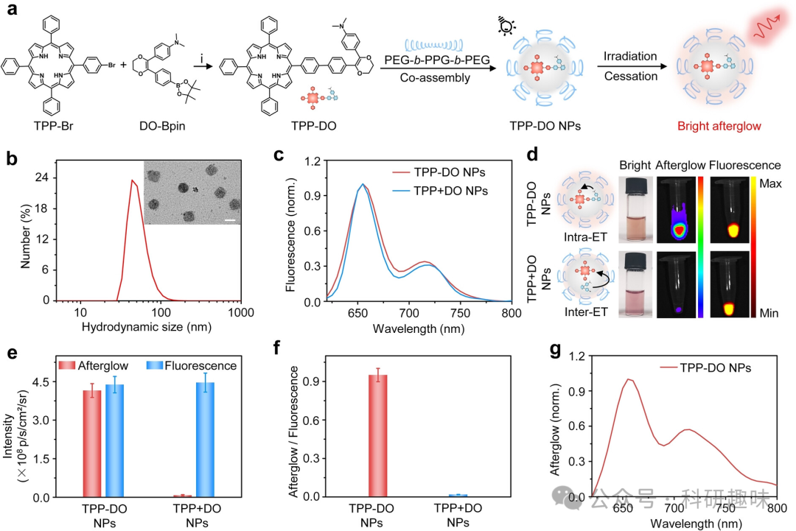
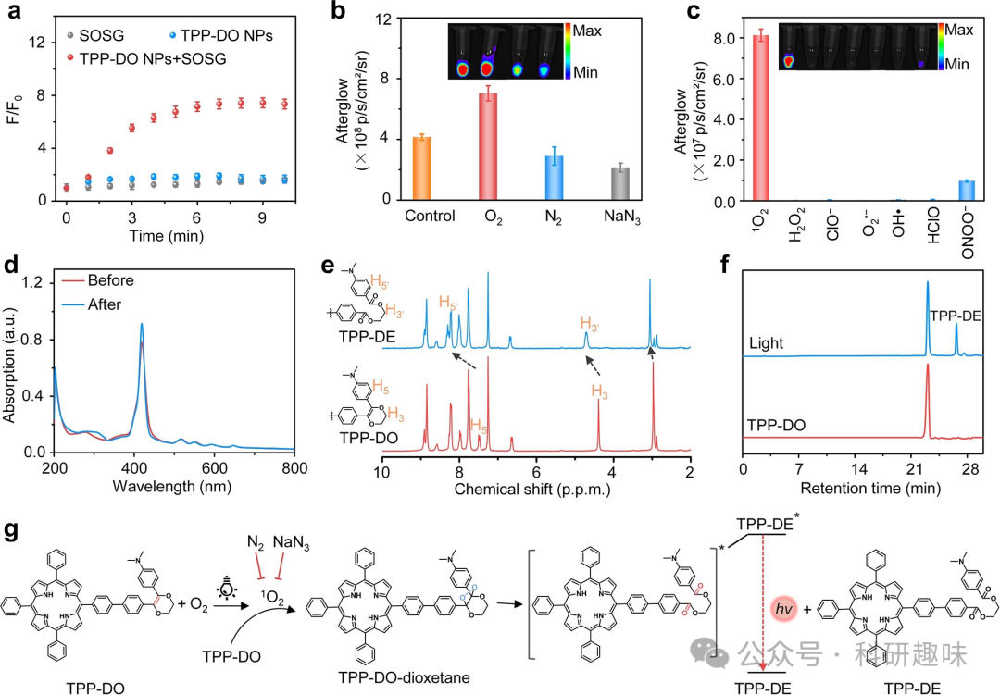
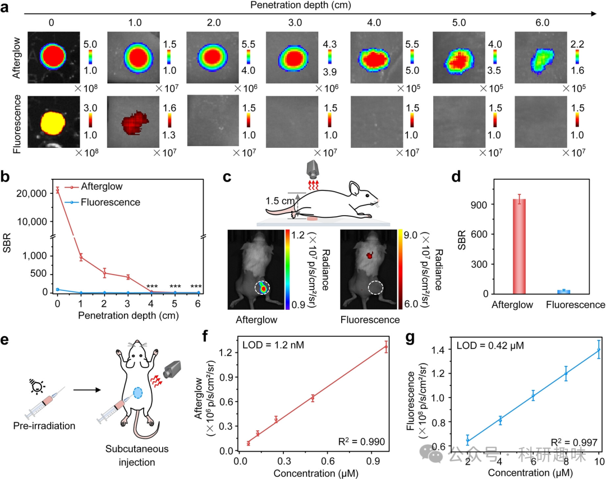
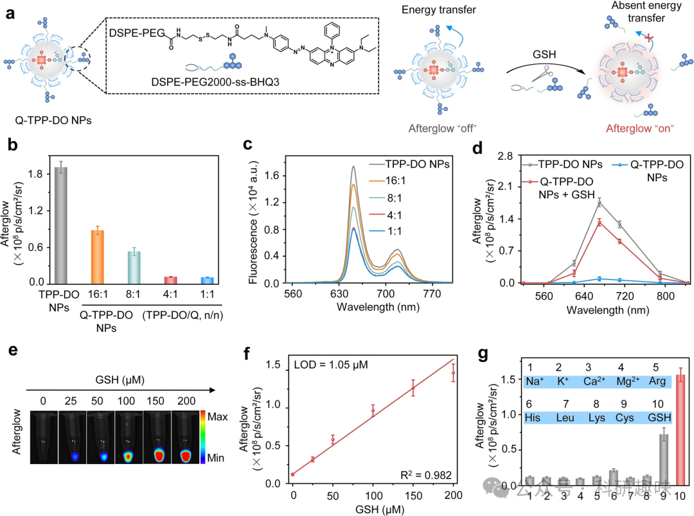
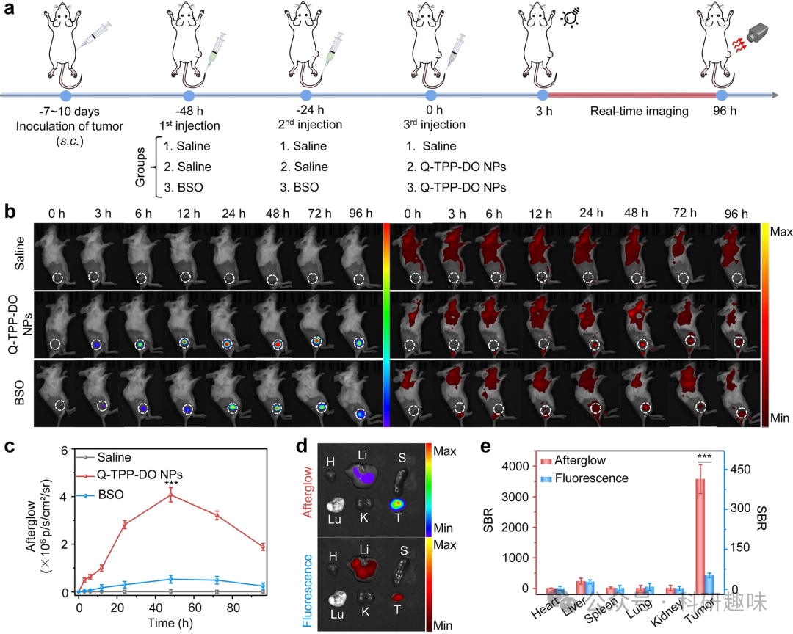
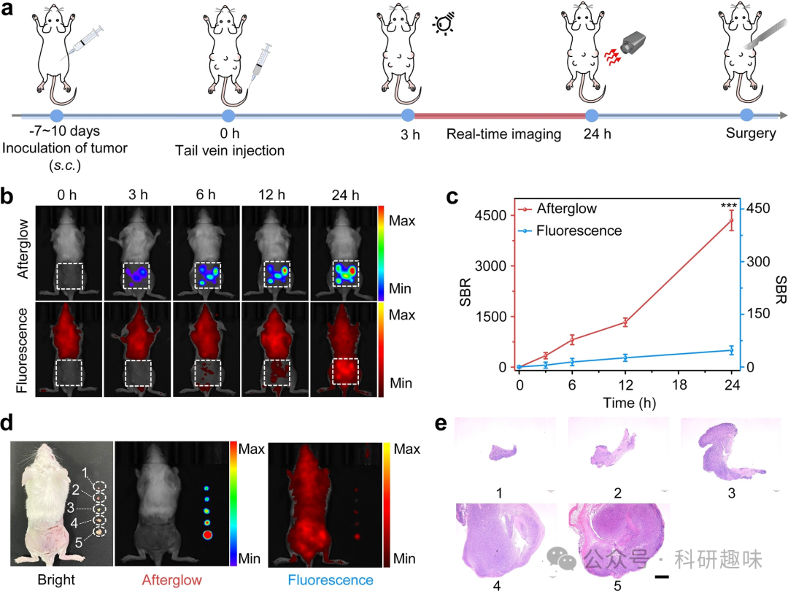

 

#  【Angew】超亮信号、深层穿透，余辉成像 vs 荧光成像 
 

Grenemal

读完需要

21

全文字数 6900 字

余辉成像探针——在光激发停止后仍具有长时间发光的特性，由于能够消除自体荧光，在生物医学成像领域引起了越来越多的关注。然而，当前的余辉材料在信号强度和多成分复杂系统方面存在问题。为解决这些问题，本研究报道了一种近红外（NIR）余辉材料（TPP-DO），通过将余辉物质和光敏感剂化学共轭为单个分子，使后者既成为余辉引发剂又作为能量传递单元，从而构建了分子内能量转移过程以提高余辉的亮度。构建的TPP-DO纳米颗粒以低浓度10μM、低辐射功率密度0.05 W/cm2的条件下，产生强烈的近红外余辉，信号强度最高可达108 p/s/cm2/sr，几乎比大多数有机余辉探针高出两个数量级。TPP-DO纳米颗粒具有高亮度的近红外余辉，且背景噪音较小，具备较强的深层组织穿透能力。此外，作者开发了一种谷胱甘肽（GSH）诱导的余辉探针（Q-TPP-DO纳米颗粒），可用于超敏检测皮下肿瘤，最小肿瘤体积可达0.048 mm3，展示了早期诊断和引导手术切除肿瘤的巨大潜力。

**Introduction**

光学成像在生物学和医学领域中具有不可或缺的地位，它以非侵入性、高灵敏度和实时可视化的方式监测生理和病理过程。荧光成像作为传统的光学成像技术，广泛应用于各种成像模式。然而，荧光成像需要实时光激发，这会导致严重的自体荧光问题，进而降低成像的保真度、信号与背景比以及组织穿透深度。

相比之下，余辉成像技术近年来受到了越来越多的关注。这种技术通过检测光照停止后的光子释放，实现了无自体荧光的自发光成像。由于具有高敏感度和深层组织穿透能力等优势，余辉成像在体内成像应用方面得到了广泛研究，如肿瘤成像、淋巴结映射、药物诱导的肝毒性、图像引导治疗和治疗效果监测等。

现有的余辉探针主要包括基于稀土材料的无机探针和基于半导体聚合物或有机小分子的有机探针。无机纳米材料在光照后释放能量陷阱中储存的光子。而有机系统则利用不稳定的化学缺陷在光照后释放光子。由于具有更好的生物相容性和结构可调性，有机余辉探针在体内应用方面表现出巨大优势。

有机余辉探针通常由三个组分组成：光敏感剂作为余辉引发剂，在光照后产生单重氧（1O2）；余辉底物与1O2反应形成高能过氧化物；能量转移分子通过能量转移吸收能量并发出长寿命的光子。然而，这三个成分通常是物理混合的，导致余辉强度较低，因为余辉底物和余辉中继单元之间的分子间能量转移效率较低。此外，制备过程需要繁琐的程序，耗时且重复性差，限制了其临床应用的潜力。

最近，余辉底物和能量转移单元之间的化学共轭显示出巨大的潜力和优势。由于分子内能量转移的效率比分子间能量转移高，因此余辉强度约为混合体系的100倍。但是这些系统仍然需要光敏感剂的混合，并且余辉发射的波长较短，组织穿透性较浅。因此，开发一种在单个分子中通过化学共轭实现高亮度近红外（NIR）发射的方法是迫切需要的。

本研究报告了一种基于N,N-二甲基-4-(3-苯基-5,6-二氢-1,4-二噁唑-2-基)苯胺（DO）的NIR余辉材料（TPP-DO NPs），与以前报道的多组分余辉体系不同，TPP-DO利用了余辉底物单元和光敏感剂的简易化学共轭，兼具余辉引发剂和中继单元的功能。该策略实现了高效的分子内能量转移，产生了强烈的近红外余辉荧光，其强度相当于其荧光信号，比物理混合底物和光敏感剂的对照探针TPP+DO NPs高出56倍。此外，还制备了一种谷胱甘肽（GSH）激活的余辉分子探针（Q-TPP-DO NPs），用于高对比度的微小肿瘤成像，最小肿瘤体积为0.048mm3，展示了其对小肿瘤病变的早期诊断潜力。

**Results and Discussion**

**Design, Synthesis, Characterization**

TPP-DO通过精心设计，巧妙地将两个关键组分结合在一起：DO作为余辉底物，通过与1O2相互作用生成高能中间体，而TPP则作为光敏剂，在光照下提供1O2和NIR能量中继单元。这种化学连接实现了余辉底物和余辉中继单元之间的紧密结合，促进了分子内能量的高效转移，从而诱导出高亮度的NIR余辉发光。

合成过程中，作者首先合成了溴化物改性的DO（DO-Br），然后将溴化物转化成DO-Bpin。最后，利用Suzuki偶联反应将DO-Bpin与合成的TPP-Br耦合，成功制备出目标产物TPP-DO。

图1. TPP-DO纳米颗粒的合成、表征和余辉荧光。(a) TPP-DO和TPP-DO纳米颗粒的化学结构。(b) TPP-DO纳米颗粒在1×PBS缓冲液中的水动力学尺寸。(c) TPP-DO纳米颗粒和TPP+DO纳米颗粒在1×PBS缓冲液中的归一化荧光光谱（激发波长：420nm）。(d) TPP-DO纳米颗粒（25 μM）和TPP+DO纳米颗粒（25 μM）的纳米颗粒、亮场、余辉和荧光图像。(e) TPP-DO纳米颗粒（25 μM）和TPP+DO纳米颗粒（25 μM）在1×PBS缓冲液中的余辉和荧光强度。(f) TPP-DO纳米颗粒和TPP+DO纳米颗粒的余辉/荧光比例。(g) TPP-DO纳米颗粒在1×PBS缓冲液中的归一化余辉荧光光谱。

为了便于应用，作者采用一种两亲性三嵌段共聚物（PEG-b-PPG-b-PEG）与TPP-DO共自组装，制备了水分散的纳米粒子（TPP-DO NPs）。这些纳米粒子展现出良好的稳定性，无论是在水溶液还是血清溶液中，几个月内尺寸和形貌均未发生明显变化。

光学性质方面，TPP-DO NPs和TPP+DO NPs显示出相似的吸收和发射光谱，吸收峰位于420 nm，荧光光谱则显示TPP-DO NPs在655 nm处有一个发射峰和一个较小的肩峰。然而，在余辉发光方面，TPP-DO NPs表现出显著的优势。经过特定条件的白光照射后，其余辉信号强烈且持久，即使在光照停止后的40分钟内仍然可被检测到。令人振奋的是，TPP-DO NPs的余辉亮度与荧光相当，这一特性远超之前报道的余辉试剂。此外，TPP-DO NPs的余辉强度与其浓度呈线性相关，这为其在低浓度下的应用提供了可能。更重要的是，这种余辉可以重复充电至少20次而信号不衰减，表明其具有很高的长期成像可行性。

**Mechanistic Study of Afterglow**

为了深入探究TPP-DO余辉荧光的内在机制，作者研究了TPP-DO在不同有机溶剂中的余辉表现，与水溶液中的TPP-DO NPs相比，单分子状态的TPP-DO在有机溶剂中展现出相当甚至更高的余辉亮度，这说明其化学结构本身就具备余辉特性，而并非纳米制剂的效果。

值得注意的是，在氯仿（CHCl3）中，TPP-DO展现出了最为显著的余辉信号，相较于四氢呋喃（THF）和乙腈（CH3CN）高出6.9倍和4.6倍。这一发现与这些有机溶剂中1O2的寿命相吻合。这进一步证实了1O2在余辉荧光中起到了关键作用，与作者之前的研究结果相一致。

图2. TPP-DO纳米颗粒余辉荧光的机理研究。(a) 含有SOSG (1 μM)、TPP-DO纳米颗粒 (5 μM)或SOSG (1 μM)与TPP-DO纳米颗粒 (5 μM)的溶液的荧光增强（F/F0）随光照时间为10分钟的变化。(b) TPP-DO纳米颗粒 (25 μM) 在饱和O2、饱和N2或NaN3（50 % w/w）预处理溶液中的余辉图像和强度。(c) TPP-DO纳米颗粒 (25 μM) 对不同ROS和RNS处理（1O2, H2O2, ClO−, O2⋅−, OH⋅, HClO和ONOO−，1.0 mM）的选择性研究。(d) TPP-DO纳米颗粒 (5 μM) 在1×PBS缓冲液中经卤素灯照射5分钟前后的吸收光谱。(e) TPP-DO在室温下在CDCl3溶液中经卤素灯照射5分钟前后的部分1H NMR光谱（功率密度：0.1 W/cm2）。(f) TPP-DO和经照射后的TPP-DO的HPLC。(g) TPP-DO余辉荧光的推测机制。

此外，作者还利用单线态氧敏感探针（SOSG）验证了TPP-DO NPs在光照条件下能够生成1O2。实验结果显示，经过10分钟的光照后，SOSG的荧光增强了7.5倍（图2a）。在相同的光照条件和浓度下，TPP+DO NPs也产生了类似的SOSG荧光增强效应，这说明两者在生成1O2的量上是相当的。

为了更深入地研究TPP-DO NPs产生余辉的特异性，作者向TPP-DO NPs溶液中直接添加了外源性的活性氧化物种（ROS）或活性氮氧化物种（RNS），包括1O2、H2O2、ClO−、O2⋅−、OH⋅、HClO和ONOO−。实验结果显示，仅当添加1O2后，作者观察到了明显的余辉荧光信号，而其他氧化物种并未产生明显的影响。这表明TPP-DO NPs对1O2具有较高的选择性（图2c）。

作者还研究了TPP-DO在光照前后的光谱特性。如图2d所示，TPP-DO NPs在420 nm处显示出明显的吸收峰增强，这表明在光照过程中产生了一种新的物质。同时，其荧光强度也增强了3.4倍。而TPP+DO NPs的荧光强度也有类似的增强效应，但仅在5分钟照射后增加了1.9倍（图S17和S18）。

为了进一步验证光照前后TPP-DO的结构变化，作者进行了核磁共振（NMR）、高效液相色谱（HPLC）和质谱（MS）分析。其中，1H NMR分析显示，光照后，DO单元的质子峰位由4.39 ppm（H3）和7.48 ppm（H5）移动到了4.71 ppm（H3'）和8.30 ppm（H5'），这表明TPP-DE的H3和H5附近的电子密度有所降低（图2e）。此外，HPLC分析发现，光照后的TPP-DO出现了一个保留时间为27分钟的新物质峰（图2f）。进一步的质谱分析证实，这个新物质具有m/z=926.3703的分子离子峰（[M+H]+），这进一步证实了余辉荧光过程中TPP-DO被氧化为TPP-DE的下游产物。

基于上述观察结果，作者提出了TPP-DO NPs的余辉荧光机制（图2g）：在光照条件下，TPP-DO产生1O2，该1O2将DO单元中的烯烃（C=C）氧化为不稳定的1,2-二氧环中间体TPP-DO-二氧环。随后，这个中间体分解为酯衍生物TPP-DE，释放化学能并被TPP-DE吸收，进而激发为态TPP-DE。最后，TPP-DE发生高效的分子内能量转移，激发TPP基团，从而产生强烈的近红外荧光作为下游产物。

**Tissue Penetration Study of Afterglow**

为了研究TPP-DO纳米颗粒在生物应用中的可行性，作者首先考察了其细胞相容性和pH稳定性，结果显示该材料具有良好的生物相容性以及出色的pH稳定性。接下来，作者深入探究了TPP-DO纳米颗粒在体内成像的能力、组织穿透深度和成像灵敏度（图3）。

图3. TPP-DO纳米颗粒余辉荧光的组织穿透深度研究。(a) TPP-DO纳米颗粒 (100 μM) 在不同厚度的鸡肉组织中的余辉荧光和荧光图像。(b) 图a中余辉荧光和荧光的SBR对应的值。(c) 通过活体小鼠进行余辉荧光穿透研究的示意图以及相应的余辉荧光和荧光图像。(d) 图c中余辉和荧光图像的SBR值。(e) 皮下植入TPP-DO纳米颗粒进行体内灵敏度研究的示意图。体内余辉 (f) 和荧光强度 (g) 随浓度变化的图像。

首先，作者在孔板上放置不同厚度的鸡胸肉组织，覆盖了光照后的TPP-DO纳米颗粒或对照的TPP+DO纳米颗粒，并记录了余辉和荧光信号。如图3a所示，随着组织厚度的增加，两种信号都有所减弱。然而，由于TPP-DO纳米颗粒的余辉背景噪声极低（5.81×103 p/s/cm2/sr），其信号与噪声比（SBR）高达540.2。在2.0 厘米的厚度下，TPP-DO纳米颗粒的SBR比荧光高出约52倍（图3b）。这主要得益于其高亮度的余辉信号，使TPP-DO纳米颗粒在6厘米的厚度下仍能被检测到，此时的SBR为35。

为了验证TPP-DO纳米颗粒在体内的成像能力，作者进行了一项活体小鼠实验。如图3c和3d所示，首先对TPP-DO纳米颗粒进行光照处理，然后将其置于活体小鼠的下方，收集余辉荧光信号。实验结果显示，TPP-DO纳米颗粒的SBR高达950，相较于TPP+DO纳米颗粒和荧光分别高出约7倍和24倍，进一步证明了TPP-DO纳米颗粒在体内成像方面的优越性。

接下来，为了探究TPP-DO纳米颗粒在活体小鼠中的成像灵敏度，作者通过皮下注射的方式进行了研究。通过420 nm的激发光获取小鼠在670 nm处的荧光图像，而在光照前通过白光照射，使用IVIS系统在生物荧光模式下获取余辉图像（0.05 W/cm2，10 s，图3e）。实验结果显示，TPP-DO纳米颗粒的余辉信号与其浓度呈线性相关关系（图3f、3g）。由于余辉信号的高SBR，TPP-DO纳米颗粒在活体小鼠中的检测限为1.2 nM，相较于荧光和TPP+DO纳米颗粒分别降低了350倍和11.7倍。更令人惊讶的是，当TPP-DO纳米颗粒的浓度下降到18 nM时，其余辉信号的SBR仍能达到5.2。

综上所述，TPP-DO纳米颗粒在组织穿透和灵敏度方面展现出卓越的成像能力。这为其在生物医学领域的应用提供了强有力的支持。

**GSH-Activatable Afterglow Probe**

谷胱甘肽（GSH）在生物系统的氧化还原平衡中扮演着关键角色，然而在肿瘤环境中，GSH的水平会出现异常升高。这种异常的GSH浓度，通常比正常细胞高出4-10倍，为肿瘤的发生与发展提供了重要线索。因此，实时监测体内GSH水平对于评估肿瘤的状态具有重要意义。

为了实现这一目标，作者设计并合成了一种特殊的两亲性聚合物，该聚合物包含可以被GSH水解释放的二硫键和淬灭剂的BHQ3。这种聚合物的合成与表征详见图4a。

图4. GSH可激活的余辉探针的设计和体外验证。(a) GSH-可激活的Q-TPP-DO纳米颗粒的示意图。在1×PBS溶液中，Q-TPP-DO纳米颗粒的余辉强度 (b) 和荧光强度 (c) 在不同TPP-DO和猝灭剂（DSPE-PEG2000-ss-BHQ3）的比例下的变化。(d) 在生物发光模式下，通过IVIS测量TPP-DO纳米颗粒和经过0.5小时与GSH孵育或未孵育的Q-TPP-DO纳米颗粒的余辉光谱（采集时间：5秒）。(e) 不同浓度GSH孵育后Q-TPP-DO纳米颗粒的余辉图像。(f) 余辉强度与GSH浓度的关系曲线。(g) 在37°C的1×PBS (pH=7.4)中，孵育不同检测物（包括Na+、K+、Ca2+、Mg2+、Arg、His、Leu、Lys、Cys和GSH，浓度为0.2 mM）后的Q-TPP-DO纳米颗粒的余辉强度。

通过与DSPE-PEG2000进行共沉淀反应，作者成功制备了可以被GSH激活的余辉探针Q-TPP-DO纳米颗粒。这种纳米颗粒的特点在于，其余辉荧光可以被BHQ3有效地猝灭，而当GSH与BHQ3结合后，这种猝灭效应会显著降低。这是因为TPP-DO和BHQ3之间存在优异的荧光光谱重叠，形成了给体-受体对，导致能量转移并猝灭余辉荧光。这种猝灭效果在图4b中得到了详细的展示，其中BHQ3对余辉荧光的猝灭表现出明显的剂量依赖性。通过优化TPP-DO和BHQ3的摩尔比，作者成功将余辉信号降低了16倍，如图4c所示。值得注意的是，光照条件下，Q-TPP-DO纳米颗粒生成的1O2量与TPP-DO纳米颗粒相当，这说明猝灭剂对光敏化作用没有产生影响。

进一步实验验证了这种纳米颗粒对GSH的响应性。当Q-TPP-DO纳米颗粒与GSH（0.2 mM）共孵育0.5小时后，其在670 nm处的余辉信号显著增加了14倍，如图4d所示。此外，激活后的余辉信号强度与TPP-DO纳米颗粒相当，这表明所有的BHQ3都已被GSH释放出来，从而恢复了余辉的生成。

为了更好地评估这种纳米颗粒在生物环境中的性能，作者研究了TPP-DO纳米颗粒在存在不同浓度的GSH（0至200 μM）时的余辉信号变化。实验结果显示，随着GSH浓度的增加，TPP-DO纳米颗粒的余辉信号逐渐增强，如图4e所示。进一步分析发现，余辉强度与GSH浓度之间呈线性关系，计算出的检出限（3σ/slope）为1.05 μM，如图4f所示。

同时，在存在其他氨基酸和金属离子（如Arg、Leu、Lys、Cys、Na+、K+、Ca2+和Mg2+）的情况下，作者研究了Q-TPP-DO纳米颗粒对生物硫含量的特异性。实验结果显示，除了对Cys和GSH分别有6倍和13倍的余辉增强反应外，Q-TPP-DO纳米颗粒对其他生物分析物几乎没有余辉增强作用。这些结果表明，Q-TPP-DO纳米颗粒是一种具有高灵敏度和特异性的优秀余辉成像生物硫探针。

**Real-Time Imaging of Tumors**

在实验开始之前，作者深入研究了TPP-DO纳米颗粒和Q-TPP-DO纳米颗粒的生物安全性，以评估其对生物系统的相容性。如图S34所示，在高浓度800 μg/mL下，两种纳米颗粒均未观察到明显的红细胞溶血毒性。这一结果证实了其良好的生物安全性。

在确认了纳米颗粒的生物安全性后，作者进一步探索了其在体内成像的能力。受到Q-TPP-DO纳米颗粒在体外GSH可激活余辉荧光的良好性能的鼓舞，作者深入研究了其在4T1小鼠中的体内成像能力。

图5. 使用Q-TPP-DO纳米颗粒进行肿瘤的体内余辉成像。(a) 示意图显示实时成像的时间线程序。Q-TPP-DO纳米颗粒静脉注射后，4T1肿瘤在活体小鼠中的余辉和荧光图像 (b) 及平均余辉强度 (c)在96小时后的表现。(d) TPP-DO纳米颗粒组在96小时成像后，主要器官（包括心脏、肝脏、脾脏、肺、肾脏和肿瘤）的余辉（上图）和荧光（下图）图像。(e) 三组（生理盐水、Q-TPP-DO纳米颗粒和BSO）主要器官和肿瘤的余辉和荧光的信噪比。

为了探究GSH对Q-TPP-DO纳米颗粒余辉荧光的激活作用，作者设计了一项实验。小鼠被随机分为三组，分别在注射纳米颗粒前24小时和48小时进行预处理，并分别注射盐水、Q-TPP-DO纳米颗粒、Q-TPP-DO纳米颗粒（200 μg/mL, 200 μL）三组（图5a）。从注射纳米颗粒开始，作者记录了从0至96小时内的余辉和荧光图像（图5b, c）。

在注射纳米颗粒后，作者观察到肿瘤区域的余辉信号逐渐增加，并在注射后48小时达到最大值。然而，在BSO预处理对照组中，小鼠在整个观察时间内肿瘤区域的余辉信号呈下降趋势，相比Q-TPP-DO纳米颗粒处理实验组的余辉信号下降了7.7倍。这一现象表明Q-TPP-DO纳米颗粒的余辉荧光激活具有GSH介导的特异性。此外，此时间点的Q-TPP-DO纳米颗粒组的信噪比（SBR）可高达7.7×103，进一步证明了GSH对Q-TPP-DO纳米颗粒余辉荧光的激活具有高效能。

同时，由于余辉相对于荧光的背景噪声极低，因此在注射纳米颗粒后的3小时内可以清晰地描绘肿瘤。在荧光模式下，直到注射纳米颗粒后的24小时才能检测到肿瘤（图5b）。此外，在经过5次照射后，肿瘤在48小时的余辉强度仅降低了11.3％，这表明在体内余辉信号的可重复性以及Q-TPP-DO纳米颗粒用于长期纵向成像的实用性。

为了进一步研究Q-TPP-DO纳米颗粒在肿瘤成像上的能力，作者使用Q-TPP-DO纳米颗粒来检测活体小鼠中的微小肿瘤。作者在小鼠背部皮下植入不同数量的细胞，经过7-10天后，通过小鼠尾静脉注射Q-TPP-DO纳米颗粒（200 μg/mL，200 μL），并持续监测荧光和余辉信号（图6a）。如图6b所示，背部肿瘤区域的余辉信号随时间不断增加。此外，不同大小的肿瘤在注射纳米颗粒后的3小时内可以在余辉荧光模式下清晰地区分出来，而在荧光成像模式下由于余辉荧光的超高灵敏度无法区分（图6b）。即使对于最小的标记为1的肿瘤，其3小时和24小时注射后的成像信噪比分别可达到31和317，显示了余辉荧光对于成像微小肿瘤的高可行性（图6c）。相比之下，所有肿瘤的荧光信号在注射后24小时的成像信噪比都小于39，由于其高背景噪声，突显了余辉荧光的优越性。

图6. 不同大小的背部微型肿瘤的体内余辉成像。(a) 通过Q-TPP-DO纳米颗粒的余辉成像示意图显示皮下微型肿瘤的探测。Q-TPP-DO纳米颗粒静脉注射后，4T1微型肿瘤在活体小鼠中的余辉和荧光图像 (b)以及相应的信噪比 (c)在静脉注射Q-TPP-DO纳米颗粒后的24小时观察到。(d) 在皮下微型肿瘤切除手术后，小鼠的亮场、余辉和荧光图像。(f) 依照(d)中的编号，肿瘤组织切片的H&E染色图像。

注射后的24小时，通过余辉荧光成像成功地切除了五个可疑的肿瘤。并通过H&E染色分析进一步确认了所有病变均为肿瘤（图6d）。为了调查Q-TPP-DO纳米颗粒在肿瘤成像上的广泛适用性，作者还在小鼠腹部皮下植入不同数量的细胞以建立微小肿瘤模型。小鼠腹部的微小肿瘤的余辉图像进一步验证了Q-TPP-DO纳米颗粒的高肿瘤成像特异性。并且最小肿瘤体积为0.048 mm3，表明Q-TPP-DO纳米颗粒具有针对肿瘤的特异性诊断潜力。

除了检测微小皮下肿瘤外，Q-TPP-DO纳米颗粒还成功用于深部微小转移肿瘤的余辉成像，包括肺部和腹部的微小转移。这一发现进一步验证了Q-TPP-DO纳米颗粒的高成像能力和广泛适用性。

总结来说，Q-TPP-DO纳米颗粒在体内外实验中均表现出优秀的生物相容性和肿瘤靶向性能。其GSH激活的余辉荧光特性，使得在体内可实现高灵敏度的肿瘤成像。此外，Q-TPP-DO纳米颗粒对肿瘤的特异性结合能力，使其在微小肿瘤、深部转移肿瘤的成像中具有广阔的应用前景。这些结果为Q-TPP-DO纳米颗粒在未来的生物医学应用，特别是在肿瘤诊断和治疗领域中，提供了坚实的实验基础。

**Conclusion**

总的来说，作者通过分子内能量转移策略，精心设计了一种全能型的近红外余辉荧光探针——TPP-DO纳米颗粒。这款纳米颗粒在低浓度10μM下展现出惊人的近红外余辉荧光信号，达到了1.73×108 p/s/cm2/sr，这一数值远超现有的有机余辉探针，几乎高出了两个数量级。更重要的是，TPP-DO纳米颗粒具备可重复充电的特性，即使经过20个光照循环，其最大强度也未出现明显的衰减。

TPP-DO纳米颗粒的独特之处在于其赋予的超亮余辉荧光，这使得其在体外和体内都具有卓越的信噪比和成像灵敏度。此外，通过进一步的工程化设计，作者成功开发出了智能活性余辉纳米探针（Q-TPP-DO纳米颗粒），为实时肿瘤成像提供了有力支持，尤其在亚表皮微小肿瘤的敏感检测和手术导航方面表现突出。

与之前报道的余辉底物与中继单元的结合方式相比，本研究采用了简便的全能型策略，无需与余辉启动剂进行共包装。此外，作者通过制备高亮度的近红外余辉发射和活性方法，显著提高了对高灵敏度和特异性的深部组织体内成像的可行性。这一创新不仅简化了制备过程，还为未来的生物医学应用，特别是在肿瘤诊断和治疗领域中，提供了更多可能性。

L. Yang, M. Zhao, W. Chen, J. Zhu, W. Xu, Q. Li, K. Pu, Q. Miao, *Angew. Chem. Int. Ed.* 2024, 63, e202313117. https://doi.org/10.1002/anie.202313117

**关注并回复文章DOI获取全文：**

10.1002/anie.202313117

**点击蓝字 关注我们**

预览时标签不可点

素材来源官方媒体/网络新闻

 [阅读原文](javascript:;) 

  继续滑动看下一个 

 轻触阅读原文 

    

