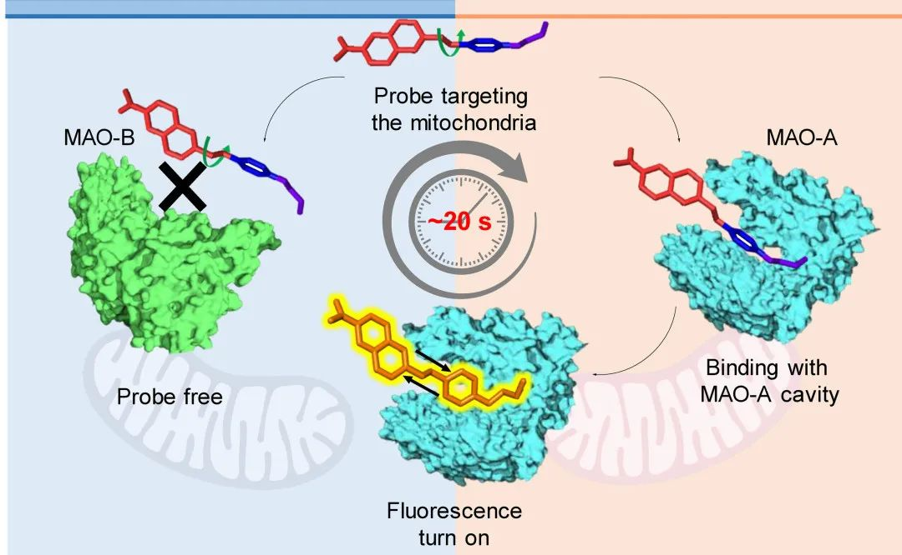
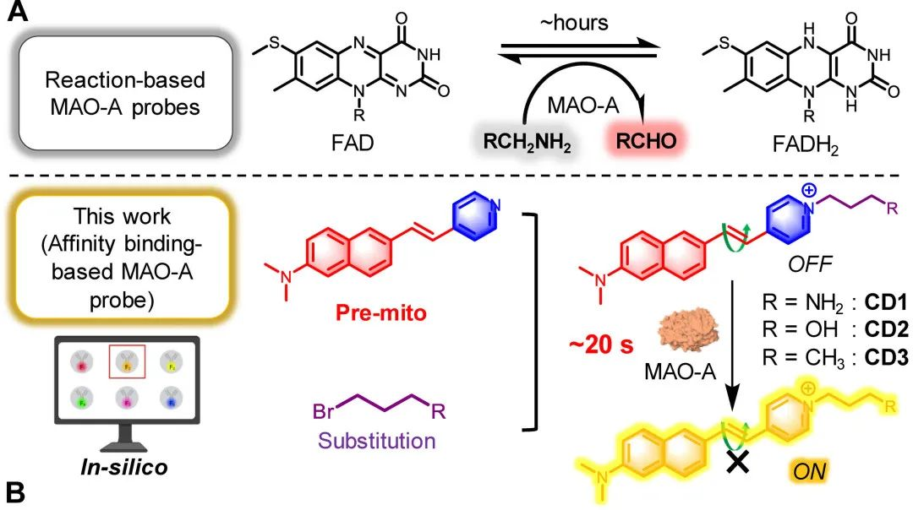
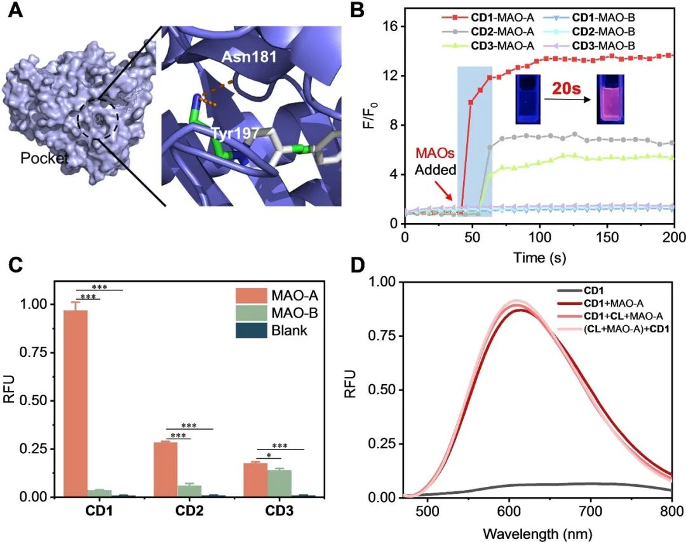
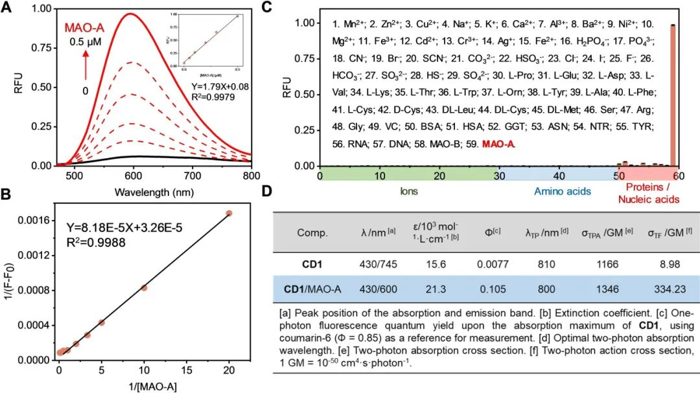
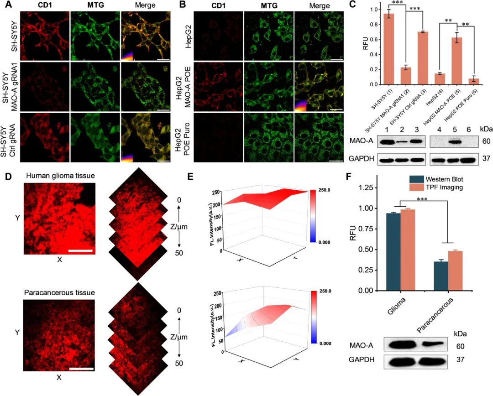

 

#  【Angew】黄维院士新发现：仅通过亲和力就能达到特定蛋白的识别 
 
 原创

Monoamine Oxidase A

单胺氧化酶A

单胺氧化酶A（MAO-A）的异常表达与人类胶质瘤的病发密切相关，因此MAO-A被视为极具潜力的治疗靶点。鉴于此，快速准确地测定MAO-A对于疾病的诊断显得尤为至关重要。通过对双光子荧光团的筛选，作者发现一种名为N,N-二甲基萘胺（pre-mito）的衍生物，其可以高效地进入MAO-A的腔体入口。经过氨基丙基取代的CD1分子展现出了最快的MAO-A检测速度（仅需20秒）、更高的MAO-A亲和力以及较强的选择性。

**初筛**

为了快速检测 MAO-A，作者选择了六种具有深部组织成像能力的双光子荧光团，并通过分子对接对它们进行了筛选，最终确定了双光子荧光团（N,N-二甲基萘胺衍生物，**pre-mito**）。为了更好的与MAO-A结合，作者通过吡啶-N引入了三个不同的取代基，并且为探针赋予了线粒体靶向能力。

图 1.CD1-3的结构式

**溶液测试**

首先，作者利用分子对接法评估了 CD1-3 与 MAO-A 的结合亲和力。如图 2A 所示，与 MAO-B 相比，这三种探针都更倾向于进入 MAO-A 的空腔，其中 CD1 最接近 MAO-A 空腔的底部，其结合焓最低。此外，CD1的氨基丙基与MAO-A酶腔中的Asn181和Tyr191相互作用，促进了探针与酶腔的结合。而时间依赖性荧光分析也CD1 与 MAO-A 也证实了CD1具有最快的结合速度（图 2B），此外，加入 MAO-A 后，三种探针的荧光都显著增强，其中 CD1 的增强效果最好（图 2C）。CD1 对 MAO-A 也有很好的选择性，并且MAO-A抑制剂CL的存在并不会对其探测性能造成明显的影响（图2D）

图2. A) CD1/MAO-A 的对接结果。B) CD1-3（2 μM）与 MAO-A 和 MAO-B（0.2 μM）在 PBS 缓冲液中孵育时的时间依赖性（0-200 秒）相对荧光变化曲线。C) 培养 1 分钟后，CD1-3（2 μM）在 MAO-A 或 MAO-B（0.2 μM）存在下的相对荧光强度。D)CD1 (2 μM)与 0.2 μM 的 MAO-A（CD1+MAO-A）、((CL+MAO-A)+CD1)或不(CD1+CL+MAO-A)与 MAO-A 预处理 30 分钟后的荧光光谱。

接着，作者进一步用 58 种常见干扰物对 CD1 进行了测试，包括阳离子、阴离子、氨基酸、蛋白质、核酸和酶，这些干扰物可能会引起荧光信号的干扰。结果表明，只有在 MAO-A 存在的情况下 CD1 的荧光信号才会增加，这证明了它对目标物的高选择性（图 3C）。随后在不同的温度和 pH 条件下评估了 CD1 对 MAO-A 的反应性，结果显示最佳反应条件为 37 °C 和 pH=7.4。这些结果表明 CD1 具有在生理条件下快速检测 MAO-A 的能力。鉴于 CD1 极佳的反应动力学和选择性，我们在将其应用于活细胞之前系统地探索了它的光物理特性。在有MAO-A存在的情况下，CD1的荧光量子产率（Φ）和双光子作用截面（δTF）都增加了，这表明CD1适用于生物组织中MAO-A的双光子荧光成像（图3D）。

图3. A) CD1（0.5 μM）与不同浓度的 MAO-A（0-0.5 μM，1 分钟）孵育的荧光光谱。B）（A）的 Benesi-Hildebrand 拟合图。C) CD1（2 μM）在 PBS 缓冲液（pH=7.4）中不同分析物（[1-49]：100 μM；[50-59]：1 μM）存在下的荧光特异性响应。D)CD1 和 CD1/MAO-A 在 PBS 缓冲液（pH=7.4）中的光物理性质。

**生物检测**

受到上述结果的鼓舞，作者进一步研究了 CD1 在活细胞成像中的潜力，为了测试 CD1 在活细胞中对 MAO-A 的选择性，作者使用 CRISPR-Cas918 技术建立了内源性 MAO-A 基因敲除的 SH-SY5Y 细胞（SH-SY5Y MAO-A gRNA1）、非靶向对照（SH-SY5Y Ctrl gRNA）、转染 MAO-A 超表达慢病毒载体（POE）或空载体（Puro，辅助信息）的 HepG2 细胞。共焦成像显示 CD1 处理过的野生型 SH-SY5Y 细胞有清晰的荧光信号，而野生型 HepG2 细胞则没有。此外，CD1 处理的 SH-SY5Y MAO-A gRNA1 发出微弱的荧光，而 CD1 处理的 HepG2 MAO-A POE 则检测到强烈的荧光信号（图 4A&B）。每个细胞系中 MAO-A 的细胞水平都得到了 WB（图 4C）的进一步证实，证明 CD1 可以选择性地检测活细胞中的内源性 MAO-A。由于 MAO-A 位于线粒体外膜上，因此确认 CD1 的准确细胞定位非常重要，不出所料，共定位结果显示CD1的强红色荧光信号与MTG的绿色荧光信号很好地重叠（Person's r=0.76-0.86，图4A和B）。在活细胞实验成功的基础上，作者利用CD1和双光子荧光显微镜（TPFM）进一步探讨了临床胶质瘤和癌旁组织中MAO-A的检测。如图4D&E所示，CD1能有效地对深部肿瘤组织中的MAO-A进行成像，在CD1处理过的人胶质瘤组织中能检测到较强的荧光信号，而在CD1处理过的癌旁组织中荧光信号则明显较弱。这一观察结果与 WB 中相应的内源性 MAO-A 表达水平一致（图 4F）。随后，将 CD1 与相应的组织裂解液孵育 1 分钟，发现人胶质瘤组织裂解液中的荧光信号明显高于癌旁组织裂解液。这些结果表明 CD1 具有良好的组织成像能力，可用于快速检测胶质瘤中 MAO-A 的含量，并有可能区分肿瘤和癌旁组织。

图4. A) 活的 SH-SY5Y 细胞与 CD1（2 μM）孵育 1 小时后的单光子共聚焦荧光图像，B) CD1（2 μM）孵育 1 小时后活体 HepG2 细胞的单光子共聚焦荧光图像，C）（A 和 B）中图像的相对荧光强度。D) CD1 处理（10 μM，1 小时）的人胶质瘤（上）和癌旁组织（下）的内源性 MAO-A 含量的双光子荧光图像（左）和相应曲线图（右）。E) CD1 处理的人类胶质瘤（上图）和癌旁组织（下图）的荧光强度。F) （D）中重建组织图像的相对荧光强度曲线（红色）和插图中的相对 WB 信号（蓝色）。

**结论**

通过筛选和合理设计，作者成功地发现了一种用于快速检测 MAO-A 的基于亲和力结合的双光子荧光探针（CD1）。高选择性与 TICT 效应的结合造就了超快 MAO-A 荧光探针，可在 20 秒内完成检测，且特异性高、检测限低。活细胞和组织成像实验表明，CD1 可以选择性地检测复杂生理环境中线粒体上的内源性 MAO-A 含量。虽然 CD1 不能反映 MAO-A 酶的活性，但其独特的反应机制可在超短时间内快速报告 MAO-A 的水平。这种特性使 CD1 成为一种潜在的分子工具，可在快速临床诊断和术中图像引导中快速筛查 MAO-A 水平。

Zhang, C.; Fang, H.; Du, W.; Zhang, D.; Qu, Y.; Tang, F.; Ding, A.; Huang, K.; Peng, B.; Li, L.; Huang, W. Ultrafast Detection of Monoamine Oxidase A in Live Cells and Clinical Glioma Tissues Using an Affinity Binding‐Based Two‐Photon Fluorogenic Probe. Angew Chem Int Ed 2023, e202310134. https://doi.org/10.1002/anie.202310134.

**关注公众号并回复**

**10.1002/anie.202310134**

**可获得原文下载链接**

[【Angew】发愁吸收波长不够？看看这种设计思路](http://mp.weixin.qq.com/s?__biz=MzkzOTI1OTMwNg==&amp;mid=2247484091&amp;idx=1&amp;sn=4be856d9ec100c467cb9bf607fb4f0ec&amp;chksm=c2f2e67ef5856f6822e7b085b4d6c2d116f82297e80dd8bf26fff6d0485e5b2ebeaad06ba539&amp;scene=21#wechat_redirect)

[【Biomaterials】不喝酒也会就酒精肝，非酒精性脂肪肝怎么治疗？](http://mp.weixin.qq.com/s?__biz=MzkzOTI1OTMwNg==&amp;mid=2247484070&amp;idx=1&amp;sn=ddb4abe02a40c21f436e651e97f4dc7d&amp;chksm=c2f2e663f5856f75d96a041aab2f889327ac3cf956c58b43334c898982327f293c7303c5e624&amp;scene=21#wechat_redirect)

[【Anal. Chem.】\[华中师范大学冯国强团队\] 急性深肾损伤怎么判断，查一下SO2浓度先](http://mp.weixin.qq.com/s?__biz=MzkzOTI1OTMwNg==&amp;mid=2247484059&amp;idx=1&amp;sn=385fc8fcdb95972f56307c53d338d2af&amp;chksm=c2f2e65ef5856f4856a8959c1a2a0eeff93a440fcb1d554bd19001530cbc6a0176ddb0a0c124&amp;scene=21#wechat_redirect)

预览时标签不可点

  继续滑动看下一个 

 轻触阅读原文 

   

